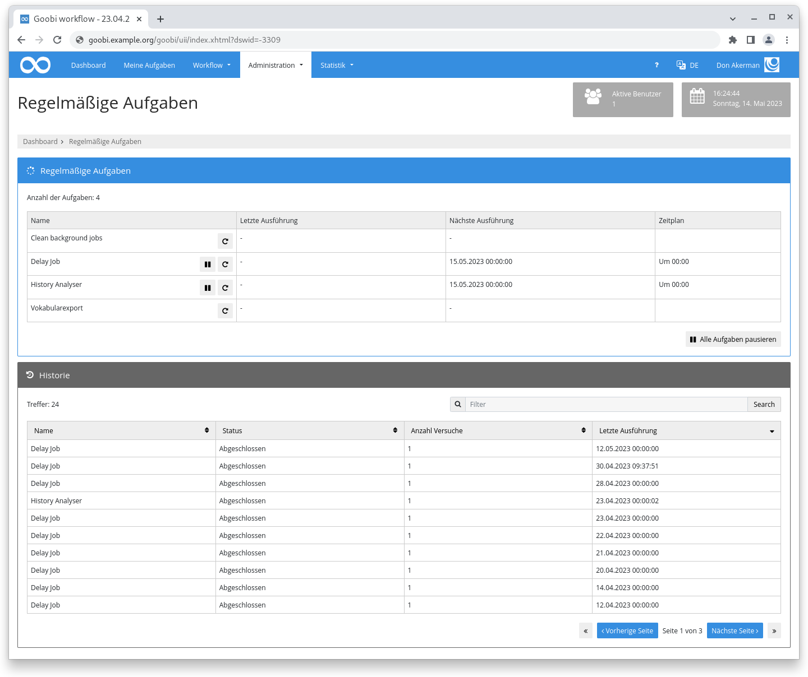
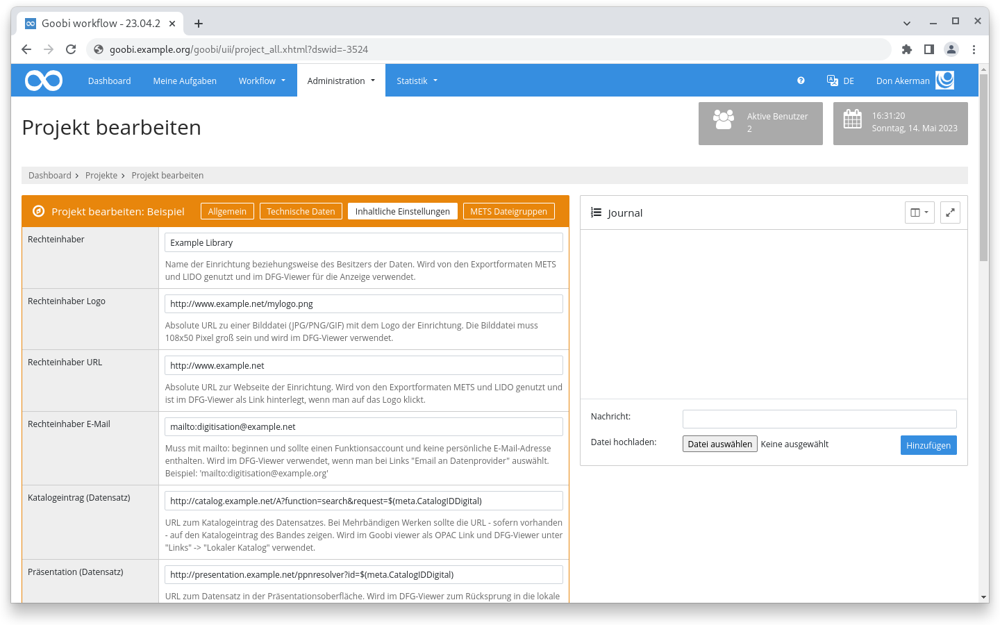

# März 2023

## Coming soon :rocket:

* Portierung der **Benutzeroberfläche** auf **neues Framework**
* **Dokumentation** der **Schrittedetails**
* Verbesserte **PDF-A Generierung**
* **REST-API**

## Core

### Regelmäßige Aufgaben

Schon länger kann Goobi workflow bestimmte Aufgaben periodisch anstoßen. Es gibt interne Aufgaben, die einmal täglich ausgeführt werden, aber auch Plugins wie der DataPoller oder zum zeitlichen pausieren von Schritten (Delay-Plugins) zählen dazu. Diese Funktionalität arbeitet stabil und verlässlich, hatte aber zwei Einschränkungen die wir mit diesem Release angegangen sind.

Zum Einen fand alles im verborgenen statt. Es gab keine Übersicht darüber welche regelmäßigen Aufgaben es gibt, wann diese laufen und ob es dabei einen Fehler gab oder nicht. Für diese Übersicht gibt es jetzt eine neue Seite im Bereich "Administration" das die angesprochenen Informationen auflistet. Auch ein individuelles Ausführen oder Pausieren von Aufgaben ist dort möglich.

Der zweite Teil war die Konfigurationsmöglichkeiten. Entweder waren Dinge gar nicht konfigurierbar oder sie wurden in Sekunden seit Mitternacht angegeben. Um etwas um 15:30 Uhr zu starten musste dann der Wert `55800` angegeben werden. Nicht gerade intuitiv. Jetzt wird die Cron-Syntax verwendet, die deutlich intuitiver zu lesen und auch mächtiger in der Konfiguration ist. Die Syntax für 15:30 Uhr jeden Tag ist jetzt `0 30 15 * * ?`

<figure><figcaption>
Übersicht der Regelmäßigen Aufgaben in der Benutzeroberfläche
</figcaption></figure>

### Sortierung für zusätzliche Spalten

Schon länger können in den Einstellungen eines Benutzeraccounts zusätzliche Spalten für die Tabelle auf der Seite "Vorgänge" und "Meine Aufgaben" konfiguriert werden. Ab sofort sind diese auch sortierbar sofern sie in der Datenbank stehen. Das ist zum Beispiel für Variablen wie `{db_meta.XYZ}`, `{process.XYZ}`, `{product.XYZ}` oder `{template.XYZ}` der Fall. Andere Variablen wie `{origpath}` oder auch `{meta.XYZ}` sind nicht sortierbar.

### Bedienbarkeit

Das Thema Bedienbarkeit geht in kleinen Schritten voran. Diesen Monat haben wir uns die Projektkonfiguration vorgenommen und dort vor allem den Reiter "METS Parameter" der zu "Inhaltliche Einstellungen" umbenannt wurde. Die Bezeichnung der Zeilen wie auch die Inline Hilfe wurden massiv überarbeitet und mit sinnvollen Beispielen versehen.

<figure><figcaption>
Überarbeitung der Terminologie bei den Projekteinstellungen
</figcaption></figure>

### Snippets

* In den Warteschlangen wird die Fehlertabelle jetzt automatisch und regelmäßig geleert.
* In den Projekteinstellungen kann im Bereich der "Inhaltlichen Einstellungen" eine eigene URL für die DFG-Viewer METS-Datei hinterlegt werden.