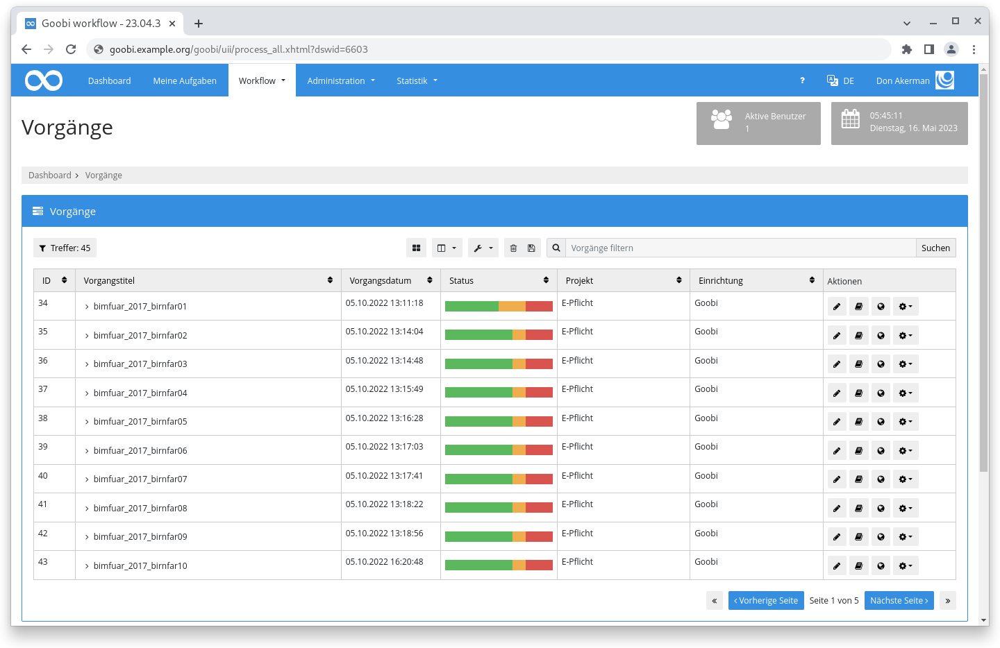
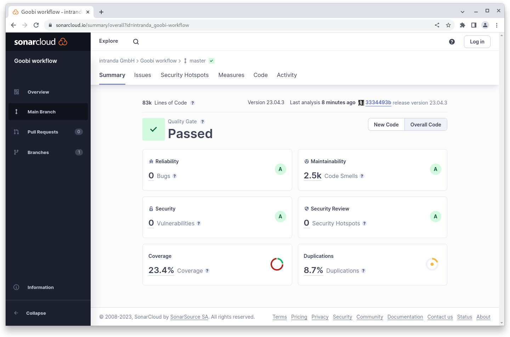

# April 2023

## Coming soon :rocket:

* **Dokumentation** der **Schrittedetails**
* Verbesserte **PDF-A Generierung**

## Core

### Benutzeroberfläche

Mehrere hundert Stunden haben wir im Hintergrund daran gearbeitet und im Ergebnis ändert sich an der Oberfläche erst einmal nur wenig... Im Unterbau aber dafür eine ganze Menge: Dort wo mit der Zeit Quelltext kopiert und modifiziert wurde ist jetzt wieder ein einheitliches System vorhanden. Neue Strukturen wurden aufgebaut, Redundanzen entfernt, Code und Markup für gleiche Dinge vereinheitlicht und dadurch der gesamte Aufbau vereinfacht.

Vermutlich fällt als erstes nur auf, dass alles ein klein bisschen luftiger ist und hier und dort einige Dinge jetzt vielleicht sogar ein bisschen komisch aussehen. Ungewohnt auf alle Fälle. Aber der grundsätzliche Aufbau und auch das Design bleibt gleich.

Auf der Basis dieser Arbeiten können wir jetzt jedoch beginnen an der Bedienbarkeit zu arbeiten: Wie wollen wir Buttons wo anordnen und benennen? Wo wird von der Terminologie im Plural gesprochen und wo Singular? Welche Boxen werden wo angezeigt, wie ist die Reihenfolge der Informationen und wie heben wir relevante Dinge hervor, blenden irrelevante oder nebensächliche aus oder reduzieren den Fokus? Was ist ein einheitlicher und verlässlicher Weg zu einem Ziel und wo wollen wir bewusst Abkürzungen schaffen? Mit dieser Basis können wir viele Dinge an einer zentralen Stelle ändern und sie wirkt sich automatisch auf alle Bereiche aus. Vorher hätten wir sehr sehr viele Stellen einzeln betrachten müssen.

Bitte meldet uns Dinge die jetzt komisch aussehen oder unverständlich sind.

<figure><figcaption><p>Die portierte Benutzeroberfläche sieht gleich aus, wirkt aber insgesamt luftiger</p></figcaption></figure>

### REST API

Im April haben wir im Rahmen eines Projektes begonnen die REST API neu zu beleuchten und unserer Ansicht nach essentielle Funktionalität zu entwickeln, zu refaktorisieren und bestehenden Code auch zu konsolidieren.

Konkret haben wir dabei Vorgänge, Schritte, Eigenschaften und das Journal bedacht und folgende Funktionalitäten implementiert:

* Vorgänge anlegen, Informationen auslesen, aktualisieren oder Vorgänge löschen
* Schritte für einen Vorgang auslesen, aktualisieren, neu hinzufügen, löschen oder ausführen
* Journal auslesen und Einträge hinzufügen, aktualisieren oder löschen
* Eigenschaften auslesen, hinzufügen, bearbeiten und löschen

Die Logik nutzt - wo möglich - vorhandenen Code aus GoobiScript. Auch die Terminologie ist identisch gewählt, so dass es hier beim Arbeiten Wiedererkennungseffekte geben sollte. Der neue Code hat eine sinnvolle Testabdeckung erhalten und die REST Kommandos sind auch in der Swagger Dokumentation alle aufgeführt und beschrieben.

Die neuen REST Endpoints erlauben über eine standardisierte Schnittstelle im Goobi workflow Core eine Integration von Funktionalität mit externen Systemen.

Hier einmal vier Beispielaufrufe für die Möglichkeiten die für das Journal zur Verfügung stehen:


[openapi2402.json](openapi2402.json)



[openapi2402.json](openapi2402.json)



[openapi2402.json](openapi2402.json)



[openapi2402.json](openapi2402.json)


## Plugins

Schon länger können die in einer Instanz installierten Plugins über die Oberfläche eingesehen werden. Auf der Seite ist ebenfalls zu sehen, ob das Plugin gegen die installierte Goobi workflow Versionsnummer getestet wurde.

Mit dem April Release haben wir begonnen die Plugins nicht nur auf die Kompatibilität zu testen, sondern auch mit einer identischen Versionsnummer zu taggen. Dadurch ist es jetzt möglich auch im Plugin Repository sofort die Commits zu erkennen, die die Kompatibilität zu einer bestimmten Core Version sicherstellen.

Wir müssen die jetzt gefundene Lösung noch beobachten und eventuell auch noch nachjustieren, aber unserem Ziel: "Pluginversionen analog zum Goobi workflow Core zu haben", sind wir dadurch schon einen großen Schritt näher gekommen.

## Codeanalyse

Der folgende Screenshot zeigt die SonarCloud Analyse des aktuellen Releases. Weitere Informationen gibt es direkt auf der [Projektseite](https://sonarcloud.io/organizations/intranda/projects).

<figure><figcaption><p>SonarCloud Analyse: Goobi workflow Core - für den Git Tag v23.04.3</p></figcaption></figure>

## Versionsnummer

Die aktuelle Versionsnummer von Goobi workflow lautet mit diesem Release: **23.04.3**. Innerhalb von Plugin-Entwicklungen muss für Maven-Projekte innerhalb der Datei `pom.xml` entsprechend folgende Abhängigkeit eingetragen werden:

```xml
<dependency>
    <groupId>de.intranda.goobi.workflow</groupId>
    <artifactId>goobi-core-jar</artifactId>
    <version>23.04.3</version>
</dependency>
```