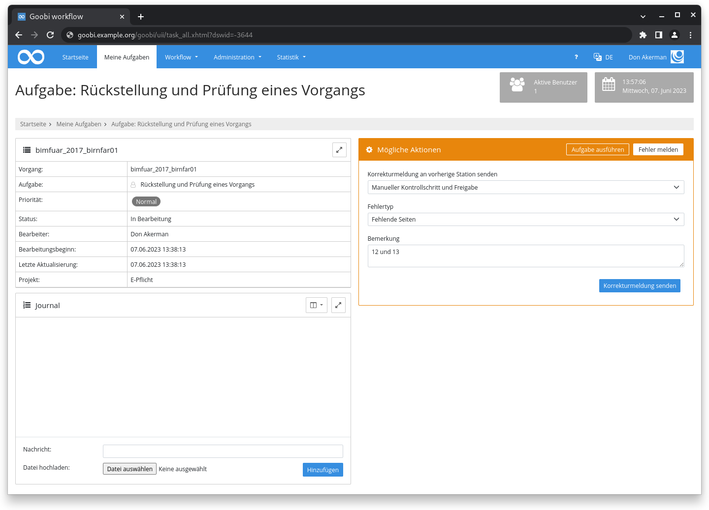
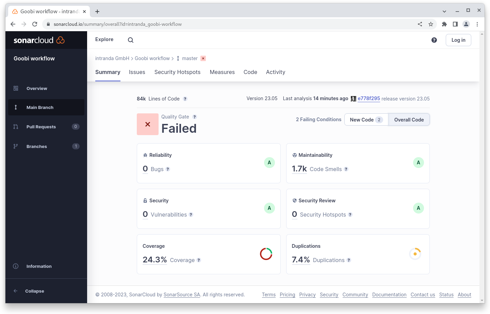

# Mai 2023

## Coming soon :rocket:

* **Dokumentation** der **Schrittedetails**
* Personalisierte **API Token**

## Core

### Fehler- und Korrekturmeldungen

In einer angenommenen Aufgabe können Fehler- und Korrekturmelden gesendet werden. Neu ist, dass jetzt ein optionales DropDown Menü zur Verfügung steht, in dem eine Liste an klassischen Fehlertypen konfiguriert werden kann.

Die Konfiguration erfolgt sowohl für die Fehler- als auch für die Korrekturmeldungen in der zentralen `goobi_config.properties` Datei. Hier eine Beispielkonfiguration:

<pre class="language-properties"><code class="lang-properties"><strong># Text templates for error reporting and problem solutions
</strong>task.error.Missing\ pages=The following pages are missing: {}
task.error.Blurred\ images=The images {} are unsharp. Please create these again.
task.solution.Problem\ solved=The problem was solved. {}
task.solution.The\ original\ print\ is\ blurred=The original pages are printed blurry. It is not possible to create sharper images. {}
</code></pre>

<figure><figcaption><p>Dropdown mit Fehlertyp in "Fehler melden"-Dialog</p></figcaption></figure>

### Mailversand

Der Mailversand aus dem Goobi workflow heraus wurde vereinheitlicht und verschiedene Plugins, die ebenfalls E-Mails versenden können, können jetzt auf dieselbe Konfiguration zugreifen. Dadurch entfallen Redundanzen im Code, der Wartungsaufwand wird minimiert und die Konfiguration wird einfacher.

### Codequalität

Seit einiger Zeit arbeiten wir in Goobi workflow mit Sonarcloud zur statischen Analyse von Codequalität. Im Juli letzte Jahres sind wir mit gut 4.600 angemerkten Issues gestartet. Mit diesem Release sind wir bei gut 1.600 Issues angekommen. Alleine im letzten Monat konnten rund 1.000 Issues bearbeitet werden. Zusätzlich konnten rund 75 Unit Tests in den Core übernommen werden.

### Performance

Beim Anlegen und Löschen von Vorgängen mit sehr vielen Schritten (sagen wir mal mehr als 50) gab es Performanceprobleme. Diese konnten durch Umstellungen an SQL Aufrufen und Java Code behoben werden.

## Plugins

### Import: Excel-Import

Das Excel-Importplugin erlaubt nun für die Generierung von Vorgangstiteln - analog zu der Konfiguration in der `goobi_projects.xml` - die Angabe eines replacewith Attributs, um zum Beispiel Leerzeichen durch einen Unterstrich zu ersetzen



### Schritt: PDF-Generierung

Das Schritteplugin zur PDF-Generierung erlaubt jetzt die Angabe und Nutzung der vor kurzem im ContentServer eingeführten PDF-Generiervarianten. Dadurch können zum Beispiel als Schritt innerhalb einer Produktionsvorlage valide PDF-A Dateien erzeugt und an einem bestimmten Ort abgelegt werden.



## Codeanalyse

Der folgende Screenshot zeigt die SonarCloud Analyse des aktuellen Releases. Weitere Informationen gibt es direkt auf der Projektseite.

<figure><figcaption><p>SonarCloud Analyse: Goobi workflow Core - für den Git Tag v23.05</p></figcaption></figure>

Ein paar Worte zu der fehlschlagenden Analyse:

In SonarCloud lassen sich Qualitätsanforderungen, sogenannte Quality Gates, definieren. Die Quality Gates werden einmal auf den gesamten Quelltext angewendet und einmal auf den Quelltext der in den letzten 30 Tagen geändert wurde. \
Das jetzt fehlschlagende Quality Gate in Goobi workflow bezieht sich auf den angepassten Quelltext in den letzten 30 Tagen. Dort wird eine Testabdeckung von mindestens 25% gefordert und die Duplucations sollen unter 10% sein. Da wir mit diesem Release sehr viel Quelltext angefasst haben erfüllen wir diese Vorgaben - bezogen auf den Quelltext der letzten 30 Tage nicht.

Das Quality Gate für den gesamten Quelltext wird aber erfüllt.

## Versionsnummer

Die aktuelle Versionsnummer von Goobi workflow lautet mit diesem Release: **23.05.1**. Innerhalb von Plugin-Entwicklungen muss für Maven-Projekte innerhalb der Datei `pom.xml` entsprechend folgende Abhängigkeit eingetragen werden:

```xml
<dependency>
    <groupId>de.intranda.goobi.workflow</groupId>
    <artifactId>goobi-core-jar</artifactId>
    <version>23.05.1</version>
</dependency>
```