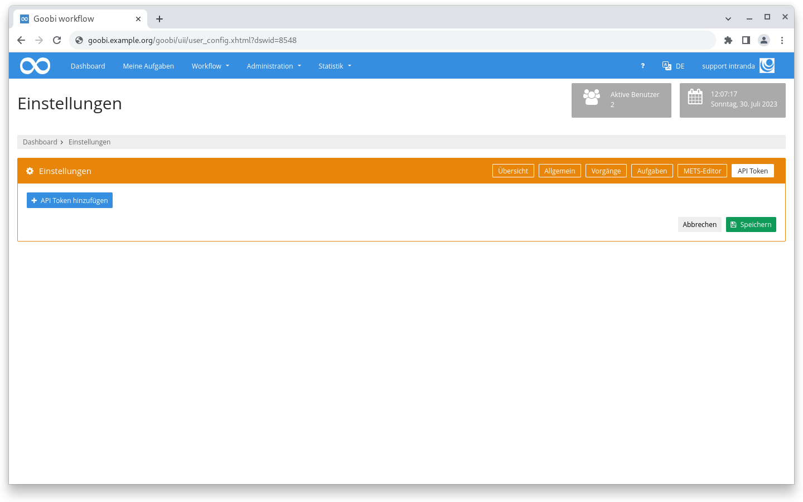
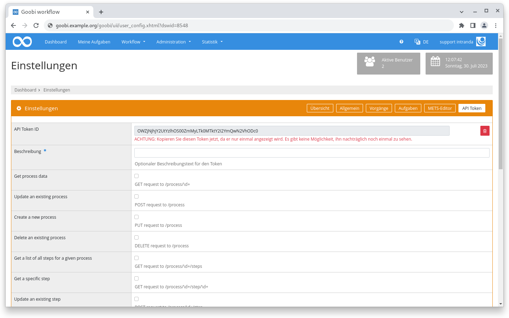
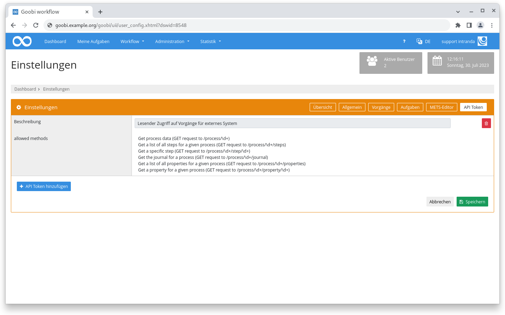
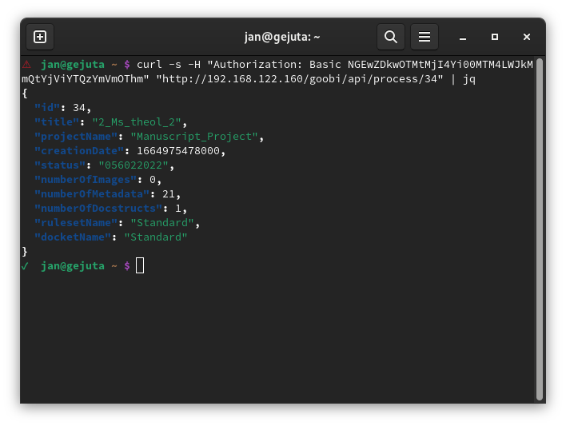

# Juni 2023

## Coming soon :rocket:

* **GoobiScript Templates**
* **Dokumentation** der **Schrittedetails**

## Core

### API Token

In den Einstellungen des eigenen Benutzeraccounts gibt es einen neuen Reiter, in dem ein API Token generiert und mit entsprechenden Rechten ausgestattet werden kann.

Das Recht einen Token zu erstellen haben nur Superadministratoren, oder Benutzeraccounts, die einer Gruppe angehören, der das entsprechende Recht zugewiesen wurde.

Dieser Token kann dann mit einer Basic Auth verwendet werden um die vorher freigeschalteten Kommandos abzufragen.

<figure><figcaption>
In der Übersicht kann ein neuer API Token hinzugefügt werden
</figcaption></figure>

<figure><figcaption>
Beim Anlegen können selektierte REST Endpoints freigeschaltet werden
</figcaption></figure>

<figure><figcaption>
Angelegte Token sind mit der Beschreibung und der erlaubten Methoden in der Übersicht sichtbar
</figcaption></figure>

<figure><figcaption>
Beispielaufruf für einen API Endpoint mit Token
</figcaption></figure>

### Vorgang anlegen

Beim Anlegen eines Vorgangs kann die Maske über die Datei `goobi_projects.xml` konfiguriert werden. Dabei konnten auch Multiselect Felder mit dem Attribut `multiselect="true"` definiert werden. Wurden dann mehrere Werte ausgewählt so landeten diese hintereinander in dem konfigurierten Metadatum oder der festgelegten Eigenschaft.

Ab diesem Release wird für jeden Wert ein eigenes Metadatum oder eine eigene Eigenschaft geschrieben.

## Plugins

### Schritt: OCR zu Metadatum

Es wurde ein neues Schritteplugin entwickelt, dass es erlaubt den OCR Text aller Bilder eines Vorgangs in ein Metadatum zu überführen.

## Snippets

* Die ALTO Bearbeitung im Metadateneditor kann jetzt auch Dateien in S3 speichern.
* Das Plugin zur automatischen PDF-Extraktion hat kleinere Verbesserungen erhalten, zum Beispiel bei fehlenden Leerzeichen im Volltext.


Im Juni gab es kein dediziertes Goobi workflow Release.
