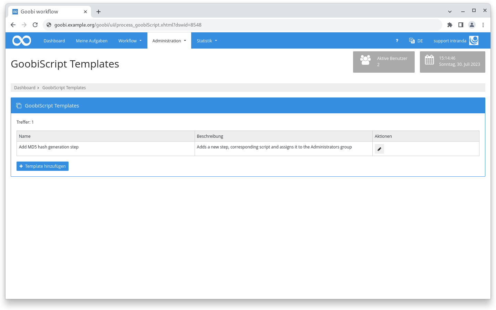
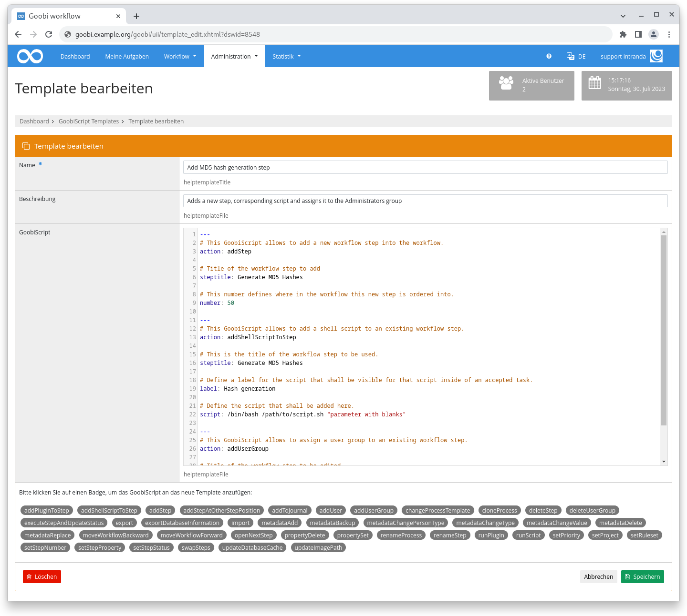
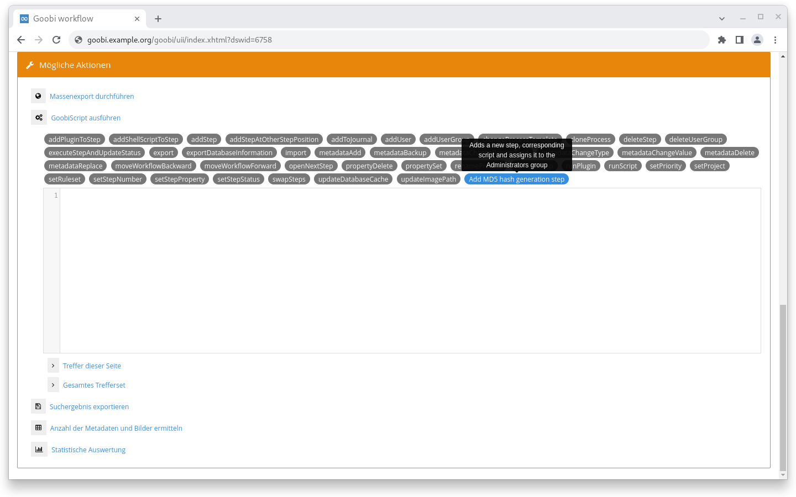
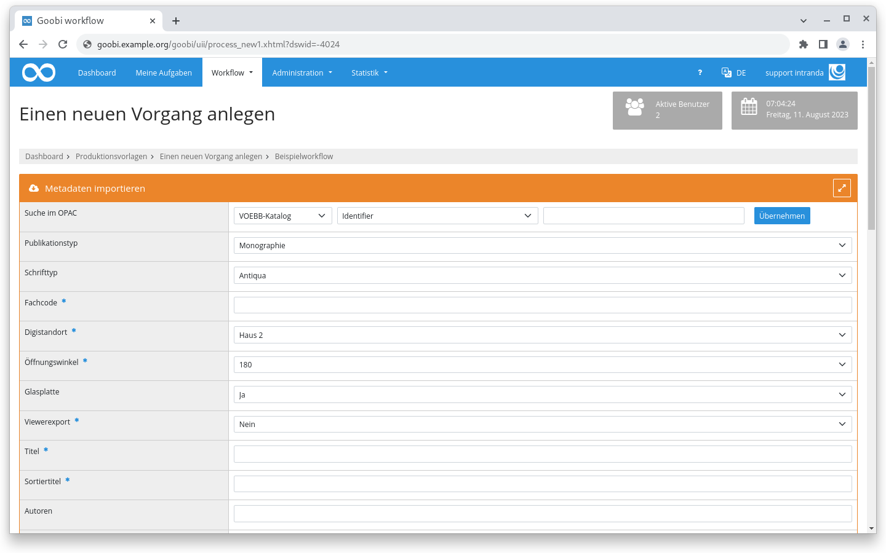
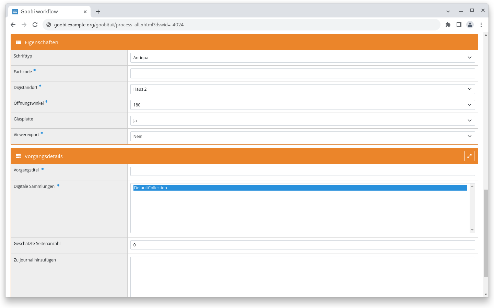
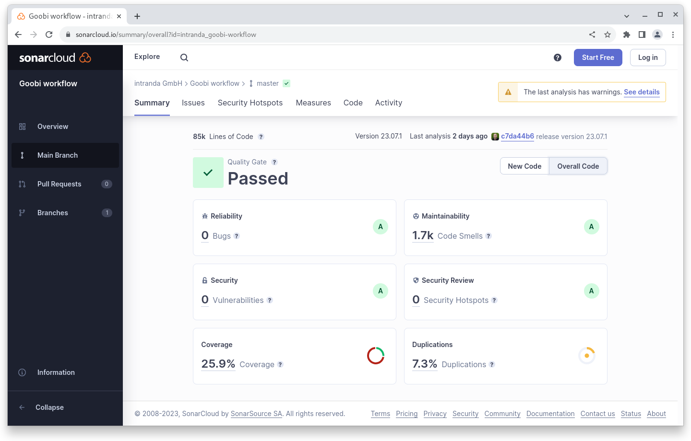

# Juli 2023

## Coming soon :rocket:

* **GoobiScript** Anpassungen
* **Dokumentation** der **Schrittedetails**

## Core

### GoobiScript Templates

Immer wieder kommt es vor, dass man mehrere GoobiScript Aufrufe hintereinander aufrufen muss. Oft wiederholen sich die Aufrufe dann auch noch weil zum Beispiel in einem bestimmten Projekt unter bestimmten Bedingungen immer mal wieder erforderlich ist einen bestimmten Schritte einzufügen.

Hierfür gibt es jetzt einen neuen Mechanismus um diese Aufgaben angenehmer zu gestalten. Im Bereich "Administration" wurde der neue Bereich GoobiScript Templates eingeführt. Dort können mehrere Aufrufe elegant verkettet und als Template abgespeichert werden. Jedes Template hat einen obligatorischen Namen und eine optionale Beschreibung.

In der Liste der GoobiScript Templates werden die selbst definierten Templates als Badges mit eigener Farbe angezeigt. Die Beschreibung wird angezeigt, wenn mit der Maus über den Badge gefahren wird. Für die Templates gelten dieselben Möglichkeiten zur dedizierten Rechteverwaltung wie für die fest eingebauten GoobiScript Aufrufe.

<figure><figcaption><p>Übersicht über vorhandene GoobiScript Templates</p></figcaption></figure>

<figure><figcaption><p>Maske zum Bearbeiten von einem GoobiScript Template </p></figcaption></figure>

<figure><figcaption><p>GoobiScript Templates in der Auswahl der verfügbaren GoobiScript Einträge</p></figcaption></figure>

### Eigenschaften beim Vorgang anlegen

Beim Anlegen eines Vorgangs können die Vorgangseigenschaften jetzt auch über die zentrale Konfigurationsdatei `goobi_processProperties.xml` verwaltet werden. Dafür wurde in der Konfigurationsdatei das neue XML-Element `<showProcessCreation />` hinzugefügt. Als Attribute gibt es `access=""` und `template=""`. Die Werte des Attributs `access` sind analog zu den anderen bereits in der Datei vorhandenen Möglichkeiten. Mit dem `template` Attribut wird gesteuert für welche Produktionsvorlage die Einstellung gilt. Das XML-Element ist wiederholbar um unterschiedliche Produktionsvorlagen konfigurieren zu können. Es ist möglich beim `template` Attribut ein `*` zu definieren, damit die Einstellung für alle Produktionsvorlagen gilt.

Mit dieser Änderung ist es erstmalig möglich die Metadaten, die aus dem Katalog importiert werden, von den Eigenschaften, die beim Anlegen eines Vorgangs mit erhoben werden sollen und dadurch inhaltlich etwas komplett anderes sind, visuell zu trennen. Bisher wurde beides vermischt im oberen Bereich mit der Überschrift "Metadaten importieren" angezeigt.

Hier ein Beispiel für eine Konfiguration und ein Screenshot wie es in der `goobi_projects.xml` bisher gemacht werden musste und aussah:

```xml
<item from="prozess" multiselect="false">
    Schrifttyp
    <select label="Antiqua">antiqua</select>
    <select label="Fraktur">fraktur</select>
    <select label="kein OCR">no_ocr</select>
</item>
<item from="prozess" required="true">Fachcode</item>
<item from="prozess" multiselect="false" required="true">
    Digistandort
    <select label="Haus 2">Haus 2</select>
    <select label="Haus 1">Haus 1</select>
</item>
<item from="prozess" multiselect="false" required="true">
    Öffnungswinkel
    <select label="180">180</select>
    <select label="110">110</select>
</item>
<item from="prozess" multiselect="false">
    Glasplatte
    <select label="Ja">true</select>
    <select label="Nein">false</select>
</item>
<item from="prozess" multiselect="false" required="yes">
    Viewerexport
    <select label="Nein">false</select>
    <select label="Ja">true</select>
</item>
```

<figure><figcaption><p>Eigenschaften und Metadaten werden in der Anlegemaske gemeinsam angezeigt.</p></figcaption></figure>

Dieselbe Konfiguration kann jetzt über die `goobi_processProperties.xml` abgebildet werden. Dafür wird dann eine eigene Box angezeigt, in der die Einstellungen vorgenommen werden können. Dadurch kann eine klarer strukturierte und dadurch übersichtlichere Oberfläche realisiert werden.

```xml
<?xml version="1.0" encoding="UTF-8"?>
<config_processProperties>
    <property name="Schrifttyp" container="0">
        <project>*</project>
        <showProcessCreation access="write" template="*" />
        <type>List</type>
        <value>Antiqua</value>
        <value>Fraktur</value>
        <value>kein OCR</value>
    </property>

    <property name="Fachcode" container="0">
        <project>*</project>
        <showProcessCreation access="writeRequired" template="*" />
        <type>Text</type>
        <defaultvalue></defaultvalue>
    </property>

    <property name="Digistandort" container="0">
        <project>*</project>
        <showProcessCreation access="writeRequired" template="*" />
        <type>List</type>
        <value>Haus 2</value>
        <value>Haus 1</value>
    </property>

    <property name="Öffnungswinkel" container="0">
        <project>*</project>
        <showProcessCreation access="writeRequired" template="*" />
        <type>List</type>
        <value>180</value>
        <value>110</value>
    </property>

    <property name="Glasplatte" container="0">
        <project>*</project>
        <showProcessCreation access="write" template="*" />
        <type>List</type>
        <value>Ja</value>
        <value>Nein</value>
    </property>

    <property name="Viewerexport" container="0">
        <project>*</project>
        <showProcessCreation access="writeRequired" template="*" />
        <type>List</type>
        <value>Nein</value>
        <value>Ja</value>
    </property>
</config_processProperties>
```

<figure><figcaption><p>Eigenschaften und Metadaten können in der Anlegemaske jetzt separat angezeigt werden.</p></figcaption></figure>

## Snippets

* Der Zeitungsexport für die DDB schreibt nun erweiterte Informationen um DFG-Viewer Darstellungsanforderungen zu erfüllen.

## Codeanalyse

Der folgende Screenshot zeigen die SonarCloud Analyse des aktuellen Releases. Weitere Informationen gibt es direkt auf der [Projektseite](https://sonarcloud.io/organizations/intranda/projects).

<figure><figcaption><p>SonarCloud Analyse: Goobi workflow Core - für den Git Tag v23.07.1</p></figcaption></figure>

## Versionsnummer

Die aktuelle Versionsnummer von Goobi workflow lautet mit diesem Release: **23.07.2**. Innerhalb von Plugin-Entwicklungen muss für Maven-Projekte innerhalb der Datei `pom.xml` entsprechend folgende Abhängigkeit eingetragen werden:

```xml
<dependency>
    <groupId>de.intranda.goobi.workflow</groupId>
    <artifactId>goobi-core-jar</artifactId>
    <version>23.07.2</version>
</dependency>
```