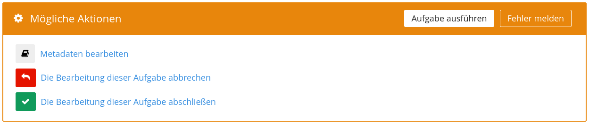
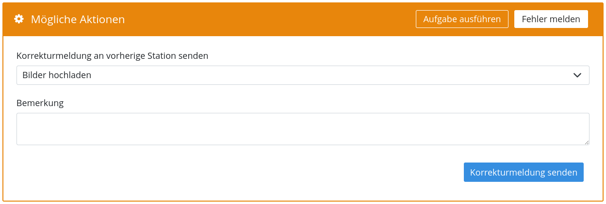
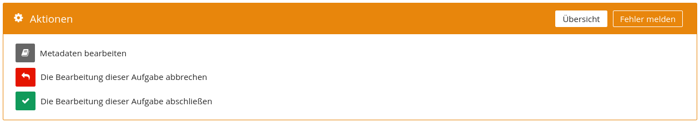
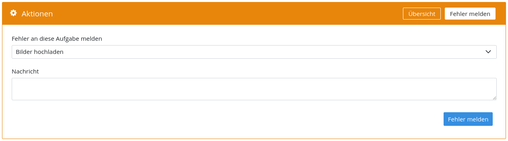
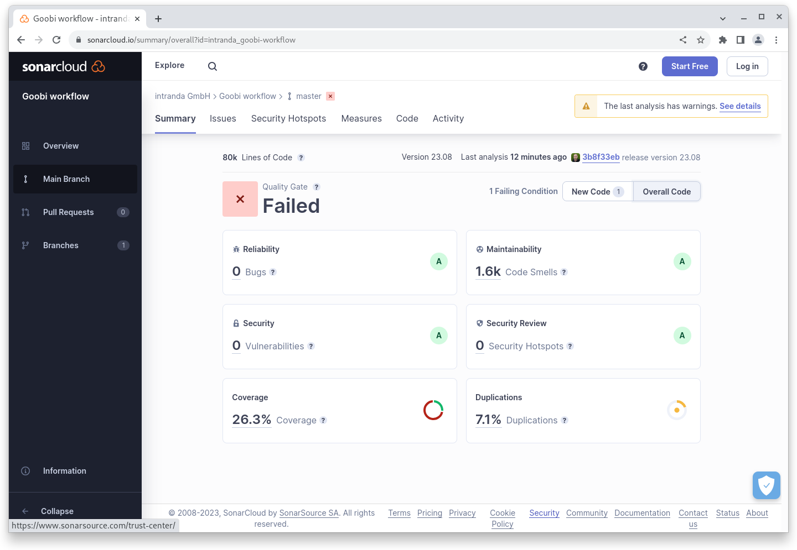

# August 2023

## Core

### Bedienbarkeit

Immer wieder suchen wir uns kleine Bereiche in der Oberfläche heraus um bei dieser gezielt die Bedienbarkeit zu verbessern. Im August war es der Bereich der Aktionen innerhalb einer angenommenen Aufgabe, bei der wir alleine durch eine Anpassung der verwendeten Terminologie versucht haben Klarheit zu schaffen.

Hier zwei Screenshots von dem Bereich vor dem Update:

<figure><figcaption><p>Altes Interface vor der Änderung der Terminologie</p></figcaption></figure>

<figure><figcaption><p>zweiter Reiter im alten Interface vor der Änderung der Terminologie</p></figcaption></figure>

Verwirrung gab es vor allem, weil der erste Reiter "Aufgabe ausführen" hieß und die Visualisierung einen Button suggerierte. Klickte man darauf passierte aber nichts. Die zweite Verwirrung gab es dann im Bereich der Fehler und Korrekturmeldungen bei dem eine "Korrektur angefordert" und eine "Fehlerlösung gemeldet" wurde. Erwartet wurde hier eher, dass man einen "Fehler meldet" und eine "Korrektur sendet". Alleine durch die Anpassung der entsprechenden Übersetzungen konnte das Benutzerinterface klarer gestaltet werden. Hier das Ergebnis:

<figure><figcaption><p>Oberfläche nach der Umbenennung</p></figcaption></figure>

<figure><figcaption><p>zweiter Reiter in der Oberfläche nach der Umbenennung</p></figcaption></figure>

### GoobiScript

Das GoobiScript `openNextStep` wurde neu hinzugefügt um die ersten gesperrte Aufgabe eines Vorgangs aus dem Trefferset auf offen zu setzen, sofern keine andere Aufgabe offen ist. Wenn es sich um eine automatische Aufgabe handelt wird diese auch automatisch gestartet.

Außerdem besteht bei dem `addStep` GoobiScript jetzt die Möglichkeit mit der Einstellung `number: end` die Aufgabe am Ende des Vorgangs einzufügen, auch ohne die genaue Nummer zu kennen. Diese wird bei der Einstellung automatisch ermittelt.

### REST

In der REST API ist ein neuer Endpoint hinzugefügt worden um offene automatische Aufgaben zu starten.


[openapi2402.json](openapi2402.json)


Außerdem wurde der Endpoint zum Anlegen von neuen Vorgängen dahingehend erweitert, dass auch Metadaten und Eigenschaften optional gleich mitgegeben werden können.


[openapi2402.json](openapi2402.json)


## Plugins

### Export: VLM

Der VLM Export unterstützt neben einem Passwort jetzt auch die Möglichkeit die SFTP-Funktionalität mit einem SSKH Key zu verwenden.

### Export: Heris

Ein Spezialplugin für den Export von fünf ausgewählten Bildern sowie Metadaten als JSON Datei wurde für das Bundesdenkmalamt in Österreich entwickelt.

### Import: Nürnberger Hausbücher

Für den Import von den Nürnberger Hausbüchern und der Überführung von einer SQL Datenstruktur in METS/MODS Dateien wurde ein spezielles Importplugin entwickelt.

### Schritt: Bildauswahl

Ein Schritteplugin zur Auswahl und festlegen einer Reihenfolge von Bildern sowie Speichern des Ergenisses für die weitere Verarbeitung als Prozesseigenschaft wurde fertiggestellt.

## Codeanalyse

Der folgende Screenshot zeigen die SonarCloud Analyse des aktuellen Releases. Weitere Informationen gibt es direkt auf der [Projektseite](https://sonarcloud.io/organizations/intranda/projects).

<figure><figcaption><p>SonarCloud Analyse: Goobi workflow Core - für den Git Tag v23.08</p></figcaption></figure>

## Versionsnummer

Die aktuelle Versionsnummer von Goobi workflow lautet mit diesem Release: **23.08**. Innerhalb von Plugin-Entwicklungen muss für Maven-Projekte innerhalb der Datei `pom.xml` entsprechend folgende Abhängigkeit eingetragen werden:

```xml
<dependency>
    <groupId>de.intranda.goobi.workflow</groupId>
    <artifactId>goobi-core-jar</artifactId>
    <version>23.08</version>
</dependency>
```