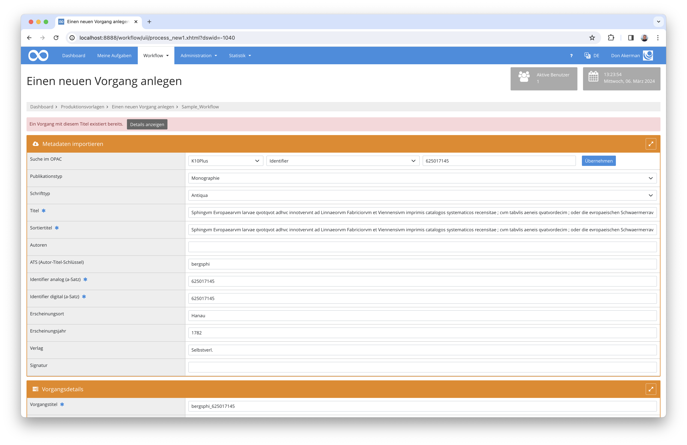
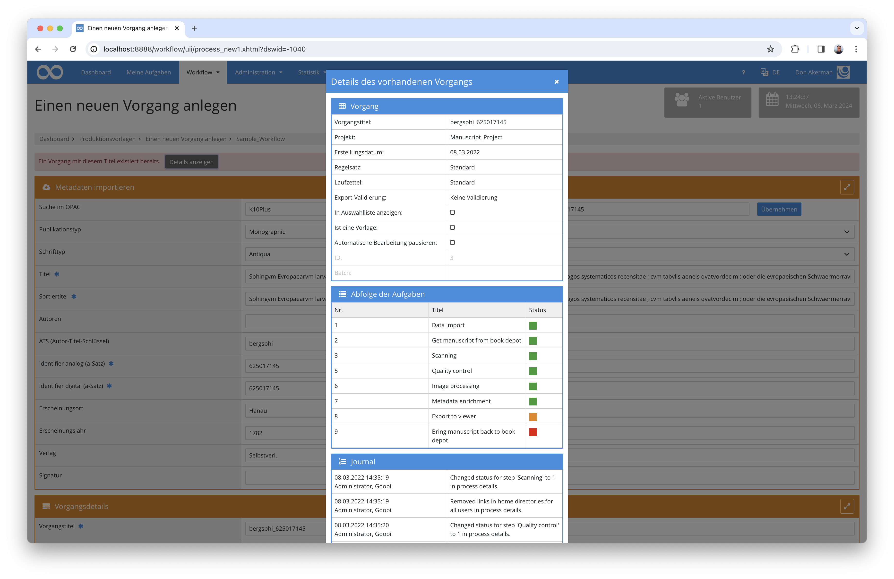

# September 2023

## Core

### Bedienbarkeit

Die Anlegemaske von Goobi workflow hat schon immer verhindert, dass ein Vorgang mit identischem Namen ein erneutes Mal angelegt werden konnte. Man erhielt dann eine kurze Fehlermeldung, die sagt, dass der Vorgang bereits existiert. Dies wurde erweitert, so das man ab jetzt auch die Details über den bereits existierenden Vorgang einsehen kann.

<figure><figcaption>
Fehlermeldung beim Anlegen eines neuen Vorgangs
</figcaption></figure>

<figure><figcaption>
Details des bereits existierenden Vorgangs in der Anlegemaske
</figcaption></figure>

### GoobiScript

Die GoobiScript Aufrufe `metadataAdd` und `metadataReplace` können jetzt auch Normdatenwerte anlegen oder manipulieren. Damit ist es zum Beispiel möglich die GND-ID für Personen nachträglich in Masse anzupassen.

In dem gleichen Zuge wurde das GoobiScript `metadataReplaceAdvanced` eingeführt. Der Aufruf erlaubt es zusätzlich mit regulären Ausdrücken zu arbeiten.

### REST

Der September bring ebenfalls Änderungen an der REST Schnittstelle, zwei neue Endpoints wurden hinzugefügt. Der erste erlaubt eine Suche und liefert eine Liste an VorgangsIDs zurück.

Der zweite erlaubt es Aufgaben mit einem definierten Titel zu abzuschließen.

## Plugins

### Import: Excel zu EAD

Ein Importplugin um aus einer Excel-Datei eine EAD Archivstruktur mit Metadaten zu erstellen wurde entwickelt.


Im September gab es kein dediziertes Goobi workflow Release.
