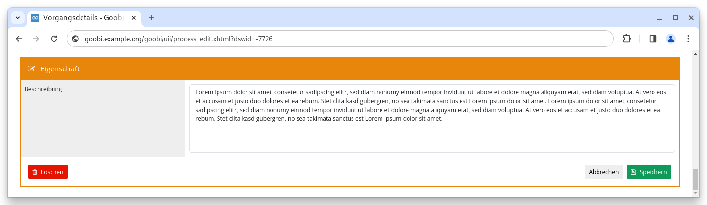

# November 2023

## Core

### Vorgangseigenschaften

Die in Goobi workflow vorhandenen Vorgangseigenschaften können jetzt auch als Textarea dargestellt werden. Die Konfiguration erfolgt über die bekannte `goobi_processProperties.xml`. Eine Beispielkonfiguration ist wie folgt:

```xml
    <property name="Beschreibung" container="0">
        <project>*</project>
        <showProcessCreation access="write" template="*" />
        <type>Textarea</type>
        <defaultvalue></defaultvalue>
    </property>
```

<figure><figcaption><p>Vorgangseigenschaft als Textarea</p></figcaption></figure>

### Snippets

* Wurde das GoobiScript zum löschen von Vorgängen mehrfach hintereinander über das gleiche Trefferset aufgerufen, kam es zu einem Fehler, der einen Neustart der Applikation notwendig machte. Das Verhalten wurde abgestellt.
* Die Standardkonfiguration von ActiveMQ wurde angepasst, so dass der Dienst nur noch auf localhost lauscht.
* Ein Fehler, der bei der Wiederholung von bestimmten Variablen in Skriptschritten aufgetreten ist, wurde behoben

## Plugins

### Import: Charité - Ärztinnen im Kaiserreich und verfolgte Ärzte

Für den Import von den beiden Datenbanken "Ärztinnen im Kaiserreich und in der Weimarer Republik" und "Verfolgte Ärztinnen und Ärzte des Berliner Städtischen Gesundheitswesens (1933-1945)" und der Überführung in METS/MODS Dateien wurde ein spezielles Importplugin entwickelt.

### Schritt: Metadaten pro Bild

Ein sehr mächtiges Schritteplugin wurde in diesem Monat fertiggestellt. Damit kann für jedes Bild eines Vorgangs eine vielzahl von Metadaten und Verlinkungen erfasst werden.

### Schritt: Aufgaben duplizieren

Das Plugin ermöglicht es, eine Vorgangseigenschaft auszulesen und einen bestehenden Workflow-Schritt für jede Zeile in der Eigenschaft mehrfach zu duplizieren. Zusätzlich dupliziert es die Eigenschaften auch in einzelne Eigenschaften pro Zeile aufgesplittet.

### Schritt: PDF Dateien extrahieren

Das bereits bekannte Plugin für die vollautomatische Aufbereitung von PDF-Dateien wurde um eine freie Dateibenennung und eine aktualisierte Dokumentation ergänzt.

## Codeanalyse

Der folgende Screenshot zeigt die SonarCloud Analyse des aktuellen Releases. Weitere Informationen gibt es direkt auf der [Projektseite](https://sonarcloud.io/organizations/intranda/projects).

<figure><figcaption><p>SonarCloud Analyse: Goobi workflow Core - für den Git Tag v23.11</p></figcaption></figure>

## Versionsnummer

Die aktuelle Versionsnummer von Goobi workflow lautet mit diesem Release: **23.11.1**. Innerhalb von Plugin-Entwicklungen muss für Maven-Projekte innerhalb der Datei `pom.xml` entsprechend folgende Abhängigkeit eingetragen werden:

```xml
<dependency>
    <groupId>de.intranda.goobi.workflow</groupId>
    <artifactId>goobi-core-jar</artifactId>
    <version>23.11.1</version>
</dependency>
```