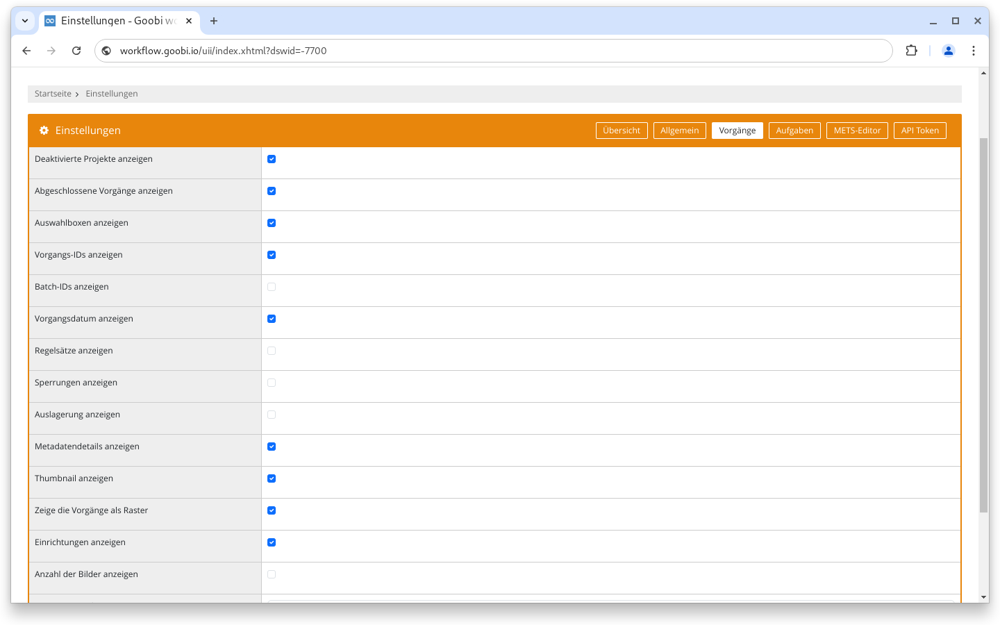
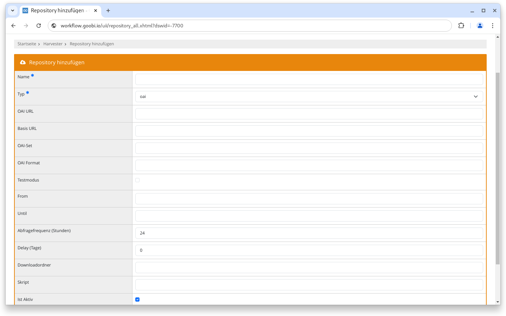
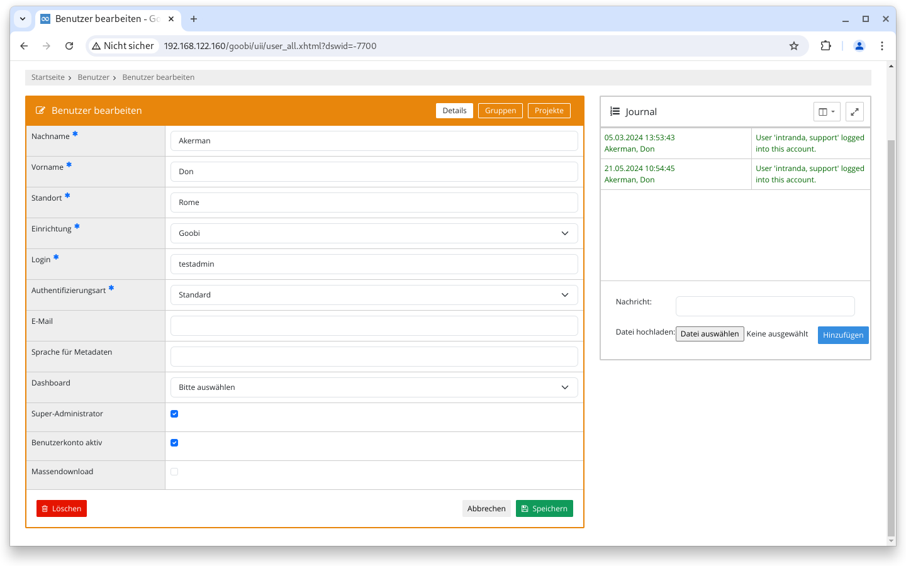
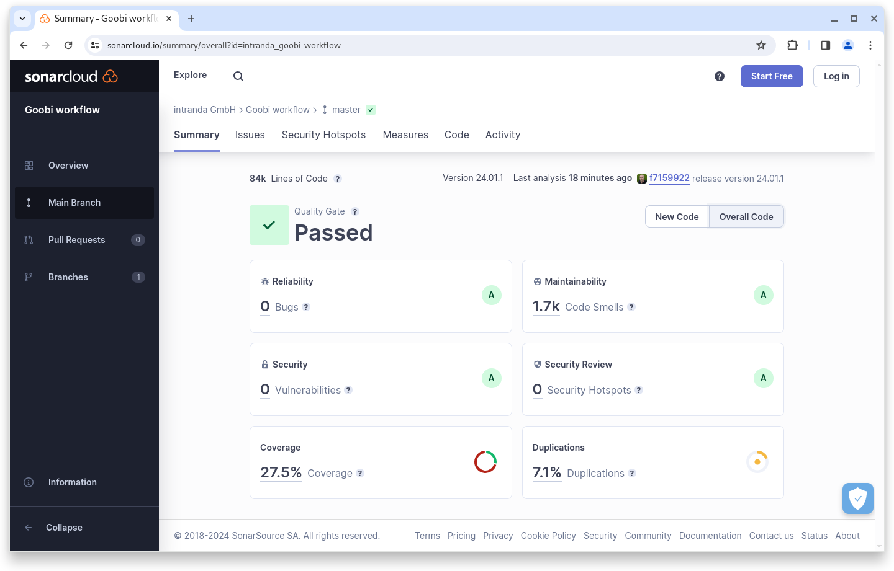

# Januar 2024

## Allgemein


Wir planen in den kommenden Monaten eine größere Umstellung in der Maven Architektur von Goobi workflow und den Plugins. Diese internen Arbeiten können Entwickler und Systemadministratoren in Ihrer Arbeitsweise kurzzeitig beeinträchtigen.


## Core

### Benutzereinstellungen

Die Anzahl der Bilder innerhalb eines Vorgangs kann bereits seit einiger Zeit als zusätzliche Tabellenspalte angezeigt werden. Bisher war es aber nicht möglich diese  Einstellung generell zu aktivieren, sondern sie musste nach jedem Anmelden neu gesetzt werden. Ab dem Januar Release ist es möglich die Option in den Benutzereinstellungen zu speichern, so dass sie für einen Account standardmäßig aktiv ist.

<figure><figcaption><p>Anzahl der Bilder jetzt auch in den Benutzereinstellungen </p></figcaption></figure>

### Suche

Ab sofort ist es möglich nach allen Vorgängen zu suchen die eine Aufgabe mit einem bestimmten Titel haben. Bisher musste der Status der Aufgabe mit angegeben werden (`steplocked:`, `stepopen:`, `stepinwork:`, `stepdone:`, ...). Ab jetzt funktioniert auch einfach `step:` gefolgt von einem Titel oder einem Teil eines Titels.

### Harvester

Der im Oktober eingeführte Harvester wurde für den Typ OAI-PMH um einen Testmodus erweitert. Ist dieser aktiviert wird nicht das komplette Trefferset abgefragt, sondern nur die erste Seite. Der resumptionToken wird dabei ignoriert.

Außerdem können können statische `from` und `until` Werte gesetzt werden. Sind die Werte leer, wird inkrementell nach allen neuen Daten seit der letzten Abfrage gesucht.

<figure><figcaption><p>Neue Optionen für den integrierten Harvester, unter anderem ein Testmodus</p></figcaption></figure>

### Barrierefreiheit

Im Januar Release wurde an vielen kleinen Baustellen im Kontext einer verbesserten Bedienbarkeit und Barrierefreiheit gearbeitet. So wurden teilweise Seitentitel eingepflegt, die Bedienung via Tastatur unter Firefox verbessert, alternative Texte für graphische Elemente eingepflegt und die Seitenstruktur verbessert. Die Änderungen sind erst dann bemerkbar, wenn Goobi workflow mit einem Screenreader oder ohne Maus bedient wird.

### Sicherheit

Seit einiger Zeit wird das Journal auch bei Benutzeraccounts angezeigt. Ab dem Januar Release wird dort automatisch eine Nachricht hinterlassen, wenn das Benutzerprofil von einem Administrator betreten wurde.

<figure><figcaption><p>Benutzer Journal enthält jetzt Informationen über Laden der Einstellungen durch einen Administrator</p></figcaption></figure>

### Snippets

* Im GoobiScript `setPriority` ist die Option `steptitle` jetzt optional.
* Ein Fehler, der bei einer leeren Suche nach Normdaten aufgetreten ist, wird jetzt abgefangen.

## Plugins

### Import: Excel

Das generische Importplugin für Excel-Dateien kann das Anlegen der Vorgänge jetzt auch via GoobiScript abarbeiten.

### OPAC: Soutron

Das Soutron OPAC Plugin unterstützt jetzt auch die neue XML API.

## Codeanalyse

Der folgende Screenshot zeigen die SonarCloud Analyse des aktuellen Releases. Weitere Informationen gibt es direkt auf der [Projektseite](https://sonarcloud.io/organizations/intranda/projects).

<figure><figcaption><p>SonarCloud Analyse: Goobi workflow Core - für den Git Tag v24.01.1</p></figcaption></figure>

## Versionsnummer

Die aktuelle Versionsnummer von Goobi workflow lautet mit diesem Release: **24.01.2**. Innerhalb von Plugin-Entwicklungen muss für Maven-Projekte innerhalb der Datei `pom.xml` entsprechend folgende Abhängigkeit eingetragen werden:

```xml
<dependency>
    <groupId>de.intranda.goobi.workflow</groupId>
    <artifactId>goobi-core-jar</artifactId>
    <version>24.01.2</version>
</dependency>
```