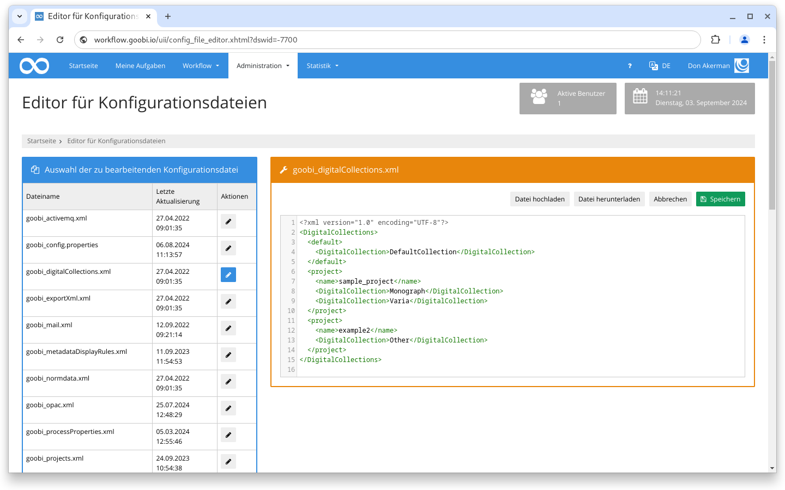
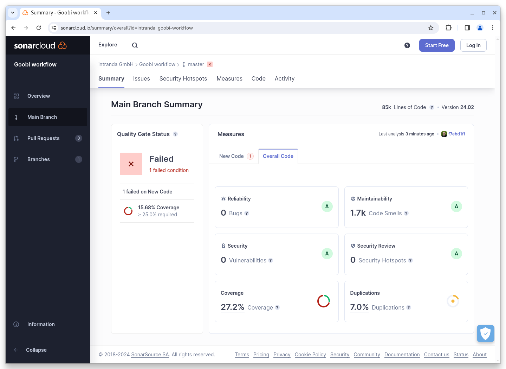

# Februar 2024

## Allgemein


Wir planen in den kommenden Monaten eine größere Umstellung in der Maven Architektur von Goobi workflow und den Plugins. Diese internen Arbeiten können Entwickler und Systemadministratoren in Ihrer Arbeitsweise kurzzeitig beeinträchtigen.



In den kommenden Monaten wird intensiv an den Bereichen "Archive" und "Vokabulare" gearbeitet.


## Core

### Config Editor

Das ehemalige Plugin für den Goobi workflow Konfigurationseditor wurde in den Core integriert und steht ab diesem Release ohne zusätzliche Installation zur Verfügung.

<figure><figcaption><p>Der Konfigurationseditor wurde in den Goobi workflow Core integriert</p></figcaption></figure>

### Frontend Buildsystem

Die Oberfläche von Goobi workflow wird über die klassischen Webtechnologien CSS und Javascript maßgeblich mitgestylt. Die Entwicklung findet aber zum Beispiel in SASS oder LESS Dateien statt, die dann zu CSS kompiliert werden. Auch in Javascript gibt es verschiedene Einzeldateien, die dann für die Applikation in eine Datei zusammengefasst werden. Früher passierte das Kompilieren und Zusammenfassen auf dem PCs des Entwicklers, der die fertigen Dateien dann mit in das Repository eingecheckt hat. Ab dem Februar Release erfolgen diese Arbeitsschritte in der CI Umgebung automatisch. Das vereinfacht den Entwicklungsprozess und reduziert das Potential für merge-Konflikte.

### Snippets

* Der Komperator für Dateinamen wurde grundlegend überarbeitet, so dass auf- und absteigende Sortierungen von Dateien im Core und in Plugins einfacher und fehlerfreier zur Verfügung stehen.

## Plugins

### Export: VLM

Das VLM Export-Plugin kann jetzt basierend auf Metadaten und Bedingungen unterschiedliche Konfigurationsblöcke verwenden.

### Schritt: Rename-Files

Das Schritteplugin um Dateien umzubenennen wurde massiv erweitert und kann jetzt mit in der neuen Konfigurationssektion `<namepart />` mehrere `<condition />` und `<replace />` Argumente enthalten.

### Schritt: Metadata-Edition

Im Schritteplugin zum Bearbeiten von Metadaten gab es einen Bugfix um Informationen zum Repräsentanten korrekt zu speichern.

## Codeanalyse

Der folgende Screenshot zeigen die SonarCloud Analyse des aktuellen Releases. Weitere Informationen gibt es direkt auf der [Projektseite](https://sonarcloud.io/organizations/intranda/projects).

<figure><figcaption><p>SonarCloud Analyse: Goobi workflow Core - für den Git Tag v24.02</p></figcaption></figure>

## Versionsnummer

Die aktuelle Versionsnummer von Goobi workflow lautet mit diesem Release: **24.02.2**. Innerhalb von Plugin-Entwicklungen muss für Maven-Projekte innerhalb der Datei `pom.xml` entsprechend folgende Abhängigkeit eingetragen werden:

```xml
<dependency>
    <groupId>de.intranda.goobi.workflow</groupId>
    <artifactId>goobi-core-jar</artifactId>
    <version>24.02.2</version>
</dependency>
```