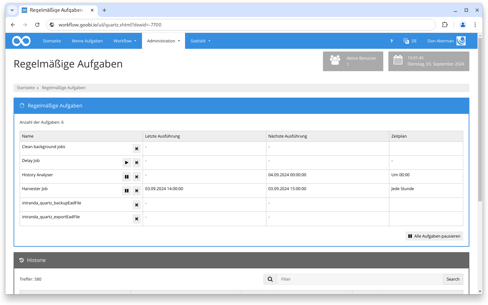

# März 2024

## Allgemein


Die größere Umstellung in der Maven Architektur von Goobi workflow und den Plugins ist im vollen Gange, aus diesem Grund gibt es im März kein Goobi workflow Release.


## Core

### Config Editor

Der frisch integrierte Konfigurationseditor wurde dahingehend erweitert, dass jetzt auch komplette Dateien hoch- und runtergeladen werden können. Weiter werden die im Hintergrund geschriebenen Backups der Dateien in der Oberfläche optional zum Download angeboten

### Regelmäßige Aufgaben

In dem Abschnitt für die Verwaltung der Quartz-Jobs gab es kleinere Änderungen an der Benutzeroberfläche. Wenn eine Aufgabe pausiert ist, wird jetzt auch kein Zeitplan und Datum für die nächste Ausführung angezeigt. Außerdem wurde das Icon zum einmaligen Ausführen geändert.

<figure><figcaption>
Kleinere optische Änderungen auf der Seite der regelmäßigen Aufgaben
</figcaption></figure>

### Vokabulare

Im Bereich der Vokabulare wurde begonnen die Bedienbarkeit bei dem Im- und Export von Datensätzen zu vereinheitlichen.

### Archive

Im Bereich der Archive wurde damit begonnen die Java Logik für die Suche in Beständen neu zu implementieren.

## Plugins

### Export: ADM - BSME

Ein Export Plugin wurde entwickelt, dass beim Erzeugen spezieller Exportformate in die Software Imagen Media Archive Management unterstützt.

### Schritt: ALMA API

Das ALMA API Plugin kann jetzt bei Variablen auch Bedingungen enthalten.

### Schritt: Metadatenanreicherung via Excel-Datei

Das neue Schritteplugin erlaubt es, dass Metadaten aus einer Excel-Datei gelesen und zu bestehenden Strukturelementen hinzugefügt werden.