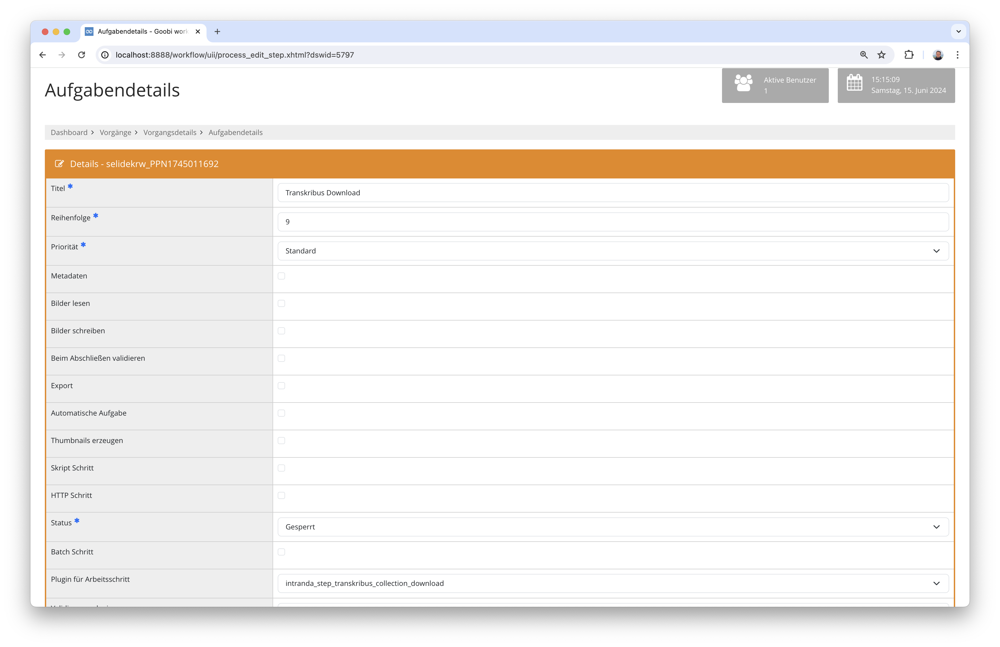

# Mai 2024

## Allgemein
Die im April beschriebenen Änderungen an der Maven Infrastruktur haben sich noch einiges länger hingezogen als erwartet. Doch auch an anderen Stellen gab es Fortschritte, zum Beispiel bei den Vokabularen und an einigen Plugins.


## Core

### ALTO Editor
Die in den Metadateneditor integrierte Lösung, um ALTO-Dateien zu bearbeiten wurde um eine neue Tagging-Funktionalität ergänzt. Dabei können ein oder mehrere Wörter markiert und zusammen mit einem Entitätstyp sowie mit Normdaten verknüpft werden. Dafür stehen bereits diejenigen Normdaten in einem DropDown Menü zur Verfügung, die in der METS-Datei bereits bekannt sind. Alternativ lassen sich jedoch ebenso auch eigene URLs eingeben, um die Verknüpfung mit den Normdaten zu ermöglichen.


### Neuenticklung der Vokabulare
Aufgrund von neuen Anforderungen wird es notwendig, die Verwaltung der Vokabulare deutlich zu überarbeiten. Wir haben uns dafür entschieden, die Vokabulare künftig in einem eigenen Vokabularserver zu verwalten. Dieser steht dann Goobi workflow, Goobi viewer und auch anderen Lösungen mittels einer API zur Verfügung, um Informationen daraus abzufragen. Die Entwicklung steckt noch in einer recht frühen Phase und wird uns voraussichtlich noch einige Wochen begleiten.


## Plugins

### Anbindung von COPE an Goobi workflow
In einem Projekt entstand die Notwendigkeit, die Software COPE von Digital Transitions an Goobi workflow anzubinden. Sie dient dazu, die RAW-Dateien aus Capture One unter Beibehaltung aller relevanten Bildinformationen in TIFF-Dateien zu konvertieren. Die besondere Schwierigkeit hierbei war, diese Windows-basierte Software an Goobi anzubinden. Unter der Nutzung von Python-Skripten ist und dies nun gelungen un in Produktivbetrieb gegangen.


### Anbindung der Transkribus Collections
Im Kontext eines Projektes wurde es notwendig, eine weitere Transkribus-Anbindung zu implementieren. Hierbei ging es speziell darum, dass bereits digitalisierte Bilddateien für eine Auszeichnung in Transkribus genutzt werden sollten, um um somit eine Ground Truth für neue Erkennungmodelle erzeugen zu können.

Für die Umsetzung dieser Funktionalität wurden daher zwei neue Plugins implementiert. Das erste Plugin ist dafür verantwortlich, die bereits im Goobi viewer veröffentlichte METS-Datei mit den zugehörigen Bilddateien an Transkribus zu melden und sie in die gewünschte Collection des Nutzers dort einzuspielen.


Das zweite Plugin hingegen ist dafür verantwortlich, die in Transkribus angereicherten Daten und die somit erzeugten Ergebnisse als ALTO-Dateien abzuholen und in dem OCR-Ordner des jeweiligen Vorgangs zu speichern.



Die Dokumentation der beiden Plugins findet sich hier:

[https://docs.goobi.io/workflow-plugins/de/step/goobi-plugin-step-transkribus-collection](https://docs.goobi.io/workflow-plugins/de/step/goobi-plugin-step-transkribus-collection)

Das Plugin kann zur Installation hier heruntergeladen werden:

[https://github.com/intranda/goobi-plugin-step-transkribus-collection](https://github.com/intranda/goobi-plugin-step-transkribus-collection)


## Versionsnummer
Die aktuelle Versionsnummer von Goobi workflow lautet mit diesem Release: `24.05`. Innerhalb von Plugin-Entwicklungen muss für Maven-Projekte innerhalb der Datei `pom.xml` entsprechend folgende Abhängigkeit eingetragen werden:

```xml
<dependency>
    <groupId>io.goobi.workflow</groupId>
    <artifactId>workflow-core</artifactId>
    <version>24.05</version>
    <classifier>classes</classifier>
</dependency>
```