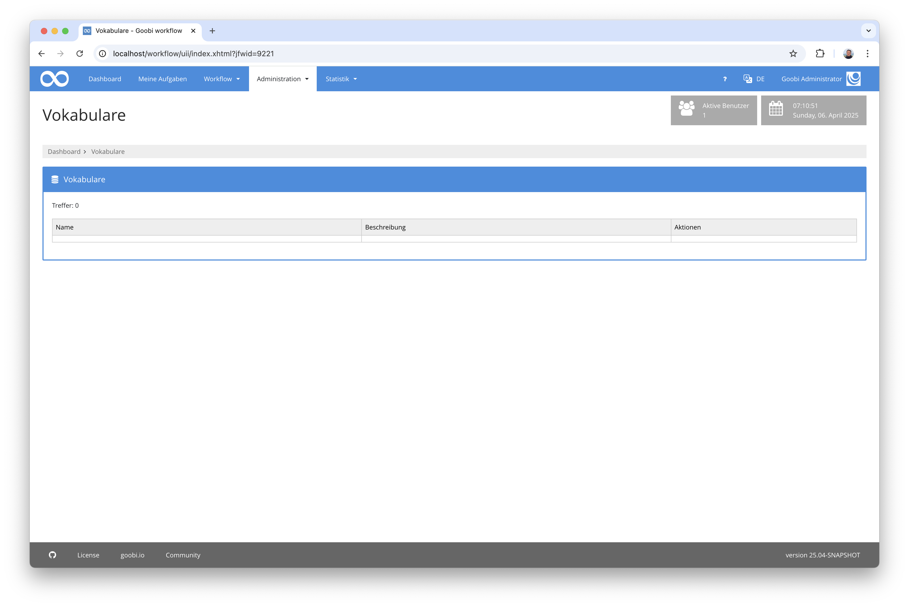
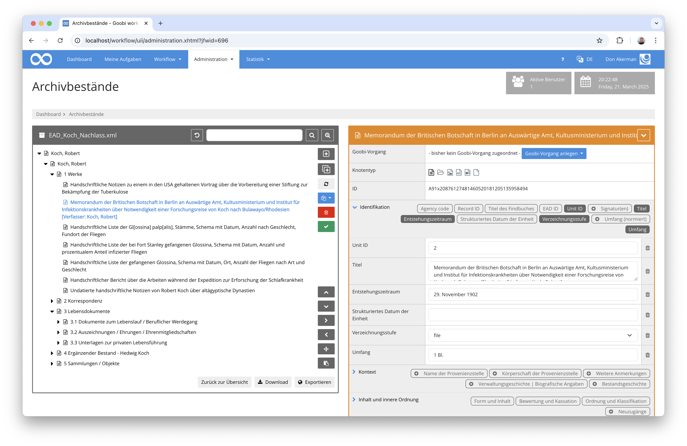

# Juni 2024

## Allgemein
In diesem Monat lag der Fokus hauptsächlich auf der Implementierung der neuen Vokabularverwaltung. Aber auch das Archiv-Management bekommt nun einen neuen Anstrich.


## Core  

### Flexiblere Ordnerkonfiguration
Man kann bereits seit einiger Zeit verschiedene Ordner konfigurieren, um jenseits von `master` und `media` auch andere Verzeichnisstrukturen zu nutzen. Diese Funktionalität wurde nun so erweitert, dass die konfigurierbaren Ordner nun auch für andere Stellen konfiguriert werden und nicht nur auf diejenigen beschränkt sind, die innerhalb des `images`-Verzeichnisses des Vorgangs liegen. Eine beispielhafte Konfiguration sieht so aus:

Die Definition der Verzeichnisse erfolgt in der Konfigurationsdatei `goobi_config.properties` so:

```toml
process.folder.ocr.pdf={processtitle}_pdf
process.folder.export.files={processtitle}_pdf
process.folder.validation.jpylyzer={processtitle}_xml
```

Innerhalb eines Plugins können solche definierten Pfade dann verwendet werden, wie beispielsweise im FileUpload-Plugin in dessen Konfigurationsdatei `plugin_intranda_step_fileUpload.xml`:

```xml
<config_plugin>
    <config>
            <project>*</project>
            <step>*</step>
            <regex>/.*/</regex>
            <folder>master</folder>
            <folder>media</folder>
            <folder>ocr.pdf</folder>
            <folder>export.files</folder>
            <folder>validation.jpylyzer</folder>                        
    </config>
</config_plugin>
```

### Vokabular
Die Arbeiten am Vokaburserver haben im letzten Monat gestartet und gehen weiter voran. Viel sichtbares gibt es noch nicht zu berichten. Wir werden hier voraussichtlich in den kommmenden Wochen genauere Fortschritte vermelden können.



## Plugins 

### Archivmanagement  
Für eine größere Performance und Flexibilität im gesamten EAD / Archivkontext haben wir beschlossen, die Speicherung der Archivalien aus der eigens separat installierten BaseX-Datenbank zu entfernen und stattdessen sämtliche EAD-Daten intern von Goobi workflow verwaltet in der Goobi-Datenbank zu speichern. Diese Arbeiten unter der Haube konnten jetzt größtenteils abgeschlossen werden. Damit ist bereits eine enorme Performancesteigerung eingetreten.



Erste Änderungen der Nutzeroberfläche wurden mittlerweile ebenfalls vorgenommen. So wurde zum Beispiel implementiert, dass die `NodeID` ab sofort auch im Archivbaum stets mit angezeigt werden kann und Knoten in Masse angelegt und mit Metadaten versehen werden können. Auch kann die Anzeige der Metadaten der einzelnen Knoten über die Konfigurationsdatei etwas besser gesteuert werden kann und es können Verlinkungen zwischen verschiedenen Knoten erzeugt werden.

Einige Wochen werden wir mit den Entwicklungen noch beschäftigt sein. Wir werden hier wieder berichten.


## Versionsnummer
Die aktuelle Versionsnummer von Goobi workflow lautet mit diesem Release: `24.06.1`. Innerhalb von Plugin-Entwicklungen muss für Maven-Projekte innerhalb der Datei `pom.xml` entsprechend folgende Abhängigkeit eingetragen werden:

```xml
<dependency>
    <groupId>io.goobi.workflow</groupId>
    <artifactId>workflow-core</artifactId>
    <version>24.06.1</version>
    <classifier>classes</classifier>
</dependency>
```