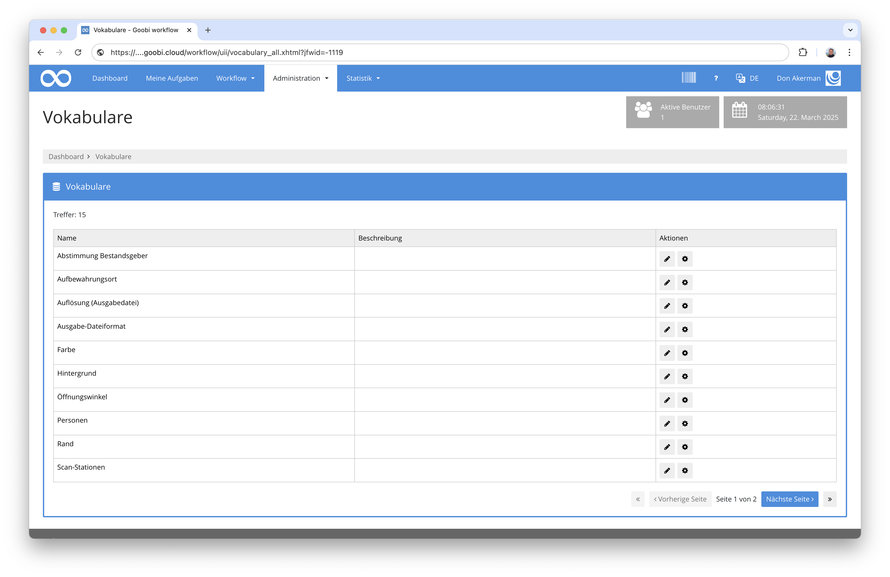
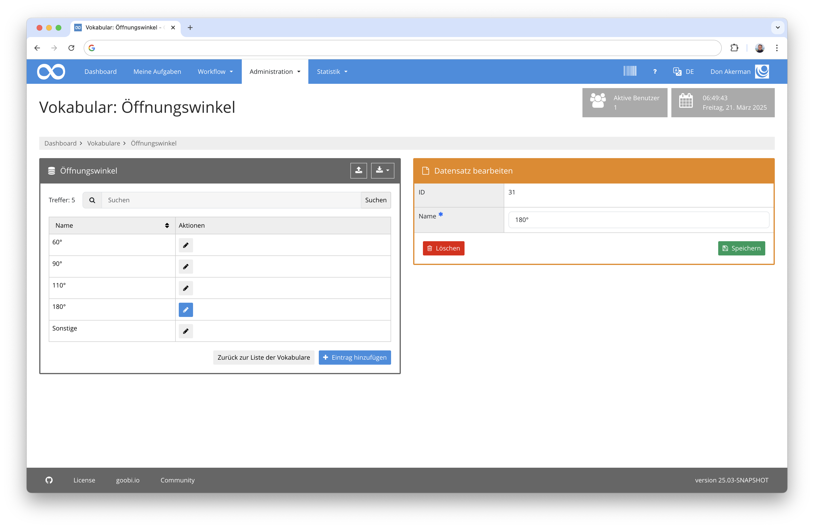
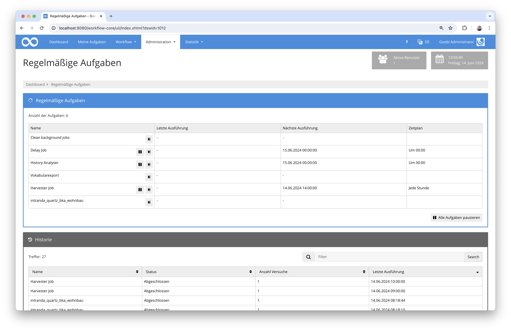

# Juli 2024

## Allgemein
In diesem Monat lag der Fokus vor allem auf drei Dingen: dem Umbau des Vokabulars, der Implementierung des neuen Archiv-Managements sowie der Entwicklung des Plugins für den österreichischen Wohnbaufonds. 


## Core

### Vokabular
Die Entwicklungen am neuen Vokabularserver gehen gut voran. Funktioniell ist am neuen Vokabularserver alles soweit vorbereitet, dass wir uns in diesem Monat auf die Umsetzung der Nutzeroberfläche konzentrieren konnten. 



Ziel ist, so viel wie möglich durch die Nutzeroberfläche bequem bedienbar zu haben. Eine administrative Oberfläche zum Neuanlegen von Vokabularen werden wir in diesem Kontext noch nicht implementieren. 




### Nutzeroberfläche und Javascript-Frontend-Build
Es gibt sehr viele über die Jahre angestauten Altlasten, die wir gerade parallel aufräumen. An einer Überarbeitung der Nutzeroberfläche sitzen wir ja bereits seit einer ganzen Weile. In dem Kontext prüfen wir auch die Anhängigkeiten von den im Hintergrund eingesetzten JavaScript-Bibliotheken sowie den gesamten Kompilierprozess für die Nutzeroberfläche. Viele dieser Arbeiten sieht man nicht unmittelbar direkt in der Anwendung später. Nötig sind diese Arbeiten aber dennoch.


## Plugins

### Dateneinspielung für den österreichischen Wohnbaufonds
Für den österreichischen Wohnbaufonds wurde ein automatisierter Datenimport entwickelt. Hierbei geht es darum, dass digitalisierte Akten, die in Form mehrerer Lieferungen durch den Scandienstleister bereitgestellt und in json-Dateien werden, in ihre jeweiligen Dokumente zerlegt, strukturiert und mit Metadaten angereichert werden.



Das Plugin ist sehr spezifisch auf den österreichischen Wohnbaufonds ausgerichtet und daher kaum für andere Projekte sinnvoll nachnutzbar. Dennoch finden sich hier auf der Dokumentationsseite weitere Details für Interessierte:

[https://docs.goobi.io/workflow-plugins/de/quartz/goobi-plugin-quartz-bka-wohnbau](https://docs.goobi.io/workflow-plugins/de/quartz/goobi-plugin-quartz-bka-wohnbau)


### Implementierung einer Rechnungsgenerierung und Lieferscheingenerierung mit Kostenerfassung  
Für die Zentralbibliothek in Zürich wurde benötigt, dass Nutzerbestellungen möglichst verautomatisiert bearbeitet werden können. Hierzu wurde ein sehr besonderer Workflow ausgearbeitet, der die Nutzerbestellungen analysiert und entsprechend die gewünschten Arbeitsschritte ausführt.


Teil des Workflows ist dabei unter anderem, dass auch Informationen zu Kosten mit erfasst werden können. Diese sind abhängig von Währung, von der Bestellung, von der Lieferart und anderen Faktoren abhängig, so dass tatsächlich eine manuelle Anpassung der Kostenaufstellung gewünscht ist.


Abschließend erzeugt Goobi mit diesem Plugin automatisch Lieferscheine, lädt die Daten auf einen Zielserver hoch und generiert ebenso eine Rechnungsvorlage für die Buchhaltung.


Mehr Details zu dem Plugin finden sich wie gewohnt hier auf der Dokumentationsseite:

[https://docs.goobi.io/workflow-plugins/de/step/goobi-plugin-step-zbz-order-delivery](https://docs.goobi.io/workflow-plugins/de/step/goobi-plugin-step-zbz-order-delivery)


### Archiv-Management
Wir sind in den letzten Zügen des Großumbaus für die Archivalien. Unsere Planung sieht vor, dass wir mit den Entwicklungen im kommenden Monat fertig werden. Dann gibt es endlich auch detaillierte Informationen über die Neuerungen.


## Versionsnummer
Die aktuelle Versionsnummer von Goobi workflow lautet mit diesem Release: `24.07`. Innerhalb von Plugin-Entwicklungen muss für Maven-Projekte innerhalb der Datei `pom.xml` entsprechend folgende Abhängigkeit eingetragen werden:

```xml
<dependency>
    <groupId>io.goobi.workflow</groupId>
    <artifactId>workflow-core</artifactId>
    <version>24.07</version>
    <classifier>classes</classifier>
</dependency>
```