# August 2024

## Allgemein

## Core

### Neuer Vokabularserver
Goobi workflow verfügt bereits seit mehreren Jahren über eine Vokabularverwaltung. Diese war bisher in Goobi fest integriert und konnte somit an den verschiedenen Bereichen aus Goobi selbst verwendet werden, beispielweise innerhalb des Metadateneditors und in einigen Plugins. Der Vokabularserver verfügte in der Vergangenheit auch bereits über eine Api, um auch externe Applikationen damit kommunizieren zu lassen. Verwendung fand dies allerdings bisher nicht.

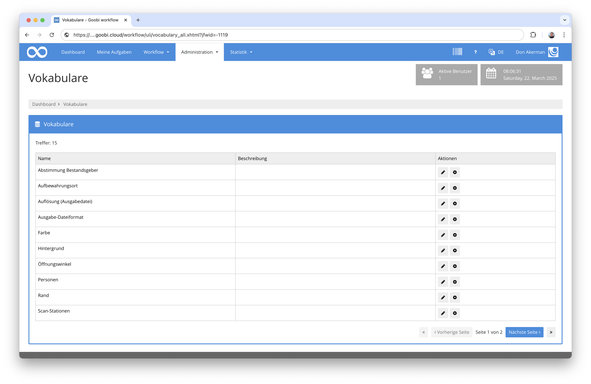

Neue Anforderungen stellten uns nun vor der Herausforderung, dass Funktionalitäten erforderlich wurden, die mehr als nur eine Anpassung der bestehenden Vokabularverwaltung erforderlich machten. Aus diesem Grund haben wir einen neuen Vokabularserver von Grund auf entwickelt, der äußerst flexibel ist, verschiedene Datensatztypen samt Validierung kennt und von vornherein mehrsprachig ausgelegt ist. 

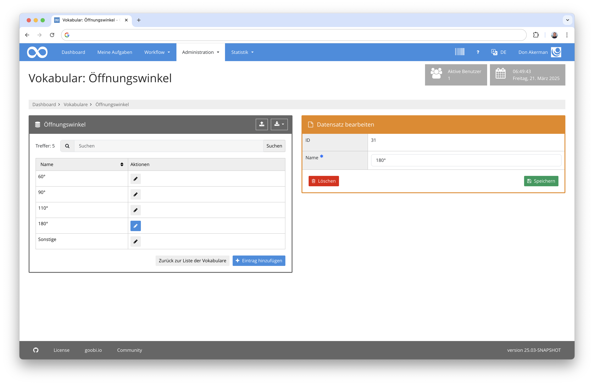

Er verfügt auch über einen Exportmechanismus im RDF-Format und ein Migrationstool, um die Daten aus der bisherigen Vokabularverwaltung in den neuen Vokabularserver umzuziehen. Und natürlich verfügt der neue Vokabularserver auch über eine sehr umfangreiche REST-API, die eine vollständige Kommunikation mit den Vokabularen ermöglicht. Über diese API kommuniziert nun auch Goobi workflow mit dem Vokabularserver. 

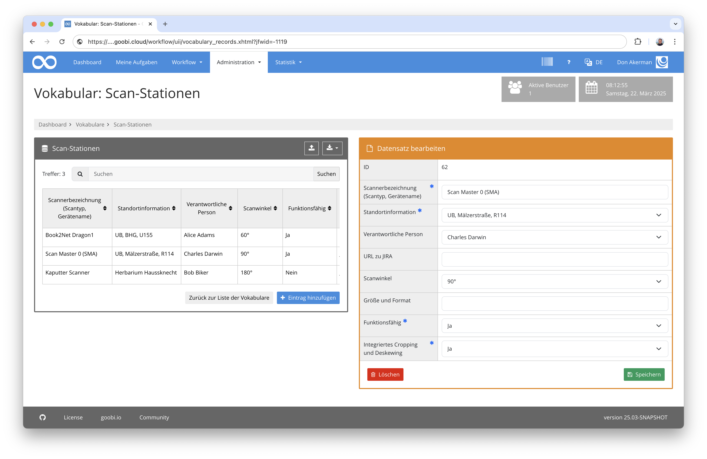

Einer der Nebeneffekte dieser Umstellung ist, dass der Vokabularserver nun eigenständig und auf eigener Infrastruktur betrieben werden kann. Dies erlaubt, dass nun auch tatsächlich andere Applikationen aus verschiedenen Netzsegmenten damit arbeiten können, ohne dass Goobi workflow selbst öffentlich zugänglich werden muss.

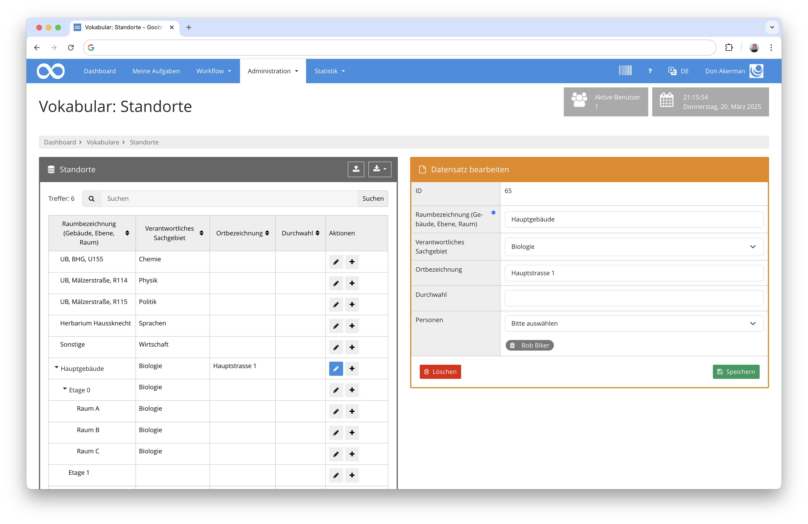

Eine Anbindung des Goobi viewers an den Vokabularserver ist noch nicht erfolgt aber für das kommende Jahr geplant. Was außerdem noch offen ist, ist die Möglichkeit wie bisher aus der Nutzeroberfläche neue Vokabulare zu definieren. Vokabulare werden derzeit in dem Vokabularserver über REST-Aufrufe definiert. Auch hierzu wird es sicher bald eine Nutzeroberfläche geben. Bis dahin aber haben wir schon eine sehr umfangreiche Dokumentation zur Vefügung gestellt, die die Installation und Verwaltung des Vokabularservers beschreibt. Sie findet sich an dieser Stelle:

[https://github.com/intranda/goobi-vocabulary-server/blob/develop/docs/de/README.md](https://github.com/intranda/goobi-vocabulary-server/blob/develop/docs/de/README.md)

Der Vokabularserver wurde wie Goobi worklow auch auf Github unter der GPL2 als Open Source veröffentlicht und dokumentiert. Das Repository befindet sich hier:

[https://github.com/intranda/goobi-vocabulary-server/tree/develop](https://github.com/intranda/goobi-vocabulary-server/tree/develop)


### Bedingt angezeigte Vorgangseigenschaften   
Die Vorgangseigenschaften werden werden in vielen Goobi Installationen dazu benutzt, dass von Bearbeitern Informationen erfasst werden, während Aufgaben in Goobi ausgeführt werden. Typische solche Informationen sind beispielsweise der Öffnungswinkel, die Nutzung der Glasplatte, das verwendete Gerät und einige andere.

Öfter kam schon der Wunsch auf, dass die hierbei erfassbaren Felder nicht immer komplett aufgeführt werden, sondern immer nur dann für den Nutzer angezeigt werden, wenn diese auch erforderlich sind, abhängig von der Auswahl eines anderen Wertes in einer anderen Eigenschaft. Diese Funktionalität haben wir nun umgesetzt.

Innerhalb der Anlegemaske beispielsweise wird eine Eigenschaft angezeigt:

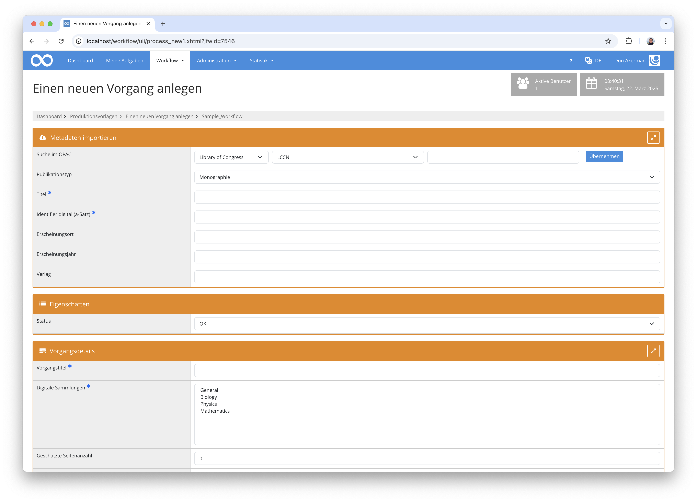

Wenn von dieser Eigenschaft der Wert geändert wird, werden abhängig davon andere Eigenschaften ebenso angezeigt:

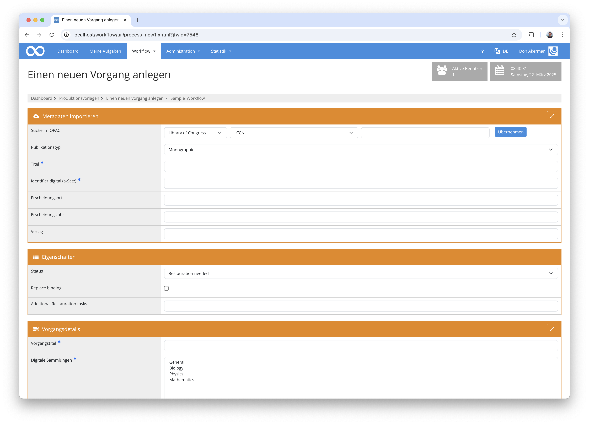

Das gleiche Prinzip funktioniert ebenso innerhalb der angenommenen Aufgaben. Auch dort wird eine Eigenschaft angezeigt:

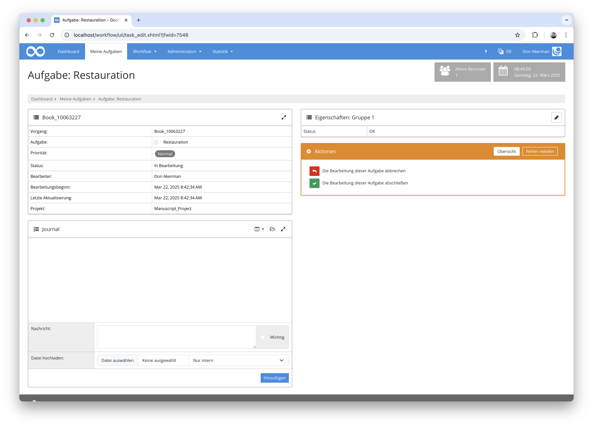

Und andere Eigenschaften lassen sich abhängig von der Auswahl der Eigenschaft zusätzlich anzeigen:

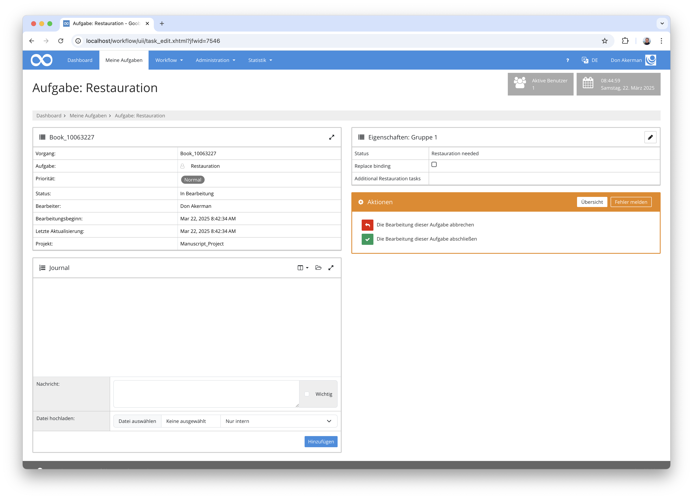

Die Konfiguration für das hier gezeigte Beispiel sieht innerhalb der Konfigurationsdatei `goobi_processProperties.xml` wie folgt aus:

```xml
    <!-- check status of object -->
    <property name="Status" container="1">
        <project>*</project>
        <showProcessCreation access="write" template="*" />
        <showStep name="Restauration" access="write"/>
    	<type>List</type>
        <value>OK</value>
        <value>Restauration needed</value>
        <value>Cancel</value>
    </property>

    <property name="Replace binding" container="1">
        <project>*</project>
      
      	<!-- show inside of creation interface -->
        <showProcessCreation access="write" template="*">
            <display property="Status" value="Restauration needed" />
        </showProcessCreation>
      
      	<!-- show inside of task -->
      	<showStep name="Restauration" access="write">
      		<display property="Status" value="Restauration needed" />
        </showStep>
        <type>Boolean</type>
    </property>
  
    <property name="Additional Restauration tasks" container="1">
        <project>*</project>
      
      	<!-- show inside of creation interface -->
        <showProcessCreation access="write" template="*">
            <display property="Status" value="Restauration needed" />
        </showProcessCreation>
      
      	<!-- show inside of task -->
      	<showStep name="Restauration" access="write">
      		<display property="Status" value="Restauration needed" />
        </showStep>
        <type>Text</type>
    </property>
```

Eine Dokumentation zu diesen Möglichkeiten findet sich hier im Handbuch:  
[https://docs.goobi.io/goobi-workflow/admin/06_config_files/10_goobi_processproperties.xml#bedingte-anzeige-von-eigenschaften](https://docs.goobi.io/goobi-workflow/admin/06_config_files/10_goobi_processproperties.xml#bedingte-anzeige-von-eigenschaften)


### Vorgangstitel ausblendbar in Anlegemaske
Vielen Anwendern von Goobi ist nicht bekannt, dass ich in der Anlegemaske auch Felder ausblenden lassen. Neu hinzugekommen ist in diesem Monat, dass sich auch der Vorgangtitel ausblenden läßt. Dies kann zum Beispiel sinnvoll sein, wenn dieser autoamtisch generiert wird und nicht von Nutzern geändert werden soll.

Die Konfiguration erfolgt innerhalb der Konfigurationsdatei `goobi_projects.xml` und kann dort zusammen mit den anderen Ausblendungen erfolgen:

```xml
<hide>collections</hide>
<hide>doctype</hide>
<hide>images</hide>
<hide>processtitle</hide>
```

Eine Dokumentation der gesamten Konfiguraionsdatei findet sich hier:  
[https://docs.goobi.io/goobi-workflow/de/admin/06_config_files/11_goobi_projects.xml](https://docs.goobi.io/goobi-workflow/de/admin/06_config_files/11_goobi_projects.xml)


### Umgestaltung der Konfiguration für die Anlegemaske
Auch andere Änderungen haben wir im Bereich der Anlegemaske von Goobi vorgenommen. Hier war uns schon seit längerem die komplizierte Konfiguration innerhalb der Datei `goobi_projects.xm` ein Dorn im Auge, so dass wir nun neue verkürzte Schreibweisen für die gleiche Konfiguration erlauben, die intuitiver zu verwenden sind. Dennoch bleibt der Mechanismus abwärtskompatibel und kann sukzessive auf die besser lesbare Konfiguration umgestellt werden.

Bisherige Konfiguration eines Haupttitels:

```xml
<item from="vorlage" docstruct="topstruct" metadata="TitleDocMain" required="true" ughbinding="true">Title</item>
```

Neue verkürzte Schreibweise für den Haupttitel:

```xml
<item from="template" metadata="TitleDocMain" required="true">Title</item>
```

Wenn eine Eigenschaft hingeben direkt am Vorgang gespeichert werden soll, kann auch das Attribut `from weggelassen werden:

```xml
<item metadata="TitleDocMain" required="true">Title</item>
```

Soll eine Information hingegen ausschließlich innerhalb der METS-Datei gespeichert werden, kann die Speicherung als Eigenschaft so unterbunden werden:

```xml
<item metadata="TitleDocMain" required="true" from="-">Title</item>
```

Auch die Schreibweise der Position, wo ein Metadatum gespeichert wird, haben wir vereinfacht. Bisher wurde die Position so ausgedrückt:

```xml
<item metadata="PublisherName" docstruct="firstchild">Title</item>
```

Verkürzt sieht das jetzt so aus:

```xml
<item metadata="PublisherName" docstruct="child">Title</item>
```

### Neue Feldtypen für die Anlegemaske
Bisher waren die Feldtypen in der Anlegemaske von Goobi worklow recht beschränkt. Hier haben wir nun drei neue Varianten geschaffen.

Informationen können jetzt in einer Textarea erfasst werden:

```xml
<item metadata="TitleDocMain" required="true" type="textarea">Title</item>
```

Informationen können aus Vokabularen übernommen werden:

```xml
<item metadata="DocLanguage" vocabulary="Languages">Language</item>
```

Und auch Datumsangaben mit Kalenderauswahl sind nun möglich:

```xml
<item metadata="DateOfOrigin" required="true" type="date" pattern="yyyy-MM-dd">Issue Date</item>
```


## Plugins

### Umbau Doku-Plattform für Plugins  
Aktuell verfügen bereits 143 der insgesamt 360 Plugins bereits über eine sehr ausführliche zweisprachige Dokumentation. Um diese bei dieser Vielzahl an Nutzungsszenarien und Plugintypen weiterhin gut pflegen zu können, haben wir uns dazu entschieden, die Art der Dokumentation zu überarbeitet. Statt die Dokumentationen an einer zentralen Stelle zu pflegen, haben wir sämtliche Dokumentationen jeweils in den Unterordner `docs` des jeweiligen Plugins umgezogen und dessen Aufbau homogenisiert. Damit ist es ab nun möglich, dass die Dokumentation für jedes Plugin jeweils auch bei dem Entwickler im gleichen Quelltextrepository vorliegt, um sie zu überblicken und auch inhaltlich pflegen zu können.

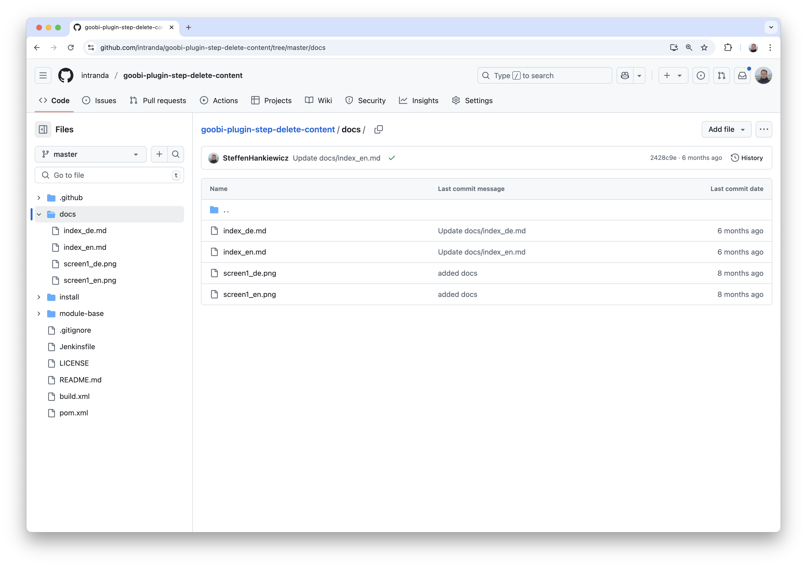

Aus diesen somit deutlich einfacher zu pflegenden einzelnen Dokumentationen erzeugen wir nun automatisch eine zentrale Datenquelle in ein eigenes Repository, was hier zu finden ist:

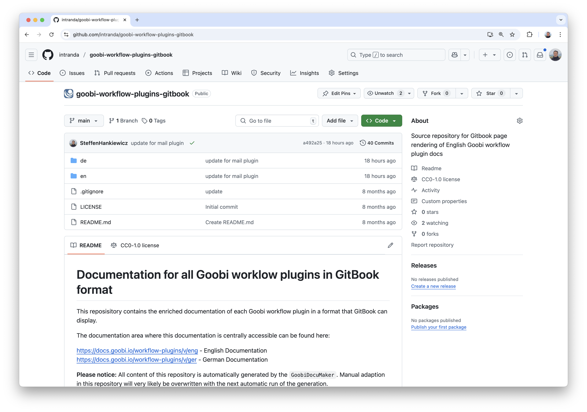

Aus diesem Repository speist sich dann wiederum unsere Dokumentationsplattform unter [https://docs.goobi.io/](https://docs.goobi.io/).

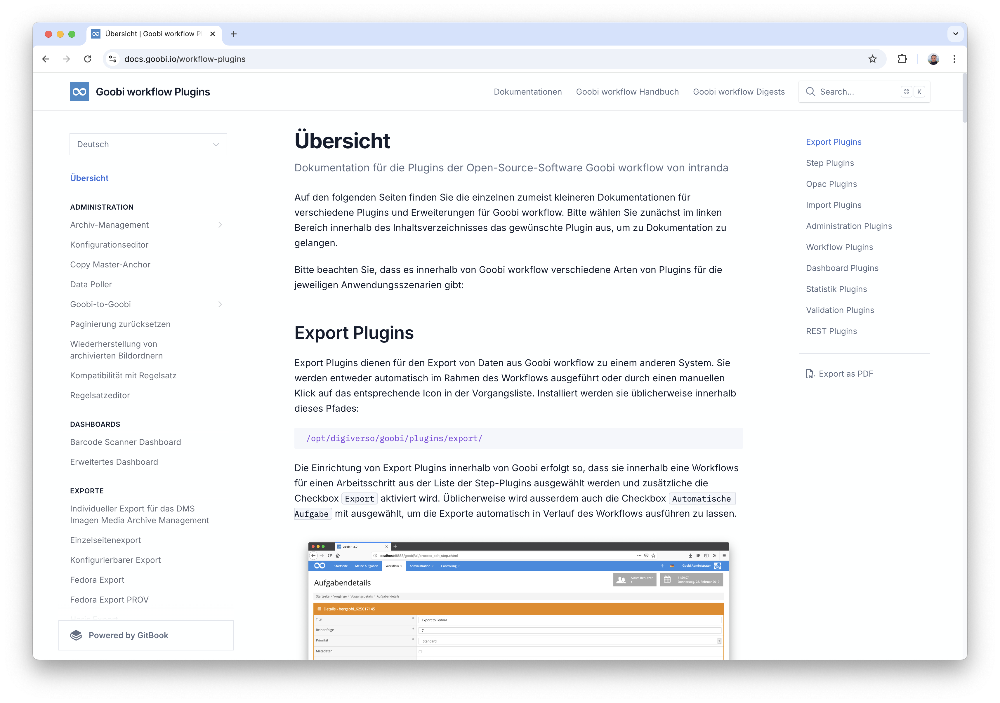


### Erstellung von Plugin-Doku für ca. 20 Plugins  
Und weil wir sowieso schon so aktiv an den Dokumentationen von Plugins gearbeitet haben, haben wir in diesem Monat einfach einmal 20 weitere Plugins dokumentiert, womit nun ca. 150 Plugins bereits umfangreich dokumentiert sind.


### Fertistellung der neuen Archiv-Management-Plugins
In den letzten Monaten haben wir sehr intensiv an der Überarbeitung des Archiv-Management-Plugins gearbeitet. Ziel war dabei, dass wir funktionell sowie auch von der Bedienung einige Neuerungen umsetzen wollten. Diese konnten wir nun endlich abschließen und in einem ersten Projekt in Betrieb nehmen.

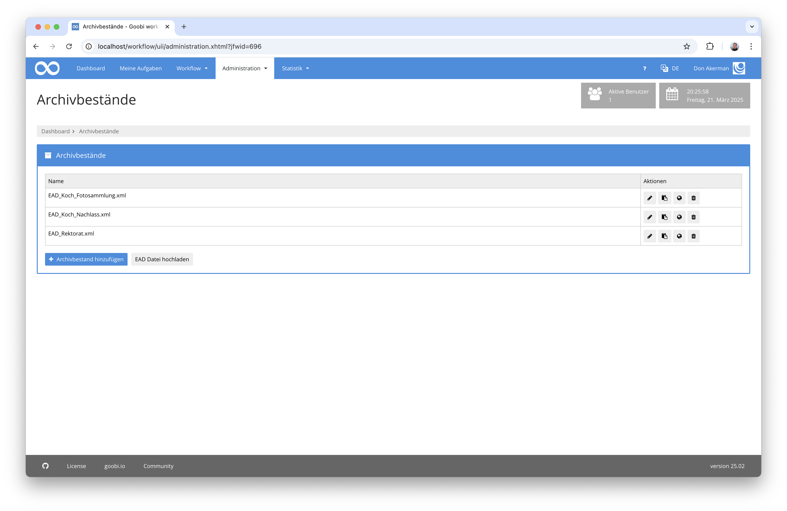

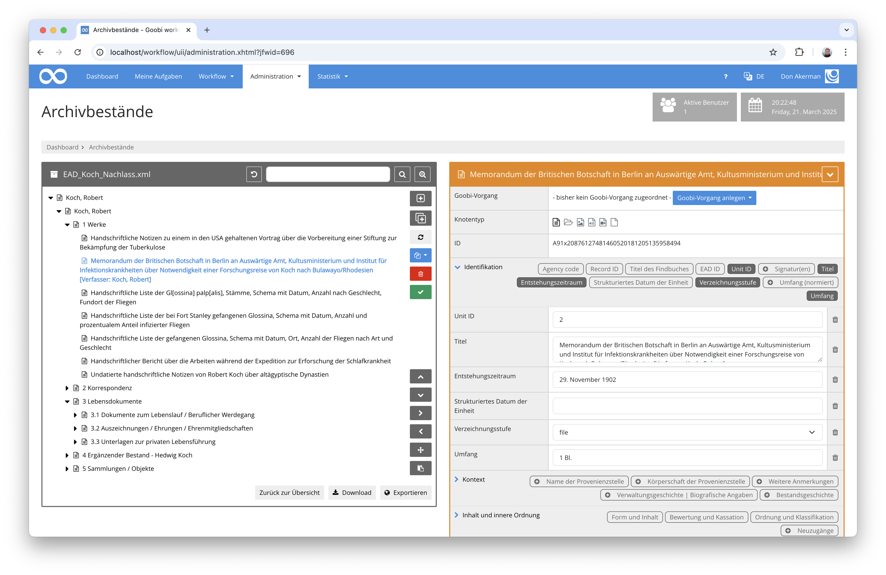

Einige der größten Neuerungen sind in diesem Kontext unter anderem:

- Es wird keine BaseX-Datenbank mehr zusätzlich benötigt. Stattdessen speichert Goobi die Informationen aller Knoten des Archivbaums innerhalb der Goobi-Datenbank.
- Mehrere Personen können gleichzeitig in einem Archivbaum arbeiten, ohne dass Sperrungen des gesamten Baumes nötig sind.
- Es können jetzt EAD2, EAD3 und EAD4 Formate eingelesen und verarbeitet werden
- Es gibt jetzt einen eigenständigen EAD-Export zum Goobi viewer
- Knoten und Baumabschnitte können jetzt umgehängt werden innerhalb des Baumes
- Knoten können dupliziert werden
- Knoten können in Masse angelegt werden
- Es können sehr granulare Rechte für die Arbeit mit dem Archiv-Management vergeben werden
- Es können Berechtigungen für die Inhalte vergeben werden
- Suche nach allen Metadaten statt nur nach Titelinhalten
- Composite-Fields als Gruppen mit mehreren Metadatenfeldern
- Verschiedene Feldtypen pro Metadatum
- Periodischer Export des gesamten EAD-Bestandes zum Goobi viewer
- Stark konfigurierbarer Export für den gesamten Bestand oder auch pro Metadatum

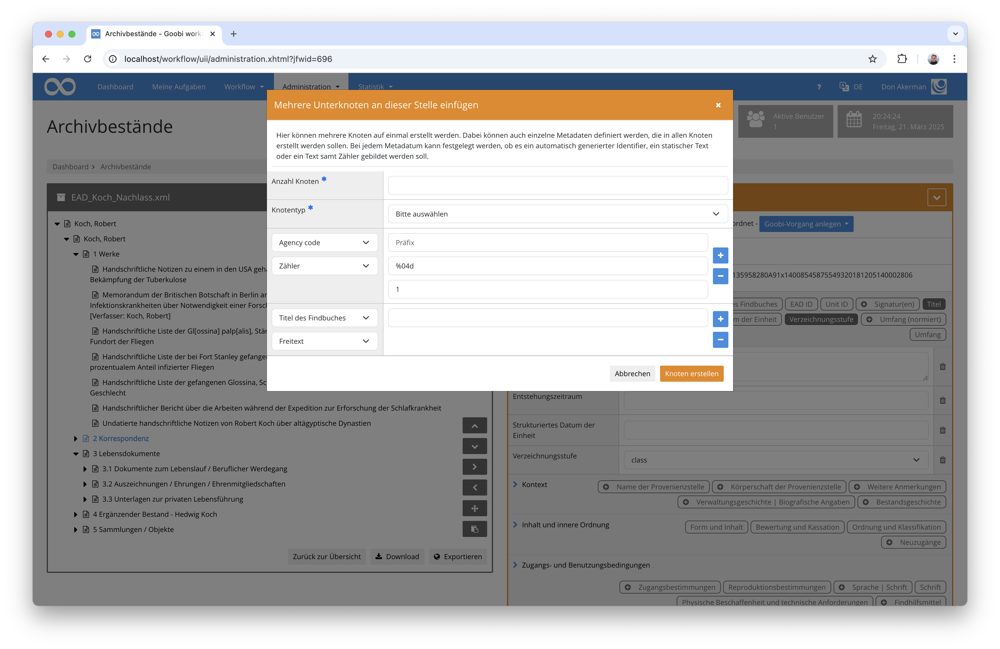

Mehr Informationen zu dem Plugin, dessen Installation und Konfiguration finden sich hier:  
https://docs.goobi.io/workflow-plugins/de/administration/goobi-plugin-administration-archive-management


### Neues Plugin zur Anreicherung von MIX Metadaten
Wir haben ein neues Plugin für die Anreicherung der METS-Dateien mit MIX Metadaten implementiert. Es erlaubt, dass aus vorliegenden Bildern deren Metadaten ausgelesen und anschließend in der METS-Datei als MIX-Daten gespeichert werden. Dazu ruft das Plugin zunächst einmal JHove auf und extrahiert aus dem somit gewonnenen Analyseergebnis die gewünschten Metadaten gemäß der festgelegten Konfiguration. 

Hier einmal ein Ausschnitt einer solchen Konfiguration:

```xml
<jhoveConfig>/opt/digiverso/goobi/config/jhove/jhove.conf</jhoveConfig>
<renameMappings>
    ...
    <value from="ImageCaptureMetadata/ScannerCapture/scannerManufacturer" to="ImageCaptureMetadata/DigitalCameraCapture/digitalCameraManufacturer" removeEmptyParents="true"/>
    <value from="ImageCaptureMetadata/ScannerCapture/ScannerModel/scannerModelName" to="ImageCaptureMetadata/DigitalCameraCapture/DigitalCameraModel/digitalCameraModelName" removeEmptyParents="true"/>
    ...
</renameMappings>
<extraMappings>
    ...
    <value source="//jhove:property[jhove:name='ExposureTime']//jhove:value[1]" target="ImageCaptureMetadata/DigitalCameraCapture/CameraCaptureSettings/ImageData/exposureTime" transform="rational2real"/>
    <value source="//jhove:property[jhove:name='ISOSpeedRatings']//jhove:value[1]" target="ImageCaptureMetadata/DigitalCameraCapture/CameraCaptureSettings/ImageData/isoSpeedRatings"/>
    <value source="//jhove:property[jhove:name='ShutterSpeedValue']//jhove:value[1]" target="ImageCaptureMetadata/DigitalCameraCapture/CameraCaptureSettings/ImageData/shutterSpeedValue" transform="rational2rationalType"/>
    ...
</extraMappings>
```

Auf diese Weise werden die Metadaten in die METS-Datei von Goobi überführt. In der weiteren  Verarbeitung der Vorgänge vor allem in Hinblick auf die Veröffentlichung stehen somit diese konfigurierten übernommenen technischen Metadaten aus den Master-Bildern in der METS-Datei und damit dann auch für Nutzer bequem zur Verfügung. 

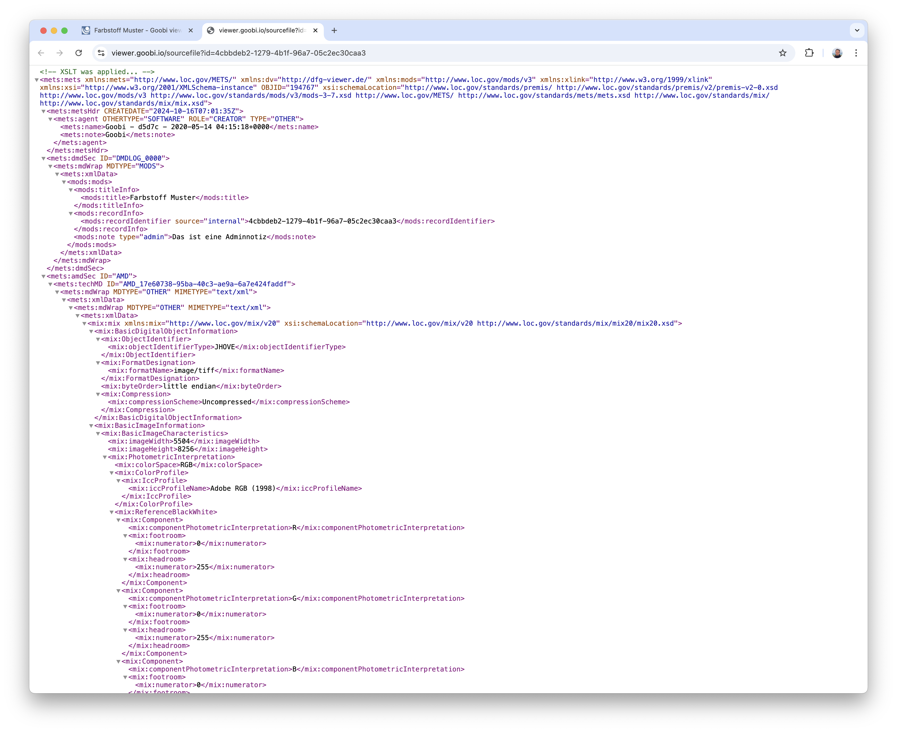

Sie können somit beispielsweise neben den Bildern zusätzlich eingeblendet oder auch danach gesucht werden.


Mehr Informationen zu dem Plugin, dessen Installation und Konfiguration finden sich hier:  
[https://docs.goobi.io/workflow-plugins/de/step/goobi-plugin-step-mix-metadata-enrichment](https://docs.goobi.io/workflow-plugins/de/step/goobi-plugin-step-mix-metadata-enrichment)


## Versionsnummer
Die aktuelle Versionsnummer von Goobi workflow lautet mit diesem Release: `24.08.3`. Innerhalb von Plugin-Entwicklungen muss für Maven-Projekte innerhalb der Datei `pom.xml` entsprechend folgende Abhängigkeit eingetragen werden:

```xml
<dependency>
    <groupId>io.goobi.workflow</groupId>
    <artifactId>workflow-core</artifactId>
    <version>24.08.3</version>
    <classifier>classes</classifier>
</dependency>
```