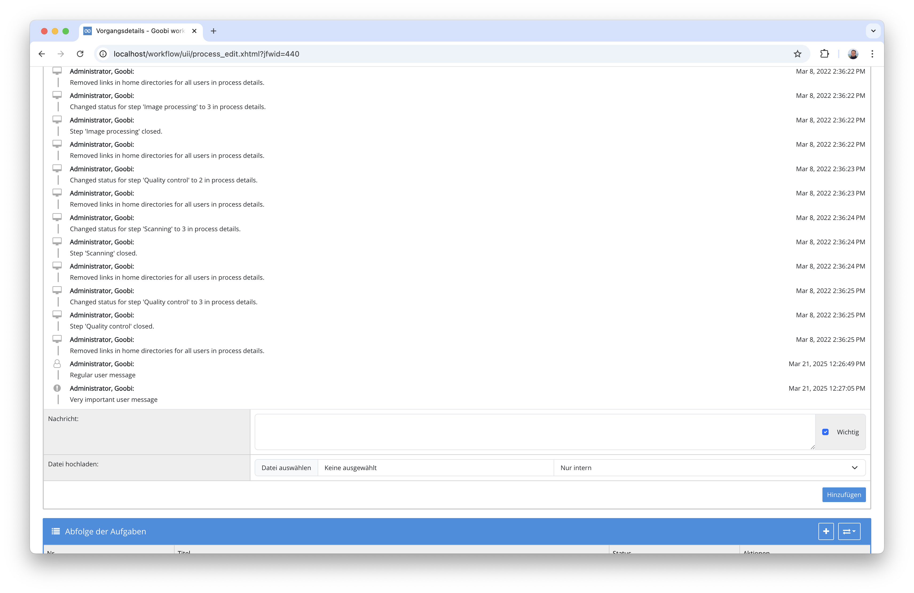
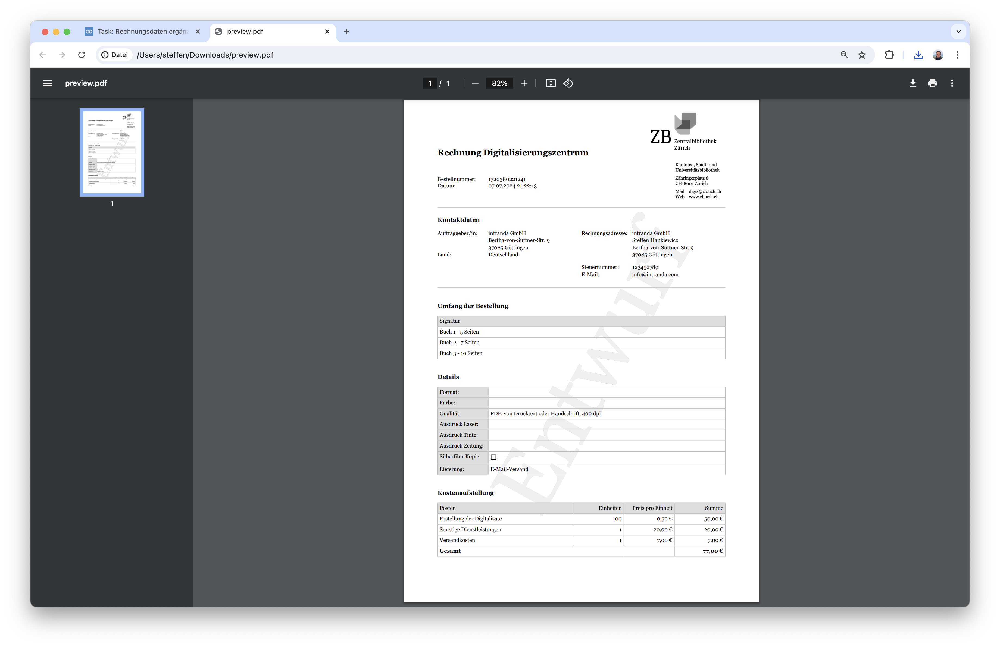

# September 2024

## Allgemein
Wie schon in den vergangenen Jahren war auch in diesem Jahr wieder das große Anwendertreffen in Göttingen. Viel konnten wir dennoch noch erreichen in diesem Monat.

## Core

### Umstellung auf Java 17
Wir haben den Quelltext von Goobi und den Plugins von Java 11 auf Java 17 umgestellt. Das ist zunächst noch keine besonders große Änderung, weil wir den Quelltext noch immer mit Kompatibilität für Java 11 kompilieren. Damit ist die Applikation auch weiterhin in der bewährten Infrastruktur einsetzbar, ohne große Umstellungen vornehmen zu müssen. Perspektivisch werden wir aber sehr bald ein größeres Update für Java 21 durchführen müssen, um mit Tomcat 10 kompatibel zu sein. Dies werden wir dann zu Beginn des kommenden Jahres in Angriff nehmen


### Neue Oberfläche für das Journal
Die Oberfläche des Journals, das zu jedem Vorgang gehört, haben wir einmal ganz neu gestaltet. Statt wie bisher mit verschiedenen Farben zu arbeiten, ist eine Klassifizierung der einzelnen Nachrichten nun durch die Icons erkennbar. Dies erlaubt so eine deutlich bessere Accessibility.


Wie bisher auch kann das Journal in einen expandierten Modus umgeschaltet werden und ist sonit insbesondere bei vielen Inhalten deutlich besser lesbar, ohne innerhalb der Box scrollen zu müssen.



Und natürlich haben wir die Gestaltung gleich so vorgenommen, dass alle Bereiche von Goobi worklfow, die das Journal verwenden, davon profitieren und somit die gleiche interne Komponente und damit auch die gleiche Gesaltung nachnutzen. Dies gilt unter anderem für das Journal in den angenommenen Aufgaben, in den Projekten und bei den Nutzern.


## Plugins


### Verarbeitung von Nutzerbestellungen
Zusammen mit der Zentralbibliothek Zürich haben wir ein sehr flexibles Plugin für den Umgang mit Nutzerbestellungen erstellt. Dieses erlaubt, dass Informationen, die durch die Nutzer bei der Beauftragung angegegeben wurden für die Abrechnung, erfasst und weiterverarbeitet werden können. Hierbei geht es einerseits um die Möglichkeit, dass Nutzer die Möglichkeit haben sollen, über Ihre Bestellungen informiert zu werden und dabei auch einen Lieferschein zu erhalten. 


Ebenso ging es aber auch darum, dass Angaben zur Bestellung, die einen Einfluß auf die Zusammensetzung der Kosten haben, bearbeitbar werden und abschließend der Buchhaltungsabteilung zur Verfügung gestellt werden können.




Mehr Informationen zu dem Plugin, dessen Installation und Konfiguration finden sich hier:  
[https://docs.goobi.io/workflow-plugins/de/step/goobi-plugin-step-zbz-order-delivery](https://docs.goobi.io/workflow-plugins/de/step/goobi-plugin-step-zbz-order-delivery)


### Erweiterung des Mail-Plugins für Anhänge und Variablen
Bereits seit einiger Zeit existiert ein Plugin, das erlaubt, dass im Verlauf des Workflows gezielt E-Mails mit flexiblem Inhalt durch Goobi versendet werden können. Was hier allerdings noch fehlte war, dass für die Angabe von Empfängern Informationen aus den Vorgangseigenschaften genutzt werden können. Dies war für den Versand von Nachrichten an die Absender einer Nutzerbestellung erforderlich. 

Auch wurde in diesem Zusammenhang eine Erweiterung des Plugins vorgenommen, um nun auch Anhänge an Mails anfügen zu können. Auch diese können unter Verwendung von Variablen aus Eigenschaften, Metadaten oder Pfaden des Vorgangs sehr flexibel festgelegt werden.


Mehr Informationen zu dem Plugin, dessen Installation und Konfiguration finden sich hier:  
[https://docs.goobi.io/workflow-plugins/de/step/goobi-plugin-step-send-mail](https://docs.goobi.io/workflow-plugins/de/step/goobi-plugin-step-send-mail)

### PDF Generierung erweitert
Das Plugin, mit dem flexibel im Verlauf von Workflows PDF-Dateien generiert werden können, ist deutlich überarbeitet worden. Die Konfiguration des Plugins erlaubt jetzt, dass noch besser gesteuert werden kann, woraus die PDF-Dateien tatsächlich generiert werden sollen. Dies betrifft einerseits die Angabe aus welchem Verzeichnis die Bilddateien für die PDF-Dateien genutzt werden sollen. Andererseits betrifft dies aber auch die Steuerung, wie das PDF zusammengesetzt werden soll. Hierbei kann jetzt festgelegt werden, ob Einzelseiten PDFs erzeugt werden sollen, oder ob ein Gesamt-PDF erzeugt werden soll. Dabei kann ebenso gesteuert weden, wie die Zusammensetzung erfolgen soll, so dass beispielsweise ein Gesamt-PDF aus Einzelseiten zusammengefügt werden soll oder durch die Seitenzuweisung der METS-Datei gesteuert werden soll. Auch der Ort, wohin die PDF-Dateien exportiert werden sollen, ist nun granular steuerbar.

Mehr Informationen zu dem Plugin, dessen Installation und Konfiguration finden sich hier:  
[https://docs.goobi.io/workflow-plugins/de/step/goobi-plugin-step-create-full-pdf](https://docs.goobi.io/workflow-plugins/de/step/goobi-plugin-step-create-full-pdf)


### Umfangreiche Dokumentationsarbeiten
An dem Aufbau der Dokumentation arbeiten wir derzeit sehr intensiv. Dazu gehört einerseits die Pflege der eigentlichen Dokumentation und Konfiguration samt Installationsanleitung in Deutsch und Englisch. Darüber hinaus gehört aber auch dazu, dass wir die Plugins in Digests erläutern, wenn es relevante Änderungen gab, dass sie bei Github veröffentlicht werden und dass die dort über eine aktuelle Readme-Datei verfügen, die eine Verbindung zwischen der lesefreundlichen Dokumentation und dem Quellcode gewährleistet. 

Für die folgenden Plugins gabe es entweder umfangreiche Updates der Dokumentationen oder es wurden neue Dokumentationen erstellt:

[https://docs.goobi.io/workflow-plugins/de/dashboard/goobi-plugin-dashboard-barcode](https://docs.goobi.io/workflow-plugins/de/dashboard/goobi-plugin-dashboard-barcode)  
[https://docs.goobi.io/workflow-plugins/de/dashboard/goobi-plugin-dashboard-extended](https://docs.goobi.io/workflow-plugins/de/dashboard/goobi-plugin-dashboard-extended)  
[https://docs.goobi.io/workflow-plugins/de/export/goobi-plugin-export-bda-single-image](https://docs.goobi.io/workflow-plugins/de/export/goobi-plugin-export-bda-single-image)  
[https://docs.goobi.io/workflow-plugins/de/export/goobi-plugin-export-configurable](https://docs.goobi.io/workflow-plugins/de/export/goobi-plugin-export-configurable)  
[https://docs.goobi.io/workflow-plugins/de/export/goobi-plugin-export-stanford](https://docs.goobi.io/workflow-plugins/de/export/goobi-plugin-export-stanford)  
[https://docs.goobi.io/workflow-plugins/de/metadata/goobi-plugin-metadata-change-type](https://docs.goobi.io/workflow-plugins/de/metadata/goobi-plugin-metadata-change-type)  
[https://docs.goobi.io/workflow-plugins/de/quartz/goobi-plugin-quartz-heris](https://docs.goobi.io/workflow-plugins/de/quartz/goobi-plugin-quartz-heris)  
[https://docs.goobi.io/workflow-plugins/de/step/goobi-plugin-step-alma-api](https://docs.goobi.io/workflow-plugins/de/step/goobi-plugin-step-alma-api)  
[https://docs.goobi.io/workflow-plugins/de/step/goobi-plugin-step-delay](https://docs.goobi.io/workflow-plugins/de/step/goobi-plugin-step-delay)  
[https://docs.goobi.io/workflow-plugins/de/step/goobi-plugin-step-delay-workflow-status](https://docs.goobi.io/workflow-plugins/de/step/goobi-plugin-step-delay-workflow-status)  
[https://docs.goobi.io/workflow-plugins/de/step/goobi-plugin-step-delete-content](https://docs.goobi.io/workflow-plugins/de/step/goobi-plugin-step-delete-content)  
[https://docs.goobi.io/workflow-plugins/de/step/goobi-plugin-step-download-and-verify-assets](https://docs.goobi.io/workflow-plugins/de/step/goobi-plugin-step-download-and-verify-assets)  
[https://docs.goobi.io/workflow-plugins/de/step/goobi-plugin-step-flex-editor](https://docs.goobi.io/workflow-plugins/de/step/goobi-plugin-step-flex-editor)  
[https://docs.goobi.io/workflow-plugins/de/step/goobi-plugin-step-generate-alto-ids](https://docs.goobi.io/workflow-plugins/de/step/goobi-plugin-step-generate-alto-ids)  
[https://docs.goobi.io/workflow-plugins/de/step/goobi-plugin-step-heris](https://docs.goobi.io/workflow-plugins/de/step/goobi-plugin-step-heris)  
[https://docs.goobi.io/workflow-plugins/de/step/goobi-plugin-step-metadata-update-field](https://docs.goobi.io/workflow-plugins/de/step/goobi-plugin-step-metadata-update-field)  
[https://docs.goobi.io/workflow-plugins/de/step/goobi-plugin-step-mets-creation](https://docs.goobi.io/workflow-plugins/de/step/goobi-plugin-step-mets-creation)  
[https://docs.goobi.io/workflow-plugins/de/step/goobi-plugin-step-user-assignment](https://docs.goobi.io/workflow-plugins/de/step/goobi-plugin-step-user-assignment)  
[https://docs.goobi.io/workflow-plugins/de/step/goobi-plugin-step-vocabulary-enrichment](https://docs.goobi.io/workflow-plugins/de/step/goobi-plugin-step-vocabulary-enrichment)  
[https://docs.goobi.io/workflow-plugins/de/workflow/goobi-plugin-workflow-aeon-process-creation](https://docs.goobi.io/workflow-plugins/de/workflow/goobi-plugin-workflow-aeon-process-creation)  
[https://docs.goobi.io/workflow-plugins/de/workflow/goobi-plugin-workflow-close-step](https://docs.goobi.io/workflow-plugins/de/workflow/goobi-plugin-workflow-close-step)  
[https://docs.goobi.io/workflow-plugins/de/workflow/goobi-plugin-workflow-yerusha-aim25](https://docs.goobi.io/workflow-plugins/de/workflow/goobi-plugin-workflow-yerusha-aim25)  


An den folgenden Plugins gab es in diesem Monat Änderungen an den README-Dateien:

```
goobi-plugin-administration-data-poller
goobi-plugin-administration-goobi2goobi-import
goobi-plugin-administration-reset-pagination
goobi-plugin-administration-restore-archived-image-folders
goobi-plugin-administration-ruleset-compatibility
goobi-plugin-dashboard-barcode
goobi-plugin-dashboard-extended
goobi-plugin-export-adm-bsme
goobi-plugin-export-bda-single-image
goobi-plugin-export-configurable
goobi-plugin-export-fedora
goobi-plugin-export-fedora-prov
goobi-plugin-export-heris
goobi-plugin-export-newspaper
goobi-plugin-export-nli-pdf-to-folder-structure
goobi-plugin-export-selected-images
goobi-plugin-export-stanford
goobi-plugin-export-vlm
goobi-plugin-export-weimar-haab
goobi-plugin-export-zop
goobi-plugin-import-bka-bda
goobi-plugin-import-crown
goobi-plugin-import-eth-no-catalogue
goobi-plugin-import-excel
goobi-plugin-import-katzoom
goobi-plugin-import-mab
goobi-plugin-import-sisis-sunrise-file
goobi-plugin-import-wuwien
goobi-plugin-import-zbz-alma
goobi-plugin-import-zbz-cmi
goobi-plugin-import-zbz-no-catalogue
goobi-plugin-metadata-change-type
goobi-plugin-metadata-create-structure-elements
goobi-plugin-opac-ariadne
goobi-plugin-quartz-heris
goobi-plugin-statistics-sudan-memory
goobi-plugin-statistics-user-throughput
goobi-plugin-opac-ead
goobi-plugin-opac-generic-xml
goobi-plugin-opac-json
goobi-plugin-opac-kalliope
goobi-plugin-opac-marc
goobi-plugin-opac-pica
goobi-plugin-opac-soutron
goobi-plugin-quartz-bka-wohnbau
goobi-plugin-step-abbyy-finereader
goobi-plugin-step-alma-api
goobi-plugin-step-analysis-imagename
goobi-plugin-step-archive-image-folder
goobi-plugin-step-ark
goobi-plugin-step-bag-creation
goobi-plugin-step-batch-progress
goobi-plugin-step-catalogue-request
goobi-plugin-step-change-workflow
goobi-plugin-step-create-full-pdf
goobi-plugin-step-create-structure-from-filenames
goobi-plugin-step-datacite-doi
goobi-plugin-step-delay
goobi-plugin-step-delay-workflow-status
goobi-plugin-step-delete-content
goobi-plugin-step-display-metadata
goobi-plugin-step-doi
goobi-plugin-step-download-and-verify-assets
goobi-plugin-step-duplicate-tasks
goobi-plugin-step-epic-pid
goobi-plugin-step-ewig
goobi-plugin-step-excel-metadata-enrichment
goobi-plugin-step-export-package
goobi-plugin-step-fetch-images-from-metadata
goobi-plugin-step-file-upload
goobi-plugin-step-file-validation
goobi-plugin-step-flex-editor
goobi-plugin-step-generate-alto-ids
goobi-plugin-step-generate-identifier
goobi-plugin-step-geonames-auto-annotator
goobi-plugin-step-geonames-correction
goobi-plugin-step-handle-mets
goobi-plugin-step-heris
goobi-plugin-step-image-metadata-extraction
goobi-plugin-step-image-resize-and-watermark
goobi-plugin-step-image-selection
goobi-plugin-step-imageqa
goobi-plugin-step-import-from-folder
goobi-plugin-step-kiel-archive-cleanup
goobi-plugin-step-metadata-edition
goobi-plugin-step-metadata-per-image
goobi-plugin-step-metadata-replacement
goobi-plugin-step-metadata-structure-import
goobi-plugin-step-metadata-update-field
goobi-plugin-step-mets-creation
goobi-plugin-step-mets-enhancer
goobi-plugin-step-mix-metadata-enrichment
goobi-plugin-step-mixed-ocr
goobi-plugin-step-ocr-selector
goobi-plugin-step-ocr-to-metadata
goobi-plugin-step-oid-creation
goobi-plugin-step-olr-correction
goobi-plugin-step-pdf-book-interchange-convert
goobi-plugin-step-pdf-extraction
goobi-plugin-step-pdf-upload
goobi-plugin-step-placeholder-creation
goobi-plugin-step-process-folder-migration
goobi-plugin-step-rename-files
goobi-plugin-step-rename-files-before-rosetta
goobi-plugin-step-rename-process
goobi-plugin-step-reorder-images
goobi-plugin-step-replace-images
goobi-plugin-step-representative-creation
goobi-plugin-step-reverse-image-order
goobi-plugin-step-rki-import
goobi-plugin-step-save-docket-file
goobi-plugin-step-send-mail
goobi-plugin-step-tei-import
goobi-plugin-step-tif-validation
goobi-plugin-step-transcription
goobi-plugin-step-transkribus-collection
goobi-plugin-step-urn
goobi-plugin-step-user-assignment
goobi-plugin-step-vocabulary-enrichment
goobi-plugin-step-xmp-header
goobi-plugin-step-yerusha-validation
goobi-plugin-step-zbz-order-delivery
goobi-plugin-workflow-aeon-process-creation
goobi-plugin-workflow-barcode-generator
goobi-plugin-workflow-charite-importer
goobi-plugin-workflow-excel-import
goobi-plugin-workflow-file-upload-process-creation
goobi-plugin-workflow-hu-importer
goobi-plugin-workflow-import-json
goobi-plugin-workflow-layoutwizzard
goobi-plugin-workflow-linked-process-creation
goobi-plugin-workflow-mass-upload
goobi-plugin-workflow-newspaper-pages-importer
goobi-plugin-workflow-project-export
goobi-plugin-workflow-yerusha-aim25
```

## Versionsnummer

Die aktuelle Versionsnummer von Goobi workflow lautet mit diesem Release: `24.09.9`. Innerhalb von Plugin-Entwicklungen muss für Maven-Projekte innerhalb der Datei `pom.xml` entsprechend folgende Abhängigkeit eingetragen werden:

```xml
<dependency>
    <groupId>io.goobi.workflow</groupId>
    <artifactId>workflow-core</artifactId>
    <version>24.09.9</version>
    <classifier>classes</classifier>
</dependency>
```