# Oktober 2024

## Allgemein
Das Release dieses Monats kommt mit etwas Verspätung und ist entsprechend umfangreich. Wir beschränken und hier einmal auf die wichtigsten Punkte dieses Monats.

## Core

### Zugriffsbeschränkungen von Metadaten
Die Programmbibliothek UGH, die als Teil von Goobi dafür zuständig ist, dass Metadaten, Strukturdaten, Paginierung, Katalogmapping, Exporte und vieles mehr funkionieren, wurde dahingehend erweitert, dass einzelne Metadaten jetzt mit Zugriffsbeschränkungen versehen werden können. Innerhalb des Regelsatzes muss hierbei einfach ein weiteres Attribut `allowAccessRestriction` zu dem gewünschten Metadatum hinzugefügt werden. 

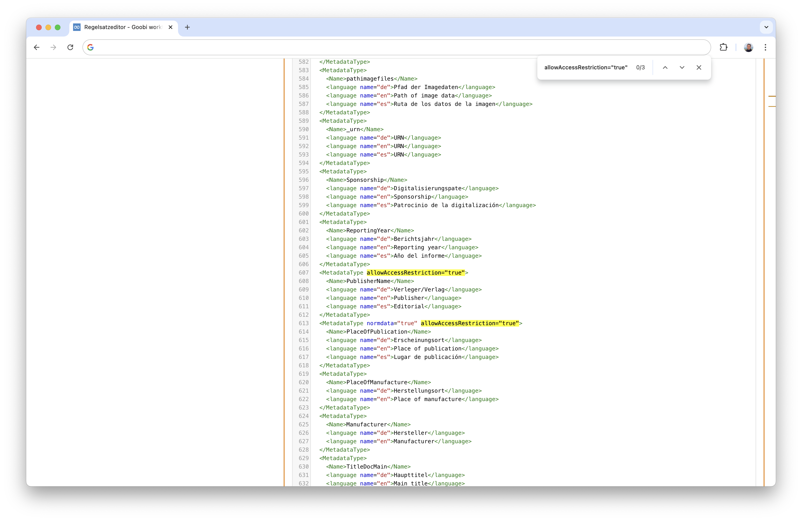

Nachdem diese Konfiguration in dem Regelsatz erfolgt ist, zeigt der Metadateneditor in seiner Oberfläche vor den jeweiligen Metadaten ein kleines Icon an, dass das Aktivieren der Zugriffsbeschränkung erlaubt.

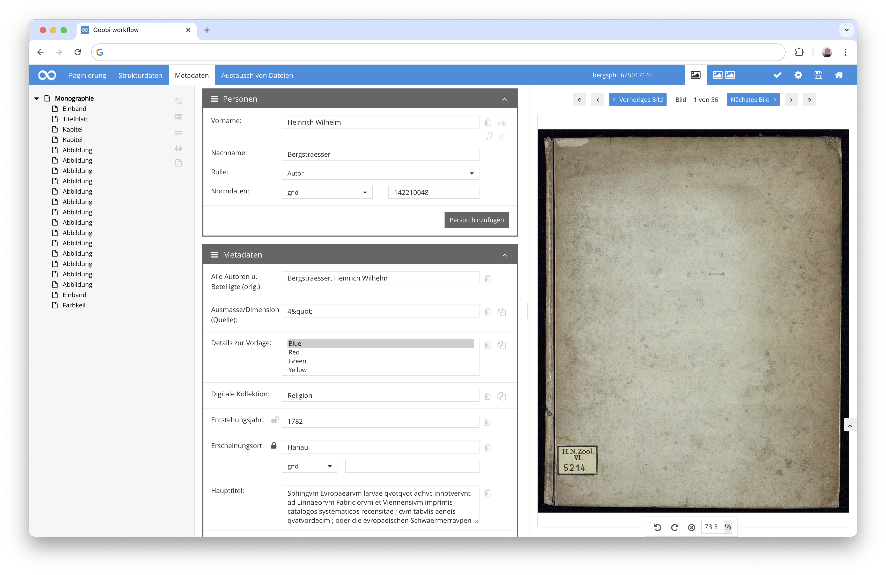

Wenn Werke mit solchen festgelegten Zugriffsbeschränkungen versehen wurden und die exportierte METS-Datei somit über die Information der Zugriffsbeschränkung verfügt, kann ein Zielsystem wie beispielsweise der Goobi viewer davon Gebrauch machen. Im Falle des Goobi viewers wird die METS-Datei beispielsweise für den Zugriff durch Nutzer jetzt jeweils auf solche Beschränkungen geprüft und dann für unberechtigte Personen von den geschützten Daten bereinigt. Auf diese Weise sind die Informationen nicht nur in der Oberfäche für unberechtigte Personen verborgen sondern auch für den Zugriff auf die zugrundeliegende METS-Datei.

Weitere Informationen zur Konfiguration des Regelsatzes finden sich innerhalb der UGH-Dokumentation hier:  
[https://docs.goobi.io/ugh-de/3/3.1#id-3.1.8.-zugriffsgeschutzte-metadaten](https://docs.goobi.io/ugh-de/3/3.1#id-3.1.8.-zugriffsgeschutzte-metadaten)

Detaillierte Informationen für die Konfiguration des Goobi viewers und wie dort der Zugriff auf Metadaten korrekt konfiguriert wird für Zugriffsbeschränkungen finden sich hier:  
[https://docs.goobi.io/goobi-viewer-de/misc/1/15](https://docs.goobi.io/goobi-viewer-de/misc/1/15)


### Docker Support erweitert - Vorbereitung für ein neues Goobi-to-go
Es gibt bereits einige Goobi Anwender, die Goobi workflow nicht mehr direkt auf den Servern installieren und stattdessen auf die Nutzung von Docker zurückgreifen, um die Applikation innerhalb von Containern zu betreiben. Für Goobi workflow wird daher bereits seit einiger Zeit auch schon ein Docker-Image bereitgestellt, dass sich hier finden läßt:

[https://hub.docker.com/r/intranda/goobi-workflow](https://hub.docker.com/r/intranda/goobi-workflow)

Diese Infrastruktur bearbeiten wir derzeit relativ intensiv und stellen darin eingige um. Nicht nur, damit Anwender davon profitieren, die es für sich auf Servern installieren möchten. Sondern auch, weil wir bereits seit einiger Zeit daran arbeiten, eine gänzlich neue Fassung von dem beliebten Goobi-to-go zu konzipieren, dass dann auf der Basis von Docker betrieben werden soll. Hier stehen also in den kommenden Wochen große Änderungen und Ankündigungen bevor.

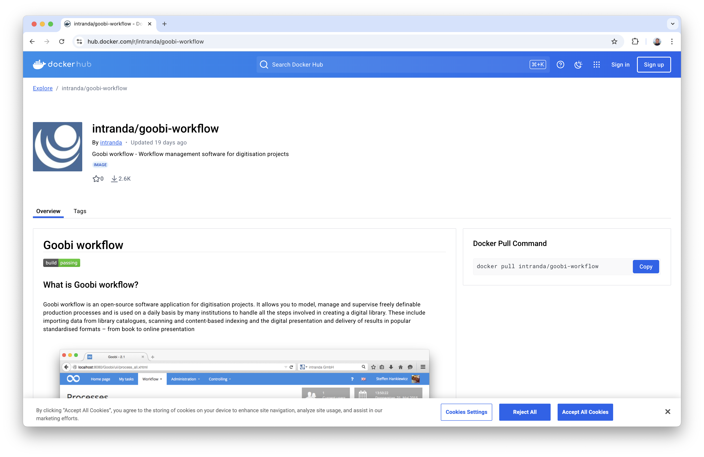


### Vorgangseigenschaften mit besseren Benennungen
Bisher war es so, dass Vorgangseigenschaften in einer gemeinsamten Box angezeigt und untereinander aufgelistet wurden. Das sah in der Vergangenheit also meist ungefähr so aus:

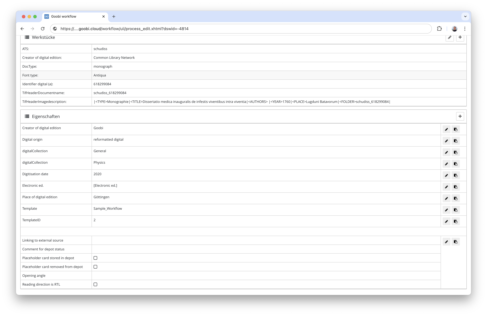

Die einzelnen Bereiche konnten zwar mehrere Eigenschaften als `Container` gruppieren. Aber es gab keine offensichtliche Klassifierung dieser Container. Diese  sollen nun dahingehend erweitert werden, dass sie einerseits nicht mehr nur aufgelistet, sondern wirklich als eigenständige Container dargestellt werden könen, wo auch die Zugehörigkeit zu den jeweiligen Containern besser ersichtlich wird:

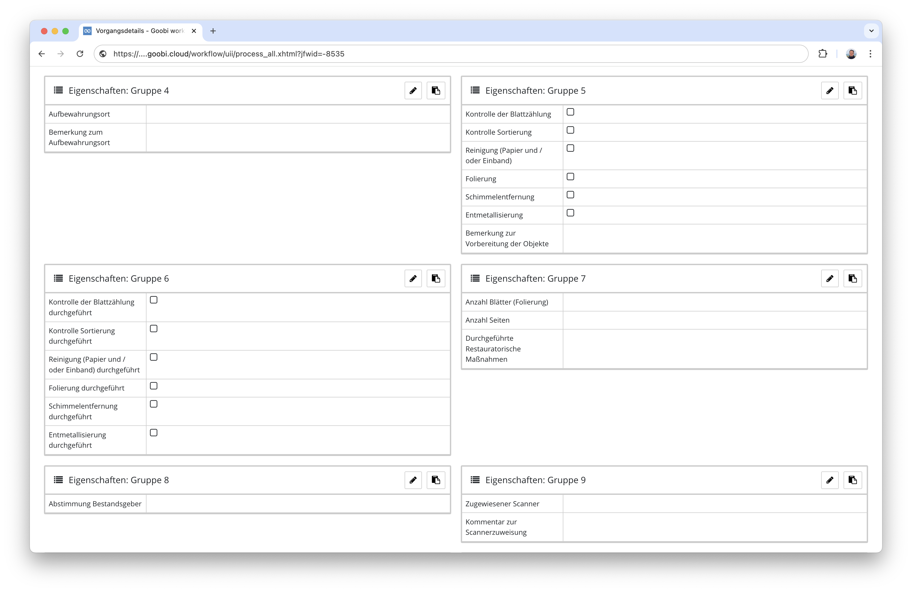

Damit die Bedienung für die Nutzer aber noch einfacher wird, wurde die Verwaltung der Container nun so erweitert, dass die Container nun jeweils eine Bezeichnung erhalten können. Diese wird in der Konfigurationsdatei beispielsweise so festgelegt:

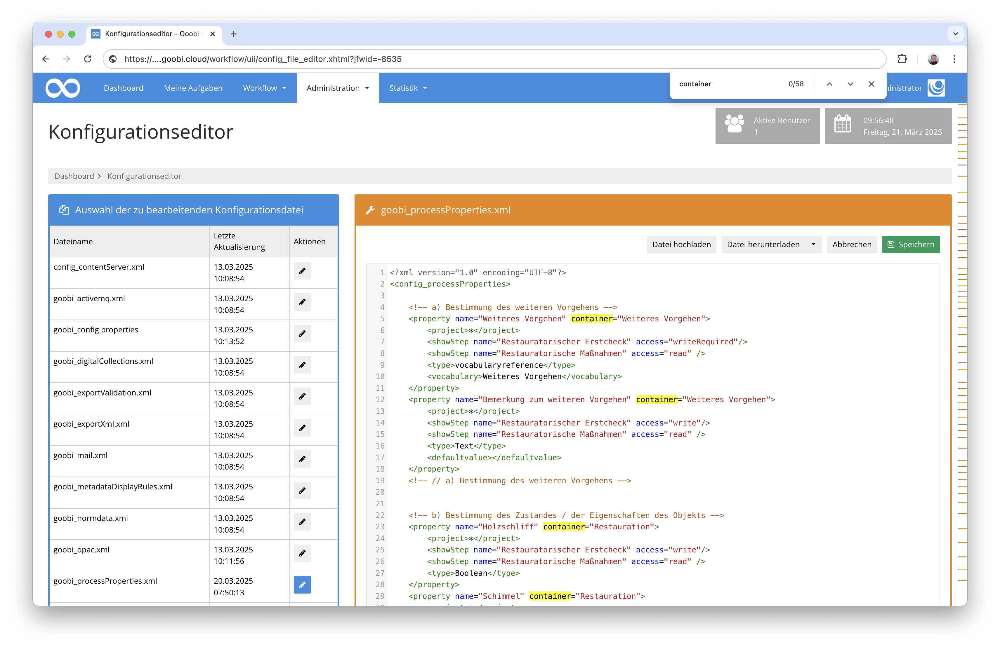

Anschließend ist die Darstellung der Eigenschaften für die Nutzer entsprechend auch deutlicher und die Zugehörigkeit zu den jeweiligen benannten Containern besser verständlich:

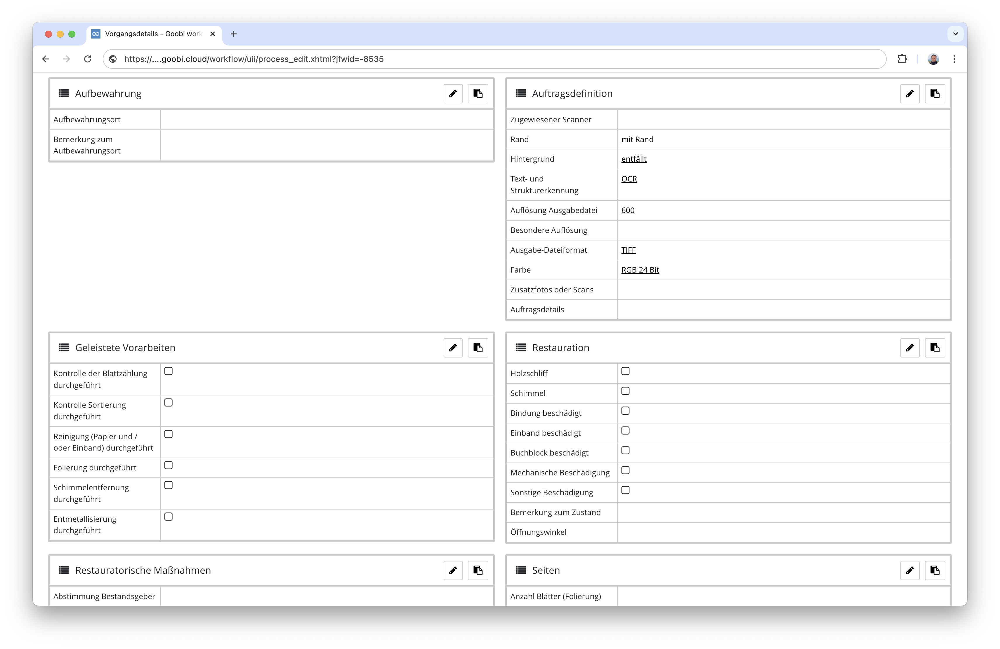

Die gleiche Darstellung in dieser Box-Form ist dabei natürlich auch innerhalb der angenommenen Aufgaben berücksichtigt, um eine einheitliche Bedienung sicherzustellen:

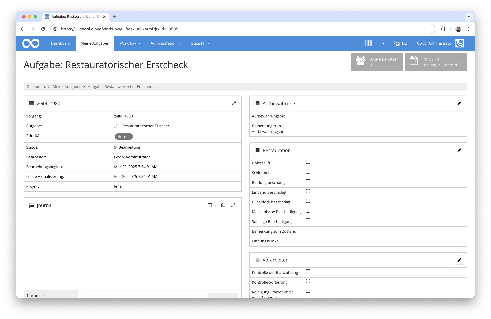


### Neues Benachrichtigungssystem und Footer
Auf den Goobi-Tagen haben wir es ja bereits angekündigt. Nun ist es auch in Produktion gegangen: Wir haben eine gänzlich andere Darstellung der Benachrichtigungen implementiert. Erfolgs- und Fehlermeldungen werden nun nicht mehr einfach nur im oberen Bereich angezeigt, sondern sind jetzt auch ausblendbar und überlagern die Oberfläche, so dass sie das Layout der gesamten Seite nicht mehr so stark beeinträchten, wenn doch einmal mehrere Meldungen gleichzeitig angezeigt werden.

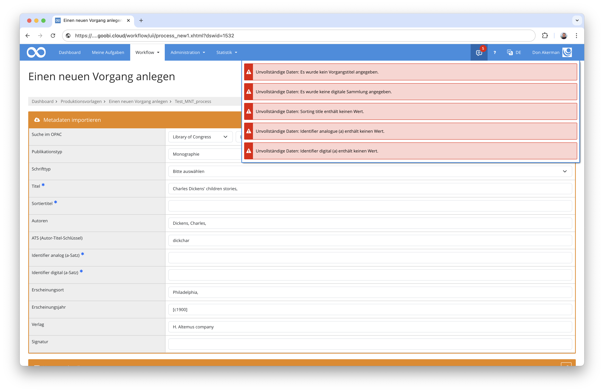

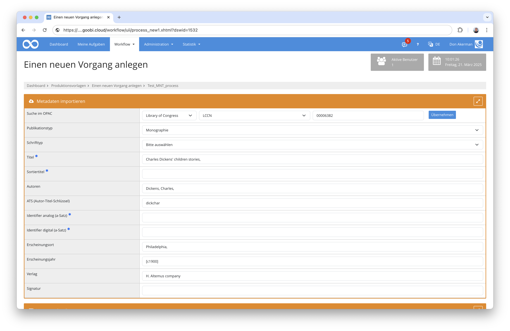

Ursprünglich war geplant, dass die Meldungen vielleichgt auch aus dem Footerbereich von Goobi kommen könnten. Daher haben wir Goobi worklow mit einer Fußzeile ausgestattet in der bereits einige nützliche Links und Informationen stehen. In Zukunft werden wir hier noch weitere praktische Dinge ergänzen.

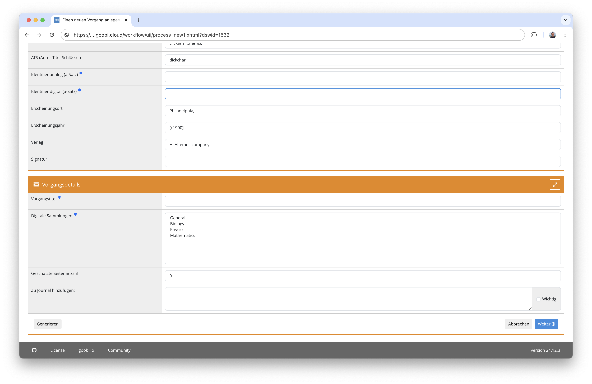


### Vokabularserver als Docker-Image
Damit der neuen Vokabularserver nicht nur auf Severn regulär installiert werden kann, haben wir ihn nun auch als Docker-Image bereitgestellt. Damit ist der Betrieb innerhalb von Docker-Umgebungen dafür auch einfacher geworden. Perspektivisch dient uns dies ebenfalls dazu, den Vokabularserver innerhalb der neuen Goobi-to-go-Infrastruktur gut nutzen zu können.

Das Dockerfile für die Inbetriebnahme findet sich hier:  
[https://github.com/intranda/goobi-vocabulary-server/blob/develop/Dockerfile](https://github.com/intranda/goobi-vocabulary-server/blob/develop/Dockerfile)


### Vokabular mit Monitoring Schnittstelle
Der Vokabularserver wurde noch etwas rubuster gemacht. Er verfügt es unter anderem über eine Methode, um seinen eigenen Betrieb zu prüfen und stellt dies als Abfrage für ein Monitoring zur Verfügung. Damit ist es nun möglich, dass externe Applikationen wie z.B. Goobi workflow den korrekten Betrieb des Vokabularservers prüfen können, bevor sie mit diesem weitergehen kommunizieren. Damit können potentielle Fehler besser vermieden werden. 

Auch wurde in dem Zusammenhang eine Versionscheck implementiert, der für andere Applikationen erlaubt, den Versionsstand des Vokabularservers abzufragen. Darauf aufbauend können externe Applikation somit besser entscheiden, ob sie und wie sie mit dem Vokabularserver weiter kommunizieren möchten.


### Nutzeroberfläche auf Basis von Bootstrap 5
An der Nutzeroberfläche von Goobi workflow arbeiten wir natürlich auch weiterhin. Die Umstellung auf Bootstrap 5 ist wie angekündigt in vollem Gange und leider auch noch immer nicht abgeschlossen. Insgesamt sind wir aber bereits sehr weit vorangeschritten und fokussieren uns jetzt darauf die ca. 300 Plugins auf ihre Nutzeroberfläche hin zu überarbeiten, so dass Goobi worklfow sowie die Plugins in einheitlichem Erscheinungsbild auftreten.

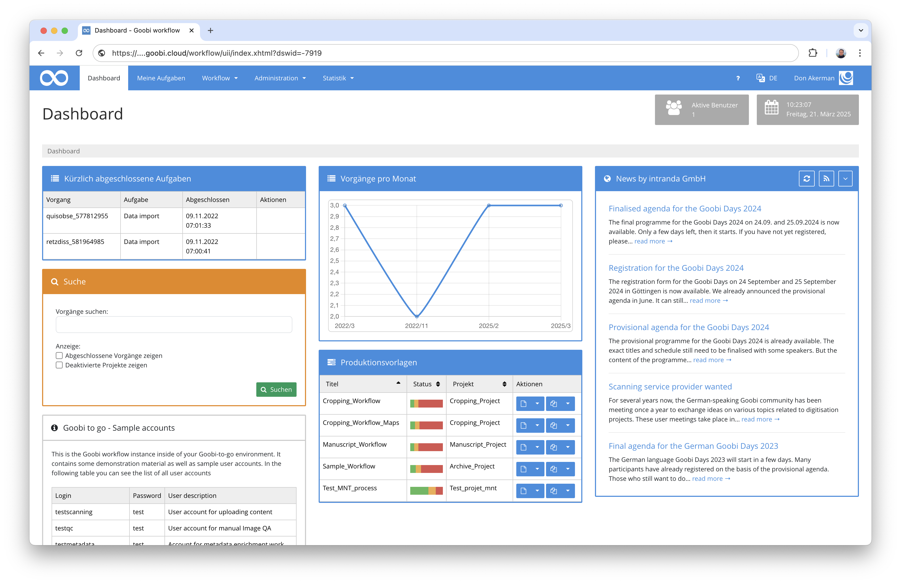


## Plugins

### Überarbeitung des Entitäteneditors
Der Editor für die Bearbeitung von Entitäten wurde in diesem Monat deutlich überarbeitet, um die Bedienung zu vereinfachen, die Speicherung von Beziehungen zwischen den Datensätzen, die Performance sowie auch das Zusammenspiel zum Vokabularserver zu verbessern.

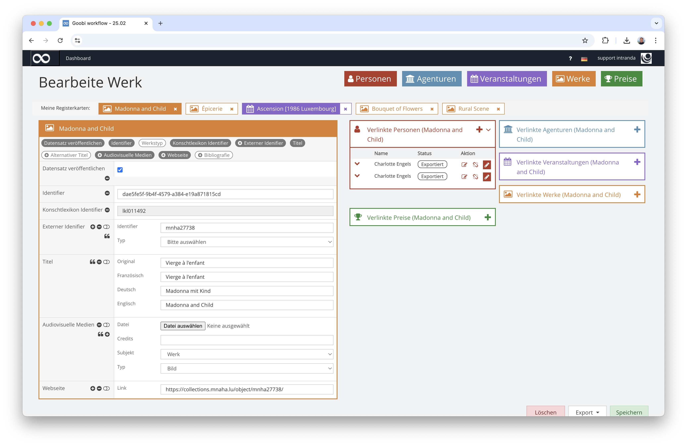

Weitere Informationen finden sich in der Dokumentation hier:  
[https://docs.goobi.io/workflow-plugins/de/workflow/goobi-plugin-workflow-entity-editor](https://docs.goobi.io/workflow-plugins/de/workflow/goobi-plugin-workflow-entity-editor)


### Überarbeitung des Data Pollers
Innerhalb der Goobi Tage im September kam noch einmal zur Sprache, dass die Funktionalität des Data Pollers (vormals `Catalogue Poller`) einmal intensiv geprüft werden muss. Dieser wurde in den Monaten zuvor ja mit der Möglichkeit für Testläufe ausgestattet, deren Ergebnisse für Anwender einsehbar sein sollten, bevor diese tatsächlich ausgeführt werden. Auch bestand der Wunsch nach einer konfigurierbaren `Whitelist` für die `zu aktualisierenden` Metadaten anstelle der bis dato nur verfügbaren `Blacklist` für die `nicht zu aktualisierenden` Metadaten.

Eine Prüfung der Funktionalität ist nun erfolgt und Fehlerchen wurden korrigiert. In dem Zusammenhang wurde auch die Nutzeroberfläche gleich auf Bootstrap 5 portiert.

Weitere Informationen finden sich in der Dokumentation hier:  
[https://docs.goobi.io/workflow-plugins/de/administration/goobi-plugin-administration-data-poller](https://docs.goobi.io/workflow-plugins/de/administration/goobi-plugin-administration-data-poller)


## Versionsnummer
Die aktuelle Versionsnummer von Goobi workflow lautet mit diesem Release: `24.10`. Innerhalb von Plugin-Entwicklungen muss für Maven-Projekte innerhalb der Datei `pom.xml` entsprechend folgende Abhängigkeit eingetragen werden:

```xml
<dependency>
    <groupId>io.goobi.workflow</groupId>
    <artifactId>workflow-core</artifactId>
    <version>24.10</version>
    <classifier>classes</classifier>
</dependency>
```