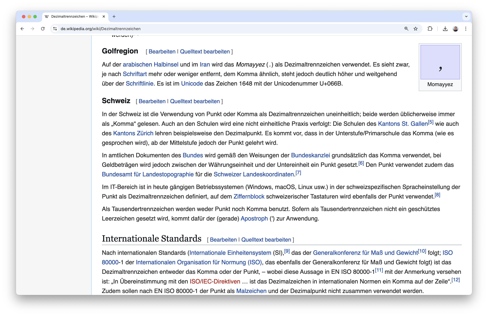
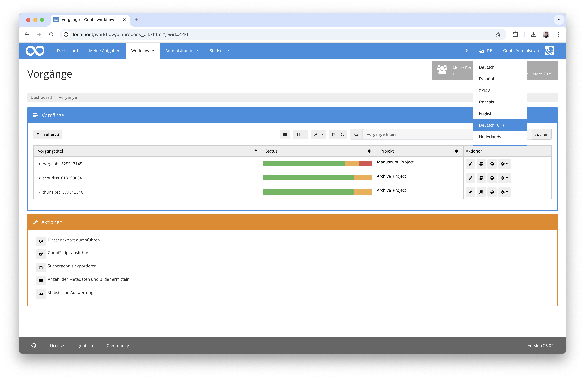

# November 2024

## Allgemein
Da das Release vom Oktober relativ spät erst veröffentlicht wurde, blieb im November nicht mehr viel Zeit, um neue Features zu entwickeln. Der Digest fällt entsprechend kürzer aus.


## Core

### Anpassungen am Vokabularserver
Die Einsatzmöglichkeiten des neuen Vokabularserver sind deutlich umfangreicher, als wir zunächst angenommen hatten. Und mit diesen zusätzlichen Einsatzmöglichkeiten fallen auch immer wieder kleine Anpassungen auf, die noch vorbenommen werden. So gab es beispielsweise die Notwendigkeit, dass das Speichern der Vokabulardatensätze noch einmal überarbeitet werden musste. An der Bedienoberfläche hat sich hierbei für Nutzer allerdings keine Änderung ergeben.


Ebenso entstand der Bedarf, dass Goobi workflow für das Zusammenspiel mit dem Vokabularserver eine Prüfroutine benötigt, um den Versionsstand des Vokabularservers abzufragen und hierbei eine Mindestversion zu prüfen, die die reibungslose Kommunikation zwischen beiden Applikationen sicherstellt.

### Schweizerdeutsch als zusätzliche Sprache der Nutzeroberfläche
Auch wenn Goobi workflow mit der Sprache Deutsch in der Nutzeroberfläche bereits ausgestattet ist, ist dies nicht autoamtisch auch die beste Wahl für Nutzer aus verschiedenen deutschsprachigen Regionen. So hat sich herausgestellt, dass im Rahmen von Abrechnungen für Nutzerbestellungen die Zahlenformate für die Anwender einen großen Unterschied machen. 



Allein die Tatsache, dass der Nummernblock auf einer Schweizer Tastatur nicht über ein Komma sondern über einen Punkt verfügt, machte es für schweizer Anwender etwas umständlich Zahlen mit Dezimalstellen einzugeben. 


Auch die Darstellung von Preisangaben, die im Rahmen der Abrechnung von Nutzerdarstellungen verarbeitet werden müssen, machte es daher erforderlich, dass Goobi workflow nun innerhalb des Sprachumschalters neben Deutsch (DE) auch Schweizerdeutsch (DE-CH) anbietet.




## Plugins

### Massenimport für das Werbemittelarchiv
Für die Wirtschaftuniversität in Wien wurde ein neues Massenimport-Plugin entwickelt, dass es erlaubt die dort vorliegenden Werbemittel und Markenstudien zu importieren. Diese lagen bisher als PDF Dateien vor und waren innerhalb von JSON-Dateien beschrieben. Für deren Import haben wir ein neues Plugin entwickelt und den Import durchgeführt.


Die ausführliche Dokumentation für das Plugin findet sich hier:

[https://docs.goobi.io/workflow-plugins/de/workflow/goobi-plugin-workflow-wu-wma-import](https://docs.goobi.io/workflow-plugins/de/workflow/goobi-plugin-workflow-wu-wma-import)


## Versionsnummer
Die aktuelle Versionsnummer von Goobi workflow lautet mit diesem Release: `24.11.4`. Innerhalb von Plugin-Entwicklungen muss für Maven-Projekte innerhalb der Datei `pom.xml` entsprechend folgende Abhängigkeit eingetragen werden:

```xml
<dependency>
    <groupId>io.goobi.workflow</groupId>
    <artifactId>workflow-core</artifactId>
    <version>24.11.4</version>
    <classifier>classes</classifier>
</dependency>
```