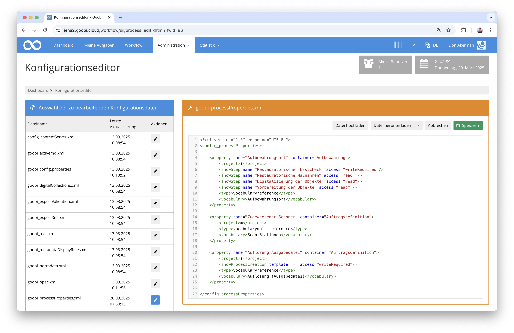

# Dezember 2024

## Allgemein
Mit dieser letzten Version des Jahres veröffentlichen wir voraussichtlich das letzte Goobi workflow Release, das noch unter Java 11 und Tomcat 9 betrieben werden kann. Ab dem kommenden Monat werden wir mit der Umstellung auf Java 21 und Tomcat 10 beginnen. 

**Achtung:**  Bitte beachten Sie, dass für die kommenden Releases einmalig ein größerer Updateaufwand erforderlich sein wird.

## Core

### Vorgangseigenschaften mit Vokabularinhalten
Vorgangseigenschaften gibt es in Goobi bereits seit langem. Sie werden oft dazu verwendet, um Informationen während des Workflows zu erfassen und auszuwerten, die nicht zum den Metadaten des Digitalisats gehören. Typische Beispiele hierfür sind Vorgaben für Arbeitsweisen, Scripte oder Statistiken (z.B. Öffnungswinkel, Leserichtung, Glasplattennutzung).

Bisher konnten die Eigenschaften in der Konfigurationsdatei `goobi_processProperties.xml` für veschiedene Inhalte typisiert werden, um beispielsweise Freitextfelder, Checkboxen oder Auswahllisten zu definieren, aus denen die Nutzer Informationen auswählen sollen. 


Neu ist nun, dass solche Informationen auch aus Vokabularen kommen können. Aus sie werden in der gleichen Konfigurationsdatei festgelegt.



Damit stehen die Eigenschaften nun in der geänderten Oberfläche mit denjenigen Werten zur Verfügung, die dort als Hauptwert angegeben wurden.


Ein Klick auf einen solchen Wert öffnet ein Fenster, dass alle Details des Vokabulareintrags zeigt.


Ebenso steht natürlich für die Bearbeitung von Eigenschaften eine Erfassungsmaske zur Vefügung, die die Werte aus den Vokabularen auflistet.


### Erweiterung für den Umgang mit hierarchischen Vokabularen
Die großen Entwicklungsarbeiten am neuen Vokabularsystem fanden ja bereits in den letzten Monaten statt. In dem Kontext wurde auch erlaubt, dass Vokabulare hierarchisch aufgebaut werden können. 


Was bisher allerdings noch fehlte war die Möglichkeit, dass Vokabularinhalte auch innnerhalb von Dropdownlisten für Eigenschaften vernünftig auswählbar sein sollten. Dies ist mit diesem Update nun möglich.


### Weitere Vorarbeiten für Goobi-to-go Umstellung
Wie auf den Goobi-Tagen bereits angekündigt arbeiten wir gerade intensiv an einer vollständigen Überarbeiten von Goobi-to-go. Dieses wird auf der Basis von Docker implementiert und getestet gerade und sieht bereits vielversprechend aus. In diesem Monat haben wir eigens hierfür den Start von Goobi workflow dahingehend angepasst, dass dieses im Falle einer langsameren Datenbankanbindung einer frisch gestarteten Datenbank robuster ist. Das spielt unsere Einschätzung nach ausschließlich für Goobi-to-go auf Docker als Infrastruktur eine größere Rolle.


## Plugins


### Migration von Visual-Library zu Goobi
Immer wieder kommen Nutzer der Software Visual Library auf uns zu und planen einen Migration ihrer Daten nach Goobi. Hierfür haben wir nun ein Plugin entwickelt, dass einen solchen Migrationsprozess sehr stark vereinfacht. Die Datenübernahme aus einer laufenden VL-Instanz kann hierbei in gleicher Form erfolgen, wie eine Katalogabfrage. Goobi startet daraufhin einen Workflow, der mit dem Migrationsplugin die Daten über die OAI-Schnittstelle abfragt und neben Paginierung, Strukturdaten und Metadaten auch die Bilder und Volltexte autoamtisch mit nach Goobi migriert. Ein solcher Workflow sieht beispielhaft wie folgt aus:


Im Anschluß an diese Migration stehen die Werke wie gewohnt in Goobi zur Verfügung und können dort beispielsweise auch im Metadateneditor bearbeitet werden:


Und auch ein Export in andere Systeme wie Langzeitarchivierung, Repositories und Kataloge sowie eine Veröffentlichung im Goobi viewer oder in anderen Systemen ist so wie gewohnt möglich:


Zur Veranschaulichung wie ein solcher Migrationsprozess für einzelne Werke verschiedener Visual-Library-Instanzen ablaufen kann, steht hier ein Screencast zur Verfügung:



Weitere Informationen zu dem Plugin für die Migration von Visual-Library-Inhalten zu Goobi finden sich in der Dokumentation hier:

[https://docs.goobi.io/workflow-plugins/de/step/goobi-plugin-step-migrate-visual-library-to-goobi](https://docs.goobi.io/workflow-plugins/de/step/goobi-plugin-step-migrate-visual-library-to-goobi)

### Anpassungen am Transkribus-Plugin
Für die Durchführung von OCR oder HCR eigenet sich Transkribus sehr gut und ist mit dem bestehenden Plugin auch sehr bequem mittels Goobi automatisierbar. Insbesondere bei der Verarbeitung wirklich großer Listen von Vorgängen mit deutlich mehr als 100.000 Seiten kam es in der Vergangenheit öfter zu Verbindungsabbrechen und damit aufwendigen manuellen Eingriffen. Diese sind nun allerdings nicht mehr notwendig. Eine Überarbeitung der Anbindung von Transkribus mit einer automatischen Wiederholung von Verbindungsversuchen im Falle der Nichterreichbarkeit von Transkribus resultiert nun in einer deutlich problemfreieren Massenverarbeitung von OCR. Gleichzeitig wurde in dem Kontext auch die Verarbeitung der Vorgänge so angepasst, dass diese nun jeweils zusammengehörig verarbeitet werden und damit der die Übersicht über den Fortschritt deutlich verbessert wurde. Als Nebeneffekt ergab sich dabei zugleich ein enorm gesteigerter Seitendurchsatz.

Mehr Informationen zur OCR-Durchführung mittels Transkribus findet sich in der Dokumentation hier:

[https://docs.goobi.io/workflow-plugins/de/step/goobi-plugin-step-transkribus](https://docs.goobi.io/workflow-plugins/de/step/goobi-plugin-step-transkribus)

### Erweiterung der Valildierunsmethoden für Bilddateien
Das Tif-Validierungsplugin wurde etwas erweitert, um weitere Validierungen auf der Basis von JHove durchzuführen. Hierbei wurden die Vergleichsmöglichkeiten so erweitert, das die erwarteten Werte nun noch flexibler definiert werden können. Auch wurden die Beispiele für die Anwendung dieser Vergleichsmöglichkeiten in der Referenzkonfiguration und auch in der Dokumentation deutlich erweitert, so dass eine Erstinstallation des Plugins zusammen mit der Dokuemtation nun deutlich einfacher und flexibler sein dürfte. Die aktuallisierte Dokumentation des Plugins findet sich hier:

[https://docs.goobi.io/workflow-plugins/de/step/goobi-plugin-step-tif-validation](https://docs.goobi.io/workflow-plugins/de/step/goobi-plugin-step-tif-validation)


### Anpassung des Zeitungsexports für das DDB-Zeitungsprofil
Goobi workflow und Goobi viewer gehen bereits sehr elegant mit Zeitungsausgaben um und bieten z.B. mit Kalendern, Metadaten und Strukturdaten verschiedene Möglichkeiten, damit Nutzer einfach zu den gewünschten Zeitungen navigieren können. Für das Einspielen von Zeitungen in deas Zeitungsportal der Deutschen Digitalen Bibliothek hingegen ist eine besondere Aufarbeitung der Metadaten notwendig, so dass die Zeitung, der Jahrgang und die einzelnen Ausgaben als Zwischenebenen anders abgebildet werden. Die hierbei notwendigen Konventionen wurden nun innerhalb eines besonderen Export-Plugins berücksichtigt, so dass die Übergabe an die DDB nun noch einfache möglich ist.


## Versionsnummer
Die aktuelle Versionsnummer von Goobi workflow lautet mit diesem Release: `24.12.4`. Innerhalb von Plugin-Entwicklungen muss für Maven-Projekte innerhalb der Datei `pom.xml` entsprechend folgende Abhängigkeit eingetragen werden:

```xml
<dependency>
    <groupId>io.goobi.workflow</groupId>
    <artifactId>workflow-core</artifactId>
    <version>24.12.4</version>
    <classifier>classes</classifier>
</dependency>
```