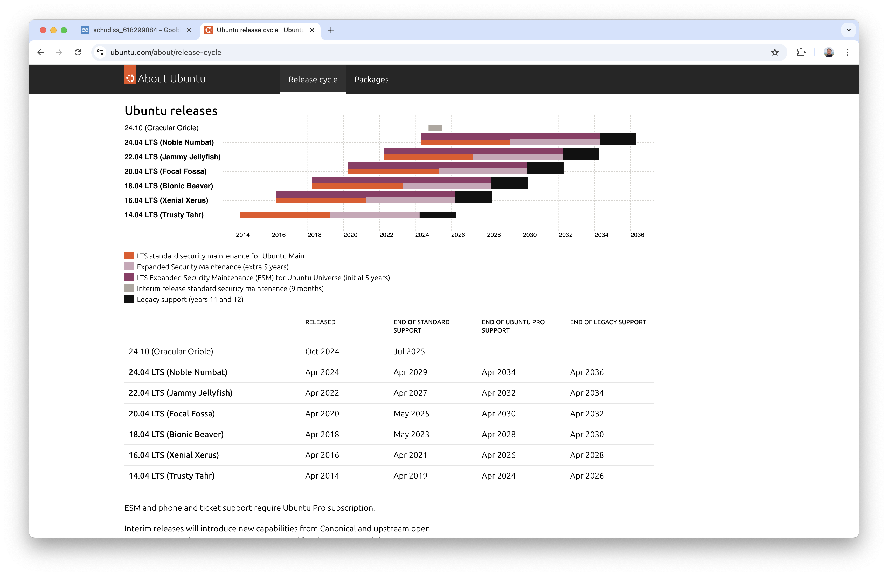
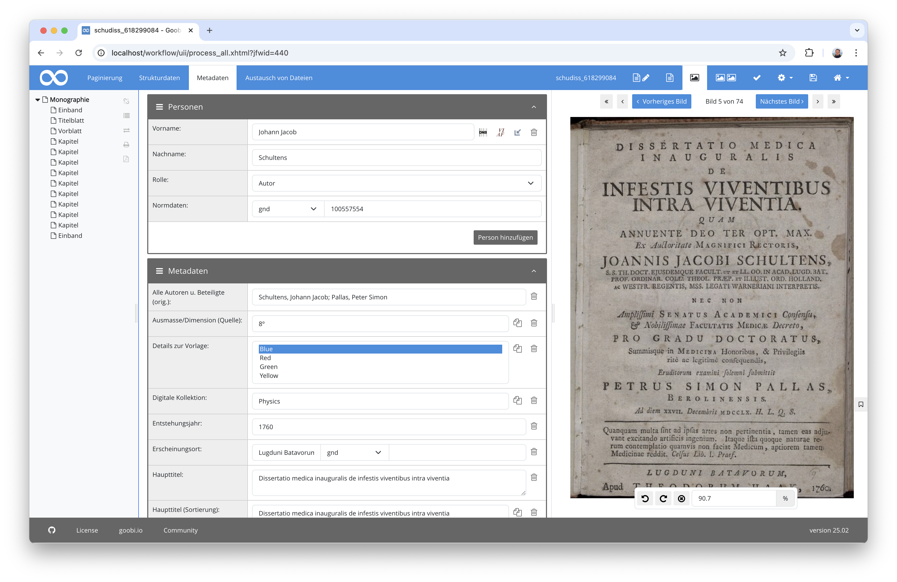
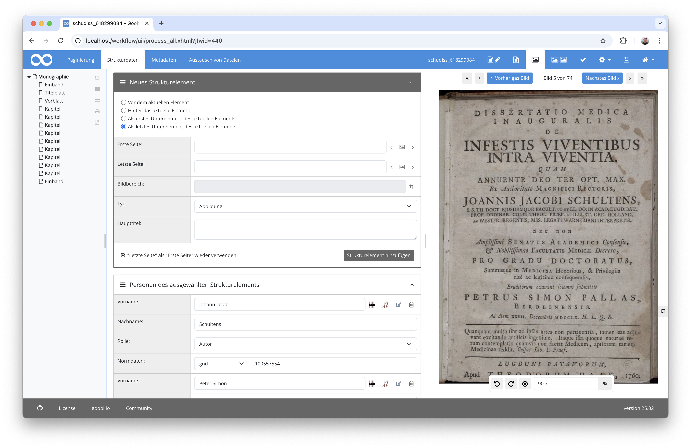
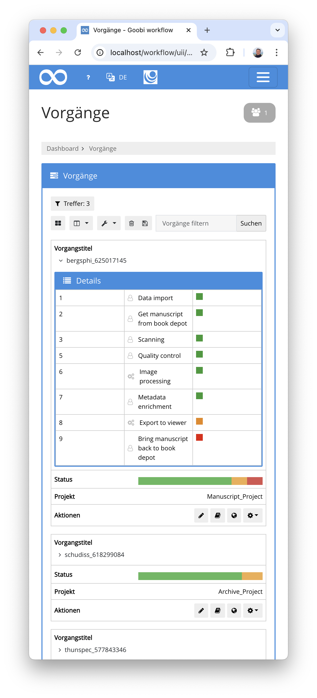
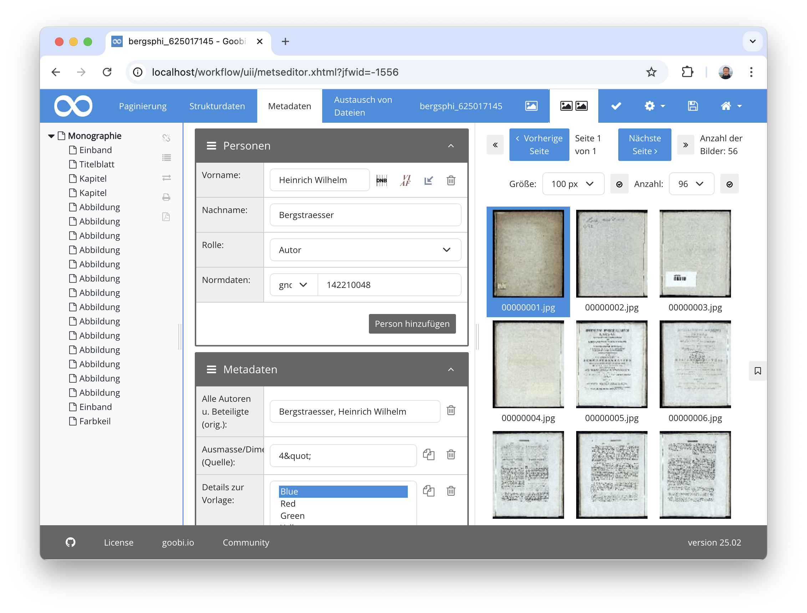
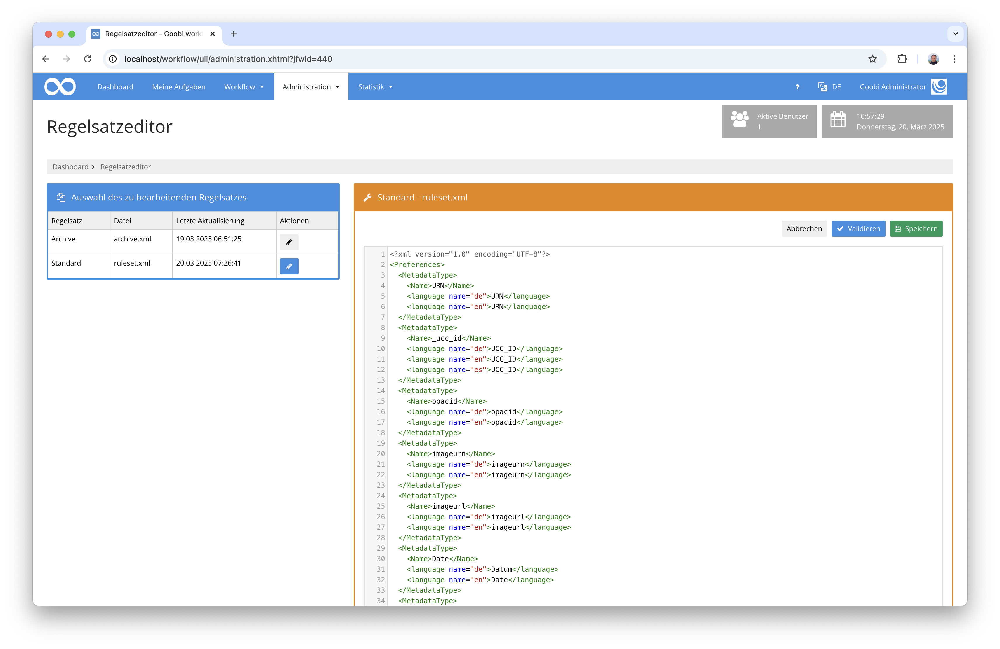
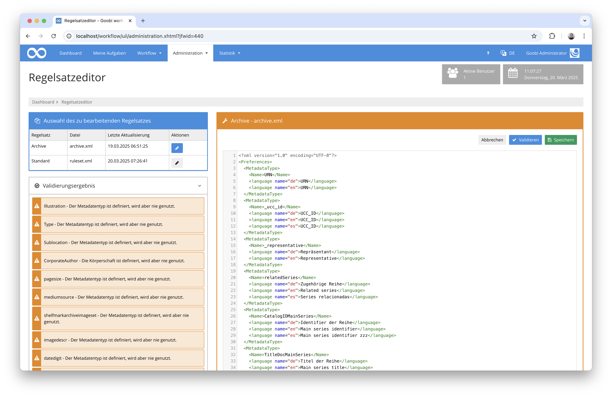
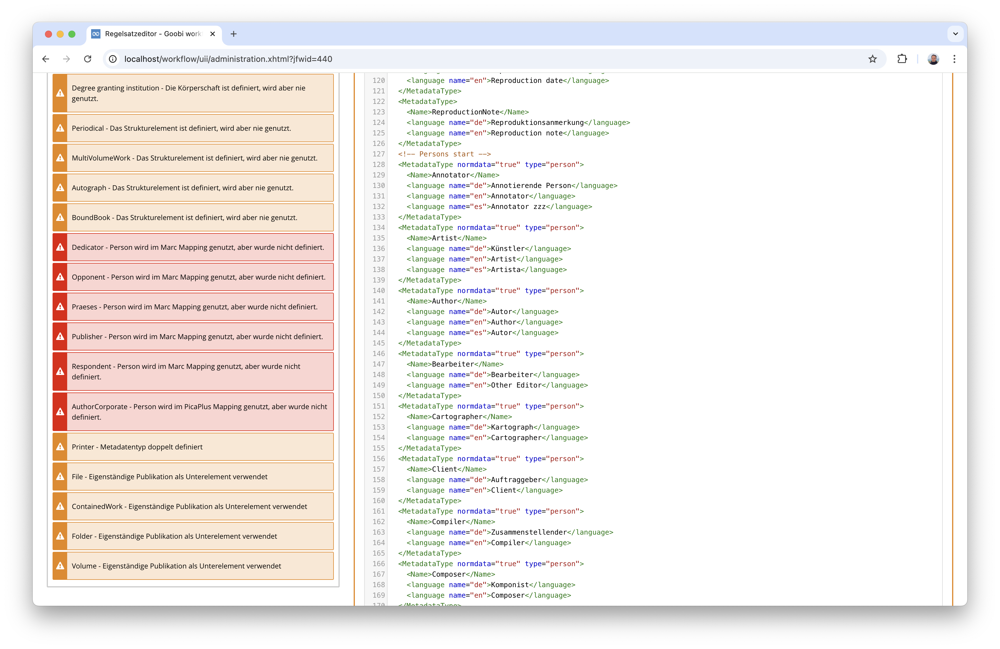
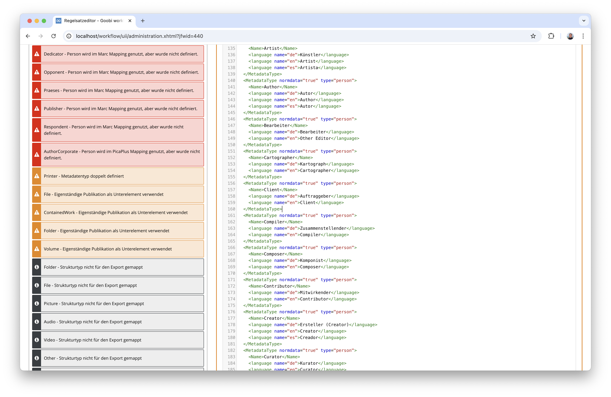

# Januar 2025

## Allgemein
In diesem Monat fand eine ganze Menge an Entwicklungsarbeiten statt, um Goobi workflow und alle Plugins zu Java 21 zu migrieren. Da die Arbeiten allerding so umfangreich sind, haben wir uns dazu entschlossen, in diesem Monat kein Release zu veröffentlichen. Das derzeit aktuellste Release bleibt daher ausnahmsweise einmal das das vorherigen Monats.

## Core

### Umstellung auf Java 21 und Tomcat 10
Goobi workflow basiert bisher auf Java 11 und kann unter verschiedenen Betriebssystemen mit einem Apache Tomcat 9 als Webserver betrieben werden. Diese technische Grundlage unterliegt allerdings aktuell großen Änderungen. Java 11 wird von den einzelen Betriebssystemen nur noch begrenzt lange unterstützt. Und auch Tomcat 9 ist in den Repositories mehrerer Linux-Distributionen nicht mehr verfügbar. Am Beispiel von Ubuntu Linux kann man hier gut sehen,  welche Versionen noch wie lange supported werden. Davon hängt dann wiederum ab, wie lang für die jeweiligen Distributionen auch Java 11 noch zu Verfügung steht:



Bevor der Support für Java 11 und Tomcat 9 für die typischen Systeme ausläuft, auf denen Goobi betrieben wird, müssen wir also Goobi workflow sowie alle zugehörigen Komponenten auf eine neue Version von Java und Tomcat bringen. Das ist allerdings im Hinblick auf Java 21 und Tomcat 10 eine sehr umfangreiche Aufgabe. Wir arbeiten gerade daran, ca. 400 Repositories mit Quelltext auf Java 21 zu migrieren. Wir hatten gehofft, dass wir die Arbeiten noch im Januar fertigstellen können. Der Umfang der Arbeiten ist jedoch deutlich größer als angenommen. Daher kann das hier nur eine Ankündigung für das kommende Release im Februar bleiben. Wir arbeiten weiter daran.


### Umstellung des Metadateneditors auf Bootstrap 5
Noch in vollem Gange ist die Umstellung des Metadateneditors auf Bootstrap 5. Dieser basierte ja bisher auf Bootstrap 4 und war von der Bedienung und Gestaltung immer etwas anders als andere Bereiche von Goobi worklow. Diese Unterschiede versuchen wir gerade zu beseitigen und portieren den Metadateneditor auf die gleiche Infrastruktur für das HTML wie auch den Rest von Goobi workflow. Davon versprechen wir uns einerseits eine bessere Usability und eine bessere Accessibility. Andererseits erhoffen wir uns von diesen Umstellungen aber ebenfalls, dass die künftige Weiterentwicklung des Metadateneditors etwas einfacher wird.

Aktuell sind die Arbeiten noch nicht abgeschlossen. Hier aber schon einmal eine Vorschau darauf, wie die Oberfläche nach der Umstellung aussehen wird:





### Anpassungen für mobile Endgeräte
Durch die zunehmende Nutzung von mobilen Endgeräten wie Tablets oder Handys, muss natürlich auch Goobi workflow gut bedienbar sein. Auch hier gab es so manche kleinere Anpassung, die die Bedienung einfacher machen. 



Selbst der Metadateneditor ist auf mobilen Geräten jetzt besser bedienbar. Ob Nutzer davon allerdings Gebrauch machen werden, wird sich erst in Zukunft zeigen.




## Plugins

### Regelsatzeditor
Mit dem Regelsatzeditor-Plugin steht den Anwendern von Goobi workflow bereits seit geraumer Zeit ein bequemer Mechanismus zur Verfügung, um die Konfiguration der Metadaten und Strukturdaten direkt aus der Nutzeroberfläche vorzunehmen.



Dieser Editor erlaubt nicht nur die bequeme Bearbeitung und dabei zugleich die automatische Erzeugung von Backups der jeweils vorherigen Version beim Speichern einer Änderung. Er erlaubt auch eine Validierung des gesamten Regelsatzes.



An dieser Validierung haben wir im Dezember und Januar intensiv gearbeitet, um diese zu erweitern. Schön ist, dass nun zahlreiche Fehlkonfigurationen geprüft und somit vermieden werden können. Nicht so schön ist, dass aufgrund der Komplexität der Regelsätze, die ja auch das Mapping von Daten aus Katalogen als MARC und PICA und in die Zielformate METS und LIDO übernehmen, eigentlich jeder Regelsatz Fehler aufweist, die man sich einmal anschauen sollte. 



Konfigurationen die historisch so gewachsen sind, die richtig erschienen und durch weitere Anpassungen im Laufe der Zeit geändert wurden, enthalten verschiedene kleine und unkritische aber auch kritische Fehler, die mit den neuen Validierungsmöghlichkeiten nun erstmals überhaupt auffallen. Es lohnt sich also, dieses Plugin einmal zu installieren oder zu updaten, um die eigenen Regelsätze einmal gewissenhaft zu prüfen.




## Versionsnummer
Die aktuelle Versionsnummer von Goobi workflow lautet mit diesem Release: `24.12.4`. Innerhalb von Plugin-Entwicklungen muss für Maven-Projekte innerhalb der Datei `pom.xml` entsprechend folgende Abhängigkeit eingetragen werden:

```xml
<dependency>
    <groupId>io.goobi.workflow</groupId>
    <artifactId>workflow-core</artifactId>
    <version>24.12.4</version>
    <classifier>classes</classifier>
</dependency>
```