# Februar 2025

## Allgemein
In diesem Monat konnten wir endlich die große Umstellung von Goobi workflow sowie allen Plugins auf Java 21 abschließen. Aufgrund der Komplexität rechnen wir damit, dass es sicher noch einmal einige Nacharbeiten hier und da geben wird. Die große Umstellung ist damit aber endlich erfolgt und wir können anfangen, die neuen Versionen auf den jeweiligen Systemen der Nutzer zu installieren.


## Core

### Umstellung auf Java 21 und Tomcat 10

Die Umstellung von Goobi workflow core auf Java 21 und Tomcat 10 ist abgeschlossen und kann ab diesem Release auf Produktivsystemem in Verwendung gehen. Wie bereits in früheren Digests erwähnt ist diese Umstellung notwendig gewesen, um die Software selbst und deren unterliegende Infrastruktur auch künftig weiterentwickeln und mit Sicherheitsupdates versorgen zu können. Nicht zuletzt erfolgte die Umstellung auf Java 21 auch vor dem Hintergrund, dass die einzelnen Betriebssysteme, unter denen Goobi betrieben wird, ihren Support für Java 11 sukzessive einstellen. 

**Achtung:** Ein Update auf diese neue Version ist im Allgemeinen mit einem gesteigerten Aufwand verbunden, da neben dem Update der eigentlichen Goobi-Anwendung und den zugehörigen Plugins ebenso ein Betriebssystem-Update, ein Java-Update sowie auch ein Tomcat-Update notwendig wird. 


### Umstellung des Metadateneditors auf Bootstrap 5

Wie an dieser Stelle bereits des öfteren zur Sprache kam, haben wir eine große Umstellung der Nutzeroberfläche vorgenommen, um die verschiedenen Bereiche von Goobi workflow sowie dessen Plugins von Bootstrap 3 auf Bootstrap 5 zu migrieren. Dieses ist nicht nur für eine zeitgemäße Gestaltung der Nutzeroberfläche sinnvoll, sondern ebenso auch dafür, dass wir den Vorgaben für Accessibility-Anforderungen sowie für eine bessere Usability gerecht werden. 

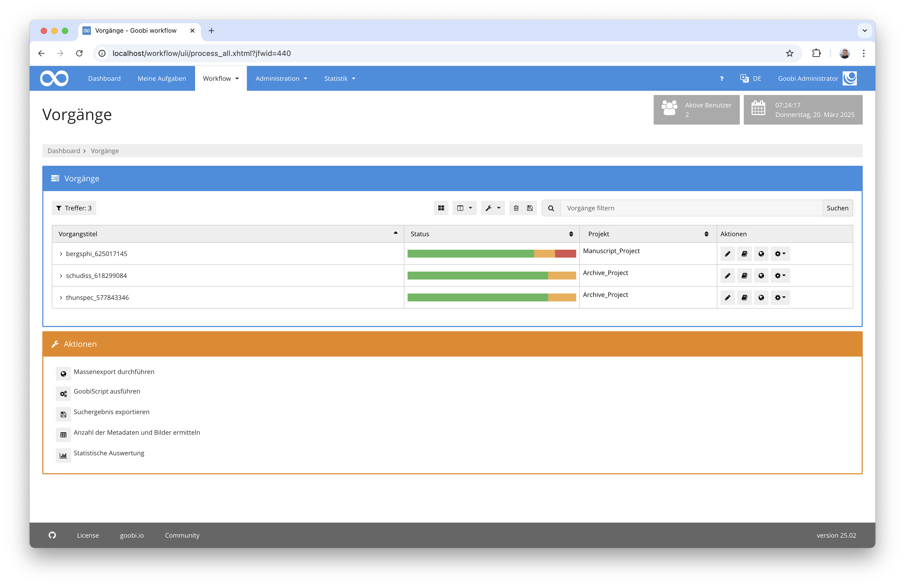

Ein Bereich der bisher von den Entwicklungen noch ausgeklammert blieb war die Nutzeroberfläche des Metadateneditors. Dieser basierte bis vor kurzem auf Bootstrap 4 und verwendete intern ein etwas anders geartetes Template für die Darstellung, das Layout sowie auch die einzelnen Komponenten (wie bspw. Formularfelder, Boxen, Buttons usw.). Mit dem Release vom Februar 2025 haben wir diese andere Infrastruktur des Metadteneditors nun aufgehoben und auch den Metadateneditor auf Bootstrap 5 migriert. Das resultiert nun darin, dass die Nutzeroberfläche in einigen Bereichen leicht anders aussieht. Funktionell sollte allerdings alles wie bisher auch gleich geblieben sein. Auffallen wird den Nutzern vermutlich am ehesten, dass die Formularfelder jetzt ähnlich gestaltet sind wie die Formulare, die man auch sonst in Goobi workflow vorfindet:

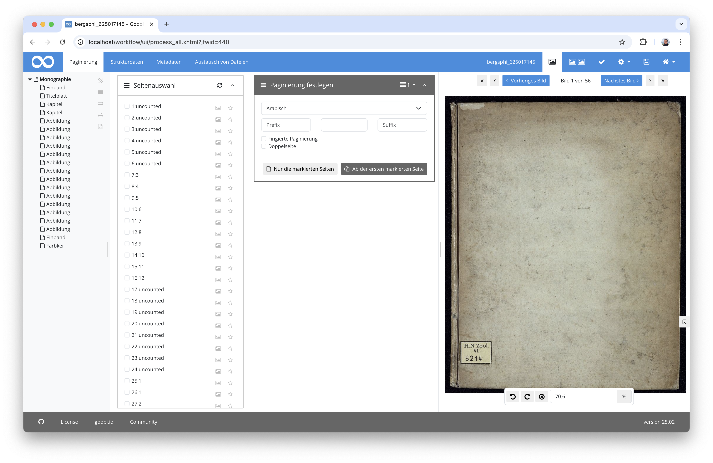

Die Anordnung der Normdatenfelder z.B. für Personen und Orte sieht etwas aufgeräumter aus als bisher:

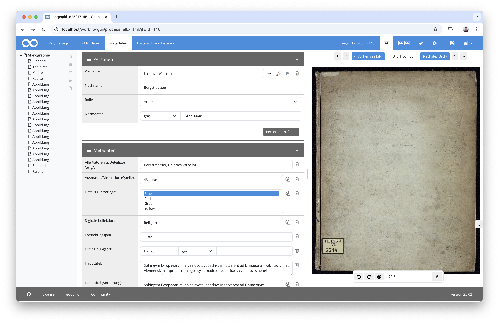

Der Erfassung neuer Strukturelemente wurde etwas überarbeitet:

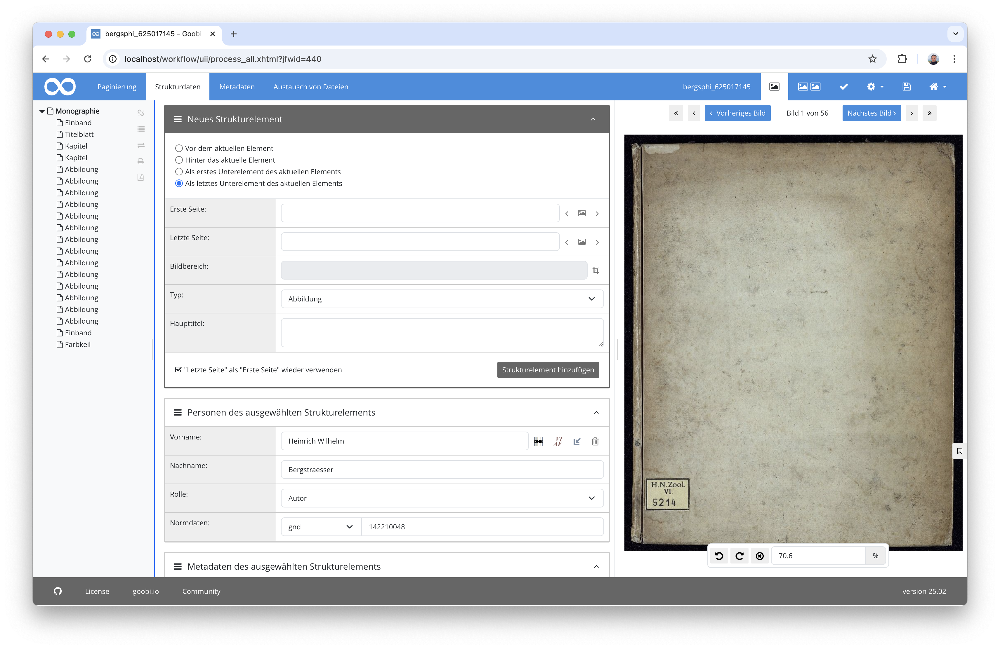

Und auch die Darstellungen von Validierungsmeldungen erfolgt nun in etwas geänderter Form:

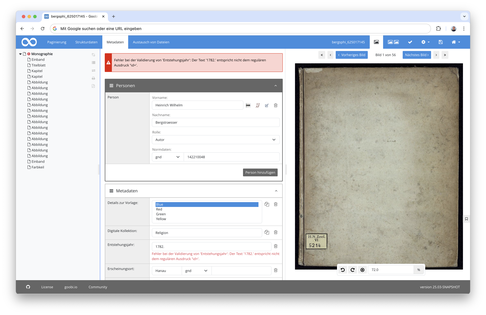

Insgesamt versprechen wir uns von dieser Umstellung nicht nur eine etwas einheitlichere Nutzeroberfläche mit besserer Usability und Accessibility sondern auch eine künftig einfachere Weiterentwicklung des Metadateneditors.


### Refaktorisierung für das Frontend

Ebenso für eine einfachere Entwicklung haben wir einige intere Umstellungen für den Aufbau der HTML-Seiten vorgenommen. Das auf `JavaServer Faces` basierende Template wurde dahingehend umgestellt, dass weitere `facelet tags` zum Einsatz kommen. Wiederholt vorkommende Blöcke in der Nutzeroberfläche werden so einheitlicher dargestellt und sind für uns als Entwickler einfacher und an einer zentralen Stelle steuerbar. Dies ist unter anderem in dem Bereich der überarbeiteten Eigenschaften auch für Nutzer sichtbar:

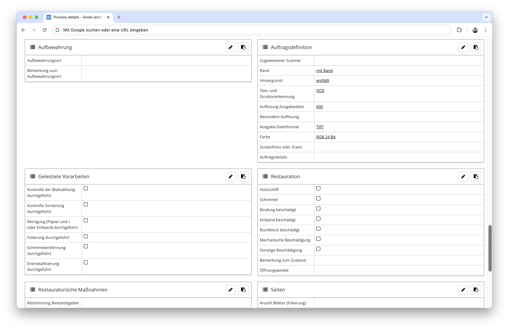

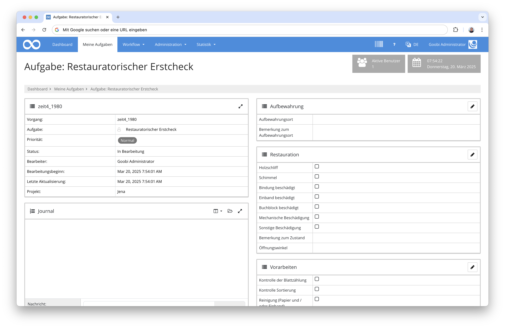

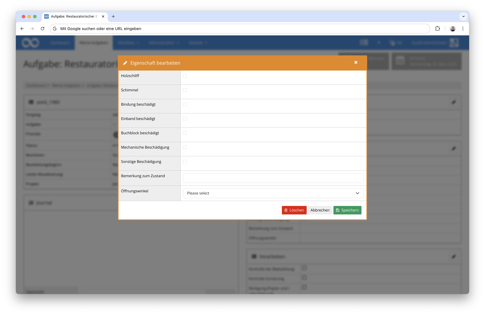


## Plugins

### Neues Plugin für die Zusammenstellung von Batches

Die Funktionalität der Batches wird nur bei relativ wenigen Anwendern im täglich Einsatz wirklich verwendet. Einige Einrichtungen arbeiten jedoch bereits vorrangig in sehr großen Projekten mit den Batches, um viele Vorgänge zusammengehörig durch ihre Workflows laufen zu lassen. Hierbei war es bisher nötig, dass die Batches entweder gleich beim Anlegen der Vorgänge zusammen erzeugt und somit zu einem Batch zusammengefasst wurden. Oder es musste eine etwas umständliche Zusammenstellung von Batches in der Batch-Oberfläche erfolgen. 

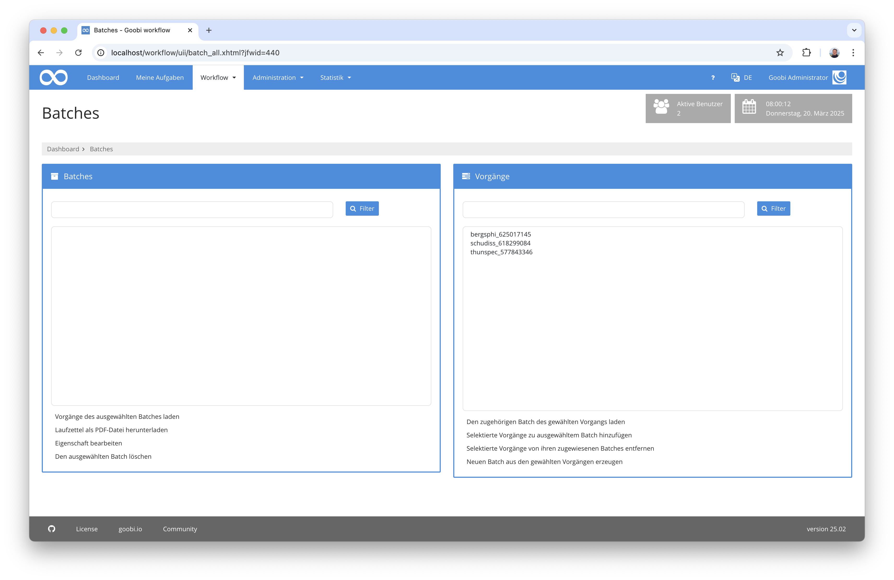

Mit einem neuen Plugin versuchen wir nun, auch anderen Anwendern eine Arbeit mit Batches besser zu ermöglichen. Dafür wurde ein neues Step-Plugin implementiert, dass es den Anwendern innerhalb einer Aufgabe ermöglicht, den jeweiligen Vorgang zu einem bereits bestehenden (und noch wartenden) Batch hinzuzufügen und diesen Batch auch als vollständig zu kennzeichnen, so dass dessen weitere Bearbeitung beginnen kann.

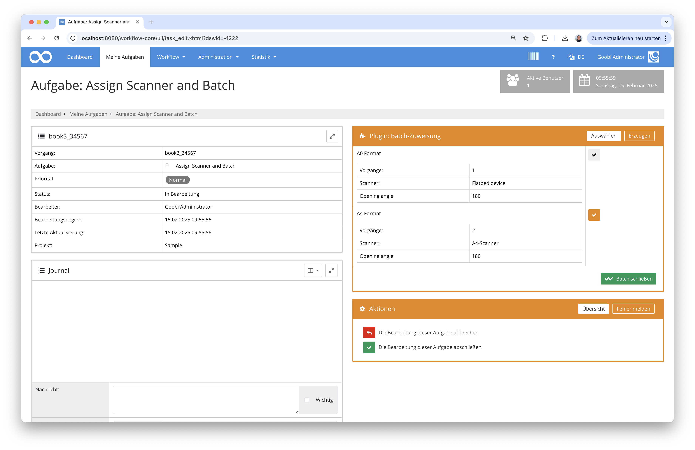

Alternativ ist es hier ebenso möglich, dass auch ein neuer Batch zusammen mit einem Titel sowie konfigurierbaren Eigenschaften erzeugt werden kann, der im weiteren Verlauf auch noch andere Vorgänge für eine Batchverarbeitung erhalten kann.

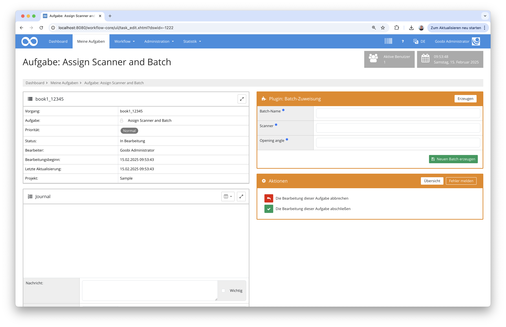

Eine detaillierte Dokumentation des Plugins findet sich wie gewohnt auf unserer Dokumentationsplattform: 

https://docs.goobi.io/workflow-plugins/step/goobi-plugin-step-batch-assignment


### Neues Plugin für den bequemen Umgang mit Barcodes

Goobi workflow kann ja bereits seit den allerersten Versionen gut mit Barcodes umgehen. So ist die Generierung von Barcodes auf Laufzetteln, ein Barcode-Generierungs-Plugin, ein Massenupload mit Barcode-Analyse auf Bildern und natürlich die Suche mittels Barcode-Lesegeräten bereits seit langem möglich. 

Was allerdings noch fehlte bisher, war eine weitgehende Automatisierung verschiedener Aktionen allein durch das Einscannen von Barcodes. Dazu haben wir ein ganz neues Plugin entwickelt, dass sich jederzeit aus der Oberfläche von Goobi worflow öffnen läßt, ohne die aktuelle Oberfläche zu verlassen. 

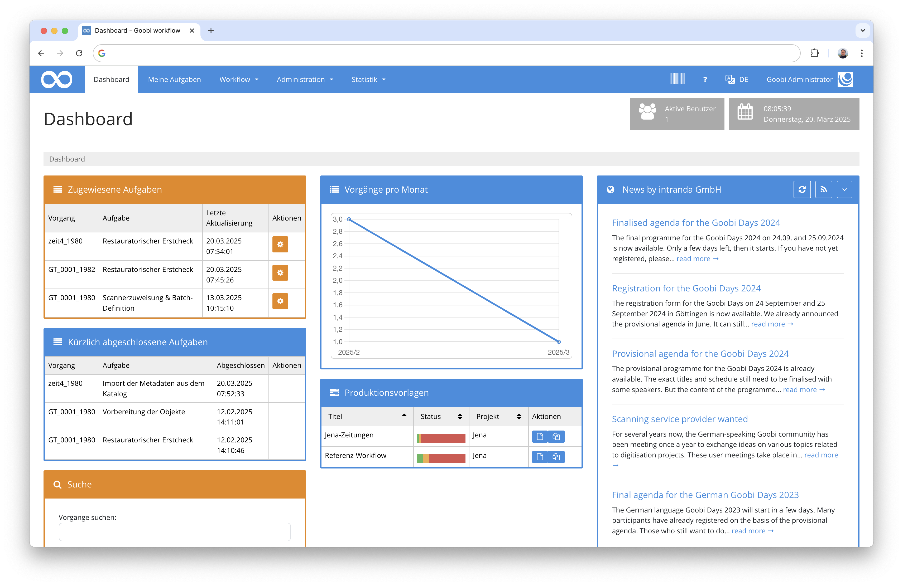

Es öffnet sich nach einem Klick auf das entsprechende Icon unmittelbar als Modal oberhalb der aktuellen Oberfläche.

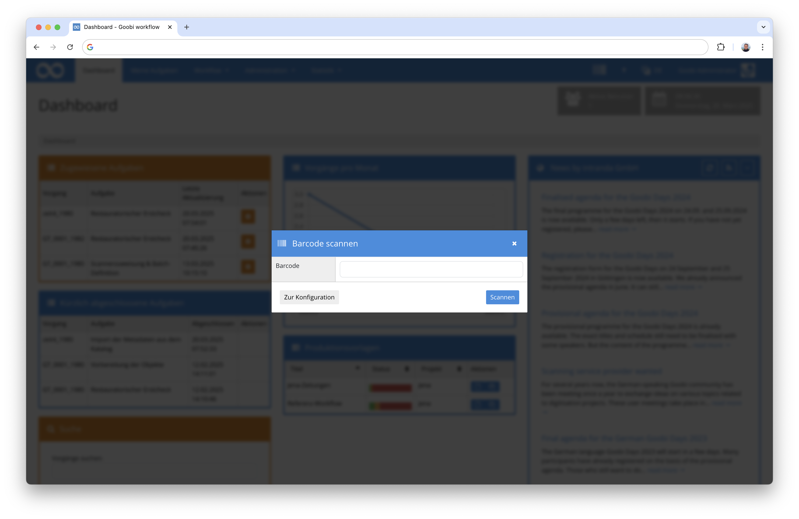

Die Möglichkeiten, die sich hier bieten sind nahezu unbegrenzt. So können hinterlegte Aktionen durch Barcode-Scans zunächst ausgewählt werden (z.B. Setzen einer Eigenschaft, Ändern eines Schrittstatus, Durchführung eines Exports, Manipulation von Workflows). Anschließend kann mit jedem Scan eines Vorgangsbarcodes oder eines Batch-Barcodes die gewählte Aktion für die betroffenen Vorgänge ausgeführt werden. Das elegante hierbei ist, dass als Aktionen all diejenigen verwendet werden können, die auch über GoobiScript zur Verfügung stehen. 

Die hierbei zu verwendenden Aktionen lassen sich in der Konfigurationsdatei des Plugins sehr granular definieren. Für eine bequeme Nutzung der Funktionalität ist es dann möglich, dass direkt aus dem Plugin heraus Barcodes für die hinterlegten Aktionen generiert werden können, um diese anschließend z.B. ausdrucken zu können. 

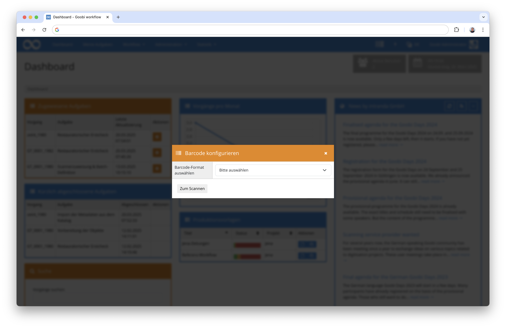

Für ein automatisches Tracken des Aufenthaltsorts eines Objektes ist es somit beipsielsweise sehr einfach möglich, Barcodes für einzelne Büros zu generieren, die dann für jedes Objekt beim Eintreffen in einem Büro mit Barcodeleser zu verwenden und damit den aktuellen Aufenthaltsort des Objekts als Vorgangseigenschaft in Goobi mitzuführen.

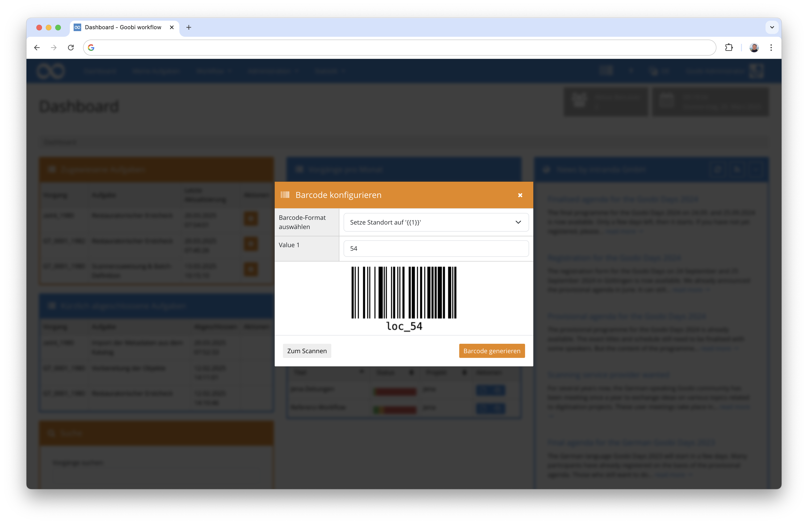

Eine Dokumentation für dieses neue Plugin wurde noch nicht erzeugt und steht auch noch nicht online. Diese wird vorraussichtlich im kommenden Monat veröffentlicht.


### Interne Umstellungen für den Umgang mit Riot-basierten Plugins

Aufgrund der Umstellung auf Java 21 musste für alle Plugins die technisch auf der Infrastruktur von Riot basieren und zwischen Frontend und Backend mittels REST kommuniziert haben, eine größere Umstellung der REST-Anbindung erfolgen. Dies resultiert nun darin, dass nach dem Update auf die hier beschriebene Version ggf. eine Anpassung der Zugriffsrecht für einige REST-Endpoints erfolgen muss. Details für die Anpassungen finden sich hierzu stets in der Updateanleitung von Goobi workflow:

https://docs.goobi.io/goobi-workflow/de/admin/08_update_guide


## Versionsnummer

Die aktuelle Versionsnummer von Goobi workflow lautet mit diesem Release: `25.02`. Innerhalb von Plugin-Entwicklungen muss für Maven-Projekte innerhalb der Datei `pom.xml` entsprechend folgende Abhängigkeit eingetragen werden:

```xml
<dependency>
    <groupId>io.goobi.workflow</groupId>
    <artifactId>workflow-core</artifactId>
    <version>25.02</version>
    <classifier>classes</classifier>
</dependency>
```