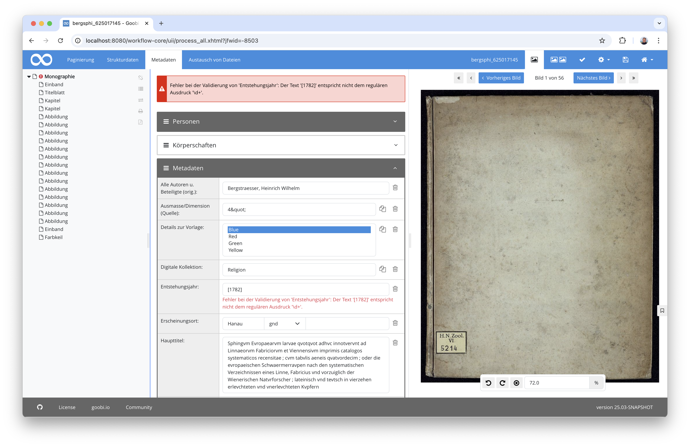
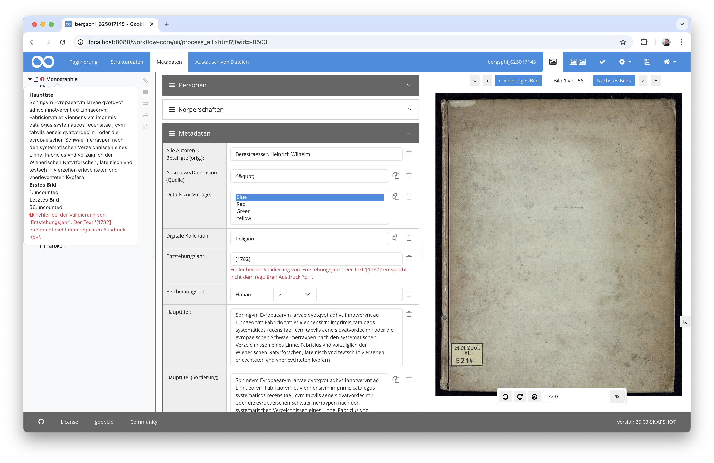
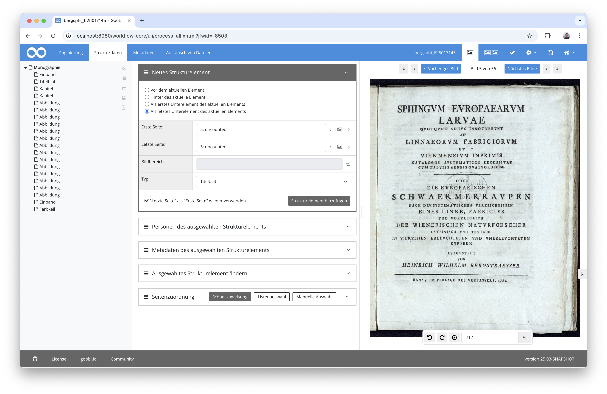
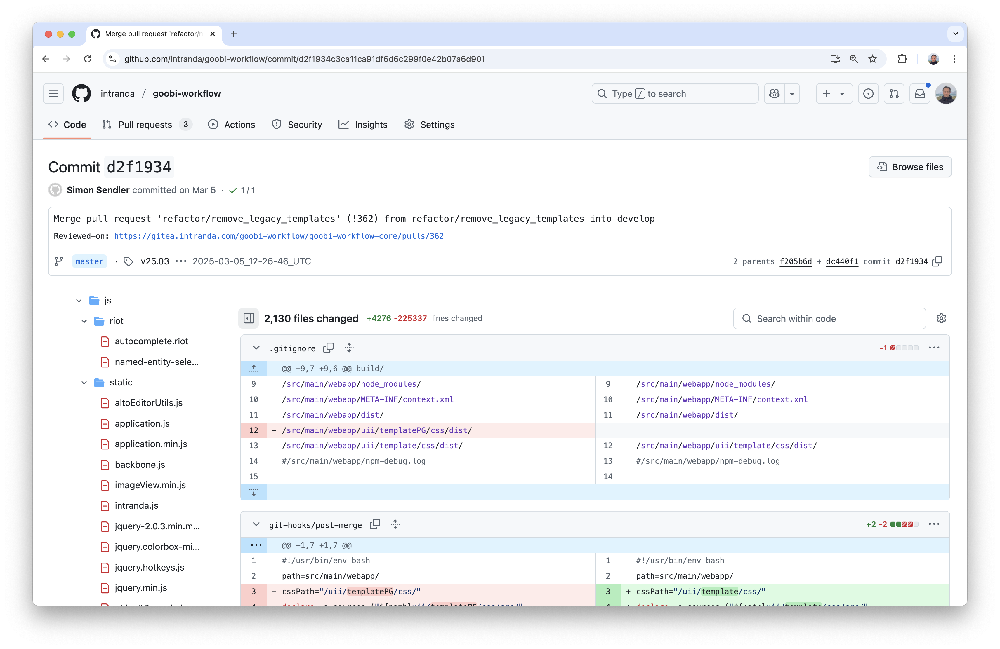
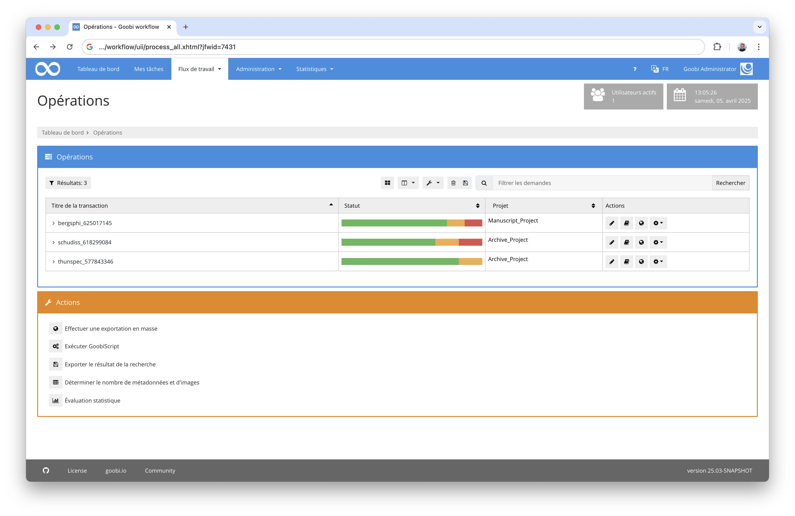
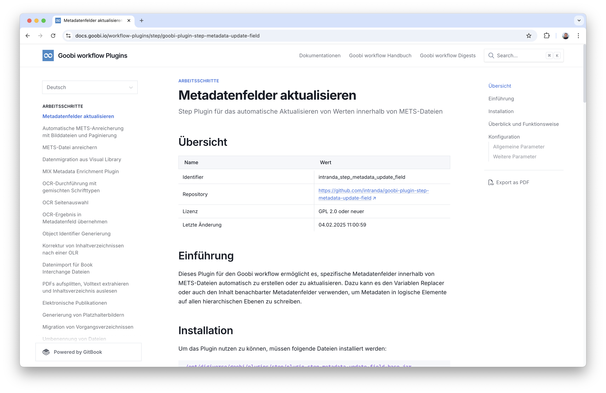
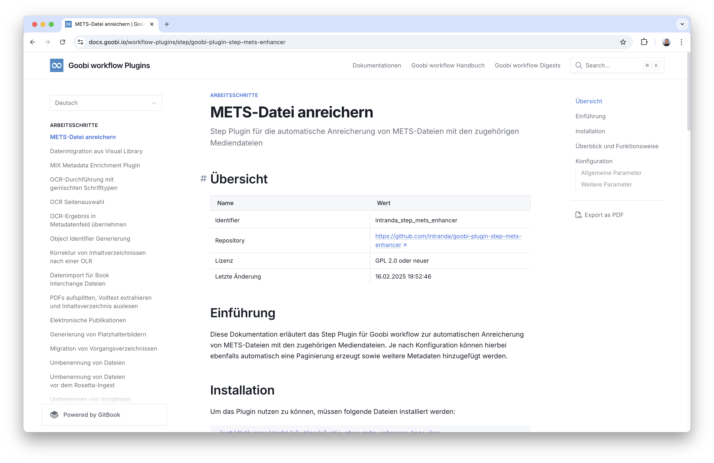
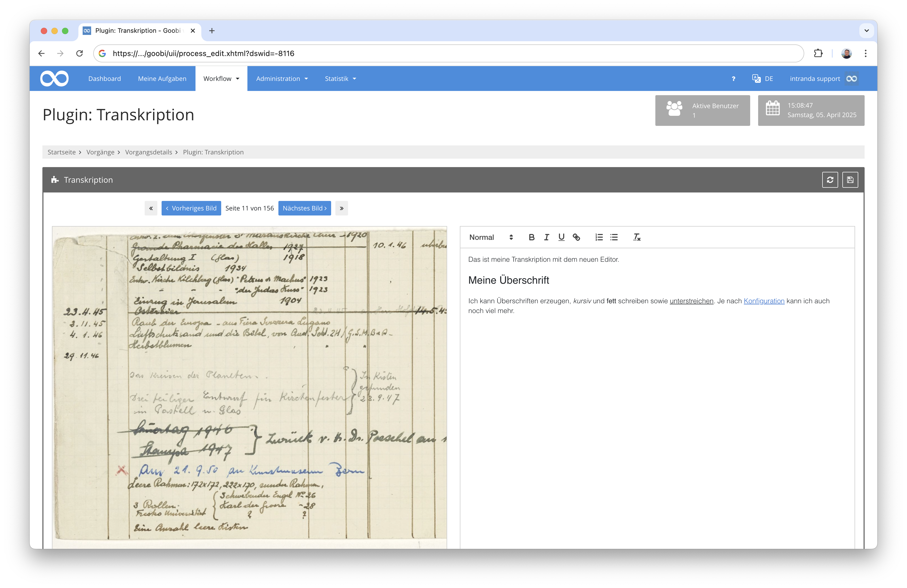
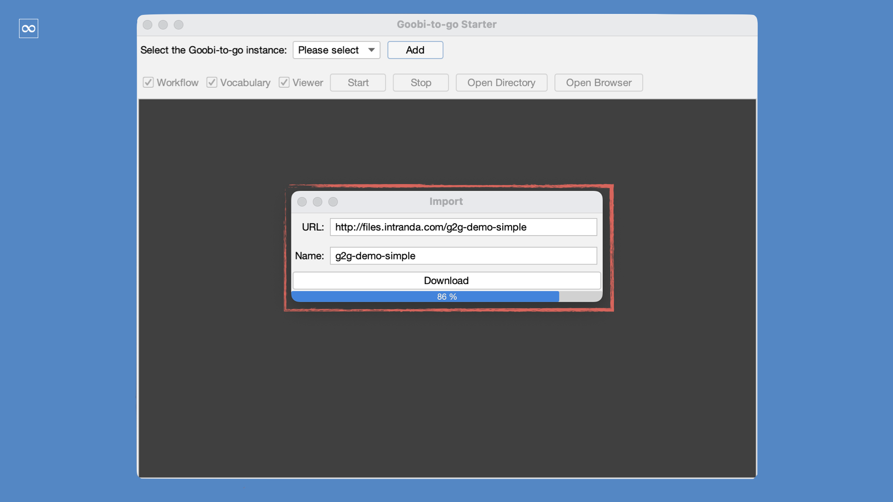

# März 2025

## Allgemein
Wie erwartet hat uns die Umstellung auf Java 21 doch noch einiges an Nacharbeiten gebracht. Die Umstellungen bezogen sich sowohl auf die Infrastruktur als auch auf die Nutzeroberfläche, wo wir parallel die Bootstrap 5 Umstellung abgeschlossen haben. Außerdem ist auch im Bereich von Goobi-to-go eine große Neuerung zu vermelden.


## Core

### Java 21 - Nacharbeiten hier und da
Wir haben es doch irgendwie kommen sehen: Es kamen doch noch einige Nacharbeiten auf uns zu, was die Großumstellung auf Java 21 betrifft. Insbesondere diejenigen Plugins, die auf der Infrastruktur Riot basierten, benötigten doch noch einmal ein paar kleinere Änderungen. Insgesamt waren diese Änderungen aber absolut überschaubar, so dass die neue Infrastruktur auf Basis von Java 21 und Tomcat 10 bereits bei einigen Goobi-Anwendern in den Produktivbetrieb gehen konnte.


### Bootstrap 5 - Nacharbeiten für die Umstellung des Metadateneditors
Auch bei dem Metadateneditor gab es noch einmal einige kleinere Nacharbeiten. Wir hatten ihn mit dem letzten Release ja bereits auf Bootstrap 5 umgestellt, so dass einige Bereiche des Metadateneditor ein kleines bisschen anders aussahen. Einige kleinere Optimierungen insbesondere im Hinblick auf Usability sind uns aber dennoch aufgefallen, die noch behoben werden sollten. So wurden beispielsweise Validierungsmeldungen, die direkt neben den Feldern angezeigt werden sollten, noch einmal leicht umgestyled:



Und auch das Popover, das erscheint, wenn man den Mauszeiger im linken Bereich über die Strukturelemente bewegt, wurden bezüglich der Validierungsmeldungen angepasst:



Die scheinbar kaum bekannte Funktionalität für die Lesezeichenfunktionalität wurde in diesem Zusammenhang auch auf den aktuellen Stand gebracht:


Und auch der Status der einzelnen Boxen, die man als Nutzer im Bereich der Strukturierung und bei den Metadaten auf- und zuklappen kann, wurde so erweitert, dass dieser nun bei Seitenwechseln wieder erhalten bleibt und so unnötige Klicks vermieden werden.

 


### Code Cleanup von 200.000 Zeilen
Da aus unserer Sicht die Umstellungen auf Bootstrap 5 abgeschlossen sind, haben wir uns in diesem Monat dazu entschlossen, nun auch einige der Layout-Altlasten zu entfernen. Dies betrifft insbesondere HTML-Komponenten, JavaScript-Dateien und Styling-Angaben, die noch für die Verwendung von Bootstrap 3 und Bootstrap 4 an verschiedensten Stellen vorhanden waren und die verhindern sollten, dass Bereiche, die wir eventuell versehentlich noch nicht umgestellt haben könnten, weiterhin gut aussehen und bedienbar bleiben. Aus unserer Sicht, sind diese Dateien nun gar nicht mehr in Verwendung und wurden daher gelöscht. Damit wurde Goobi workflow schlagartig um ca. 200.000 Zeilen von redundantem Quellcode kleiner. Für uns als Entwickler fühlt sich das gut an. :)




### Französisch als Sprache eingeführt
Die Verbreitung von Goobi worklow steigt scheinbar auch weiterhin. Dabei kommen immer mal wieder Wünsche nach zusätzlich zu unterstützenden Sprachen auf. In diesem Monat haben wir daher französisch in die Liste der unterstützten Sprachen aufgenommen. Für uns als Nicht-Muttersprachler heisst dies, dass wir hierfür die Infrastruktur bereitstellen, dass es überhaupt einen Sprachumschalter gibt, der Französisch jetzt als Sprache anbietet. Außerdem haben wir auf der Basis von automatischer Übersetzung auch dafür gesorgt, dass für alle Beschriftungen, die in Goobi workflow z.B. für Buttons oder Felder angezeigt werden, nun französische Übersetzungen vorliegen. Diese sind allerdings bisher noch nicht durch eine manuelle Korrekturlesung eines Muttersprachlers geprüft worden. Gern stellen wir engagierten Interessenten die Sprachdateien für jede der bereits verfügbaren Sprachen zur Verfügung, um deren Übersetzungen komplettieren oder überarbeiten zu können.




## Plugins

### Bedingungen für die automatische Aktualisierung von Metadatenfeldern
Das Plugin `goobi-plugin-step-metadata-update-field` existiert bereits seit einiger Zeit und dient dazu, dass Metadatenfelder automatisiert gefüllt werden können, u.a. aus Inhalten anderer Metadatenfelder und auch generierten Informationen. 



Dieses Plugin wurde nun erweitert, um diese Erzeugung von Metadaten und damit die Aktualisierung der METS-Datei des entsprechenden Vorgangs nur dann dann ausführen zu lassen, wenn eine konfigurierte Bedingung erfüllt ist. Eine beispielhafte Konfiguration hierfür sieht so aus:

```xml
<config_plugin>
    <config>
		<project>*</project>
		<step>*</step>
        
        <update>
			<field>TitleDocMain</field>
			<element>Monograph</element>
			<forceUpdate>true</forceUpdate>
            <condition field="PublicationYear" value="\d[4}]" />
    		<content type="variable">{meta.CatalogIDDigital}</content>
			<content type="static">_</content>
            <content type="metadata">PublicationYear</content>
		</update>

	</config>
</config_plugin>
```

Genauere Informationen finden sich innerhalb der Dokumentation des Plugins, in der die Konfigurierbarkeit der Bedingungen ebenfalls erläutert werden:

[https://docs.goobi.io/workflow-plugins/de/step/goobi-plugin-step-metadata-update-field](https://docs.goobi.io/workflow-plugins/de/step/goobi-plugin-step-metadata-update-field)


### Neues Plugin für die METS-Datei-Aufbereitung
In einigen Anwendungsfällen besteht die Notwendigkeit, dass die METS-Datei eines Vorgangs automatisch exportiert wird, ohne dass sie zuvor von einem Nutzer im Metadateneditor manuell bearbeitet wurde. In einem solchen Fall ist es notwendig, dass die METS-Datei üblicherweise etwas angereichert werden muss. Insbesondere geht es dabei darum, dass die zugehörigen Mediendateien (z.B. die Bilder) der METS-Datei zumindest auf oberster Ebene zugewiesen werden. Eventuell ist es hierbei ebenso sinnvoll, gleich automatisch eine Paginierung verschiedenen Typs zuzuweisen oder auch andere Metadaten automatisiert ergänzen zu lassen. Für solche Anwendungsfälle haben wir nun ein neues Plugin mit dem Namen `goobi-plugin-step-mets-enhancer` entwickelt.



Die ausführliche Dokumentation findet sich wie gehabt auf unserer Dokumentationsplattform hier:

[https://docs.goobi.io/workflow-plugins/de/step/goobi-plugin-step-mets-enhancer](https://docs.goobi.io/workflow-plugins/de/step/goobi-plugin-step-mets-enhancer)

Der Quelltext des Plugins sowie die installierbare Fassung des Plugins finden sich hier:

[https://github.com/intranda/goobi-plugin-step-mets-enhancer](https://github.com/intranda/goobi-plugin-step-mets-enhancer)


### Umstellung des Rich-Text-Editors für Transkriptionen
Mit dem Plugin `goobi-plugin-step-transcription` steht bereits seit längerem eine Möglichkeit zur Verfügung relativ einfach Transkriptionen von Bildern zu erzeugen und sie dabei gleich mit Formatanweisungen zu kombinieren. Bisher haben wir hierzu den Editor TinyMCE verwendet. Aus verschiedenen Gründen mussten wir hier allerdings eine größere Umstellung vornehmen, um auch die Weiterentwicklung des Goobi-Plugins zu gewährleisten. Hierzu haben wir uns nun für die JavaScript-Bibliothek Quill entschieden. 



Der neue Editor verhält sich annähernd so, wie der bisherige. Das Update sollte also für Nutzer keine negative Auswirking haben und wie gehabt funtionieren.

Die Dokumentation des Plugins findet sich hier auf unserer Dokumentationsplattform:

[https://docs.goobi.io/workflow-plugins/de/step/goobi-plugin-step-transcription](https://docs.goobi.io/workflow-plugins/de/step/goobi-plugin-step-transcription)

Das installierbare Plugin findet sich hier:  

[https://github.com/intranda/goobi-plugin-step-transcription](https://github.com/intranda/goobi-plugin-step-transcription)


## Neue Goobi-to-go Infrastruktur
Nach langer Bearbeitungszeit haben wir unsere Infrastruktur für Goobi-to-go ungestellt. Erste Tests bei Anwendern finden bereits statt. Neu ist hierbei insbesondere, dass die neue Goobi-to-go-Infrastruktur auf Docker basiert und jetzt deutlich flexibler ist als bisher. Sie läuft auch endlich wieder unter allen gängigen Betriebssystemen.



Noch haben wir die neue Fassung von Goobi-to-go nicht eigenständig veröffentlicht. Wer Lust auf die Durchführung von Tests hat, kann sich gern jederzeit bei uns melden. Wir stellen dies dann gern zur Verfügung.


## Versionsnummer
Die aktuelle Versionsnummer von Goobi workflow lautet mit diesem Release: `25.03`. Innerhalb von Plugin-Entwicklungen muss für Maven-Projekte innerhalb der Datei `pom.xml` entsprechend folgende Abhängigkeit eingetragen werden:

```xml
<dependency>
    <groupId>io.goobi.workflow</groupId>
    <artifactId>workflow-core</artifactId>
    <version>25.03</version>
    <classifier>classes</classifier>
</dependency>
```