# April 2025

## Allgemein
In diesem Monat haben wir vor allem einmal einiges an Digests nachgearbeitet. Diese waren in den letzten Monaten etwas stiefmütterlich gepflegt worden. Nun sind sie aber wieder lückenlos nachgetragen. Darüber hinaus haben wir aber natürlich auch in anderen Bereichen gearbeitet.

## Core

### Kein Anlegen von Vorgängen bei fehlenden Pflichtangaben
Für das Anlegen von Vorgängen ist es möglich, dass Metadaten und Eigenschaften durch Nutzer angegeben werden können. Dabei können diese Eigenschaften verschiedenen Typs sein (z.B. Drop-Down-Felder, Textfelder, Datumsauswahl). Außerdem kann gesteuert werden, ob die dort zu fassenden Informationen Pflichtangaben sind oder fakultativ.

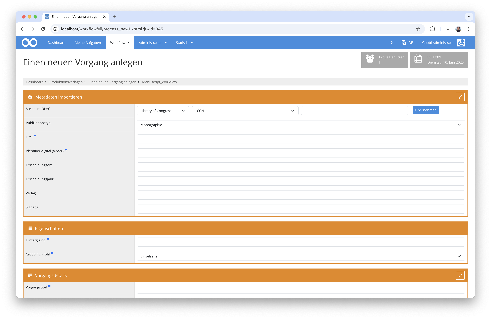

Wir sind kürzlich auf ein Fehlverhalten von Goobi in diesem Bereich aufmerksam geworden. Eigenschaften für Vorgängen, die eigentlich als Pflichtangaben durch den Nutzer angegeben werden müssen, wurden von Goobi nicht richtig geprüft und haben daher erlaubt, dass Vorgänge auch ohne ausgefüllte Pflichtfelder für Eigenschaften angelegt werden konnten. Dieses Verhalten haben wir korrigiert, so dass jetzt eine Fehlermeldung erscheint und ein Anlegen des Vorgangs unterbindet.

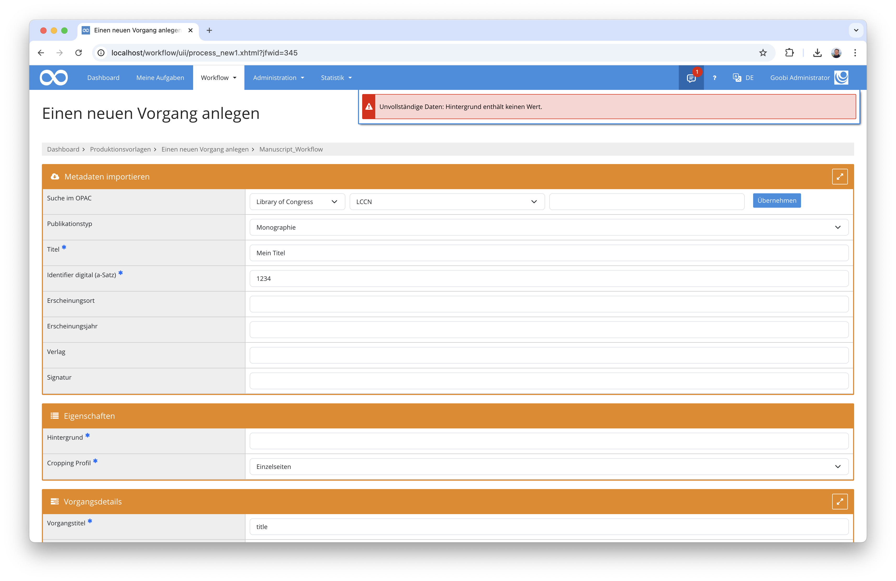

Die Pflichtfelder für Metadaten waren von diesem Verhalten im Übrigen nicht betroffen. Da die Mehrheit der Goobi-Nutzer beim Anlegen lediglich Metadaten erfassen, dürfte lediglich eine Minderheit der Goobi-Nutzer von der Fehlfunktion betroffen gewesen sein.

### Tooltips als Hilfe bei Dropdowns
Wie die meisten Web-Applikationen und Webseiten zeigt auch Goobi workflow kleine Hilfetext an, wenn man den Mauszeiger beispielsweise über einem Button läßt. Diese Hilfetext sind zwar meist nur sehr kurz, können aber doch relativ hilfreich sein.

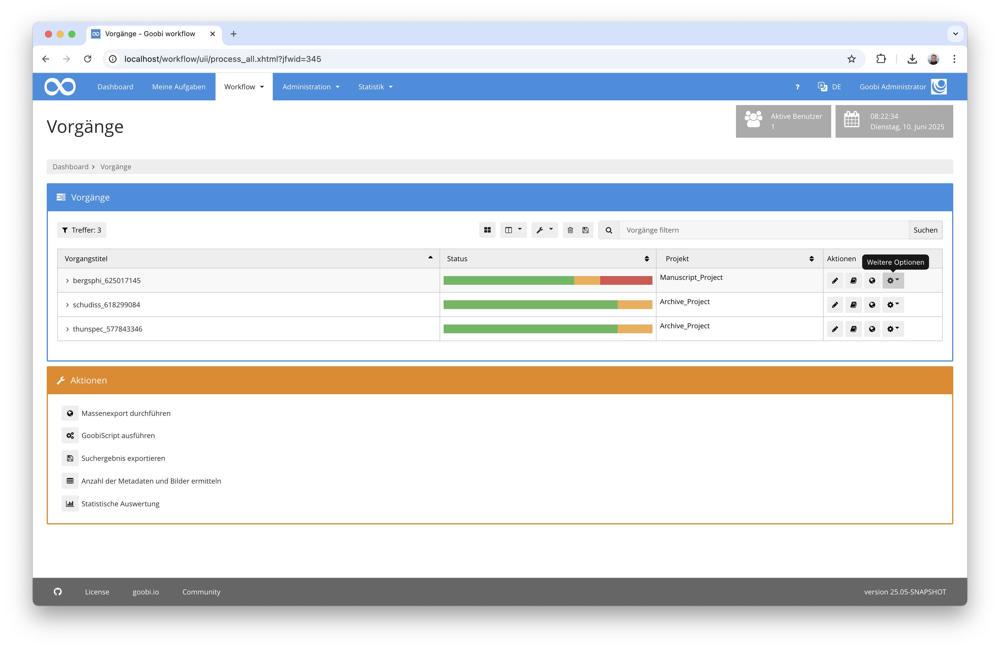

Bei einigen Drop-Down-Buttons war die Anzeige dieser kleinen Hilfetexte (Tooltips) nicht ganz nutzerfreundlich und verschwanden zu schnell wieder oder überlagert teilweise den ersten Menüeintrag eines solchen Drop-Down-Elements. Dies haben wir nun überarbeitet und an vielen Stellen homoginisiert. Damit dürte die Bedienung in dem Bereich noch einmal etwas besser geworden sein.


### Dynamische Spaltenbreite für alle wichtigen Tabellen
Schon im letzten Jahr hatten wir vorsichtig ein neues Feature eingeführt und zunächst einmal nur bei der Auflistung der Vorgänge aktiviert. Dabei geht es darum, dass Nutzer sich die Breite der angezeigten Spalten selbst einstellen können sollten.

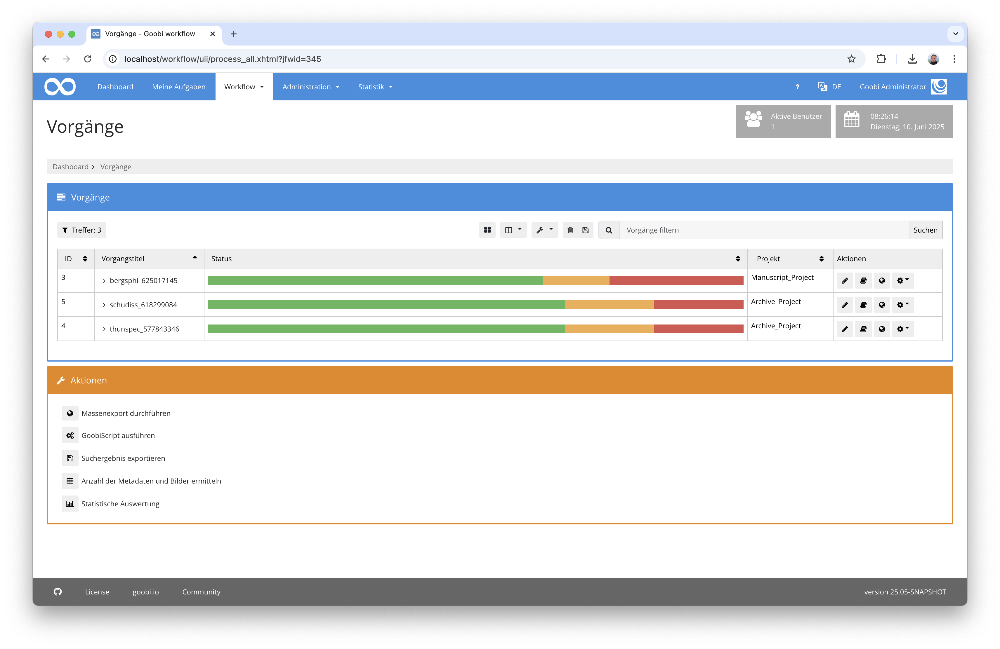

Da uns seit Einführung dieser Funktion keine einzige Fehlfunktion dieser Einstellbarkeit berichtet wurde, haben wir uns nun dazu entschlossen, diese Funktionalität nun für sämtliche wichtigen Tabellen auszurollen. Somit findet sich die Möglichkeit der individuellen Spaltenbreiten nun auch innerhalb der eigenen Aufgaben sowie in allen Tabellen innerhalb des Administrativen Bereichs.

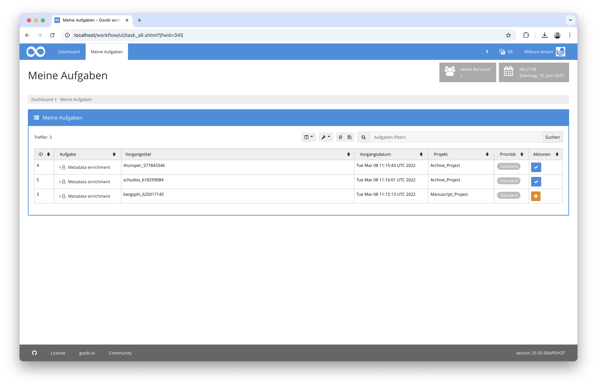

Sollten wir hierbei einen wichtigen Bereich übersehen haben oder doch einmal ein Fehler auftreten, so meldet Euch bitte jederzeit.

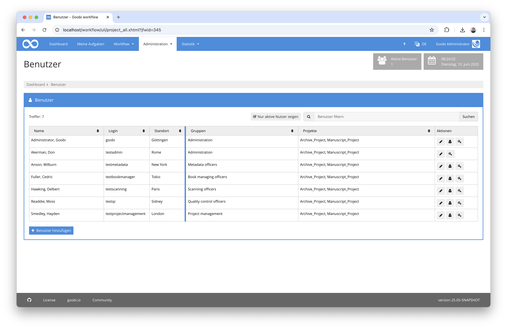


### Nach oben scrollen
Sollten Inhalte auf einer der Seiten von Goobi einmal sehr lang werden, war es bisher nötig, jeweils weit nach oben zu scrollen und beispielsweise wieder zu den Menüeinträgen zu gelangen.

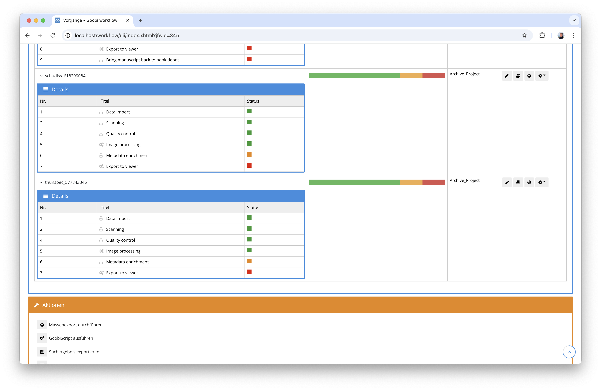

Neu ist ab jetzt, dass wir einen neuen Button eingeführt haben, der den aktuellen Scrollstatus anzeigt und zugleich auch erlaubt, schnell wieder nach oben zu scrollen. Alle Bearbeiter von Regelsätzen werden diese neue Funktion lieben. :)


## Plugins

### Großumbau des Newspaper Recognizers
Das Plugin für die bequeme Erfassung von Zeitungsausgaben wurde grundlegend umgestaltet. Jetzt ist es möglich, dass Ausgaben und Beilagen konfigurierbar typisiert werden können. Damit ist einstellbar, welche Strukturelemente aus dem Regelsatz für Ausgaben- und Beilagentypen in die Metadaten geschrieben werden sollen. Zuvor war der Metadatentyp für Ausgaben fix und Beilagen wurden innerhalb der Metadaten nur unzureichend erfasst. Dies ist nun deutlich flexibler und mächtiger geworden.

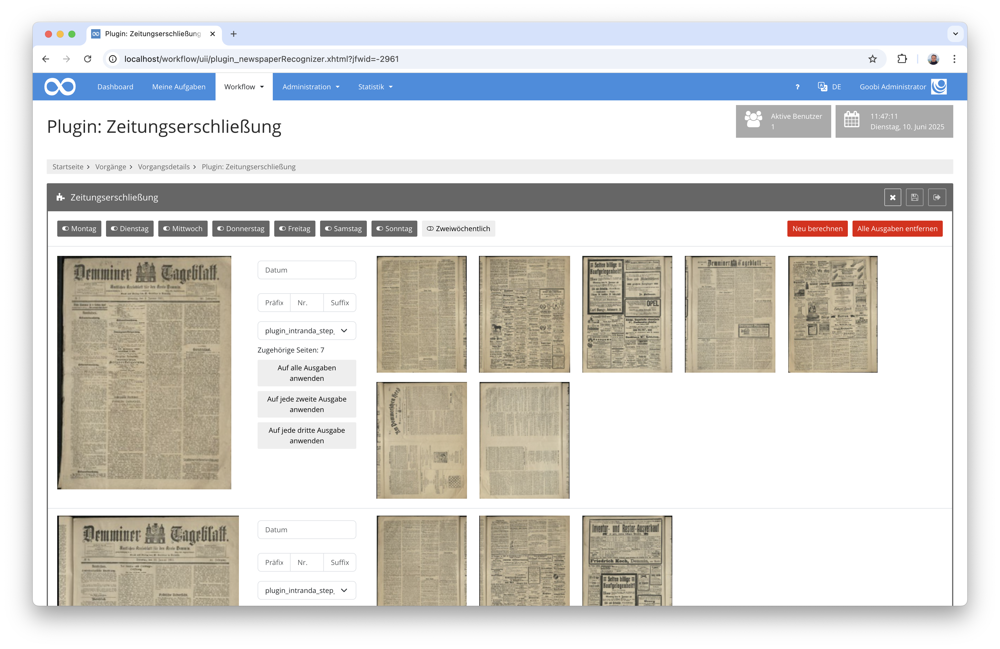

Auch für die Titelgenerierung läßt sich jetzt ein flexibles Format definieren, wobei das Format für das Datum nun auch konfigurierbar geworden ist. Nutzer können somit die Titelgenerierung bezüglich des Aufbaus frei wählen und die jeweiligen Typen so auch für andere Sprachen konfigurieren.

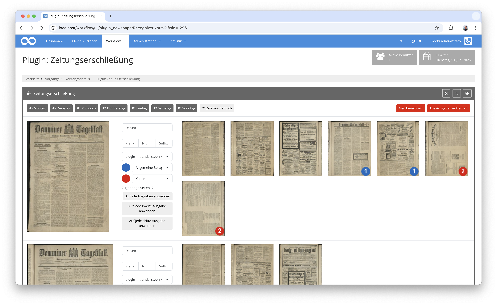

Die ausführliche Dokumentation des Plugins findet sich hier:

[https://docs.goobi.io/workflow-plugins/de/step/goobi-plugin-step-olr-newspaper-recognizer](https://docs.goobi.io/workflow-plugins/de/step/goobi-plugin-step-olr-newspaper-recognizer)


### Erweiterung der REST-API
Die REST-API von Goobi workflow wurde etwas erweitert. Neu hinzugekommen ist hier, dass es beim Anlegen von Vorgängen über die REST-API nun möglich ist, Anchor und Child-Strukturen zu verwenden. Damit ist es nun möglich geworden, dass auch mehrbändige Werke oder Zeitschriftenbände über die API angelegt werden können.

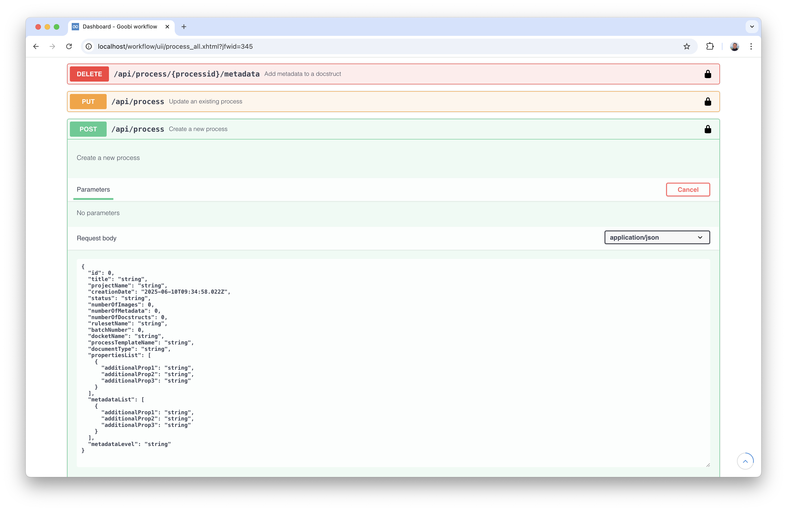


## Codeanalyse
Die folgenden Screenshots zeigen die SonarCloud Analyse des aktuellen Releases. Weitere Informationen gibt es direkt auf der [Projektseite](https://sonarcloud.io/organizations/intranda/projects).

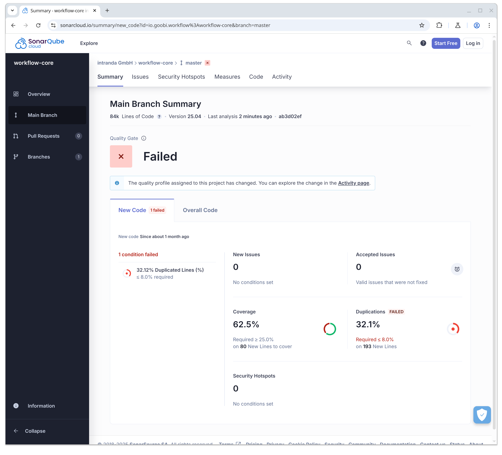

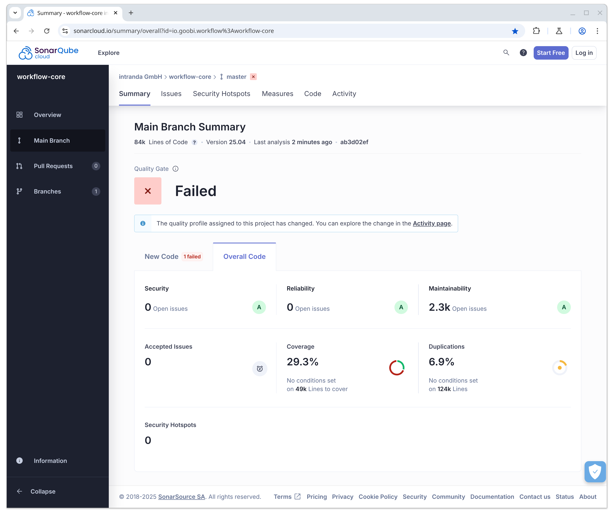


## Versionsnummer
Die aktuelle Versionsnummer von Goobi workflow lautet mit diesem Release: `25.04`. Innerhalb von Plugin-Entwicklungen muss für Maven-Projekte innerhalb der Datei `pom.xml` entsprechend folgende Abhängigkeit eingetragen werden:

```xml
<dependency>
    <groupId>io.goobi.workflow</groupId>
    <artifactId>workflow-core</artifactId>
    <version>25.04</version>
    <classifier>classes</classifier>
</dependency>
```