# Mai 2025

## Allgemein
In diesem Monat haben wir einige optische Anpassungen vorgenommen, um die Accessibility und die Usabilty zu verbessern. Außerdem haben wir eine Großbaustelle bzgl. der Vorgangseigenschaften abschließen können. In diversen Plugins gab es Neuerungen. Und der überarbeitete Regelsatzeditor ist jetzt da.


## Core


### Verbesserung des Menüs für eindeutige Kennzeichnung des aktiven Bereichs
Für eine gute Barrierefreiheit ist wichtig, dass der aktive Menüeintrag gut von den nicht-aktiven Menüeinträgen unterschieden werden kann. Bisher erfolgte das im Menü darüber, dass der aktive Menüeintrag eine andere Hintergrund- und Vordergrundfarbe aufwies. 

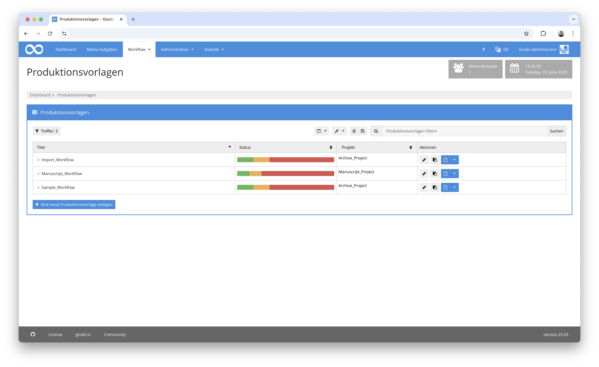

Das allein genügt jedoch nach heutigem Stand der Anforderungen nicht für eine eindeutige Kennzeichnung der Aktivität. Neben einer unterschiedlichen Farbe musste hier ein weiteres Kriterium ergänzt werden. 


Wir haben uns daher dafür entschieden, die Menüpunkte in ihrer Form leicht unterschiedlich zu handhaben. Der jeweils aktive Menüeintrag ist von nun an so gestaltet, dass er etwas mehr an Registerkarten erinnert. Damit ist die Optik weitestgehend erhalten geblieben, die Anforderung für die Barrierefreiheit aber erfüllt.


### Vereinfachter Zugang zu kontrastreicher Darstellung für WCAG
Vor einigen Jahren hatten wir in Goobi workflow eine Möglichkeit geschaffen, dass Nutzer eine Einstellung für eine kontrastreichere Darstellung wählen können. Hinzu kam später auch die Möglichkeit, dass Nutzer auch einen speziellen WCAG-Modus aktivieren konnten, der eine Erfüllung der Accessibility-Anforderung gemäß WCAG erlaubte. Diese beiden Modi haben wir nun einmal überarbeitet und zusammengelegt. Außerdem haben wir andere WCAG-Anforderungen mittlerweile so zentral in Goobi eingepflegt, dass diese nicht mehr explizit angeschaltet werden müssen. Einzig unser Sorgenkind der Farbwahl für die Boxen mit der weissen Schrift darauf konnten wir noch nicht lösen. Aus diesem Grund haben wir uns nun zu folgendem Kompromiss durchgerungen:

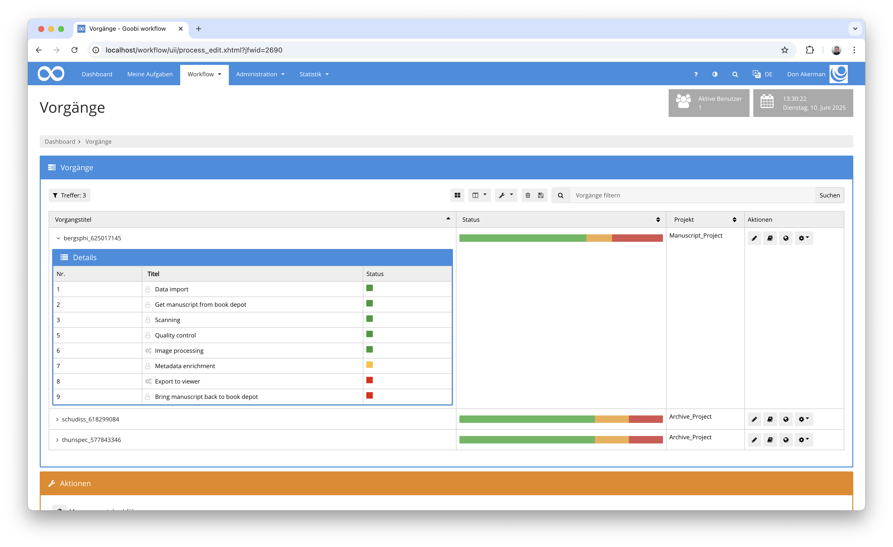

Wir haben den bisherigen WCAG-Modus und den bisherigen Modus für einen hohen Kontrast nun zu einem Kontrastmodus zusammengelegt. Dieser ist von nun an einfach über die Menüleiste einfach umschaltbar, ohne umständlich in die Einstellungen des Nutzers wechseln zu müssen. Aktiviert man diesen Modus nun, wird damit der Kontrast bei den farbigen Boxen dadurch erhöht, dass sowohl blaue als auch orange Boxen etwas dunkler eingefärbt werden. Hinzu kommt, dass einige Funktionen, die normalerweise nur über ihre Farbe unterschieden werden können, einen kleinen Erläuterungshinweis daneben anzeigen.

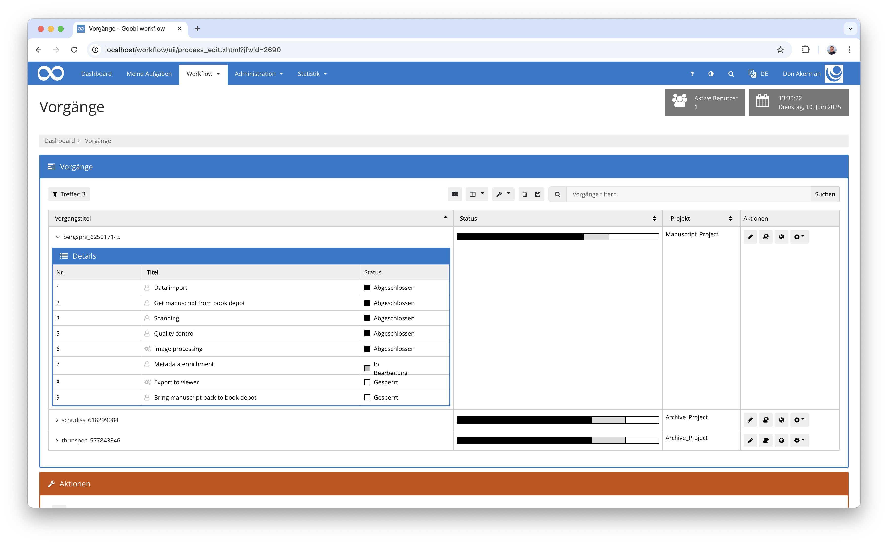


### Neue globale Suche direkt aus dem Menü
Der letzte noch offene Punkt für eine Erfüllung der deutschen Accessibility-Anforderungen BITV wurde von uns in diesem Monat auch gelöst. Neben dem klassischen Menü muss eine Anwendung wie Goobi über die Möglichkeit verfügen auch anderweitig bequem zu Inhalten zu gelangen. Wir haben dies darüber gelöst, dass wir in der Menüleiste nun eine globale Suche integriert haben. Diese steht jederzeit zur Verfügung und erlaubt die Nutzung der üblichen Suchsyntax, wie sie bei Vorgängen und Aufgaben bereits genutzt wird und hier detailliert beschrieben ist:

[https://docs.goobi.io/goobi-workflow/de/manager/06_processes/01_search](https://docs.goobi.io/goobi-workflow/de/manager/06_processes/01_search)

Aktiviert man die Suche dort, kann man einfach den gewünschten Suchbegriff eingeben und entscheiden, ob innerhalb der Vorgänge oder innerhalb der eigenen Aufgaben gesucht werden soll - sofern der aktuelle Nutzer denn über die nötige Berechtigung verfügt.

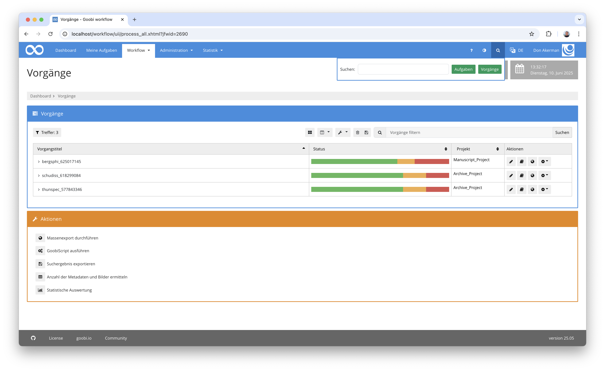

Und für die ganz eiligen Nutzer haben wir hier gleich noch zwei verschiedene Bedienungen der Suche erlaubt:

- Drückt man die `Enter`-Taste nach Eingabe der Suche, wird standardmäßig in den eigenen Aufgaben gesucht.
- Drückt man hingegen `Shift` und die `Enter`-Taste, wird innerhalb der Vorgänge gesucht.


### Neue Verwaltung von Eigenschaften
Bereits vor mehreren Jahren hatten wir einmal eine Umfrage auf den Goobi-Tagen durchgeführt, um zu fragen, ob wir die sogenannten Vorlageneigenschaften und die Werkstückeigenschaften eigentlich abschaffen könnten. Eine beträchtliche Mehrheit sprach sich dafür aus und wir hatten gemeinsam entschieden, dass die dort bisher hinterlegten Eigenschaften eigentlich sowieso redundant mit denjenigen aus der jeweiligen METS-Datei sind. 

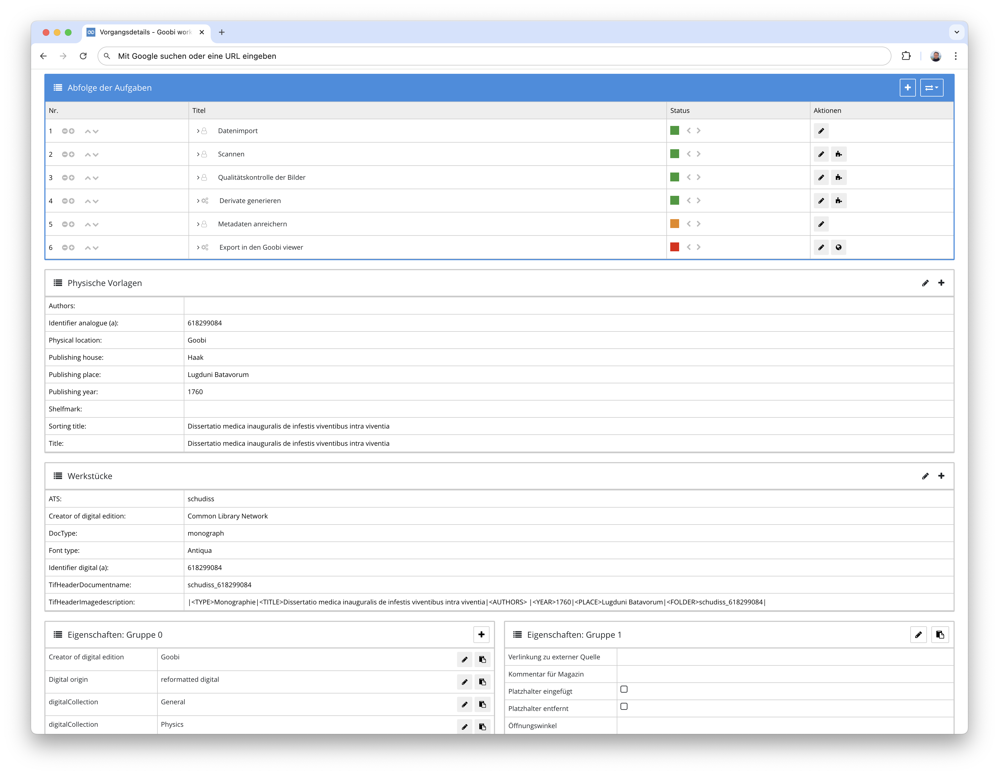

Aus diesem Grund war schon länger geplant, diese Eigenschaften einfach mit denjenigen der Vorgänge zusammenzulegen. Diese Umstellung haben wir nun auch in die Tat umgesetzt. Mit der Installation des Updates überführt Goobi workflow automatisch alle bereits vorhandenen Werkstück- und Vorlageneigenschaften in die Vorgangseigenschaften. Damit ergibt sich eine deutlich übersichtlichere Verarbeitung der Eigenschaften. 

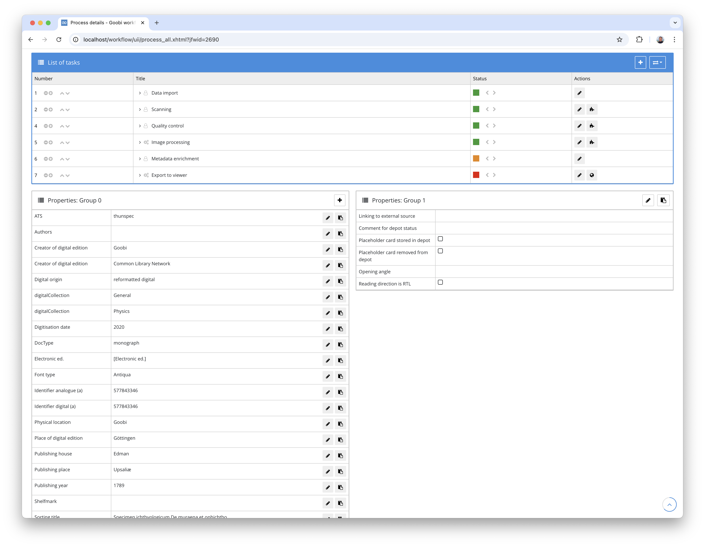

Hinzu kommt, dass sämtliche dieser Eigenschaften seit den Erweiterungen der Gruppierbarkeit nun individuell auch ganz anders gruppiert werden können. Strengenommen ist diese Vereinfachung der Datenhaltung damit für die Endanwender sogar deutlich flexibler als vorher.

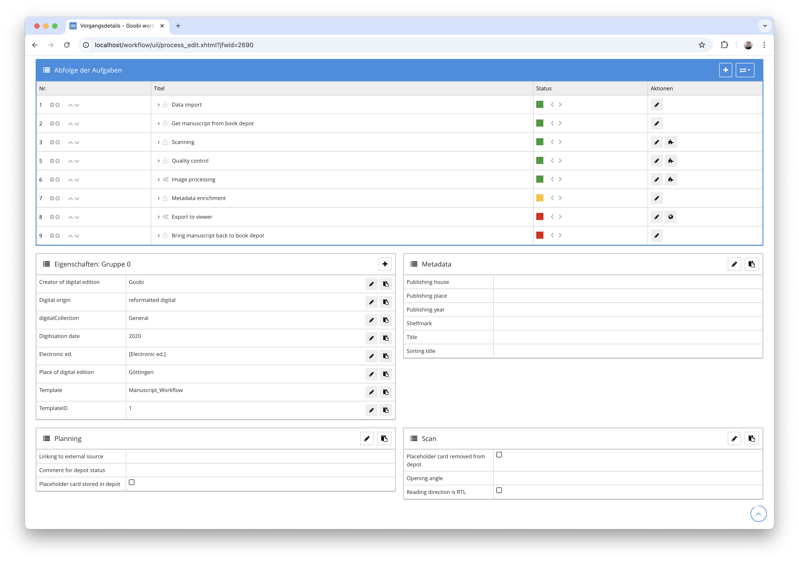

Eine Erläuterung, wie die Gruppierung von Eigenschaften vorgenommen werden kann, findet sich wie gehabt unter folgender Adresse:

[https://docs.goobi.io/goobi-workflow/de/admin/06_config_files/10_goobi_processproperties.xml](https://docs.goobi.io/goobi-workflow/de/admin/06_config_files/10_goobi_processproperties.xml)


### Properties in den Projekten
Die intern überarbeitete Verwaltung von Eigenschaften wurde in dem Zusammenhang gleich so konzipiert, dass sich Eigenschaften von nun an nicht mehr allein auf Vorgänge beziehen können. Denkbar sind hier auch ganz andere Bereiche in Goobi, wie Batches, Institutionen, Benutzergruppen, Regelsätze und vieles mehr. Angefangen haben wir aber einmal mit den Projekten. Diese bieten in einer weiteren Registerkarte der Projektdetails nun die Möglichkeit, eigene Eigenschaften zu besitzen. Diese Eigenschaften können dann von Automatismen oder Plugins für bedingte Ausführungen von Workflows, spezielle Exporte oder andere künftige Entwicklungen ausgewertet werden.

Unser erste Anwendungsfall hierfür ist der besondere Export in das Langzeitarchiv Arche der Akademie der Wissenschaften in Wien.

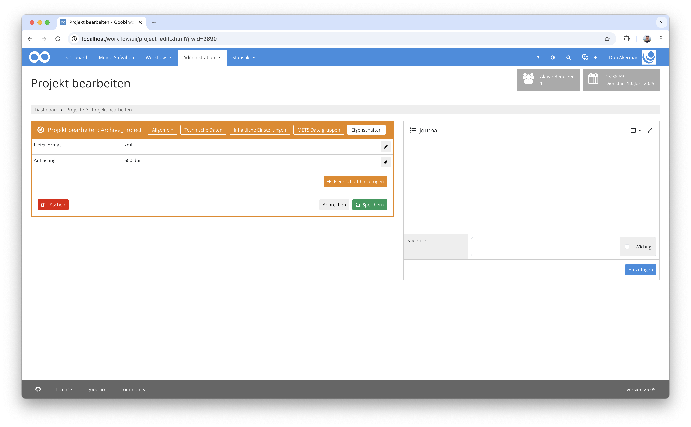


### Erweiterung des Regelsatzeditors und Integration in den Goobi-Kern
Wer schon einmal intensiver mit Goobi workflow gearbeitet hat, hat natürlich auch bereits von den Regelsätzen gehört. Hierbei handelt es sich um zentrale Konfigurationen für das Handling und Mapping von Metadaten sowie für den Austausch mit Katalogsystemen und den Export bzw. die Veröffentlichung z.B. als METS oder LIDO Dateien.

```xml
  [...]
  <MetadataType>
    <Name>TitleDocMain</Name>
    <language name="de">Haupttitel</language>
    <language name="en">Main title</language>
    <language name="es">Título principal</language>
  </MetadataType>
  [...]
  <MetadataType>
    <Name>FontType</Name>
    <language name="de">Schrifttyp</language>
    <language name="en">Font type</language>
  </MetadataType>
  [...]
  <Group>
    <Name>AccrualsGroup</Name>
    <language name="de">Informationen über voraussichtliche Ergänzungen</language>
    <language name="en">anticipated additions</language>
    <metadata DefaultDisplay="true" num="1o">Title</metadata>
    <metadata DefaultDisplay="true" num="1o">Description</metadata>
    <metadata DefaultDisplay="true" num="1o">Date</metadata>
  </Group>
  [...]
  <DocStrctType>
    <Name>Epilogue</Name>
    <language name="de">Nachwort</language>
    <language name="en">Epilogue</language>
    <language name="es">Epílogo</language>
    <allowedchildtype>Appendix</allowedchildtype>
    <allowedchildtype>Introduction</allowedchildtype>
    <allowedchildtype>Chapter</allowedchildtype>
    <allowedchildtype>Errata</allowedchildtype>
    <allowedchildtype>OtherDocStrct</allowedchildtype>
    <allowedchildtype>Preface</allowedchildtype>
    <metadata num="*">Author</metadata>
    <metadata num="*">TitleDocMainShort</metadata>
    <metadata num="1o">TitleDocMain</metadata>
    <metadata num="*">_ucc_id</metadata>
    <metadata num="*">DocLanguage</metadata>
    <metadata num="*">Composer</metadata>
    <metadata num="1o">_urn</metadata>
  </DocStrctType>
  [...]
```

Diese Regelsätze sind also sehr umfangreiche Konfigurationsdateien, deren Bearbeitung recht aufwendig ist und bei der schnell auch einmal Fehler unterlaufen können. Aus diesem Grund haben wir seit einigen Jahren bereits ein Plugin für die Bearbeitung bereitgestellt, das auch einfache Validierungen der Regelätze erlaubt hat.

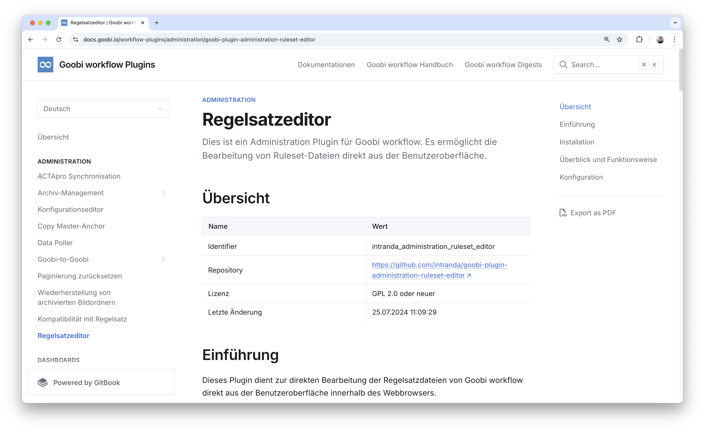

Dieses Plugin wurde nun vollständig in den Kern von Goobi workflow integriert. Der Mehrwert des Plugins war einfach so groß, dass immer mehr Nutzer nach dessen Installation fragen und von der einfacheren Konfigurierbarkeit profitierten.

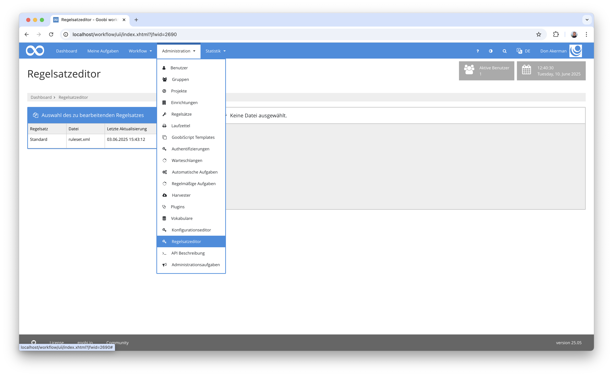

Doch neben dem reinen Umzug des Plugins in den Kern von Goobi haben wir bei der Gelegenheit auch einmal mehrere neue Funktionen ergänzt, von denen nun tatsächlich alle profitieren können. Die Validierungen wurden massiv erweitert. So wird bei der Bearbeitung von Regelsätzen nun folgendes geprüft:

- **Wohlgeformheit:** Werden alle geöffneten Tags `<>` auch geschlossen? Werden ungültige Zeichen verwendet? Werden Attribute an der falschen Stelle verwendet?

- **Fehlerhafte Namen:** Haben alle `<MetadataType>`, `<Group>`, `<DocStrct>` und Exportformate ein Element `<Name>` (bzw. für einige Exportformate ein Element `<InternalName>`) und ist dessen Wert nicht leer? 

- **Fehlende Übersetzungen:** Ist jeder Wert, der in einem `<language>` Element aufgeführt ist, nicht leer oder besteht nur aus Leerzeichen?

- **Ungültige Kardinalität:** Ist bei jedem Unterelement von `<DocStrctType>` vom Typ `<metadata>` und `<group>` ein valider Wert unter dem Attribut `num` angegeben? Gültige Werte sind ausschließlich: `1o`, `*`, `1m`und `+`.

- **Mehrfach definierte Werte:** Sind alle `<MetadataType>`, `<Group>` und `<DocStrctType>` Elemente nur einmal definiert?

- **Duplikate:** Wurden innerhalb von `<Group>` oder `<DocStrctType>` die gleichen Elemente `<metadata>`, `<allowedChildType>` oder `<group>` mehrfach verwendet?

- **Nutzung von Publikationstypen:** Wurden `<DocStrctType>` Elemente mit dem Attribut `<topStruct="true">` fälschlicherweise innerhalb von `<DocStrctType>` Elementen als `<allowedchildType>` genutzt?

- **Undefinierte Metadatentypen:** Wird innerhalb von  `<Group>`, `<DocStrct>` sowie in den Exportformaten ein Element `<metadata>` aufgeführt, welches nicht als `<MetadataType>` definiert wurde?

- **Ungenutzte Metadatentypen:** Wird ein Element `<MetadataType>` definiert, aber weder in `<Group>`,`<DocStrct>` noch innerhalb von Exportformaten genutzt? 

- **Ungenutzte Strukturtypen:** Ist ein Element `<DocStrctType>` definiert, wird aber in keinem anderen `<DocStrctType>` als `<allowedchildtype>` genutzt? 

- **Ungemappte Strukturtypen:** Werden `<DocStrctType>`, `<MetadataType>` und `<Group>` Elemente definiert aber nicht im Export genutzt? 

Dabei werden die ermittelten Fehler nun nach deren Dringlichkeit absteigend sortiert dargestellt und sie weisen auch auf die konkrete Zeilennummer hin, in der der jeweilige Fehler festgestellt wurde.

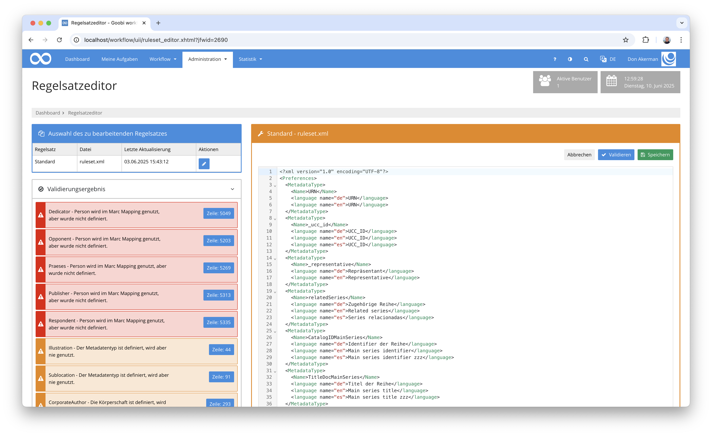

Hinzu kommt die Möglichkeit, dass man auf diese Zeilennummern nun einfach klicken kann und Goobi damit automatisch zu der jeweiligen Zeile scrollt. Darüber hinaus wird diese Zeile dann auch farbig hervorgehoben.

Und auch damit noch nicht genug: Wir haben eine große Überarbeitung des gesamten Lade- und Anzeigemechanismus vorgenommen. Die Validierung ist trotz erweiterten neuen Prüfmöglichkeiten auf weniger als 10% der vorherigen langsameren Ausführungsgeschwindigkeit gesunken. Und auch das alleinige Betreten eines Regelsatzes sowie das neue Laden findet dank der Nutzung von Code-Mirror 6 als eingebettetem Editor nun in einem Bruchteil der Zeit vorher statt. 

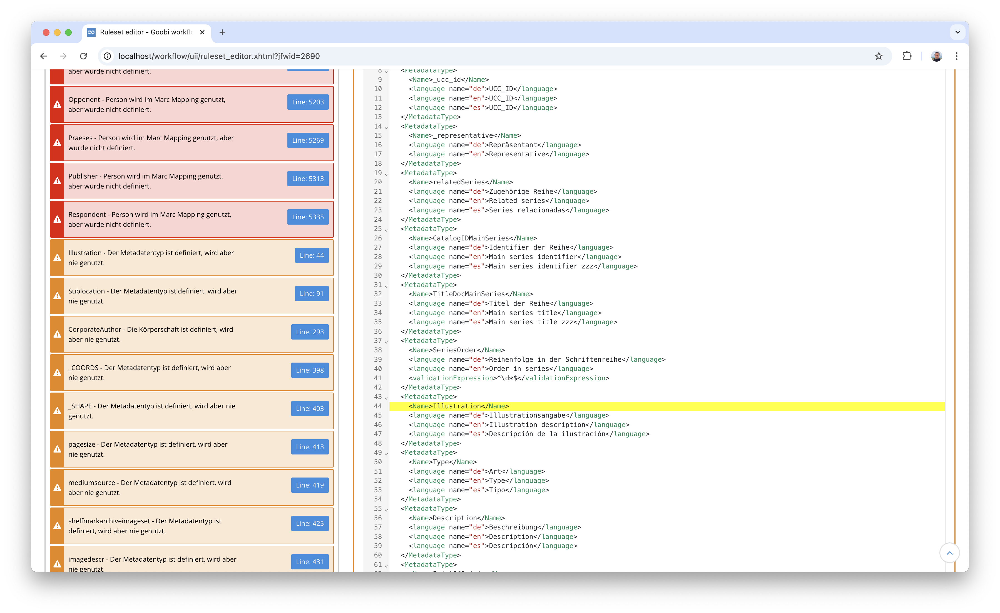

Alles in allem sind die Änderungen und Erweiterungen des neuen Regelsatzeditors so enorm, dass jeder Anwender es sofort selbst bemerken wird. Probiert es aus!

Und wenn Ihr Interesse an der Dokumentation habt, haben wir hierfür eine eigene Seite in unserer zentralen Dokumentation erzeugt. Sie findet sich unter dieser Adresse:

[https://docs.goobi.io/goobi-workflow/de/manager/10_ruleset_editor](https://docs.goobi.io/goobi-workflow/de/manager/10_ruleset_editor)

Und hier ist auch die zugehörige Konfigurationsdatei erläutert:

[https://docs.goobi.io/goobi-workflow/de/admin/06_config_files/17_goobi_ruleseteditor](https://docs.goobi.io/goobi-workflow/de/admin/06_config_files/17_goobi_ruleseteditor)


### Erweiterung des Konfigurationseditors 
Da sich die Lade- und Anzeigegeschwindigkeit im Regelsatzeditor so enorm steigern ließ, haben wir auch den Konfigurationseditor mit Code-Mirror 6 ausgestattet. Auch hier gilt nun also, dass die Ladezeiten und auch das ganze Handling von Dateien deutlich besser und performanter geworden ist.

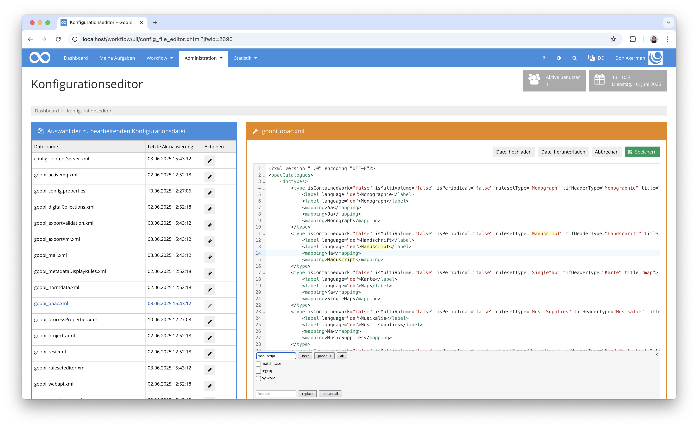

Für die Konfiguration des Editors von Konfigurationsdateien liegt nun eine eigene Seite in unserer Dokumentation vor. Diese befindet sich hier:

[https://docs.goobi.io/goobi-workflow/de/admin/06_config_files/16_goobi_configeditor](https://docs.goobi.io/goobi-workflow/de/admin/06_config_files/16_goobi_configeditor)


## Plugins

### Anbindung an ACTApro
Für die Bibliothek der Wirtschaftsuniversität Wien haben wir eine Anbindung von Goobi workflow an das Archiv-System ACTApro entwickelt. Für dessen Nutzung wird innerhalb von Goobi workflow der Betrieb des Plugins für das Archiv-Management vorausgesetzt. Ist diese Voraussetzung erfüllt und alles richtig konfiguriert, erlaubt der neue Mechanismus, dass Goobi periodisch Informationen von ACTApro abfragen kann und damit den Archivbestand im Archiv-Management aktualisiert. Wenn nun innerhalb des Archiv-Managements weitere Metadaten für einzelne Verzeichnungseinheiten erfasst werden und damit der Archivbestand angereichert wird, stellt das Plugin einen Automatismus zur Verfügung, der es erlaubt, diese angereicherten Metadaten auch an ACTApro zurückzugeben. Damit ist es möglich, die Bestandsinformationen in beiden Systemen zu synchronisieren.

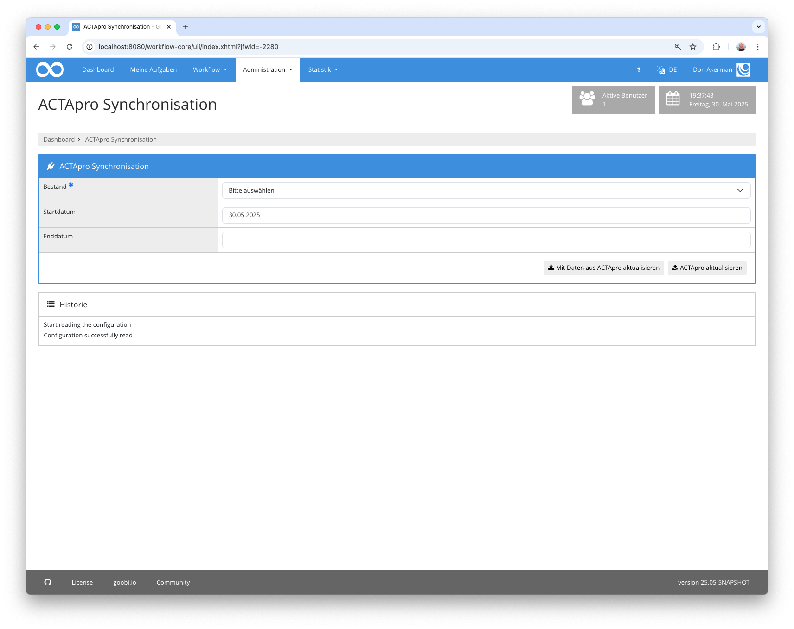

Detaillierte Informationen zu dem Plugin und dessen Konfiguration finden sich hier in den ausführlichen Dokumentationen:

[https://docs.goobi.io/workflow-plugins/de/administration/goobi-plugin-administration-actapro-sync](https://docs.goobi.io/workflow-plugins/de/administration/goobi-plugin-administration-actapro-sync)

[https://docs.goobi.io/workflow-plugins/de/step/goobi-plugin-step-actapro](https://docs.goobi.io/workflow-plugins/de/step/goobi-plugin-step-actapro)


### Renaming Plugin
Das Renaming Plugin wurde um einen neuen Baustein zur Dateinamensgenerierung sowie um eine erweiterte Zählerkomponente ergänzt. Dateinamen können nun auch Metadaten des Vorgangs enthalten, die in den Strukturelementen der jeweiligen Bilddatei hinterlegt sind. Falls mehrere Strukturelemente infrage kommen, lässt sich der gewünschte Typ gezielt auswählen. Die Zählerkomponente, die fortlaufende Nummerierungen ermöglicht, wurde dahingehend erweitert, dass der Zähler nun pro Strukturelement zurückgesetzt werden kann. Dadurch ist es beispielsweise möglich, die Nummerierung innerhalb eines Kapitels oder ähnlicher Struktureinheiten stets bei eins beginnen zu lassen.

Die Dokumentation des Plugins und dessen Konfiguration finden sich hier:

[https://docs.goobi.io/workflow-plugins/de/step/goobi-plugin-step-rename-files](https://docs.goobi.io/workflow-plugins/de/step/goobi-plugin-step-rename-files)


### Weitere Anpassungen an Plugins
Neben den geschilderten Anpassungen an den recht verbreiteten Plugins, gab es auch weitere Änderungen an Plugins, die zum Teil nur von wenigen Anwendern eingesetzt werden. Einige davon sollen hier kurz genannt werden:

An dem Plugin für den Import für Excel-Dateien an der ETH-Zürich gab es einige Anpassungen für den Umgang mit Archivalien. Die Dokumentation hierfür befindet sich unter dieser Adresse: [https://docs.goobi.io/workflow-plugins/de/import/goobi-plugin-import-eth-no-catalogue](https://docs.goobi.io/workflow-plugins/de/import/goobi-plugin-import-eth-no-catalogue)

Am Plugin für das Archiv-Management gab es verschiedene kleinere Änderungen und Korrekturen. Diese betrafen unter anderem das Verhalten nach dem Löschen von Archiv-Knoten, dem Duplizieren von Daten, der Änderung des Knotentyps und allgemein dem Umgang mit Unterknoten. Die aktuelle Dokumentation findet sich wie gewohnt hier: [https://docs.goobi.io/workflow-plugins/de/administration/goobi-plugin-administration-archive-management](https://docs.goobi.io/workflow-plugins/de/administration/goobi-plugin-administration-archive-management)

Es wurde ein neues Export-Plugin für die Nationalbibliothek Wales implementiert, das es erlaubt, die Daten in sehr individuellen Formaten bereitzustellen. Inwieweit dieses Plugin für andere Nutzer nachnutzbar ist, lässt sich derzeit noch nicht beurteilen. Hier folgen in Kürze noch einige weitere Anpassungen, über die wir dann wieder berichten werden.

Die REST-API wurde dahingehend angepasst, dass bei der Erzeugung von Vorgangstiteln noch konsequenter geprüft wird, welche Zeichen darin vorkommen. Leerzeichen und andere besondere Zeichen werden nun konsequent mit Unterstrichen ersetzt.

Am Plugin für den Entitäteneditor gab es verschiedene optische Anpassungen für eine bessere Bedienbarkeit. So wird unter anderem die Scrollposition besser ausgewertet und nachgenutzt. Auch gab es Anpassungen für die Höhe der Inhaltsdarstellung und weitere Kleinigkeiten.

Die Dokumentation für das Change-Workflow-Plugin wurde hinsichtlich der Nutzung von Bedingungen besser dokumentiert. Die Dokumentation findet sich hier: [https://docs.goobi.io/workflow-plugins/de/step/goobi-plugin-step-change-workflow](https://docs.goobi.io/workflow-plugins/de/step/goobi-plugin-step-change-workflow)


## Codeanalyse
Die folgenden Screenshots zeigen die SonarCloud Analyse des aktuellen Releases. Weitere Informationen gibt es direkt auf der [Projektseite](https://sonarcloud.io/organizations/intranda/projects).

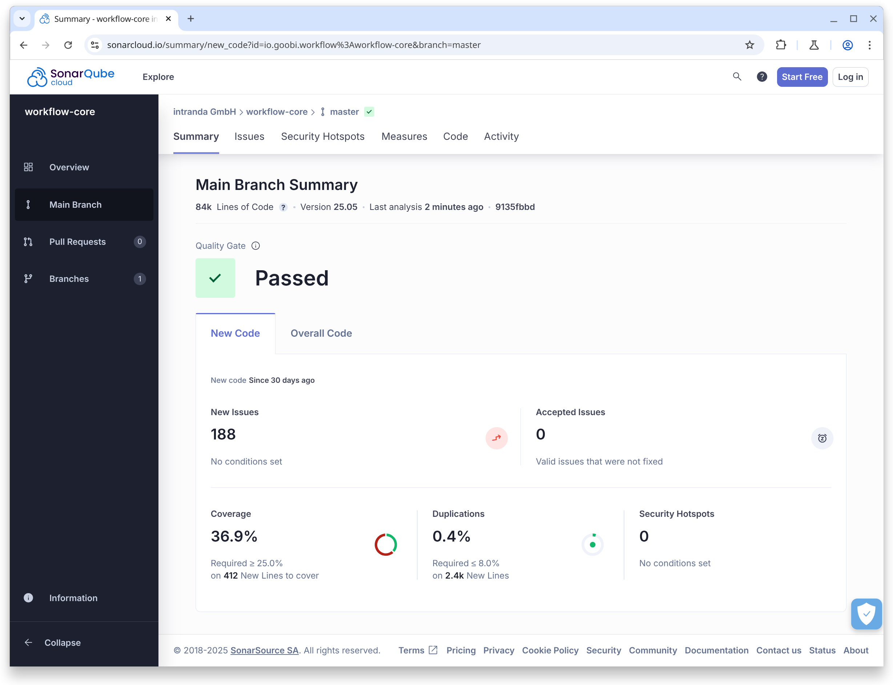

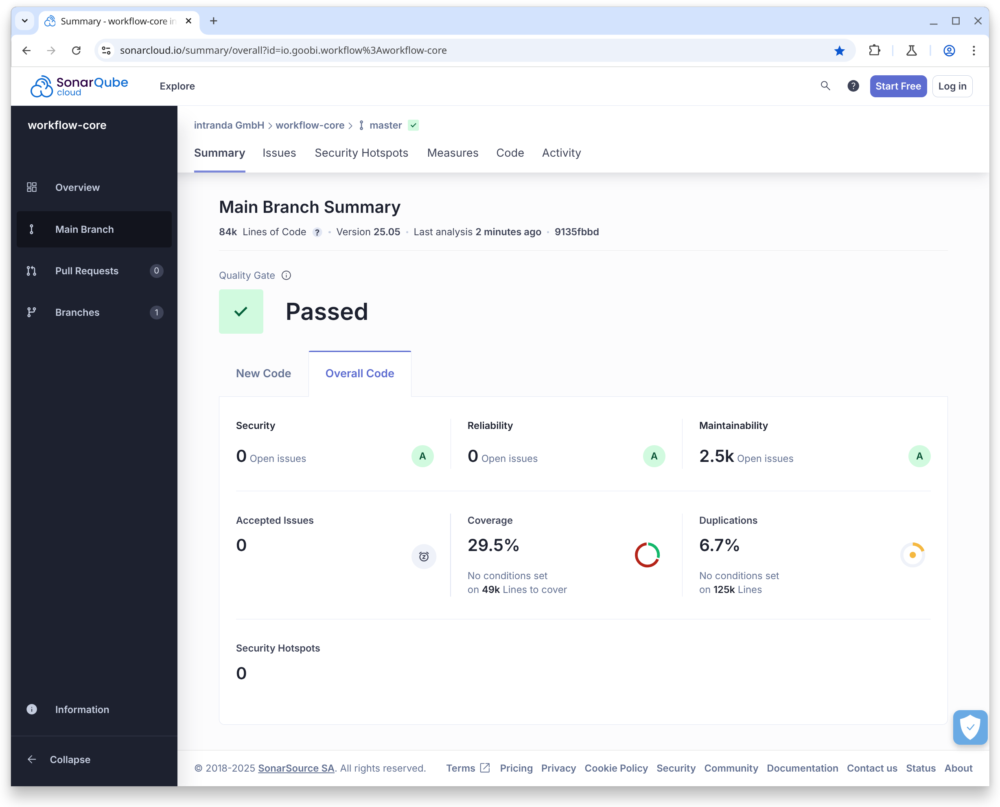


## Versionsnummer
Die aktuelle Versionsnummer von Goobi workflow lautet mit diesem Release: `25.05`. Innerhalb von Plugin-Entwicklungen muss für Maven-Projekte innerhalb der Datei `pom.xml` entsprechend folgende Abhängigkeit eingetragen werden:

```xml
<dependency>
    <groupId>io.goobi.workflow</groupId>
    <artifactId>workflow-core</artifactId>
    <version>25.05</version>
    <classifier>classes</classifier>
</dependency>
```