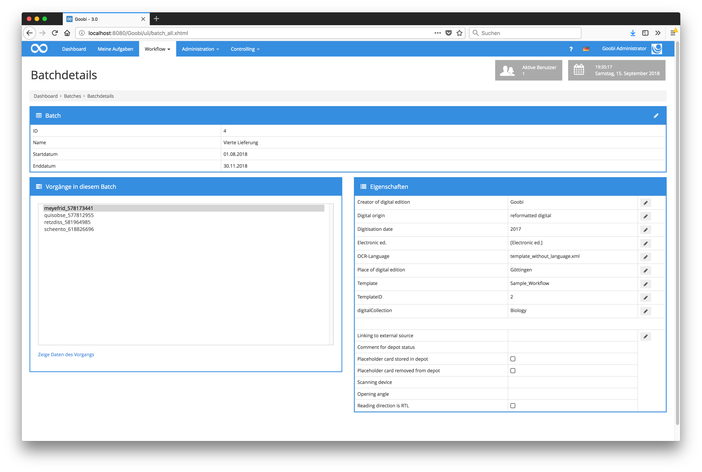
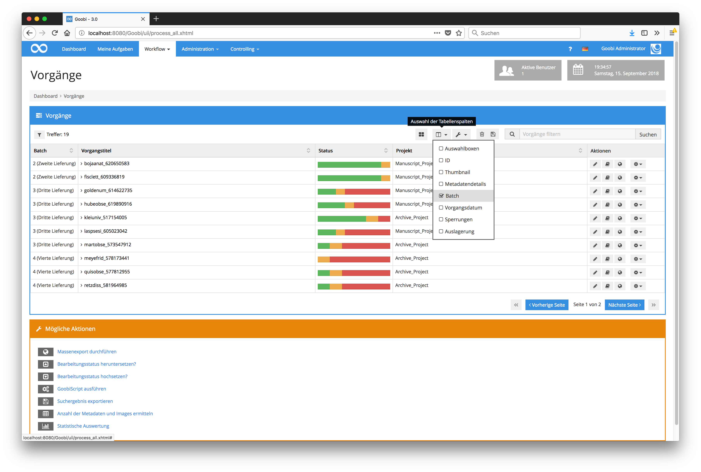
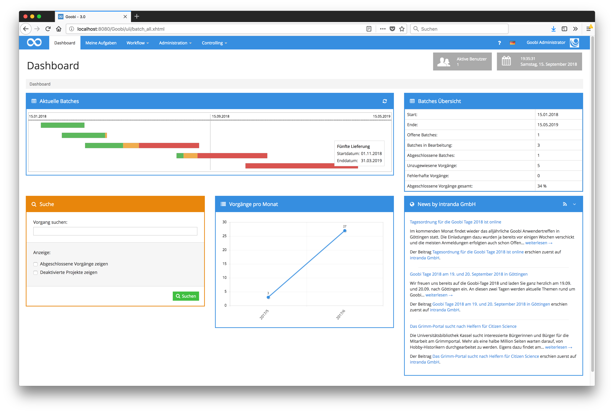
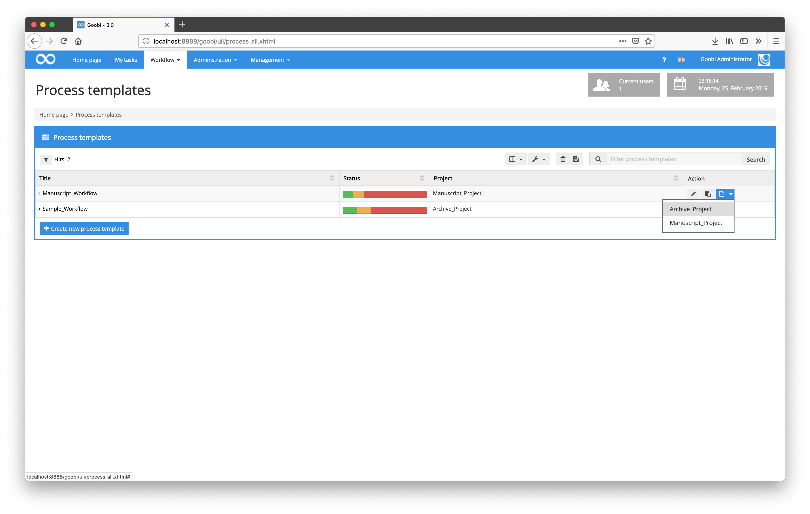

# May 2018

## Storage of file sizes within the Goobi database

In order to guarantee the possibility to generate further individual statistics, from now on the respective storage space within the database is also cached for the individual folders of each process. This avoids the repeated retrieval of memory sizes from the file system and thus ensures better support for storage systems such as S3.

[https://github.com/intranda/goobi/commit/90f694e5e41ee7c3eb4c86e7c7027c3461c3f43d](https://github.com/intranda/goobi/commit/90f694e5e41ee7c3eb4c86e7c7027c3461c3f43d)

## Batches can now have titles and a runtime

Until now, batches could only have one identifier. With the new developments, additional speaking and searchable titles can now be assigned.



These titles are thus also listed within the column for batches both in the processes and in the own tasks and can be filtered via the search filter `batch`.

```text
"batch:Vierte Lieferung"
```



If, in addition to a title, dates for start and end of runtime are also entered for batches, these batches are automatically visualized within the Goobi dashboard depending on your runtime and your actual progress.



[https://github.com/intranda/goobi/commit/1854d76fbfb8c6b268a8697c87e6fd1bb82c9bf4](https://github.com/intranda/goobi/commit/1854d76fbfb8c6b268a8697c87e6fd1bb82c9bf4) [https://github.com/intranda/goobi/commit/fb00653ddf3474a5a09ee7a282965d0bdf6efbc0](https://github.com/intranda/goobi/commit/fb00653ddf3474a5a09ee7a282965d0bdf6efbc0) [https://github.com/intranda/goobi/commit/35c181677742380a4f195088379a0503d91b4d6e](https://github.com/intranda/goobi/commit/35c181677742380a4f195088379a0503d91b4d6e)

## Process templates can now be used for multiple projects

Until now, a process template always belonged to a single project. As a result, the same process templates often had to exist several times for each project, even if their content was identical. With the new change within the user interface, this is no longer necessary. Within the button for using a process template, it is now possible to use the same process template for another project. Only those projects for which the current user has authorization are listed.



[https://github.com/intranda/goobi/commit/4437ceab503cee708b7a4e40497bd364b86d3242](https://github.com/intranda/goobi/commit/4437ceab503cee708b7a4e40497bd364b86d3242) [https://github.com/intranda/goobi/commit/c9edc5db6ba0ef810c4f49e0394577e527e8abd8](https://github.com/intranda/goobi/commit/c9edc5db6ba0ef810c4f49e0394577e527e8abd8) [https://github.com/intranda/goobi/commit/5f99d3810c940ad1f38b568eaecdcc4514b197dd](https://github.com/intranda/goobi/commit/5f99d3810c940ad1f38b568eaecdcc4514b197dd)