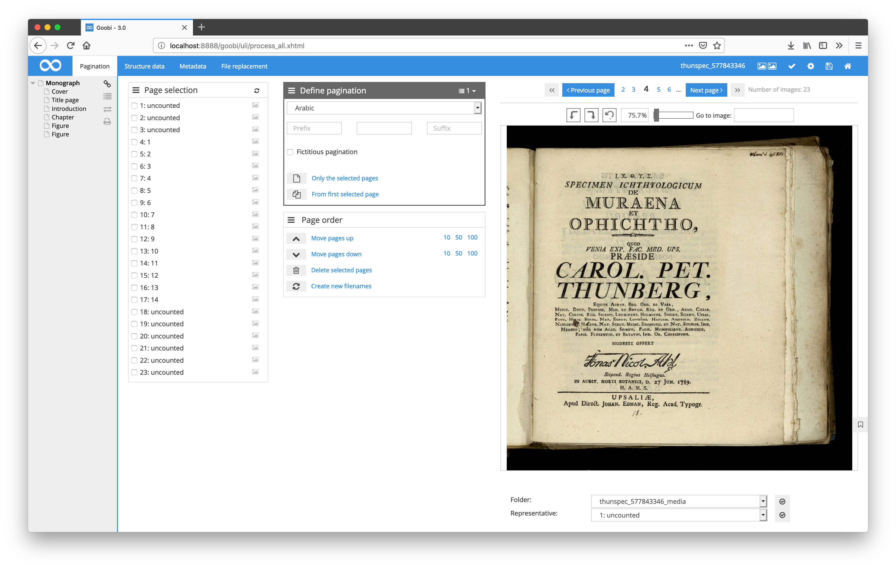

# June 2018

## New GoobiScript for editing metadata

There are now several new GoobiScripts for manipulating metadata within METS files. This GoobiScript, like all others, can be called and executed simultaneously for multiple operations. Among other things, it is possible to change, supplement or delete existing metadata in mass.

The new GoobiScripts look like the following:

```
action:metadataAdd field:MY_METADATA_FIELD value:MY_VALUE position:top_OR_child
action:metadataReplace field:MY_METADATA_FIELD search:OLD_VALUE replace:NEW_VALUE position:top_OR_child
action:metadataChange field:MY_METADATA_FIELD "prefix:MY_PREFIX" "suffix:MY_SUFFIX" position:top_OR_child "condition:MY_OPTIONAL_VALUE_THAT_SHOULD_BE_PRESENT"
action:metadataDelete field:MY_METADATA_FIELD value:MY_VALUE position:top_OR_child
```


[https://github.com/intranda/goobi/commit/315c0cf6d0169ead27db6358865434c8ab2dcd68](https://github.com/intranda/goobi/commit/315c0cf6d0169ead27db6358865434c8ab2dcd68) [https://github.com/intranda/goobi/commit/9a67111071953a77b33cb983f856f13fc5a74b8c](https://github.com/intranda/goobi/commit/9a67111071953a77b33cb983f856f13fc5a74b8c)

## New functionality for changing a workflow for a process that is already running

In order to configure a process afterwards to another workflow, it is now possible to execute this directly via a button without having to change a process manually step by step. Also the process does not have to be created again. Instead, if the user has the appropriate rights, the new workflow to be used is simply selected. All workflow steps already executed are set to the same status in their status in the new workflow, provided that they are also represented there with the same name.


It should be noted that the user must be a member of a user group that has the right  `Change process template later on`. If this right is missing, it must first be added to one of the user groups.


[https://github.com/intranda/goobi/commit/1981b70282afbc05ca233a41f3f56b182d70e826](https://github.com/intranda/goobi/commit/1981b70282afbc05ca233a41f3f56b182d70e826) [https://github.com/intranda/goobi/commit/f200bf9f8357d270f2c6698ec08fafe077a1d587](https://github.com/intranda/goobi/commit/f200bf9f8357d270f2c6698ec08fafe077a1d587) [https://github.com/intranda/goobi/commit/9ac738a64d1605d4606b462410751689d7c7e8ec](https://github.com/intranda/goobi/commit/9ac738a64d1605d4606b462410751689d7c7e8ec)

## New GoobiScript to change workflow for multiple running tasks

A new GoobiScript has been introduced in order to be able to change the workflow for several processes at the same time. The call of this GoobiScript is as follows:

```
action:changeProcessTemplate templateName:MyOtherProcessTemplate
```


[https://github.com/intranda/goobi/commit/40297d1b05c8b31197c4830a5d03522c0e008609](https://github.com/intranda/goobi/commit/40297d1b05c8b31197c4830a5d03522c0e008609)

## Zoom within the METS editor with percentage display

The image display within the METS editor has been extended to allow zoom using the zoom slider. At the same time, the current zoom level is displayed as a percentage value next to the zoom slider. In addition, the percentage value for the zoom can also be entered using the keyboard to directly obtain the desired magnification.



[https://github.com/intranda/goobi/commit/ad136df09f33b59adf92b82caba8d4523666052f](https://github.com/intranda/goobi/commit/ad136df09f33b59adf92b82caba8d4523666052f) [https://github.com/intranda/goobi/commit/e669135fc50282099def7e9d11b8106b7853229d](https://github.com/intranda/goobi/commit/e669135fc50282099def7e9d11b8106b7853229d)