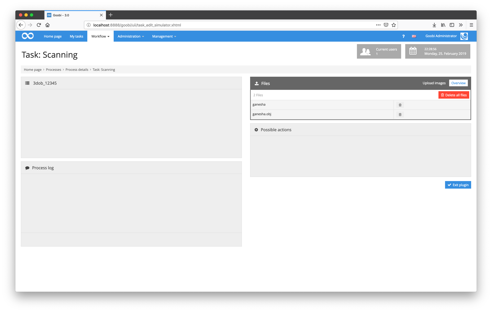
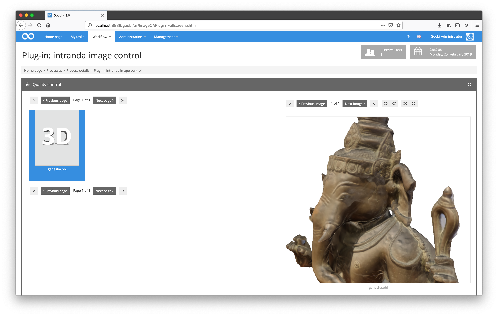
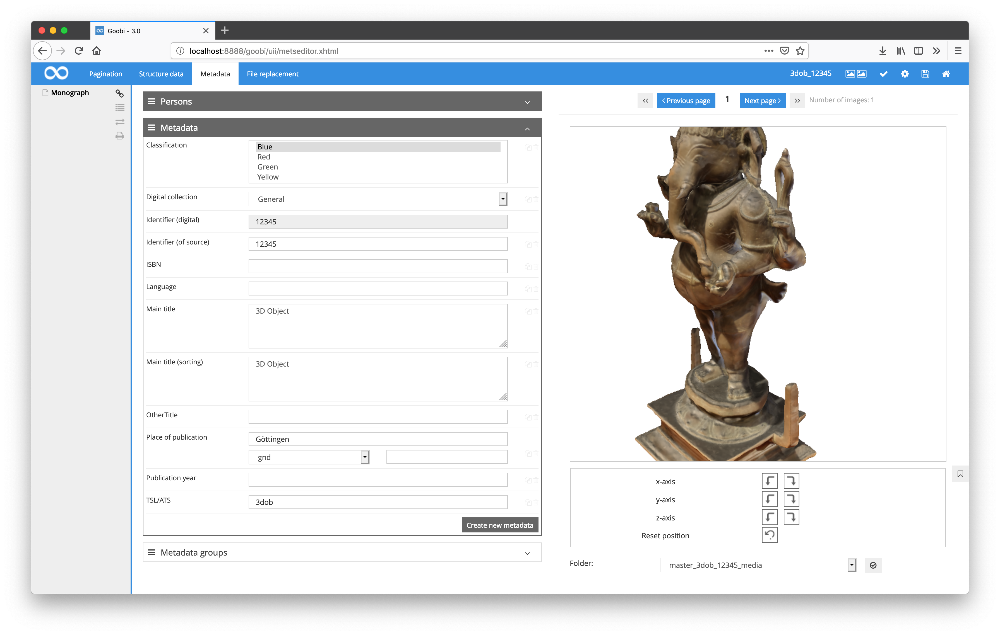

# July 2018

## Support of 3D objects in the entire workflow

After several months of work on support for processing and displaying 3D objects, the first milestone has now been reached. 3D objects are now supported in the entire workflow. This applies both to the upload of files and the display within the Image QA plug-in as well as the METS editor and the export to the Goobi viewer. This means that both Goobi workflow and Goobi viewer can now be used for 3D objects.

[https://github.com/intranda/goobi/commit/bfe18323b67fc7fb9fea159b38d661eb32fce518](https://github.com/intranda/goobi/commit/bfe18323b67fc7fb9fea159b38d661eb32fce518) [https://github.com/intranda/goobi/commit/df51c1d6cba86160937cbaad3c55daa4eb53a1d9](https://github.com/intranda/goobi/commit/df51c1d6cba86160937cbaad3c55daa4eb53a1d9) [https://github.com/intranda/goobi/commit/1a1d0ae7fca052835cf58dfc53dd6afbbf9d6652](https://github.com/intranda/goobi/commit/1a1d0ae7fca052835cf58dfc53dd6afbbf9d6652)