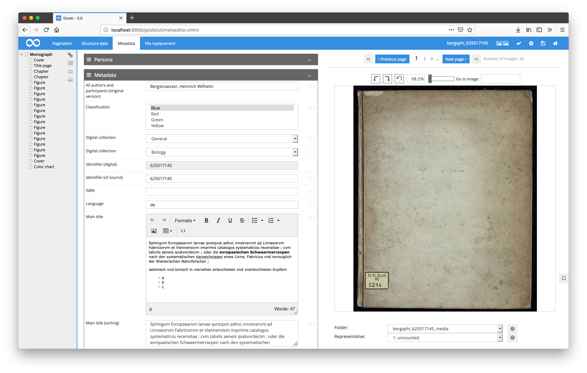
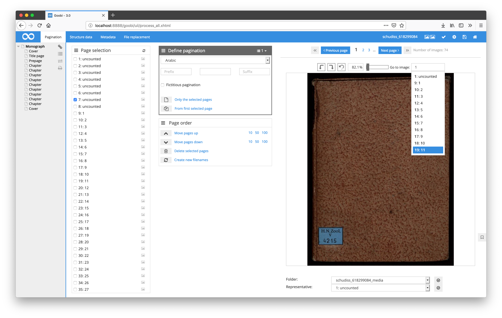

# August 2018

## Support of S3 as storage system for Goobi workflow

After several months of development, support for S3 as a storage system for Goobi workflow has now been integrated. This means that Goobi can now be operated within the Amazon Cloud using the appropriate storage structure.

[https://github.com/intranda/goobi/commit/ab154014f8e03ecc34973eacdd78a0564afe52cc](https://github.com/intranda/goobi/commit/ab154014f8e03ecc34973eacdd78a0564afe52cc) [https://github.com/intranda/goobi/commit/2f14bd25911d1715004dc93d3a9b863af8e1b316](https://github.com/intranda/goobi/commit/2f14bd25911d1715004dc93d3a9b863af8e1b316) [https://github.com/intranda/goobi/commit/b591884c3d234bffefe0a49aaac7e5b2f2119ec2](https://github.com/intranda/goobi/commit/b591884c3d234bffefe0a49aaac7e5b2f2119ec2) [https://github.com/intranda/goobi/commit/2c42756520a3365f078c3e94e77817edca3426f7](https://github.com/intranda/goobi/commit/2c42756520a3365f078c3e94e77817edca3426f7) [https://github.com/intranda/goobi/commit/9ef20712319f8a7b1bdad3bcb5b0dc6d4aa764ab](https://github.com/intranda/goobi/commit/9ef20712319f8a7b1bdad3bcb5b0dc6d4aa764ab)

## New type for editing fields in the METS editor

In addition to the existing editing fields such as InputBox, SelectBox, MultiSelectBox, TextArea and some others, a new type for editing metadata has been added to the METS Editor. This serves for the treatment of RichText data and permits thus a collection of texts including formatting defaults. The storage takes place thereby within the METS file as HTML.

The configuration of this new field type takes place within the file `goobi_metadataDisplayRules.xml` as an example:

```markup
  <htmlInput ref="TitleDocMain">
      <label></label>
  </htmlInput>
```



[https://github.com/intranda/goobi/commit/365f575e3ffd2f4fb6657f51a067be01ff5d7802](https://github.com/intranda/goobi/commit/365f575e3ffd2f4fb6657f51a067be01ff5d7802)

## Limiting requests to GND

In order to ensure that the Common Authority File (GND) of the German National Library continues to function correctly in the event that it cannot be accessed, the GND will now only be queried with a maximum of three attempts. In the event of faulty communication, further attempts and a further waiting period for the user are thus avoided.

[https://github.com/intranda/goobi/commit/5928186a80f72f632d48000d00ea9ff3b9817b36](https://github.com/intranda/goobi/commit/5928186a80f72f632d48000d00ea9ff3b9817b36)

## New GoobiScript for adding and changing properties

In addition to the existing GoobiScripts, there are now several new scripts for editing process properties. With these new calls, it is now possible to change or delete existing properties and add new properties for multiple tasks together.

```
action:propertySet name:PROPERTY_TITLE value:MY_VALUE
action:propertyDelete name:PROPERTY_TITLE
```


[https://github.com/intranda/goobi/commit/e75188caac225af59470f2943e8dfd67b84a6f56](https://github.com/intranda/goobi/commit/e75188caac225af59470f2943e8dfd67b84a6f56)

## Limiting the display of suggestions within the METS Editor

Within the METS editor, Goobi suggests content to the user for several fields. This suggestion list has now been optically limited to a certain height, so that it is still easy to use even with a large number of suggestions.



[https://github.com/intranda/goobi/commit/73bd0950899f177ca0ebd9ddb25e64b8f52426b0](https://github.com/intranda/goobi/commit/73bd0950899f177ca0ebd9ddb25e64b8f52426b0) [https://github.com/intranda/goobi/commit/6cbc17a50807a2f363f2da9dca3ae6c11f16a912](https://github.com/intranda/goobi/commit/6cbc17a50807a2f363f2da9dca3ae6c11f16a912)