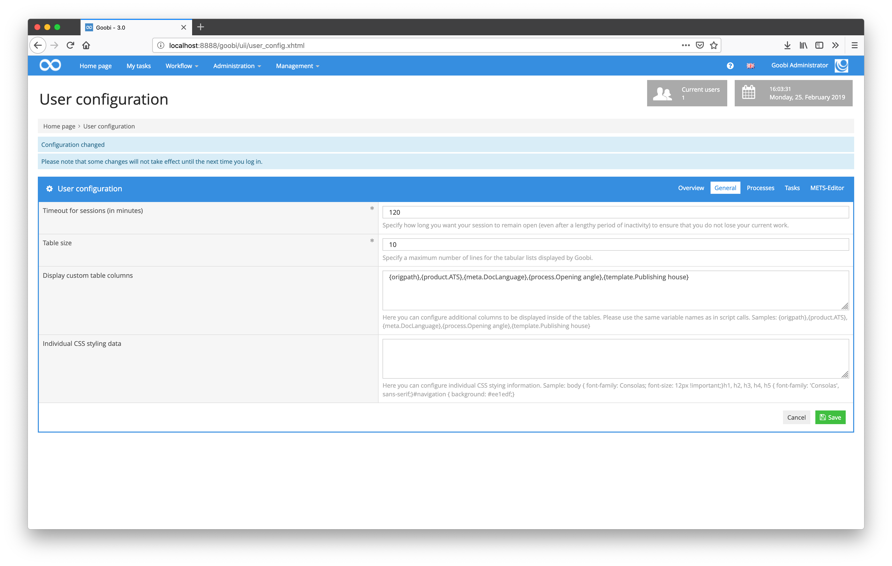

# September 2018

## Individual styling of Goobi

Goobi has been enhanced so that users can now influence the visual design. Using smaller CSS instructions, each user can now adjust colors, fonts, spacing and much more for his or her own interface.

```css
  body {
    font-family: Consolas;
    font-size: 12px !important;
  }
  h1, h2, h3, h4, h5 {
    font-family: 'Consolas', sans-serif;
  }
  #navigation {
    background: #ee1edf;
  }
```

The example configuration shown here is displayed within the user settings inside of the help text and results in a visual appearance as follows:


[https://github.com/intranda/goobi/commit/fb3bf47b208ebd8a57e4cb4599ec93f2b3f1a32c](https://github.com/intranda/goobi/commit/fb3bf47b208ebd8a57e4cb4599ec93f2b3f1a32c) [https://github.com/intranda/goobi/commit/48354ee6ea009aff7c35fd6317a97e7e17626cfa](https://github.com/intranda/goobi/commit/48354ee6ea009aff7c35fd6317a97e7e17626cfa)

## Freely configurable display of table columns

In addition to the table columns that Goobi usually displays, additional columns can now be displayed for each user. Each user can define this for himself within his own user configuration.



```text
{origpath},{product.ATS},{meta.DocLanguage},{process.Opening angle},{template.Publishing house}
```

The individual columns defined there are then used for the user within the process listing.


This setting is also used within the list of your own tasks.


## Increased performance for process list

By optimizing the database operations and massively reducing the number of checks within the file system, the overall speed of the Goobi user interface was drastically increased. This is particularly noticeable within the process list as well as in the task list.

[https://github.com/intranda/goobi/commit/b730873e5e6dbacb50a3173c278f12932eec1d94](https://github.com/intranda/goobi/commit/b730873e5e6dbacb50a3173c278f12932eec1d94) [https://github.com/intranda/goobi/commit/9da399a0c5eeb3ab5540a585022579ff8fb94175](https://github.com/intranda/goobi/commit/9da399a0c5eeb3ab5540a585022579ff8fb94175) [https://github.com/intranda/goobi/commit/82626f5900894c35d7e6ac4b36afff13734c4b9c](https://github.com/intranda/goobi/commit/82626f5900894c35d7e6ac4b36afff13734c4b9c)

## Improved performance when opening the metadata editor

When reading the data for the metadata editor, some nested loops with file system operations were removed. This has made opening the Metadata Editor much faster, especially for large items.

[https://github.com/intranda/goobi/commit/edd49559719ff7c335c131e1952f306746b74a08](https://github.com/intranda/goobi/commit/edd49559719ff7c335c131e1952f306746b74a08)

## Dockets can be downloaded within tasks

Printing the dockets is now not only possible after creating processes, but can now be done as a separate step. The checkbox `Print docket` must be activated in the step details.


In the accepted task, an additional button for printing the docket is now available.


[https://github.com/intranda/goobi/commit/03e38a7fa23025e2d0727b703588a7799e34bc06](https://github.com/intranda/goobi/commit/03e38a7fa23025e2d0727b703588a7799e34bc06) [https://github.com/intranda/goobi/commit/7547ef2c301740497e72cb94c8b9807caf7e3231](https://github.com/intranda/goobi/commit/7547ef2c301740497e72cb94c8b9807caf7e3231)

## Revision of the usability for the METS-Editor

The METS Editor has been redesigned so that the image display makes optimum use of the available space. For this purpose, the entire structure of the METS Editor has been adapted so that all elements are displayed responsive. This allows not only a better display of the image container, but also an operation on mobile devices with smaller screen sizes.

[https://github.com/intranda/goobi/commit/138e25e56ceed14c89cee494d98032afe28e954a](https://github.com/intranda/goobi/commit/138e25e56ceed14c89cee494d98032afe28e954a) [https://github.com/intranda/goobi/commit/71ff70b42029d7058d9b55109ba9bef9a820c1a6](https://github.com/intranda/goobi/commit/71ff70b42029d7058d9b55109ba9bef9a820c1a6) [https://github.com/intranda/goobi/commit/625a7d7984333880271484e999f2273263d7dacd](https://github.com/intranda/goobi/commit/625a7d7984333880271484e999f2273263d7dacd)