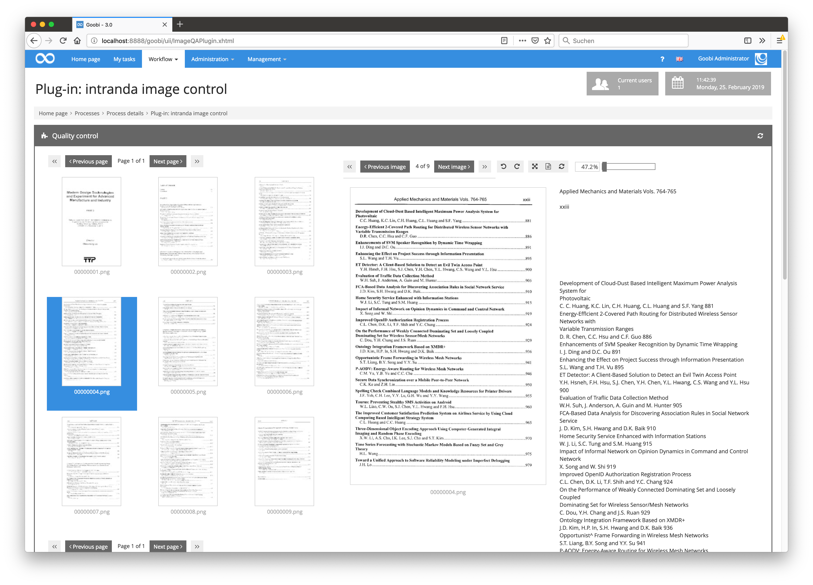

# October 2018

## Optimized image display within the METS editor

The metadata editor has been reworked for a better image display. In particular for the ideal display with consideration of image height and image width an optimization was once again carried out. Among other things, the zoom as well as a percentage display of the image size has been made possible.


[https://github.com/intranda/goobi/commit/4e9c2723cb7d1e336c6ae56ba2c34b5026cb378d](https://github.com/intranda/goobi/commit/4e9c2723cb7d1e336c6ae56ba2c34b5026cb378d) [https://github.com/intranda/goobi/commit/138e25e56ceed14c89cee494d98032afe28e954a](https://github.com/intranda/goobi/commit/138e25e56ceed14c89cee494d98032afe28e954a) [https://github.com/intranda/goobi/commit/625a7d7984333880271484e999f2273263d7dacd](https://github.com/intranda/goobi/commit/625a7d7984333880271484e999f2273263d7dacd) [https://github.com/intranda/goobi/commit/ebfa7fa3ef743f4546a21b8551847c4ef2a96793](https://github.com/intranda/goobi/commit/ebfa7fa3ef743f4546a21b8551847c4ef2a96793)

## New Authentication Configuration for the REST API

A completely new and much more flexible authentication configuration has been created for the `REST API`. From now on, this configuration allows the locking and releasing of individual HTTP methods (`GET`, `POST`, etc.).

A sample configuration with a `regular expression` for the path and the corresponding netmasks can be seen here. It only allows PUT requests against any path that matches the regular expression.

```markup
<config>
<endpoint path="/processes/\d*?/properties/.*?">
    <method name="put">
        <allow netmask="127.0.0.1/32" token="geheim" />
        <allow netmask="192.168.178.0/24" token="geheim" />
        <allow netmask="0:0:0:0:0:0:0:1/128" token="geheim" />
    </method>
</endpoint>
</config>
```

[https://github.com/intranda/goobi/commit/b85f2af5ab550220ebadea1cda0563bba57a3398](https://github.com/intranda/goobi/commit/b85f2af5ab550220ebadea1cda0563bba57a3398)

## Simple CORS configuration for the REST API

The new configuration also allows the easy acceptance of `cross-origin` requests from the browser. The following example configuration shows the activation of CORS requests from the domain as for example `https://intranda.com` with the methods `GET` and `POST`.

The actual `GET` and `POST` calls are allowed without IP and token restrictions.

```markup
<endpoint path="/processes/search">
    <cors>
        <method>GET</method>
        <method>POST</method>
        <origin>https://intranda.com</origin>               
    </cors>
    <method name="get">
        <allow />
    </method>
    <method name="post">
        <allow />
    </method>
</endpoint>
```

[https://github.com/intranda/goobi/commit/eb53974280cfd2d5c1d6ae42c0944e0d44a0a1a8](https://github.com/intranda/goobi/commit/eb53974280cfd2d5c1d6ae42c0944e0d44a0a1a8) [https://github.com/intranda/goobi/commit/85413db9a024f55cbec47f704257297b51eab413](https://github.com/intranda/goobi/commit/85413db9a024f55cbec47f704257297b51eab413)

## Display of full texts within the Image QA plugin

The plugin for the quality control of digitized material has been reworked so that now the full text can be displayed in addition to the images, if it already exists. For this, the workflow must of course be configured in such a way that full text recognition must have taken place beforehand.



[https://github.com/intranda/goobi-plugin-step-imageqa/commit/847076ebd0728e7e44f037c83180e36c1ec193e2](https://github.com/intranda/goobi-plugin-step-imageqa/commit/847076ebd0728e7e44f037c83180e36c1ec193e2) [https://github.com/intranda/goobi-plugin-step-imageqa/commit/f23ed047d1d81e6b54269ffb785ebae952ec7538](https://github.com/intranda/goobi-plugin-step-imageqa/commit/f23ed047d1d81e6b54269ffb785ebae952ec7538) [https://github.com/intranda/goobi-plugin-step-imageqa/commit/dd124f738e9143fb34d0e4750307ff162812c0e2](https://github.com/intranda/goobi-plugin-step-imageqa/commit/dd124f738e9143fb34d0e4750307ff162812c0e2) [https://github.com/intranda/goobi-plugin-step-imageqa/commit/705bb11d91d996fd7552208d18b458587bd4372e](https://github.com/intranda/goobi-plugin-step-imageqa/commit/705bb11d91d996fd7552208d18b458587bd4372e)