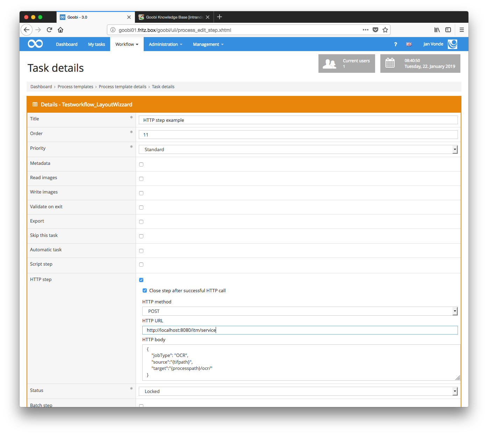

# November 2018

## Final conversion to maven as build-tool

After extensive testing, the internal management of program libraries and interaction with the 170 plug-ins currently available were converted to [Maven](https://maven.apache.org/). This allows for easier use of repeatedly required functionalities via integrated modules and libraries. As in the past, the switch from [Ant](https://ant.apache.org/) to Maven still allows the `*.war` file and a `*.jar` file to be compiled that can be installed in an application server such as [Apache Tomcat](http://tomcat.apache.org/).

With the pom.xml available within Maven projects, it is now relatively easy for anyone interested to download and compile a Goobi from Github themselves, or to develop one themselves with commands such as:

```bash
git clone https://github.com/intranda/goobi.git
mvn install
```

These calls download the source code of Goobi from Github and compile it afterwards. The file `goobi.war` existing in the `module-war/target/` directory can then be installed in the application server.

[https://github.com/intranda/goobi/commit/12558bc5279245ca9728558e3315edb59ee2a471](https://github.com/intranda/goobi/commit/12558bc5279245ca9728558e3315edb59ee2a471) [https://github.com/intranda/goobi/commit/dc0c53a55dc7c89ca3e23191013f6dcfd6eb8fc7](https://github.com/intranda/goobi/commit/dc0c53a55dc7c89ca3e23191013f6dcfd6eb8fc7) [https://github.com/intranda/goobi/commit/38e26c12a78eb6577e1fb8dbe152926aa039403b](https://github.com/intranda/goobi/commit/38e26c12a78eb6577e1fb8dbe152926aa039403b) [https://github.com/intranda/goobi/commit/6f8467a0384249c4a7762ff15bc596ba92be8ecd](https://github.com/intranda/goobi/commit/6f8467a0384249c4a7762ff15bc596ba92be8ecd) [https://github.com/intranda/goobi/commit/7b9aea59178caef8524b1b02a47031c4193fbfee](https://github.com/intranda/goobi/commit/7b9aea59178caef8524b1b02a47031c4193fbfee) [https://github.com/intranda/goobi/commit/64a54a6e7d08f358e9c598ae8dcbf530c8802bf1](https://github.com/intranda/goobi/commit/64a54a6e7d08f358e9c598ae8dcbf530c8802bf1)

## New step type for HTTP calls

Goobi has been enhanced for a new step type: the `HTTP step`. `GET`, `POST` and `PUT` requests can be executed automatically here.

If the call is successful and the status code `20x` is returned, the work step (if configured in this way) is closed. Any error messages that occur are stored in the process log and can therefore be traced afterwards.

The following screenshot shows an example configuration for calling the TaskManager OCR plugin:



The configuration used here uses POST and sends it to the address `http://localhost:8080/itm/service`:

```javascript
{
  "jobType":"OCR",
  "source":"{tifpath}",
  "target":"{processpath}/ocr/"
}
```

[https://github.com/intranda/goobi/commit/0a16484b60b3939ba4a79d66b630db5b40537cf6](https://github.com/intranda/goobi/commit/0a16484b60b3939ba4a79d66b630db5b40537cf6) [https://github.com/intranda/goobi/commit/b5be4c238e7ff1da81ac78ecd52fc45e6d0669db](https://github.com/intranda/goobi/commit/b5be4c238e7ff1da81ac78ecd52fc45e6d0669db)

## Support of JSON Web Tokens for accessing the REST API

Goobi workflow now supports the ability to create JSON Web Tokens (JWT) that allow access to the API for a specified time. These JWTs are provided as variables within HTTP calls. So far the JWT `{changesteptoken}` already exists, which allows to change a certain work step.

[https://github.com/intranda/goobi/commit/d17380c341ebb4dbe1112f3e5834aa7232290a51](https://github.com/intranda/goobi/commit/d17380c341ebb4dbe1112f3e5834aa7232290a51)