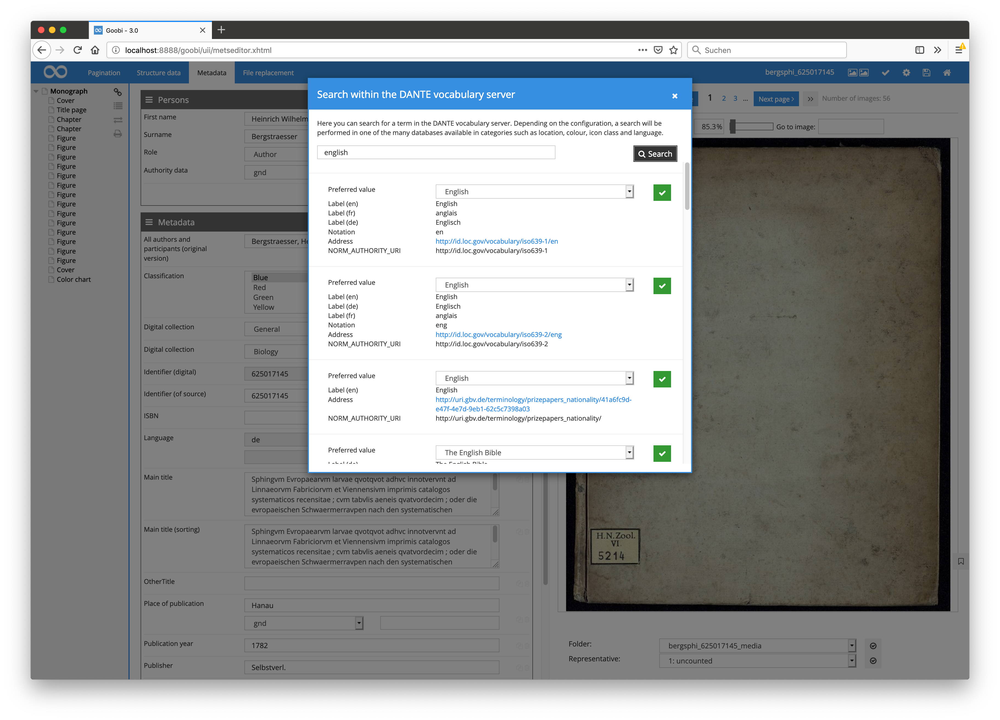
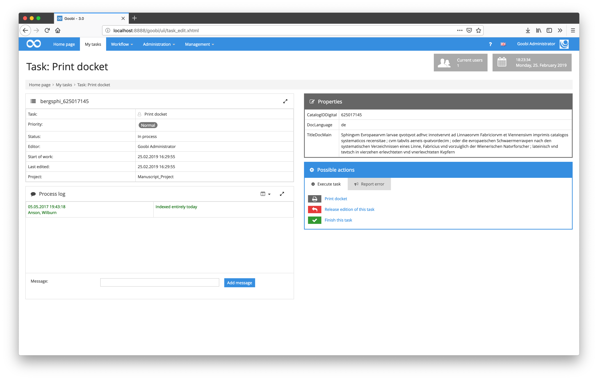
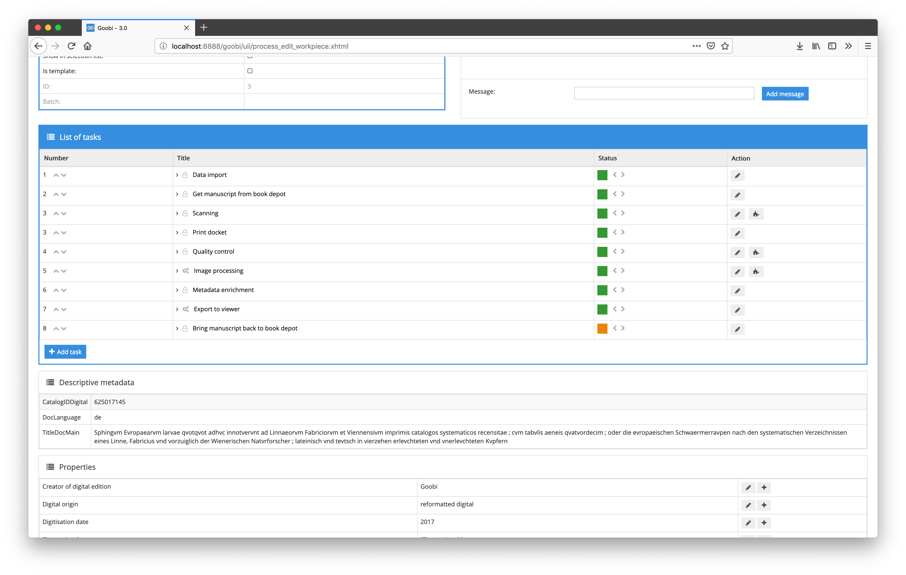
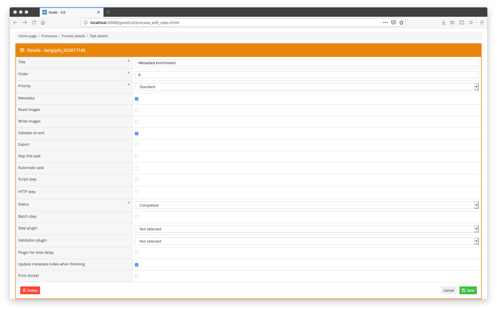

# December 2018

## Extended support of standard data via DANTE

In addition to the metadata fields for texttareas, select menus, read-only fields or the connection of [GeoNames](https://www.geonames.org/) and [GND](https://www.dnb.de/DE/Standardisierung/GND/gnd_node.html), which have been available for a long time, the [GBV DANTE standard data](https://dante.gbv.de/) service has been connected. Dante currently provides [about 90 different vocabularies](http://api.dante.gbv.de/voc) which can all be used with this revised implementation.

To use the DANTE API the file `goobi_metadataDisplayRules.xml` must be extended by the following configuration:


```markup
<!-- dante configuration for the metadata field DocLanguage-->
<dante ref="DocLanguage">
    <!-- name of the vocabulary, a list of all vocabularies can be found here:  http://api.dante.gbv.de/voc, the vocabulary name can be found inside of the element notation -->
    <source>languages_gnd</source>
    <!-- the list of fields to import the value from. The list is ordered and the first value that was found will be used for the display. Can be overwritten inside of the UI -->
    <field>NORM_LABEL_de, NORM_LABEL_en, NORM_LABEL_fr, NORM_LABEL_es</field>
</dante>
```


The field configured in each case is then available in the METS editor. The search form is opened by means of the magnifying glass icon so that the desired value can be entered within the selected standard data vocabulary. The desired hit can then be selected from the displayed search hit list. Within the desired hit, the value to be imported can also be selected from a selection list and confirmed by clicking on the green button.



[https://github.com/intranda/goobi/commit/b330b9b481939a48cdaca470d353ae2507beb753](https://github.com/intranda/goobi/commit/b330b9b481939a48cdaca470d353ae2507beb753) [https://github.com/intranda/goobi/commit/d61f25f75fd4398e4c3843232500ce8bf2be763c](https://github.com/intranda/goobi/commit/d61f25f75fd4398e4c3843232500ce8bf2be763c) [https://github.com/intranda/goobi/commit/24443bafcef10212d99c4ad33cfa23e11ed03793](https://github.com/intranda/goobi/commit/24443bafcef10212d99c4ad33cfa23e11ed03793) [https://github.com/intranda/goobi/commit/cf9b0993f64cf807e9c039657008425c207ad5cb](https://github.com/intranda/goobi/commit/cf9b0993f64cf807e9c039657008425c207ad5cb)

## Correction of the determination of directory sizes when using S3

The integration of [Amazon S3](https://de.wikipedia.org/wiki/Amazon_S3) as a storage system for storing large amounts of data has already made massive progress in recent months. During this work, further improvements and error corrections were always necessary. In addition to a reduction of file accesses, the determination of directory sizes, which did not always provide correct results when using S3, has also been revised.

[https://github.com/intranda/goobi/commit/152e3787d5dd9651b5e9f65a0be8cb454e0b0c54](https://github.com/intranda/goobi/commit/152e3787d5dd9651b5e9f65a0be8cb454e0b0c54) [https://github.com/intranda/goobi/commit/8c8d6e48660e78058751fa3da688453024c08ba5](https://github.com/intranda/goobi/commit/8c8d6e48660e78058751fa3da688453024c08ba5)

## New plugin for importing province data from the GBV catalogue

If province data have already been entered in the [GBV catalogue](http://gso.gbv.de), they can now be imported as well. Since this metadata is not contained within the MARC record, it cannot be imported during the initial import of the metadata. The import therefore takes place in a second step. For this purpose, the `EPN` of the `A-record` is used to search for the corresponding `Pica+` record. The system then checks whether provenance data is available for the copy used. This check takes place by matching the `EPN` in field `092B$2` and the library symbol in field `092B$1`.

To be able to use the plugin, a metadata group `Provenience` must exist in the rule record:


```markup
<MetadataType>
    <Name>ProvenienceCode</Name>
    <language name="de">Code</language>
    <language name="en">ProvenienceCode</language>
  </MetadataType>
  <MetadataType normdata="true">
    <Name>ProveniencePrevOwner</Name>
    <language name="de">Besitzer</language>
    <language name="en">ProveniencePrevOwner</language>
  </MetadataType>
  <MetadataType>
    <Name>ProvenienceCharacteristic</Name>
    <language name="de">Characteristik</language>
    <language name="en">ProvenienceCharacteristic</language>
  </MetadataType>
  <MetadataType>
    <Name>ProvenienceDate</Name>
    <language name="de">Datum</language>
    <language name="en">ProvenienceDate</language>
  </MetadataType>
  <MetadataType>
    <Name>ProvenienceExplanation</Name>
    <language name="de">Erläuterung</language>
    <language name="en">ProvenienceExplanation</language>
  </MetadataType>
  <MetadataType>
    <Name>ProvenienceGND</Name>
    <language name="de">GND</language>
    <language name="en">ProvenienceGND</language>
  </MetadataType>
  <Group>
    <Name>Provenience</Name>
    <language name="de">Provenienz</language>
    <language name="en">Provenience</language>
    <metadata>ProvenienceCode</metadata>
    <metadata>ProveniencePrevOwner</metadata>
    <metadata>ProvenienceCharacteristic</metadata>
    <metadata>ProvenienceDate</metadata>
    <metadata>ProvenienceExplanation</metadata>
    <metadata>ProvenienceGND</metadata>
  </Group>
```


Further adjustments are not necessary. The plugin itself is part of the collection `goobi-plugin-opac-marc.jar` and can be accessed via the name `HaabProvenienceOpac`. An activation within the configuration file `goobi_opac.xml` is not possible, because the plugin only delivers the provenance metadata and no structural elements are created. To integrate it into the workflow as a step after the initial import, the step plug-in `intranda_step_provenience_request` from the `goobi-plugin-step-catalogue-request` repository is also required.

## Import EAD records directly into Goobi

Goobi is now able to import individual records from EAD find books. To do this, the EAD data records available in XML are periodically imported into the [BaseX XML](http://basex.org/) database. From now on, this database serves as a dynamically updated EAD memory and can be queried with the help of a special OPAC plug-in via the `RESTXQ` query language instead of a typical library catalog.

The special feature compared to a normal XML-based import is that the tectonics of the find book are preserved, since they are also stored within the XML database. If the tectonics is changed and the previously imported data record is moved to another structure, then only the EAD file must be read into the XML database in updated form. Since the identifiers of the data records are retained, presentation software such as the Goobi viewer, which also has access to this EAD memory, can query the current status of the tectonics live.

Further detailed information about the implementation including installation instructions can be found here:

[https://docs.intranda.com/goobi-workflow-plugins-de/opac-plugins/opac-ead](https://docs.intranda.com/goobi-workflow-plugins-de/opac-plugins/opac-ead)

## Display metadata within tasks and in task details

Goobi workflow has been enhanced to allow you to display specific metadata from the METS file within individual accepted tasks as well as properties.



The display of this metadata integrates itself into the range of properties that can also be displayed and edited and can be individually configured for each task of individual workflows. Such a configuration looks like the following within the file `goobi_processProperties.xml`:


```markup
<metadata name="CatalogIDDigital">
    <project>*</project>
    <showStep name="Print docket" />
</metadata>
<metadata name="DocLanguage">
    <project>*</project>
    <showStep name="Print docket" />
</metadata>
<metadata name="TitleDocMain">
    <project>*</project>
    <showStep name="Print docket" />
</metadata>
```


The display of descriptive metadata is also possible within the process details. For this purpose, a new area has been created below the tasks that lists these metadata.



With the help of this new functionality and future developments, redundant storage of some metadata will become superfluous in the future. From now on, information that is currently still available as a property as well as within the METS file can only be stored in the METS file and read from there. It is important that the checkbox `Update metadata index when finishing` is activated within the individual tasks of the workflow to ensure efficient caching of the data from the METS file for display.



For a complete update of the cache for the fast display of this metadata within the web interface, the existing GoobiScript `updateDatabaseCache` can of course also be called for several processes simultaneously.


[https://github.com/intranda/goobi/commit/0314dfccedf39d3d5d082c66562d1af3a62d47a4](https://github.com/intranda/goobi/commit/0314dfccedf39d3d5d082c66562d1af3a62d47a4) [https://github.com/intranda/goobi/commit/6218226341bdce689b178fdb3aef0bdf297f9b59](https://github.com/intranda/goobi/commit/6218226341bdce689b178fdb3aef0bdf297f9b59) [https://github.com/intranda/goobi/commit/2a278d03a20c3ce22f494b22fbab74a6ef67c36e](https://github.com/intranda/goobi/commit/2a278d03a20c3ce22f494b22fbab74a6ef67c36e) [https://github.com/intranda/goobi/commit/0c50c0401606eeadfc9b3ab33fa55d29b16c7346](https://github.com/intranda/goobi/commit/0c50c0401606eeadfc9b3ab33fa55d29b16c7346) [https://github.com/intranda/goobi/commit/68750e1858ec0a51353110e31c863db02be2291d](https://github.com/intranda/goobi/commit/68750e1858ec0a51353110e31c863db02be2291d)