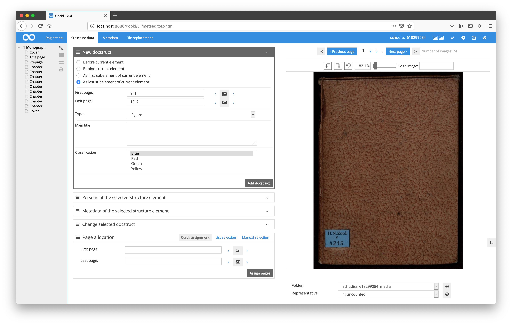
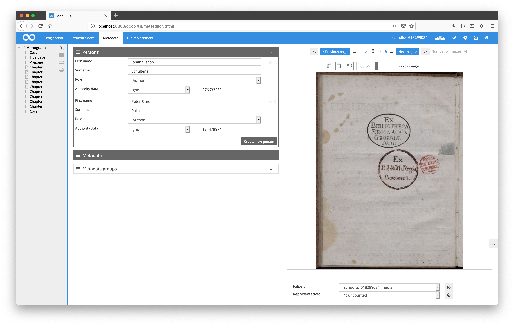
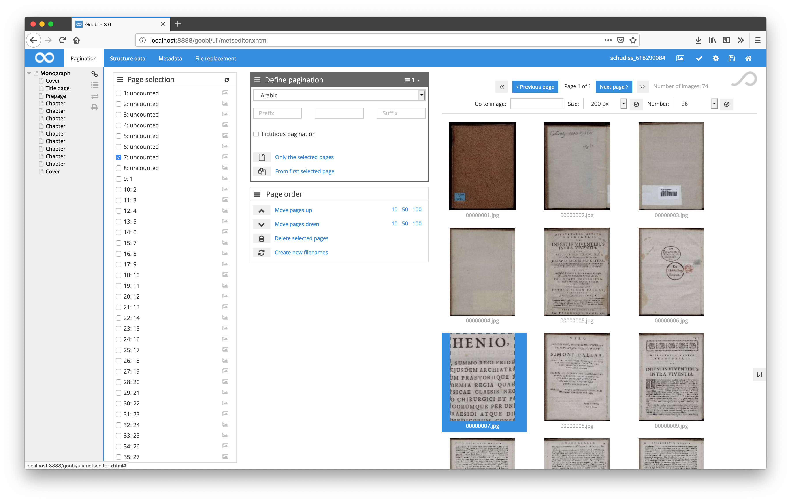
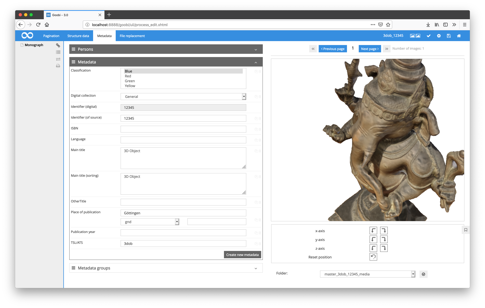
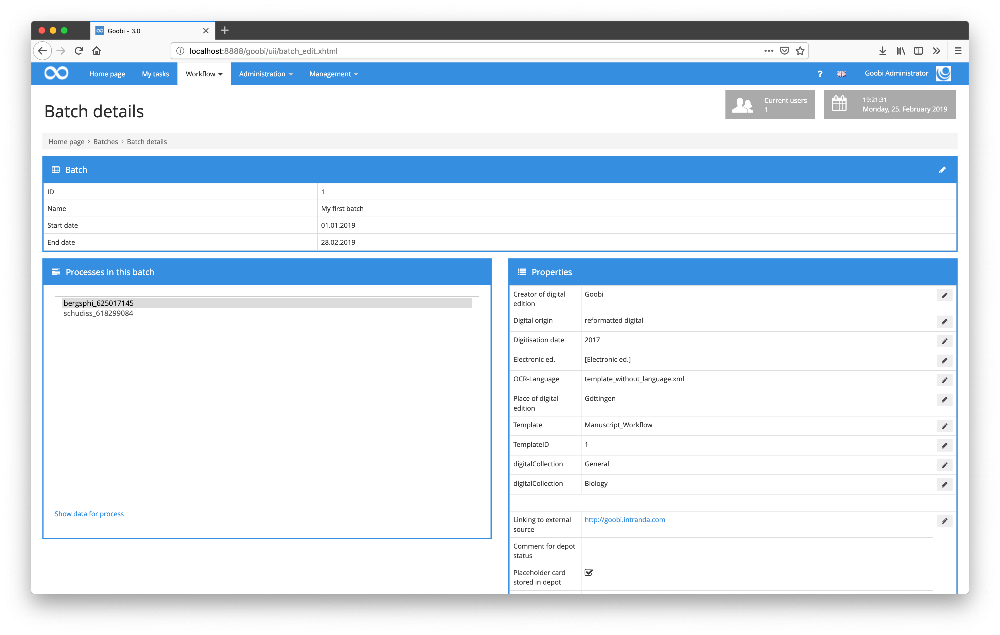

# January 2019

## Usability adjustments for the boxes within the METS Editor

Within Goobi's METS editor, there were a few minor improvements in usability. For example, the title bars of the boxes can now be clicked across the entire width to open or close them. Previously this was only possible by clicking the icons in the title bar on the right.

As a result of this change, the operating logic for adding people and metadata has also been adapted to the other areas of Goobi workflow. The previous button within the title bar of the boxes is now located within the boxes in the lower right area, as in the other areas before.

[https://github.com/intranda/goobi/commit/6aa0ff7145390eb26a724219d65cdee3601d1961](https://github.com/intranda/goobi/commit/6aa0ff7145390eb26a724219d65cdee3601d1961) [https://github.com/intranda/goobi/commit/10e2d95d5aaca0926260827c7ef48f7961cb4b3b](https://github.com/intranda/goobi/commit/10e2d95d5aaca0926260827c7ef48f7961cb4b3b)

## Revision of the image display when manipulating the image stack

If changes are made to the sequence of images using the functions provided by Goobi for intervening in the image stack, the display of the opened image is now reloaded correctly. In addition, the logic for browsing through the thumbnail pages has also been revised so that the operation is more intuitive.

[https://github.com/intranda/goobi/commit/f7c192c28f12f1c2621de96f2f66a867a68adaaf](https://github.com/intranda/goobi/commit/f7c192c28f12f1c2621de96f2f66a867a68adaaf) [https://github.com/intranda/goobi/commit/314aea5646bad8452de2a6c16ab6a707640e622c](https://github.com/intranda/goobi/commit/314aea5646bad8452de2a6c16ab6a707640e622c)

## Rotation of 3D objects in the METS Editor

The correct center point is now used for the correct rotation of 3D objects within the METS Editor. This prevents the object from leaving the visible area of the object display during rotation.

[https://github.com/intranda/goobi/commit/c0f24fa18e45a3c7c0a0a3da2ebf80c2fdf0fa63](https://github.com/intranda/goobi/commit/c0f24fa18e45a3c7c0a0a3da2ebf80c2fdf0fa63)

## Correction for the properties of batches

A behavior error occurred within the processing of properties for batches, so that the processed properties were incorrectly duplicated. This behavior has now been configured.

[https://github.com/intranda/goobi/commit/bf2e47d48af47686134fa03d0b4969bea7ed55a8](https://github.com/intranda/goobi/commit/bf2e47d48af47686134fa03d0b4969bea7ed55a8)

## Adaptation of path specifications for goobi-to-go

Due to the increasing distribution of Goobi-to-go, the need for compatibility with different operating systems is also increasing. Especially the operating system Windows has to be considered with some special features. For this reason, some path specifications have been revised, especially for handling images within the METS editor, and are therefore easier to maintain in the long term.

[https://github.com/intranda/goobi/commit/1f7f95846e9535bcddc50462b4e81b78e752d079](https://github.com/intranda/goobi/commit/1f7f95846e9535bcddc50462b4e81b78e752d079)

## Updating the English user interface of Goobi workflow

All user interface texts that have not yet been translated into English have been checked, translated and imported by the English translator.

[https://github.com/intranda/goobi/commit/1d55539c2c3ccd114ce65c48eb6e91897424420b](https://github.com/intranda/goobi/commit/1d55539c2c3ccd114ce65c48eb6e91897424420b) [https://github.com/intranda/goobi/commit/5c614ed06f7cbca2959f1285c282867a187e80ee](https://github.com/intranda/goobi/commit/5c614ed06f7cbca2959f1285c282867a187e80ee)