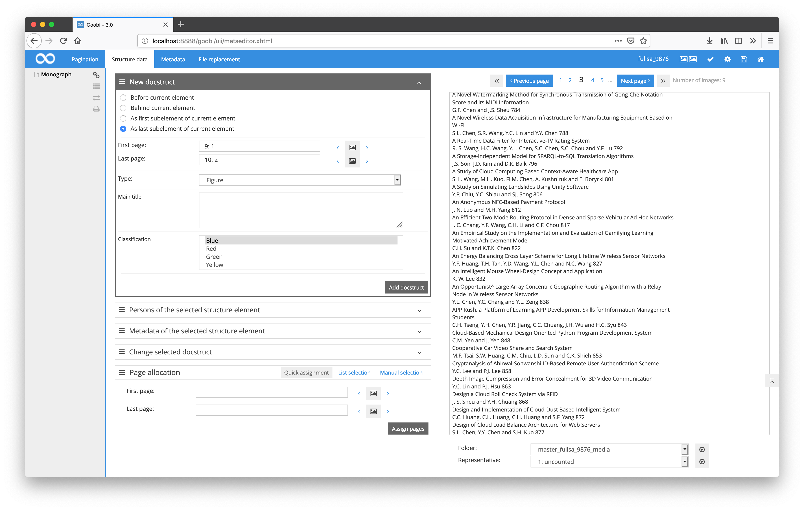
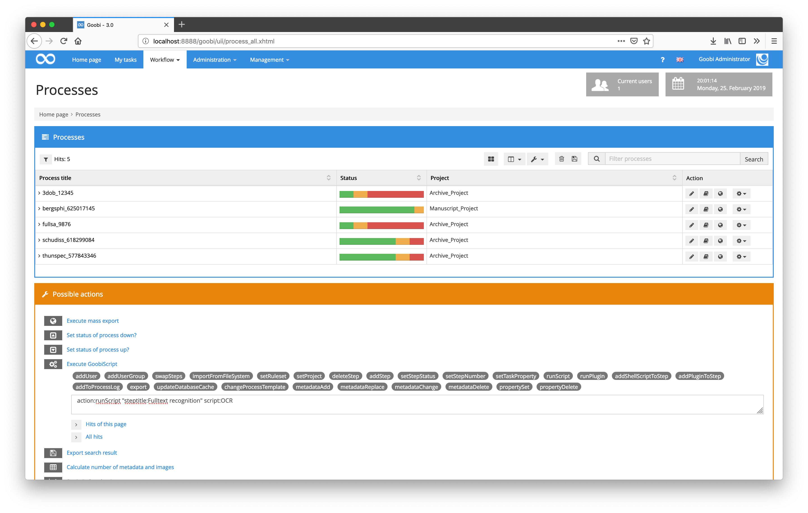
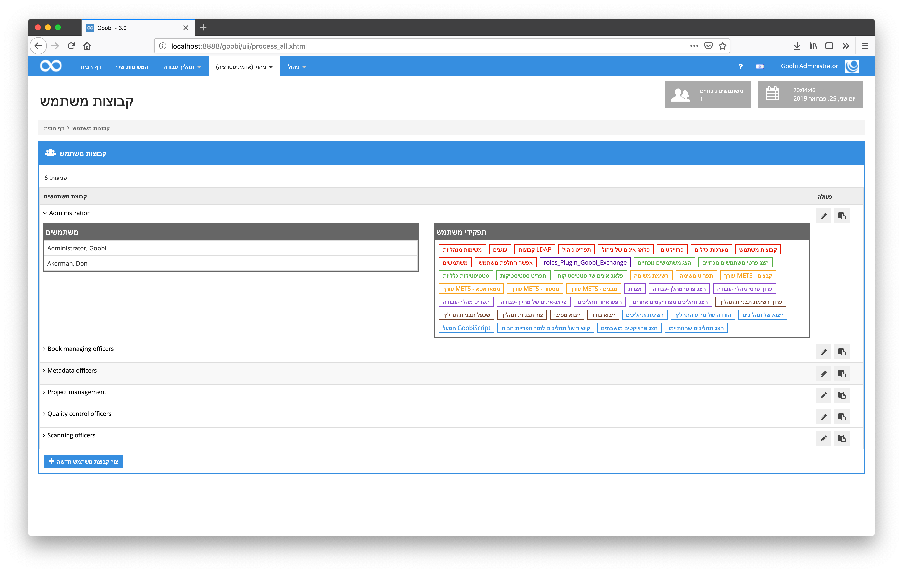
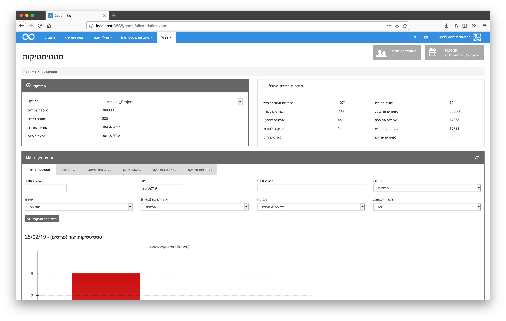
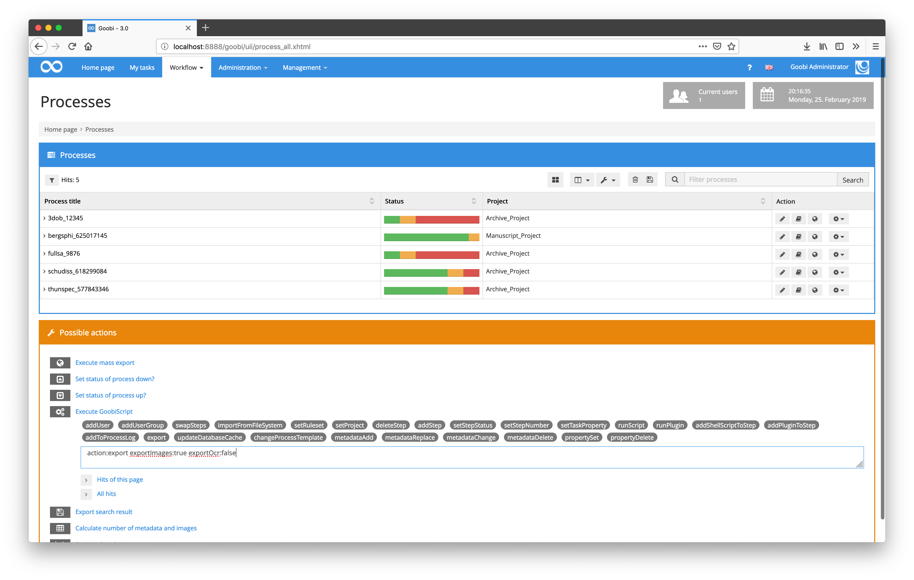

# February 2019

## Display of longer OCR results within the METS editor now scrollable

If the results of a full-text recognition were displayed within the METS editor, the full-text recognition has been abbreviated for longer texts. This display has now been adapted so that even longer texts can be displayed without problems by making the associated container scrollable from now on.

[https://github.com/intranda/goobi/commit/888509510484574b10264ce7929260744515a944](https://github.com/intranda/goobi/commit/888509510484574b10264ce7929260744515a944)

## GoobiScript result display extended for special return values

Goobi has long been able to handle the various return values of the called programs and handle the workflow accordingly, especially when communicating with external programs that perform long-running tasks. However, the processing of `GoobiScript` to call such external programs in mass for several processes together could not yet correctly handle these return values and mistakenly indicated them as incorrect calls. This has now been corrected so that the return values `98` and `99` are also successfully evaluated and are therefore no longer displayed as errors within GoobiScript.

[https://github.com/intranda/goobi/commit/5e713f5d04f936506f351bec51de92e707d19604](https://github.com/intranda/goobi/commit/5e713f5d04f936506f351bec51de92e707d19604) [https://github.com/intranda/goobi/commit/9ce09f6c6410b820661e1d556364c8dc345101a1](https://github.com/intranda/goobi/commit/9ce09f6c6410b820661e1d556364c8dc345101a1) [https://github.com/intranda/goobi/commit/a0f1f211566e3e737e4db694395f65b65d1f2b89](https://github.com/intranda/goobi/commit/a0f1f211566e3e737e4db694395f65b65d1f2b89)

## Hebrew user interface 

Thanks to the collaboration with the [National Library of Israel](http://nli.org.il/), Goobi workflow is now fully available in Hebrew.

[https://github.com/intranda/goobi/commit/b41194ad3ee350177a4ce95f0ec0e27a89f9f608](https://github.com/intranda/goobi/commit/b41194ad3ee350177a4ce95f0ec0e27a89f9f608)

## Unification within JavaScript files for 3D objects

A number of JavaScript files for handling 3D objects have been standardized for better maintainability and better interaction between Goobi workflow and Goobi viewer. This is particularly beneficial for the maintainability and training of other Goobi developers.

[https://github.com/intranda/goobi/commit/eaaac77efd856e05a88f7ac39de9b9c8ffe01ab2](https://github.com/intranda/goobi/commit/eaaac77efd856e05a88f7ac39de9b9c8ffe01ab2) [https://github.com/intranda/goobi/commit/32b2e99172a6e31d03b0b3279b01dd02965722de](https://github.com/intranda/goobi/commit/32b2e99172a6e31d03b0b3279b01dd02965722de) [https://github.com/intranda/goobi/commit/76629353b0773e7425203114c65200ac96787e13](https://github.com/intranda/goobi/commit/76629353b0773e7425203114c65200ac96787e13)

## Correction of GoobiScript for export to Goobi viewer

Within the GoobiScript for exporting processes to the Goobi viewer, there was a small error that caused OCR results to be exported, even if this was disabled in the call. This behavior has now been corrected and intensively checked again.

[https://github.com/intranda/goobi/commit/d7864a6d06a648c20f4f1ec769ec00ffb7b541f8](https://github.com/intranda/goobi/commit/d7864a6d06a648c20f4f1ec769ec00ffb7b541f8)

## Correction for export of Goobi operations when searching for batch titles

When generating exports such as Excel files, incorrect results occurred if the search query was filtered by batch title. This behavior is now corrected.

[https://github.com/intranda/goobi/commit/9a94b8f63720951316934704dfbbf24eb6944914](https://github.com/intranda/goobi/commit/9a94b8f63720951316934704dfbbf24eb6944914)