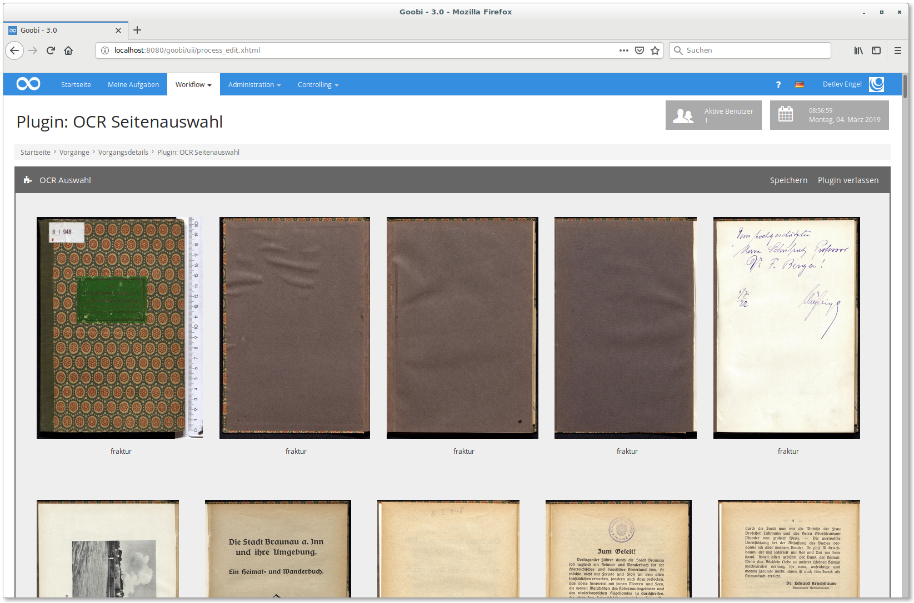

# March 2019

## Better display of results for script executions

If a GoobiScript was faulty, the red error status was a good indicator, but the cause was often not visible. Therefore the display was extended to show the feedback of the scripts or plugins. These messages can also be downloaded as Excel files and are written to the process log.


The Export search result area has also been adjusted. There it is now possible to export the last saved error message from the process log. The column `Last error message` must be selected for this. If no error message exists for a task, the cell remains empty. The corresponding commits can be found here:

[https://github.com/intranda/goobi/commit/329487de6fa1e68e4da204a19c70516b2c73288b](https://github.com/intranda/goobi/commit/329487de6fa1e68e4da204a19c70516b2c73288b) [https://github.com/intranda/goobi/commit/af6930ab091653658003908458c05ced4215b84c](https://github.com/intranda/goobi/commit/af6930ab091653658003908458c05ced4215b84c)[https://github.com/intranda/goobi/commit/3344487fa53943a6cf7424e475493e3805fd5841](https://github.com/intranda/goobi/commit/3344487fa53943a6cf7424e475493e3805fd5841)

## Extended Excel Import Plugin

The already existing Excel Import Plugin for importing metadata has been extended to work with the column header instead of the column order. This allows you to make minor changes to the Excel files without having to change the configuration each time because individual columns have changed or the order is now different.

In Goobi the plugin `intranda_import_excel_read_headerdata` must be selected during the import.

The configuration file `plugin_intranda_import_excel_read_headerdata.xml` is based on the previous configuration, but allows a definition of the metadata fields according to the following scheme:

```markup
<metadata ugh="CatalogIDDigital" headerName="PPN-Digital" />
```

If the Excel file contains a column that contains the value `PPN-Digital` in the first row, the value from this column is then written to the metadata `CatalogIDDigital` in each data record.

Persons can be imported in several ways. If the first and last names are in separate columns, the field looks like this:

```markup
<person ugh="Author">
  <firstnameFieldHeader>Vorname</firstnameFieldHeader>
  <lastnameFieldHeader>Nachname</lastnameFieldHeader>
</person>
```

If the full name is provided in a column, the following configuration must be selected:

```markup
<person ugh="Author">
  <nameFieldHeader>Person</nameFieldHeader>
  <splitName>true</splitName>
  <splitChar firstNameIsFirstPart="false">\, </splitChar>
</person>
```

The value found is split at the configured `<splitChar>` and divided into first name and last name. Optionally, it is also possible to specify authority data for a metadata:

```markup
<person ugh="Author" headerName="Person" normdataHeaderName="GND-Person">
[...]
</person>
<metadata ugh="PlaceOfPublication" headerName="Ort" normdataHeaderName="GND-Ort" />
```

## Updated Catalogue Poller Plugin

The already existing plugin for periodically updating the METS files within Goobi from a catalogue has been slightly revised. The main need for action here was to be able to determine more precisely which metadata should not be overwritten with changed values and how to deal with omitted metadata.


In this context, the logging of the plugin activity has also been improved. In the Goobi process log, it is now easy to see at any time what has changed in the data record and exactly when this took place.


Finally, we took the opportunity to create a detailed documentation for the plugin. This can be found at the following address:



## New XMP Plugin

The new XMP plugin makes it possible to write various metadata from Goobi into the XMP headers of image files. Metadata can be written at the factory level as well as metadata at the image level (e.g. belonging to structural elements).


A complete documentation can be viewed here:



## New plugins for OCR execution configurable on single pages

With this plugin you can define on a single page basis which images from a process are sent with which font to the OCR.



The documentation of the two plugins can be found in this portal:





## K10Plus Changeover

The merging of the two GBV and SWB catalogue databases to form the K10plus database resulted in changes. Goobi can already deal with these. It is irrelevant whether the query is made via SRU or the XML interface, whether `pica+` or `marcxml` or which database is used. In the file `goobi_opac.xml` the following catalog connections have to be configured:[\
](https://docs.intranda.com/goobi-workflow-plugins-de/step-plugins/ocr-seitenauswahl)

```markup
<!-- replacement for old swb/gbv pica interface -->
<catalogue title="K10Plus">
  <config address="kxp.k10plus.de" database="1.1" description="K10plus-Datenbank" iktlist="IKTLIST-GBV.xml" port="80" ucnf="UCNF=NFC&amp;XPNOFF=1"/>
</catalogue>

<!-- replacement for old swb/gbs marc interface-->
<catalogue title="K10plus SRU">
  <config description="K10plus-SRU-Datenbank" address="http://sru.k10plus.de/k10cat" port="80" database="2.1" iktlist="IKTLIST-GBV.xml" ucnf="XPNOFF=1"  opacType="GBV-MARC"/>
</catalogue>
```

Since the assignment of some fields has also changed, it may also be necessary to make adjustments to the rulesets. Depending on the format, these can also be more extensive. With `pica`, the most serious change seems to be that the `GND identifiers` are now in `subfield 7` and all `PPNs`, which have been entered in the new catalog for the first time, have received a prefix `KXP` in some fields.

## Specific statistics for throughput and productivity

A number of statistical evaluations have been created to evaluate the progress, throughput or current status of the operations. Since these evaluations can be broken down to user groups and even to individual users, personal statements can be made. For this reason, these statistics are located in an independent plug-in and are only installed within Goobi on request.


## Detailed information about the status in the progress bar

The display of the progress bars for the tasks should be more informative. For this reason, Goobi has been enhanced to display a popup when the mouse is moved over the progress bar. From now on, it will visualize which concrete work steps are currently in the status over which the mouse pointer is currently positioned.


In this way it is now possible to see which tasks have already been completed, are currently being processed or are still locked without unfolding the tasks or opening the task details.


The commit for this can be seen here:

[https://github.com/intranda/goobi/commit/68b1c9ad05a63cdef2e7dfd75a473e03a062a53f](https://github.com/intranda/goobi/commit/68b1c9ad05a63cdef2e7dfd75a473e03a062a53f)

## Create tasks directly from the dashboard

[The community expressed the wish](https://community.goobi.io/t/vorgang-anlegen-von-der-goobi-startseite-aus/156) that it should be possible to create processes directly from the Goobi homepage within the standard dashboard. This has already been implemented in a first draft and can now be put into operation. All those production templates are listed for which the respective user actually has access.

