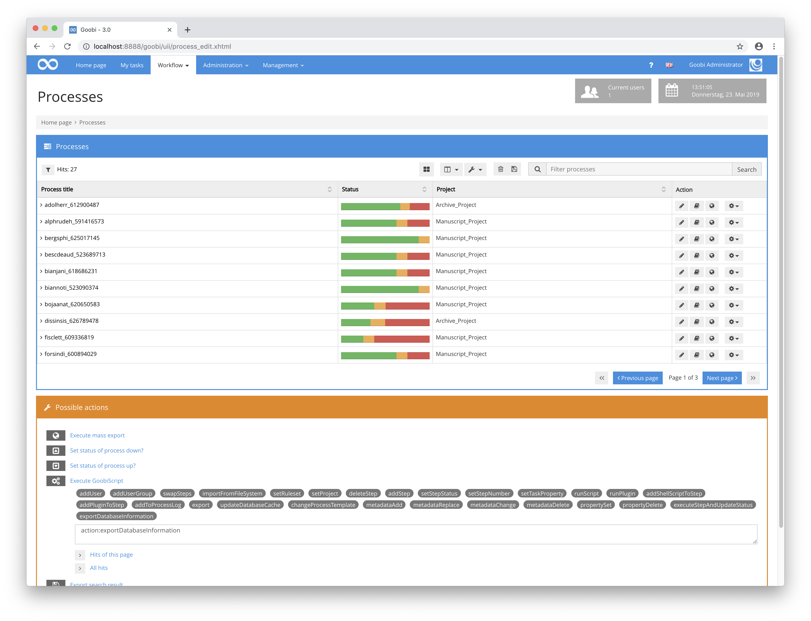

# April 2019

## Thumbnails folder per process

Goobi workflow has now been extended so that thumbnails can now also be used in addition to the directories already used for the master files and derivatives. After completion of the entire implementation, these are then used within the metadata editor as well as within the Image QA plug-in for image display and thumbnail display. If such thumbnails are available, the image display can be done much faster. The directory convention for the thumbnails can be shown as follows for an exemplary process `testitem_goobi_123`:

```bash
/opt/digiverso/goobi/metadata/456/
├── meta.xml
├── images/
│   ├── master_testitem_goobi_123_media/
│   │   ├── 000000001.tif
│   │   ├── 000000002.tif
│   │   ├── 000000003.tif
│   │   └── 000000004.tif
│   └── testitem_goobi_123_media/
│       ├── 000000001.tif
│       ├── 000000002.tif
│       ├── 000000003.tif
│       └── 000000004.tif
└── thumbs/
    ├── master_testitem_goobi_123_media_400/
    │   ├── 000000001.jpg
    │   ├── 000000002.jpg
    │   ├── 000000003.jpg
    │   └── 000000004.jpg
    └── master_testitem_goobi_123_media_800/
    │   ├── 000000001.jpg
    │   ├── 000000002.jpg
    │   ├── 000000003.jpg
    │   └── 000000004.jpg
    ├── testitem_goobi_123_media_400/
    │   ├── 000000001.jpg
    │   ├── 000000002.jpg
    │   ├── 000000003.jpg
    │   └── 000000004.jpg
    └── testitem_goobi_123_media_800/
        ├── 000000001.jpg
        ├── 000000002.jpg
        ├── 000000003.jpg
        └── 000000004.jpg
```

At the same time, it is even easier to clean up the Goobi workflow system. Master files and derivatives can now be deleted from the system to save space. At the same time, however, very strongly compressed files can still be used for the workflow-internal image display. In addition, this also ensures that the thumbnails are not accidentally used for publication to the Goobi viewer and overwrite the high-resolution images there. Such a workflow could be structured in a similar way:


## New queue processing in Goobi workflow

Goobi workflow has been enhanced with an internal message queue, which can be used to process complex tasks. With this new mechanism, it is possible to configure how many jobs can run simultaneously, thus preventing unwanted load peaks on the Goobi server. At the same time, it is also possible to use an external queue. This makes it possible to execute orders independent of Goobi on other computers and to distribute computing load across several systems. Previous developments (commits) have so far only introduced this new queue. Shell calls and all Goobi scripts will have to be converted to this new mechanism in the future.

[https://github.com/intranda/goobi/commit/af99eebcc7cb0231a528e0434fda66a3da2797b0](https://github.com/intranda/goobi/commit/af99eebcc7cb0231a528e0434fda66a3da2797b0)\
[https://github.com/intranda/goobi/commit/bf77ef0656eeec4a4a261aa29a5b8ac98455d3b9](https://github.com/intranda/goobi/commit/bf77ef0656eeec4a4a261aa29a5b8ac98455d3b9)\
[https://github.com/intranda/goobi/commit/c051dd18b22163ec7a9b336bd98d5a059519d064](https://github.com/intranda/goobi/commit/c051dd18b22163ec7a9b336bd98d5a059519d064)

## Trigger Goobiscript with Enter

The security dialog for the execution of GoobiScript was already revised not so long ago. However, what still disturbed the operation was that after entering the sum to be calculated, one still had to click with the mouse on the corresponding button to start the GoobiScript.


This has now been revised so that pressing the Enter key already checks the calculation and the GoobiScript starts.

[https://github.com/intranda/goobi/commit/27c2764aa5c904cdfae7b16fecde7c5ec5e1f318](https://github.com/intranda/goobi/commit/27c2764aa5c904cdfae7b16fecde7c5ec5e1f318)

## GoobiScript to export the extended process log for Goobi-to-Goobi Export

The first important step in the development of data exchange between different Goobi instances has now been taken as part of a more comprehensive import-export implementation. For this purpose, a new GoobiScript `exportDatabaseInformation` was developed, which writes a very detailed process log to the process directory for each filtered process.



For example, such a log file looks like the following:

```markup
<?xml version="1.0" encoding="UTF-8"?>
<process xmlns="http://www.goobi.io/logfile" id="10" template="false" displayInProcessCreation="false">
  <id>10</id>
  <title>alphrudeh_591416573</title>
  <creationDate>2017-06-21T14:36:13.019+0200</creationDate>
  <ruleset id="1" name="Sample ruleset" filename="ruleset.xml" />
  <sorting status="062012025" images="26" articles="0" docstructs="7" metadata="22" mediaFolderExists="false" />
  <docket id="1" name="Sample docket" file="docket.xsl" />
  <project archived="false">
    <id>2</id>
    <title>Manuscript_Project</title>
    <fileFormatInternal>Mets</fileFormatInternal>
    <fileFormatDmsExport>Mets</fileFormatDmsExport>
    <startDate>2017-01-02T00:00:00.000+0100</startDate>
    <endDate>2018-03-31T00:00:00.000+0200</endDate>
    <pages>200000</pages>
    <volumes>150</volumes>
    <exportConfiguration useDmsImport="true" dmsImportCreateProcessFolder="false">
      <dmsImportTimeOut>0</dmsImportTimeOut>
      <dmsImportRootPath>{goobiFolder}../viewer/hotfolder/</dmsImportRootPath>
      <dmsImportImagesPath>{goobiFolder}../viewer/hotfolder/</dmsImportImagesPath>
      <dmsImportSuccessPath />
      <dmsImportErrorPath />
    </exportConfiguration>
    <metsConfiguration>
      <metsRightsOwner>intranda GmbH</metsRightsOwner>
      <metsRightsOwnerLogo />
      <metsRightsOwnerSite>http://goobi.intanda.com</metsRightsOwnerSite>
      <metsRightsOwnerMail />
      <metsDigiprovReference>http://viewer-demo01.intranda.com/Portal/Default/en-GB/RecordView/Index/$(meta.CatalogIDDigital)</metsDigiprovReference>
      <metsDigiprovPresentation>http://viewer-demo01.intranda.com/viewer/ppnresolver?id=$(meta.CatalogIDDigital)</metsDigiprovPresentation>
      <metsDigiprovReferenceAnchor>http://viewer-demo01.intranda.com/Portal/Default/en-GB/RecordView/Index/$(meta.CatalogIDDigital)</metsDigiprovReferenceAnchor>
      <metsDigiprovPresentationAnchor>http://viewer-demo01.intranda.com/viewer/ppnresolver?id=$(meta.topstruct.CatalogIDDigital)</metsDigiprovPresentationAnchor>
      <metsPointerPath>http://viewer-demo01.intranda.com/viewer/metsresolver?id=$(meta.CatalogIDDigital)</metsPointerPath>
      <metsPointerPathAnchor>http://viewer-demo01.intranda.com/viewer/metsresolver?id=$(meta.topstruct.CatalogIDDigital)</metsPointerPathAnchor>
      <metsPurl />
      <metsContentIDs />
      <metsRightsSponsor />
      <metsRightsSponsorLogo />
      <metsRightsSponsorSiteURL>info@intranda.com</metsRightsSponsorSiteURL>
      <metsRightsLicense />
    </metsConfiguration>
    <fileGroups>
      <projectFileGroup id="2" folder="" mimetype="image/jpg" name="PRESENTATION" path="file://{goobiFolder}../viewer/media/$(meta.CatalogIDDigital)/" suffix="jpg" />
    </fileGroups>
  </project>
  <log>
    <entry id="72">
      <content>Step 'Get manuscript from book depot' closed.</content>
      <creationDate>2017-06-21T14:40:59.451+0200</creationDate>
      <type>debug</type>
      <user>Fuller, Cedric</user>
    </entry>
    <entry id="73">
      <content>Step 'Scanning' opened.</content>
      <creationDate>2017-06-21T14:40:59.452+0200</creationDate>
      <type>debug</type>
      <user>Fuller, Cedric</user>
    </entry>
    <entry id="90">
      <content>Script '/opt/digiverso/goobi/scripts/script_createSymLink.sh /opt/digiverso/goobi/metadata/10/images /opt/digiverso/goobi/users/testscanning/alphrudeh_591416573__[10] testscanning' was executed with result: /opt/digiverso/goobi/metadata/10/images
/opt/digiverso/goobi/users/testscanning/alphrudeh_591416573__[10]</content>
      <creationDate>2017-06-21T14:44:25.163+0200</creationDate>
      <type>debug</type>
      <user>Hawking, Delbert</user>
    </entry>
    <entry id="92">
      <content>Step 'Scanning' closed.</content>
      <creationDate>2017-06-21T14:44:40.101+0200</creationDate>
      <type>debug</type>
      <user>Hawking, Delbert</user>
    </entry>
    <entry id="93">
      <content>Step 'Quality control' opened.</content>
      <creationDate>2017-06-21T14:44:40.102+0200</creationDate>
      <type>debug</type>
      <user>Hawking, Delbert</user>
    </entry>
    <entry id="130">
      <content>Script '/opt/digiverso/goobi/scripts/script_createSymLink.sh /opt/digiverso/goobi/metadata/10/images /opt/digiverso/goobi/users/testqc/alphrudeh_591416573__[10] root' was executed with result: /opt/digiverso/goobi/metadata/10/images
/opt/digiverso/goobi/users/testqc/alphrudeh_591416573__[10]</content>
      <creationDate>2017-06-21T14:48:16.539+0200</creationDate>
      <type>debug</type>
      <user>Readdie, Moss</user>
    </entry>
    <entry id="132">
      <content>Step 'Quality control' closed.</content>
      <creationDate>2017-06-21T14:48:22.830+0200</creationDate>
      <type>debug</type>
      <user>Readdie, Moss</user>
    </entry>
    <entry id="133">
      <content>Step 'Image processing' opened.</content>
      <creationDate>2017-06-21T14:48:22.831+0200</creationDate>
      <type>debug</type>
      <user>Readdie, Moss</user>
    </entry>
    <entry id="134">
      <content>Step 'Image processing' started to work automatically.</content>
      <creationDate>2017-06-21T14:48:22.833+0200</creationDate>
      <type>debug</type>
      <user>Readdie, Moss</user>
    </entry>
    <entry id="136">
      <content>Step 'Image processing' closed.</content>
      <creationDate>2017-06-21T14:48:23.412+0200</creationDate>
      <type>debug</type>
      <user>- automatic -</user>
    </entry>
    <entry id="137">
      <content>Step 'Metadata enrichment' opened.</content>
      <creationDate>2017-06-21T14:48:23.413+0200</creationDate>
      <type>debug</type>
      <user>- automatic -</user>
    </entry>
  </log>
  <properties>
    <property id="77" container="0">
      <creationDate>2017-06-21T14:36:34.091+0200</creationDate>
      <name>Creator of digital edition</name>
      <value>Goobi</value>
    </property>
    <property id="79" container="0">
      <creationDate>2017-06-21T14:36:34.091+0200</creationDate>
      <name>Digital origin</name>
      <value>reformatted digital</value>
    </property>
    <property id="75" container="0">
      <creationDate>2017-06-21T14:36:34.091+0200</creationDate>
      <name>Digitisation date</name>
      <value>2017</value>
    </property>
    <property id="76" container="0">
      <creationDate>2017-06-21T14:36:34.091+0200</creationDate>
      <name>Electronic ed.</name>
      <value>[Electronic ed.]</value>
    </property>
    <property id="80" container="0">
      <creationDate>2017-06-21T14:36:34.091+0200</creationDate>
      <name>OCR-Language</name>
      <value>template_without_language.xml</value>
    </property>
    <property id="78" container="0">
      <creationDate>2017-06-21T14:36:34.091+0200</creationDate>
      <name>Place of digital edition</name>
      <value>Göttingen</value>
    </property>
    <property id="82" container="0">
      <creationDate>2017-06-21T14:36:34.091+0200</creationDate>
      <name>Template</name>
      <value>Manuscript_Workflow</value>
    </property>
    <property id="83" container="0">
      <creationDate>2017-06-21T14:36:34.091+0200</creationDate>
      <name>TemplateID</name>
      <value>1</value>
    </property>
    <property id="81" container="0">
      <creationDate>2017-06-21T14:36:34.091+0200</creationDate>
      <name>digitalCollection</name>
      <value>General</value>
    </property>
    <property id="118" container="1">
      <creationDate>2017-06-21T14:40:50.837+0200</creationDate>
      <name>Comment for depot status</name>
      <value />
    </property>
    <property id="117" container="1">
      <creationDate>2017-06-21T14:40:50.837+0200</creationDate>
      <name>Linking to external source</name>
      <value>http://goobi.intranda.com</value>
    </property>
    <property id="128" container="1">
      <creationDate>2017-06-21T14:44:25.089+0200</creationDate>
      <name>Opening angle</name>
      <value>180 degrees</value>
    </property>
    <property id="119" container="1">
      <creationDate>2017-06-21T14:40:50.837+0200</creationDate>
      <name>Placeholder card stored in depot</name>
      <value>true</value>
    </property>
    <property id="129" container="1">
      <creationDate>2017-06-21T14:44:25.089+0200</creationDate>
      <name>Reading direction is RTL</name>
      <value>false</value>
    </property>
  </properties>
  <templates />
  <workpiece />
  <tasks>
    <task id="61">
      <name>Data import</name>
      <priority>0</priority>
      <order>1</order>
      <status>3</status>
      <processingTime>2017-06-21T14:36:34.091+0200</processingTime>
      <processingStartTime>2017-06-21T14:36:13.019+0200</processingStartTime>
      <processingEndTime>2017-06-21T14:36:34.091+0200</processingEndTime>
      <user id="1" login="goobi">Administrator, Goobi</user>
      <editionType>4</editionType>
      <configuration useHomeDirectory="0" useMetsEditor="false" isAutomatic="false" readImages="false" writeImages="false" export="false" finalizeOnAccept="false" verifyOnFinalize="false" delayStep="false" updateMetadataIndex="false" generateDocket="false" batchStep="false" stepPlugin="" validationPlugin="" />
      <scriptStep scriptStep="false" />
      <httpStep httpStep="false" />
      <assignedUserGroups>
        <usergroup id="6" name="Project management" accessLevel="4">
          <role>Statistics_CurrentUsers</role>
          <role>Statistics_CurrentUsers_Details</role>
          <role>Statistics_General</role>
          <role>Statistics_Menu</role>
          <role>Statistics_Plugins</role>
          <role>Task_List</role>
          <role>Task_Menu</role>
          <role>Task_Mets_Files</role>
          <role>Task_Mets_Metadata</role>
          <role>Task_Mets_Pagination</role>
          <role>Task_Mets_Structure</role>
          <role>Workflow_General_Batches</role>
          <role>Workflow_General_Details</role>
          <role>Workflow_General_Details_Edit</role>
          <role>Workflow_General_Menu</role>
          <role>Workflow_General_Plugins</role>
          <role>Workflow_General_Search</role>
          <role>Workflow_ProcessTemplates</role>
          <role>Workflow_ProcessTemplates_Clone</role>
          <role>Workflow_ProcessTemplates_Create</role>
          <role>Workflow_ProcessTemplates_Import_Single</role>
          <role>Workflow_Processes</role>
          <role>Workflow_Processes_Allow_Download</role>
          <role>Workflow_Processes_Allow_Export</role>
          <role>Workflow_Processes_Allow_Linking</role>
          <role>Workflow_Processes_Show_Deactivated_Projects</role>
          <role>Workflow_Processes_Show_Finished</role>
        </usergroup>
      </assignedUserGroups>
    </task>
    <task id="62">
      <name>Get manuscript from book depot</name>
      <priority>0</priority>
      <order>2</order>
      <status>3</status>
      <processingTime>2017-06-21T14:40:59.451+0200</processingTime>
      <processingStartTime>2017-06-21T14:40:50.837+0200</processingStartTime>
      <processingEndTime>2017-06-21T14:40:59.451+0200</processingEndTime>
      <user id="6" login="testbookmanager">Fuller, Cedric</user>
      <editionType>1</editionType>
      <configuration useHomeDirectory="0" useMetsEditor="false" isAutomatic="false" readImages="false" writeImages="false" export="false" finalizeOnAccept="false" verifyOnFinalize="false" delayStep="false" updateMetadataIndex="false" generateDocket="false" batchStep="false" stepPlugin="" validationPlugin="" />
      <scriptStep scriptStep="false" />
      <httpStep httpStep="false" />
      <assignedUserGroups>
        <usergroup id="4" name="Book managing officers" accessLevel="4">
          <role>Statistics_CurrentUsers</role>
          <role>Task_List</role>
          <role>Task_Menu</role>
        </usergroup>
      </assignedUserGroups>
    </task>
    <task id="63">
      <name>Scanning</name>
      <priority>0</priority>
      <order>3</order>
      <status>3</status>
      <processingTime>2018-03-09T18:08:02.036+0100</processingTime>
      <processingStartTime>2017-06-21T14:44:25.106+0200</processingStartTime>
      <processingEndTime>2017-06-21T14:44:40.101+0200</processingEndTime>
      <user id="1" login="goobi">Administrator, Goobi</user>
      <editionType>3</editionType>
      <configuration useHomeDirectory="0" useMetsEditor="false" isAutomatic="false" readImages="false" writeImages="false" export="false" finalizeOnAccept="false" verifyOnFinalize="false" delayStep="false" updateMetadataIndex="false" generateDocket="false" batchStep="false" stepPlugin="intranda_step_fileUpload" validationPlugin="intranda_validation_filename" />
      <scriptStep scriptStep="false" />
      <httpStep httpStep="false" />
      <assignedUserGroups>
        <usergroup id="2" name="Scanning officers" accessLevel="4">
          <role>Statistics_CurrentUsers</role>
          <role>Task_List</role>
          <role>Task_Menu</role>
        </usergroup>
      </assignedUserGroups>
    </task>
    <task id="64">
      <name>Quality control</name>
      <priority>0</priority>
      <order>4</order>
      <status>3</status>
      <processingTime>2017-06-21T14:48:22.830+0200</processingTime>
      <processingStartTime>2017-06-21T14:48:16.487+0200</processingStartTime>
      <processingEndTime>2017-06-21T14:48:22.830+0200</processingEndTime>
      <user id="4" login="testqc">Readdie, Moss</user>
      <editionType>1</editionType>
      <configuration useHomeDirectory="0" useMetsEditor="false" isAutomatic="false" readImages="false" writeImages="false" export="false" finalizeOnAccept="false" verifyOnFinalize="false" delayStep="false" updateMetadataIndex="false" generateDocket="false" batchStep="false" stepPlugin="intranda_step_imageQA" validationPlugin="" />
      <scriptStep scriptStep="false" />
      <httpStep httpStep="false" />
      <assignedUserGroups>
        <usergroup id="3" name="Quality control officers" accessLevel="4">
          <role>Statistics_CurrentUsers</role>
          <role>Task_List</role>
          <role>Task_Menu</role>
        </usergroup>
      </assignedUserGroups>
    </task>
    <task id="65">
      <name>Image processing</name>
      <priority>0</priority>
      <order>5</order>
      <status>3</status>
      <processingTime>2017-06-21T14:48:23.411+0200</processingTime>
      <processingStartTime>2017-06-21T14:48:22.833+0200</processingStartTime>
      <processingEndTime>2017-06-21T14:48:23.411+0200</processingEndTime>
      <editionType>4</editionType>
      <configuration useHomeDirectory="0" useMetsEditor="false" isAutomatic="true" readImages="false" writeImages="false" export="false" finalizeOnAccept="false" verifyOnFinalize="false" delayStep="false" updateMetadataIndex="false" generateDocket="false" batchStep="false" stepPlugin="intranda_step_imageConverter" validationPlugin="" />
      <scriptStep scriptStep="false" />
      <httpStep httpStep="false" />
      <assignedUserGroups>
        <usergroup id="1" name="Administration" accessLevel="4">
          <role>Admin_Administrative_Tasks</role>
          <role>Admin_Dockets</role>
          <role>Admin_Ldap</role>
          <role>Admin_Menu</role>
          <role>Admin_Plugins</role>
          <role>Admin_Projects</role>
          <role>Admin_Rulesets</role>
          <role>Admin_Usergroups</role>
          <role>Admin_Users</role>
          <role>Admin_Users_Allow_Switch</role>
          <role>Plugin_Goobi_Exchange</role>
          <role>Statistics_CurrentUsers</role>
          <role>Statistics_CurrentUsers_Details</role>
          <role>Statistics_General</role>
          <role>Statistics_Menu</role>
          <role>Statistics_Plugins</role>
          <role>Task_List</role>
          <role>Task_Menu</role>
          <role>Task_Mets_Files</role>
          <role>Task_Mets_Metadata</role>
          <role>Task_Mets_Pagination</role>
          <role>Task_Mets_Structure</role>
          <role>Workflow_General_Batches</role>
          <role>Workflow_General_Details</role>
          <role>Workflow_General_Details_Edit</role>
          <role>Workflow_General_Menu</role>
          <role>Workflow_General_Plugins</role>
          <role>Workflow_General_Search</role>
          <role>Workflow_General_Show_All_Projects</role>
          <role>Workflow_ProcessTemplates</role>
          <role>Workflow_ProcessTemplates_Clone</role>
          <role>Workflow_ProcessTemplates_Create</role>
          <role>Workflow_ProcessTemplates_Import_Multi</role>
          <role>Workflow_ProcessTemplates_Import_Single</role>
          <role>Workflow_Processes</role>
          <role>Workflow_Processes_Allow_Download</role>
          <role>Workflow_Processes_Allow_Export</role>
          <role>Workflow_Processes_Allow_GoobiScript</role>
          <role>Workflow_Processes_Allow_Linking</role>
          <role>Workflow_Processes_Show_Deactivated_Projects</role>
          <role>Workflow_Processes_Show_Finished</role>
        </usergroup>
      </assignedUserGroups>
    </task>
    <task id="66">
      <name>Metadata enrichment</name>
      <priority>0</priority>
      <order>6</order>
      <status>2</status>
      <processingTime>2017-06-21T14:49:19.991+0200</processingTime>
      <processingStartTime>2017-06-21T14:49:19.991+0200</processingStartTime>
      <processingEndTime />
      <user id="5" login="testmetadata">Anson, Wilburn</user>
      <editionType>1</editionType>
      <configuration useHomeDirectory="0" useMetsEditor="true" isAutomatic="false" readImages="false" writeImages="false" export="false" finalizeOnAccept="false" verifyOnFinalize="true" delayStep="false" updateMetadataIndex="false" generateDocket="false" batchStep="false" stepPlugin="" validationPlugin="" />
      <scriptStep scriptStep="false" />
      <httpStep httpStep="false" />
      <assignedUserGroups>
        <usergroup id="5" name="Metadata officers" accessLevel="4">
          <role>Statistics_CurrentUsers</role>
          <role>Task_List</role>
          <role>Task_Menu</role>
          <role>Task_Mets_Metadata</role>
          <role>Task_Mets_Pagination</role>
          <role>Task_Mets_Structure</role>
        </usergroup>
      </assignedUserGroups>
    </task>
    <task id="67">
      <name>Export to viewer</name>
      <priority>0</priority>
      <order>7</order>
      <status>0</status>
      <processingTime>2017-06-21T14:36:13.019+0200</processingTime>
      <processingStartTime />
      <processingEndTime />
      <user id="1" login="goobi">Administrator, Goobi</user>
      <editionType>4</editionType>
      <configuration useHomeDirectory="0" useMetsEditor="false" isAutomatic="true" readImages="false" writeImages="false" export="true" finalizeOnAccept="false" verifyOnFinalize="false" delayStep="false" updateMetadataIndex="false" generateDocket="false" batchStep="false" stepPlugin="" validationPlugin="" />
      <scriptStep scriptStep="false" />
      <httpStep httpStep="false" />
      <assignedUserGroups>
        <usergroup id="1" name="Administration" accessLevel="4">
          <role>Admin_Administrative_Tasks</role>
          <role>Admin_Dockets</role>
          <role>Admin_Ldap</role>
          <role>Admin_Menu</role>
          <role>Admin_Plugins</role>
          <role>Admin_Projects</role>
          <role>Admin_Rulesets</role>
          <role>Admin_Usergroups</role>
          <role>Admin_Users</role>
          <role>Admin_Users_Allow_Switch</role>
          <role>Plugin_Goobi_Exchange</role>
          <role>Statistics_CurrentUsers</role>
          <role>Statistics_CurrentUsers_Details</role>
          <role>Statistics_General</role>
          <role>Statistics_Menu</role>
          <role>Statistics_Plugins</role>
          <role>Task_List</role>
          <role>Task_Menu</role>
          <role>Task_Mets_Files</role>
          <role>Task_Mets_Metadata</role>
          <role>Task_Mets_Pagination</role>
          <role>Task_Mets_Structure</role>
          <role>Workflow_General_Batches</role>
          <role>Workflow_General_Details</role>
          <role>Workflow_General_Details_Edit</role>
          <role>Workflow_General_Menu</role>
          <role>Workflow_General_Plugins</role>
          <role>Workflow_General_Search</role>
          <role>Workflow_General_Show_All_Projects</role>
          <role>Workflow_ProcessTemplates</role>
          <role>Workflow_ProcessTemplates_Clone</role>
          <role>Workflow_ProcessTemplates_Create</role>
          <role>Workflow_ProcessTemplates_Import_Multi</role>
          <role>Workflow_ProcessTemplates_Import_Single</role>
          <role>Workflow_Processes</role>
          <role>Workflow_Processes_Allow_Download</role>
          <role>Workflow_Processes_Allow_Export</role>
          <role>Workflow_Processes_Allow_GoobiScript</role>
          <role>Workflow_Processes_Allow_Linking</role>
          <role>Workflow_Processes_Show_Deactivated_Projects</role>
          <role>Workflow_Processes_Show_Finished</role>
        </usergroup>
      </assignedUserGroups>
    </task>
    <task id="68">
      <name>Bring manuscript back to book depot</name>
      <priority>0</priority>
      <order>8</order>
      <status>0</status>
      <processingTime>2017-06-21T14:36:13.019+0200</processingTime>
      <processingStartTime />
      <processingEndTime />
      <user id="1" login="goobi">Administrator, Goobi</user>
      <editionType>4</editionType>
      <configuration useHomeDirectory="0" useMetsEditor="false" isAutomatic="false" readImages="false" writeImages="false" export="false" finalizeOnAccept="false" verifyOnFinalize="false" delayStep="false" updateMetadataIndex="false" generateDocket="false" batchStep="false" stepPlugin="" validationPlugin="" />
      <scriptStep scriptStep="false" />
      <httpStep httpStep="false" />
      <assignedUserGroups>
        <usergroup id="4" name="Book managing officers" accessLevel="4">
          <role>Statistics_CurrentUsers</role>
          <role>Task_List</role>
          <role>Task_Menu</role>
        </usergroup>
      </assignedUserGroups>
    </task>
  </tasks>
</process>
```

The implementation of this part is the first step in exchanging data between two Goobi instances. With the help of this export file, the workflows can now be transferred to other systems.

[https://github.com/intranda/goobi/commit/82ccf81197b0940c6a05b5de42a5422d131dbbc7](https://github.com/intranda/goobi/commit/82ccf81197b0940c6a05b5de42a5422d131dbbc7)\
[https://github.com/intranda/goobi/commit/0d49071fcdc3f7886d9a414adea60eac7a6fab66](https://github.com/intranda/goobi/commit/0d49071fcdc3f7886d9a414adea60eac7a6fab66)\
[https://github.com/intranda/goobi/commit/d46d92445797d7c6d3f853f41f70346b80e461a6](https://github.com/intranda/goobi/commit/d46d92445797d7c6d3f853f41f70346b80e461a6)\
[https://github.com/intranda/goobi/commit/a3da5bb9858822e16e9aba28733c7ee74dd39247](https://github.com/intranda/goobi/commit/a3da5bb9858822e16e9aba28733c7ee74dd39247)\
[https://github.com/intranda/goobi/commit/55c13e61c8d2f9069eec0c0111e1683026fa7e70](https://github.com/intranda/goobi/commit/55c13e61c8d2f9069eec0c0111e1683026fa7e70)

## Preparation for the Import of the extended process log for Goobi-to-Goobi Import

The work for exporting the workflow information into an XML file is only the first part for the future Goobi-to-Goobi data exchange. The second essential part for this is still in development. We are working intensively on a user interface that will allow you to import data from another Goobi into your own Goobi. The whole thing is implemented as an administration plug-in. However, the development has not yet been completed to the extent that an insight can already be given here. This will take place next month.

## Bugfix for "broken pipe" log messages

In the past, the log messages from Goobi workflow often contained error messages with a reference to `broken pipe`. By changing the redirection after logging in, these error messages could now be reduced.

[https://github.com/intranda/goobi/commit/755412a889fdd583ec7318272c2f2dcb593dcf9a](https://github.com/intranda/goobi/commit/755412a889fdd583ec7318272c2f2dcb593dcf9a)