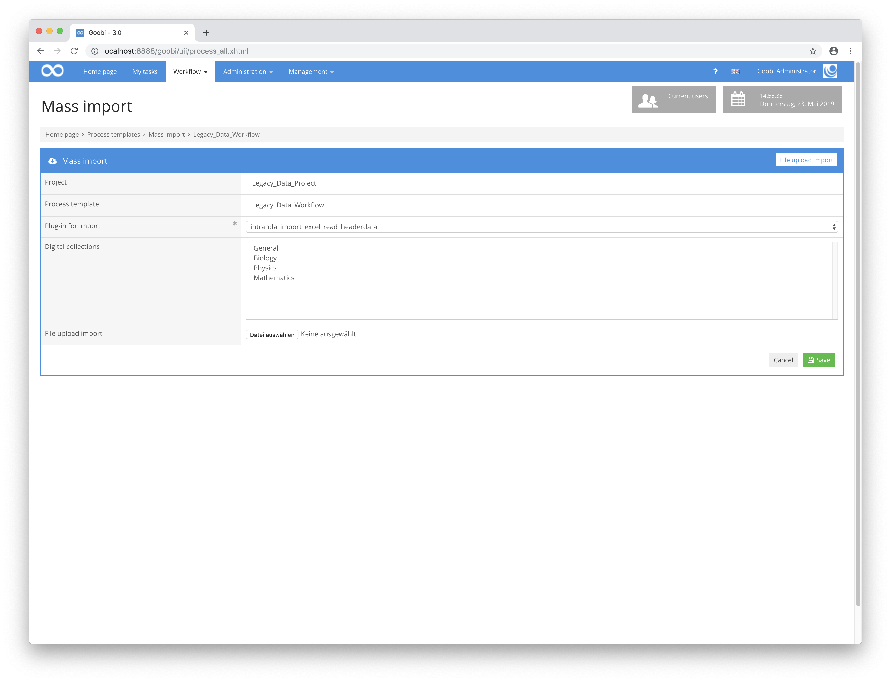

# May 2019

## Adjustments to the mass import screen

The interface for the mass import of Goobi workflow has been massively revised. Previously, users had to select the correct import mechanism and then import the plugin from the list. And last but not least you had to select the file to be uploaded first and then click on a separate button. All this is now much more intuitive. If you enter the mass import, from now on only those tabs will be displayed for which plugins are installed. If only one plugin is installed, it is already selected. And also the upload of the file is directly possible with Drag & Drop. Thus the handling is simplified by a multiple and requires substantially fewer clicks than before.

​[https://github.com/intranda/goobi/commit/41d622981b7ea2ced3cc009a703c78a23c1967c1](https://github.com/intranda/goobi/commit/41d622981b7ea2ced3cc009a703c78a23c1967c1) [https://github.com/intranda/goobi/commit/93d0042cad7f99e480d1fbeb5b961af74702ae92](https://github.com/intranda/goobi/commit/93d0042cad7f99e480d1fbeb5b961af74702ae92) [https://github.com/intranda/goobi/commit/4f23eb2ca69ae7e5d35ae5658e017cae69c1c973](https://github.com/intranda/goobi/commit/4f23eb2ca69ae7e5d35ae5658e017cae69c1c973) [https://github.com/intranda/goobi/commit/b2a8bf88cd9a352ad00ff1571d4465b96a900ba7](https://github.com/intranda/goobi/commit/b2a8bf88cd9a352ad00ff1571d4465b96a900ba7) [https://github.com/intranda/goobi/commit/51ebf28f6deb99d6590c48906500f2d379c28a15](https://github.com/intranda/goobi/commit/51ebf28f6deb99d6590c48906500f2d379c28a15)​‌

## Conversion of all tables to UTF8

To ensure better compatibility with different character sets and languages, the Goobi workflow database has now been adapted to store all tables internally as UTF8. After installing the new version of Goobi workflow, this update takes place automatically during the first program start, so that no manual intervention in the database is necessary.

​[https://github.com/intranda/goobi/commit/d48a075ab4a1db543a38ccce4c486acfe6187bce](https://github.com/intranda/goobi/commit/d48a075ab4a1db543a38ccce4c486acfe6187bce) [https://github.com/intranda/goobi/commit/b2fbd68681082e3ccbfc6a24064f8ea55537a270](https://github.com/intranda/goobi/commit/b2fbd68681082e3ccbfc6a24064f8ea55537a270) [https://github.com/intranda/goobi/commit/21fdbc7b0479f41dac8c2a922fadfb5d254a7f96](https://github.com/intranda/goobi/commit/21fdbc7b0479f41dac8c2a922fadfb5d254a7f96)​‌

## Increased performance when listing steps

By adapting an SQL query, the speed of listing many steps could be increased. Even with 30,000 steps assigned to a user, waiting times are now less than one second.

​[https://github.com/intranda/goobi/commit/80435577b4b0bac5b5c226c17a83907789256ae7](https://github.com/intranda/goobi/commit/80435577b4b0bac5b5c226c17a83907789256ae7)​‌

## Placeholder within the metadata editor for missing images

A placeholder text is now displayed in the metadata editor when no media is available for a task. This means that the user can now see immediately whether files belong to a process at all or whether there are only problems with the display of available media under certain circumstances.

## File-Upload-Plugin now with download possibility

Within the File-Upload-Plugin not only files can be uploaded from now on. It is now also possible to download individual files again. In addition, the entire directory content can be downloaded as a zip file.

## Adaptation of the plugin Catalogue Poller for automatic export

The Administration Plugin Catalogue Poller now has a mechanism to export updated tasks that have been changed by a periodic query of a library catalog, for example. With this new mechanism, it is now possible for only those records to be re-published, e.g. in the Goobi viewer, for which there is an update. Only the METS file is exported, but not associated images, media or full text files. In this way, the publication process is also correspondingly efficient and current data records are always published.

Further information about the configuration of the Catalogue Poller Plugin [can be found in its documentation](https://docs.intranda.com/goobi-workflow-plugins-de/administration-plugins/catalogue-poller).

## Connection to the LZA of the GWDG (CDStar)

Three plug-ins were developed to connect Goobi workflow to the LZA of the GWDG (CDStar):

* One step plugin for the ingest of master images and derivatives in CDStar
* A plugin for exporting a METS file with file groups in which the IDs and URLs point to the previously ingested images in CDStar.
* A plugin that imports the exported METS file into a Fedora system.

All these plug-ins already work with the Goobi internal queue, avoiding peak loads.

## Import plugin for importing newspaper articles from an Endnote Export

A new plugin for importing newspaper articles from an Endnote export has been created. An explanation and documentation [can be found in this portal](https://docs.intranda.com/goobi-workflow-plugins-de/import-plugins/import-fuer-zeitschriftenartikel-aus-einem-endnote-export).