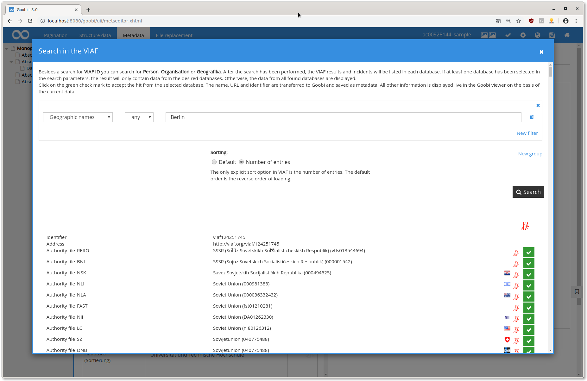
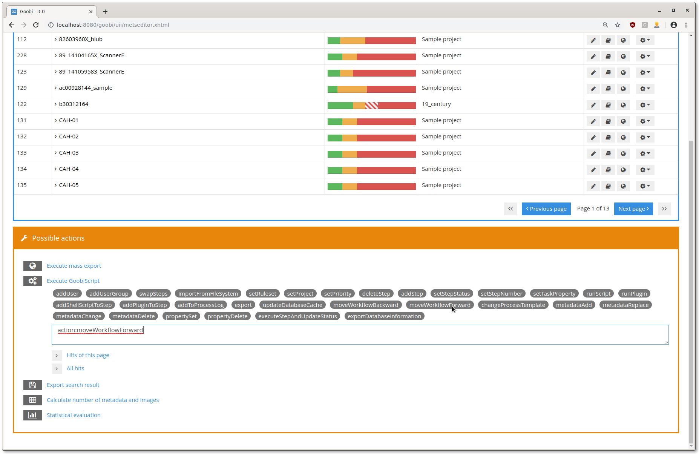
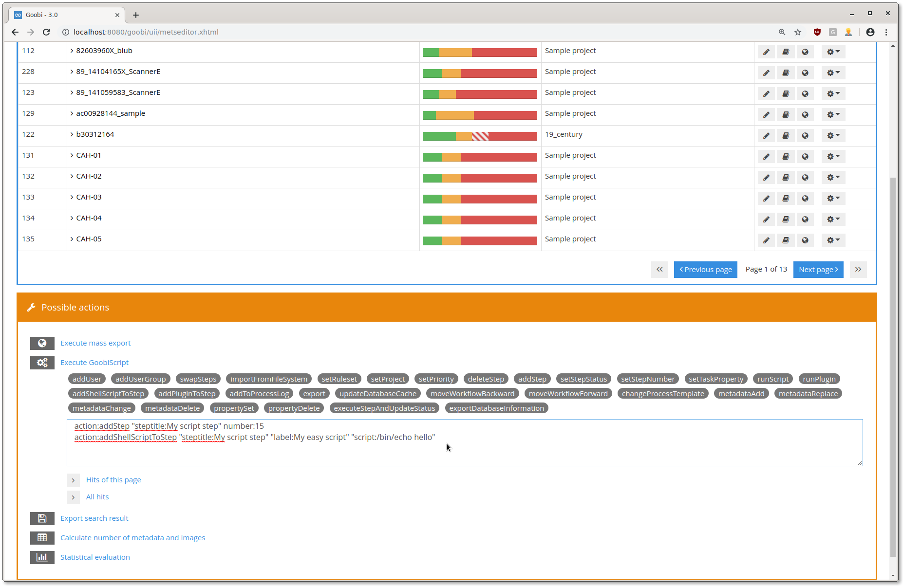
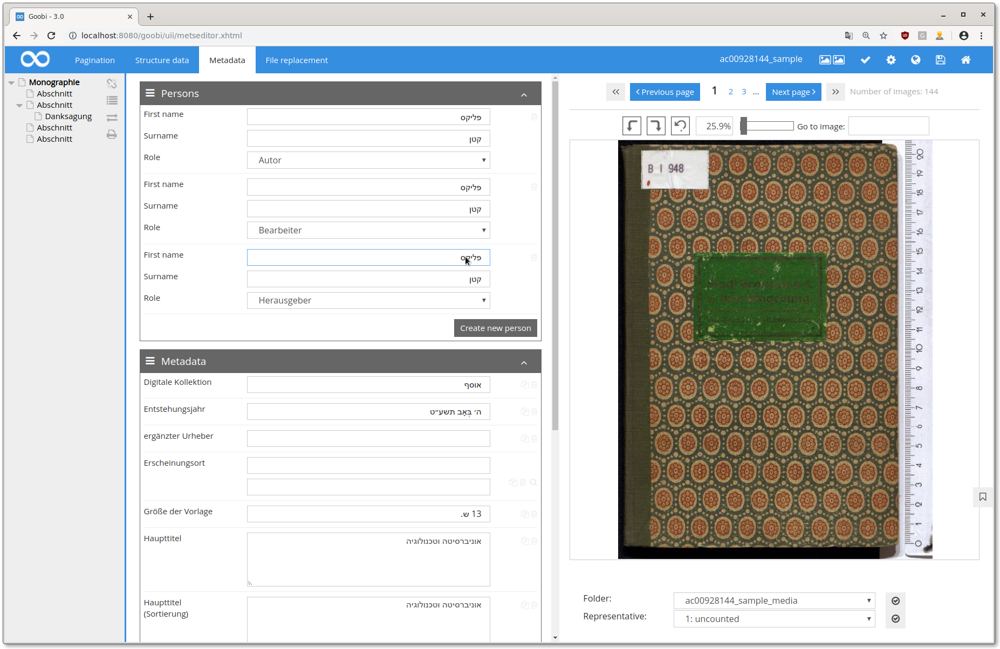

# June 2019

## Integration of VIAF for authority data acquisition

A search in the [VIAF](https://viaf.org/) has been integrated into the metadata editor. In this way, the authority databases from 40 countries can be searched and their values transferred to the METS file.

The VIAF search can be activated for a metadata type by editing the `goobi_metadataDisplayRules.xml` configuration file and adding a block like the following:

```markup
<viaf ref="PlaceOfPublication">                
   <!-- # Format: 'mmmiis' -->                
   <!-- # mmm - MARC main field -->                
   <!-- # ii - indicator 1 + 2 (_ if empty) -->                
   <!-- # s - MARC subfield -->                
   <source>210__a; 111__a; 100__a; 110__a; 150__a; 151__a;</source>                

   <!-- # Format: 'mmmiis=label' -->                
   <!-- # mmm - MARC main field -->                
   <!-- # ii - indicator 1 + 2 (_ if empty) -->                
   <!-- # s - MARC subfield -->                
   <!-- # label - label of the field, can be used as message key -->                
   <field>001=NORM_IDENTIFIER; 0247_a=URI;</field>                
</viaf>
```



[https://github.com/intranda/goobi/commit/d56e244bde8cc5ba844f94f1bf2bb2846215bbb1](https://github.com/intranda/goobi/commit/d56e244bde8cc5ba844f94f1bf2bb2846215bbb1)\
[https://github.com/intranda/goobi/commit/96fa0656984d6b049e29a8853cf26a7fb94e927a](https://github.com/intranda/goobi/commit/96fa0656984d6b049e29a8853cf26a7fb94e927a)\
[https://github.com/intranda/goobi/commit/6f72039ef2393def29e8750ccb48558f6ec2c0a5](https://github.com/intranda/goobi/commit/6f72039ef2393def29e8750ccb48558f6ec2c0a5)

## Two new GoobiScripts "moveWorkflowForward" and "action:moveWorkflowBackward".

The two buttons to "fast forward" and "rewind" a process below the process list have been replaced by GoobiScripts. This allows a concurrent execution in the GoobiScript queue. A further advantage of processing in the queue is that peak loads are avoided.



[https://github.com/intranda/goobi/commit/bd967dfb8b8ea02a1af2af846a770cb09ab595e5 ](https://github.com/intranda/goobi/commit/bd967dfb8b8ea02a1af2af846a770cb09ab595e5)

## Fix for Goobiscripts: ensure serial processing

With this fix it is again possible to combine different GoobiScripts and perform a task consisting of several GoobiScript calls with one large command. For example, the screenshot shows adding a new script step to all processes in the search results.



[https://github.com/intranda/goobi/commit/74b8ecb7f62875a9e1be8cd47d9705cec7738da3](https://github.com/intranda/goobi/commit/74b8ecb7f62875a9e1be8cd47d9705cec7738da3)

## Metadata editor: write direction is now recognized automatically

All input fields in the metadata editor now automatically recognize the text flow direction depending on the content.



[https://github.com/intranda/goobi/commit/73a22c71b2165d6ba76241824d792aa7b453cf8c](https://github.com/intranda/goobi/commit/73a22c71b2165d6ba76241824d792aa7b453cf8c)\
[https://github.com/intranda/goobi/commit/d89ed3eff3fbfae453ce67d5c822c2284ddcd618](https://github.com/intranda/goobi/commit/d89ed3eff3fbfae453ce67d5c822c2284ddcd618)

## S3 storage backend: connections are now closed correctly

When using S3 as storage backend, connections have been kept open for too long. These connections are now closed correctly and a memory leak is prevented.

[\
https://github.com/intranda/goobi/commit/c4f9487877d92d6526e6b36e07ae18761e4d7b4f](https://github.com/intranda/goobi/commit/c4f9487877d92d6526e6b36e07ae18761e4d7b4f)

## Thumbnail folder in task folder: fix for MS Windows

The new thumbnail folder did not work correctly when using Goobi under Windows. This bug has been fixed and Goobi and GoobiToGo now work on Windows again.

[https://github.com/intranda/goobi/commit/a84fe0e5e2f1a2bd28d56cb04ec25f88eb5bb792 ](https://github.com/intranda/goobi/commit/a84fe0e5e2f1a2bd28d56cb04ec25f88eb5bb792)