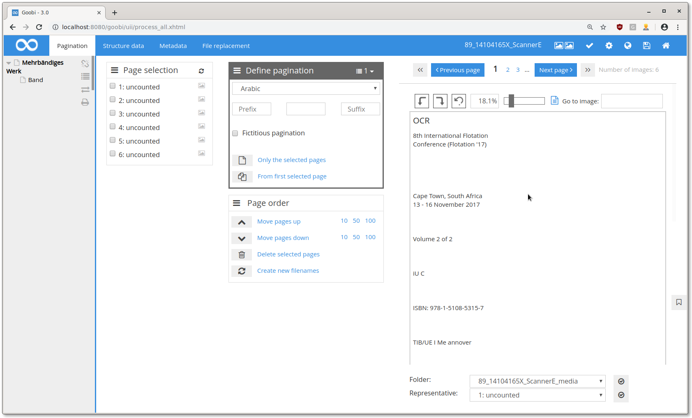
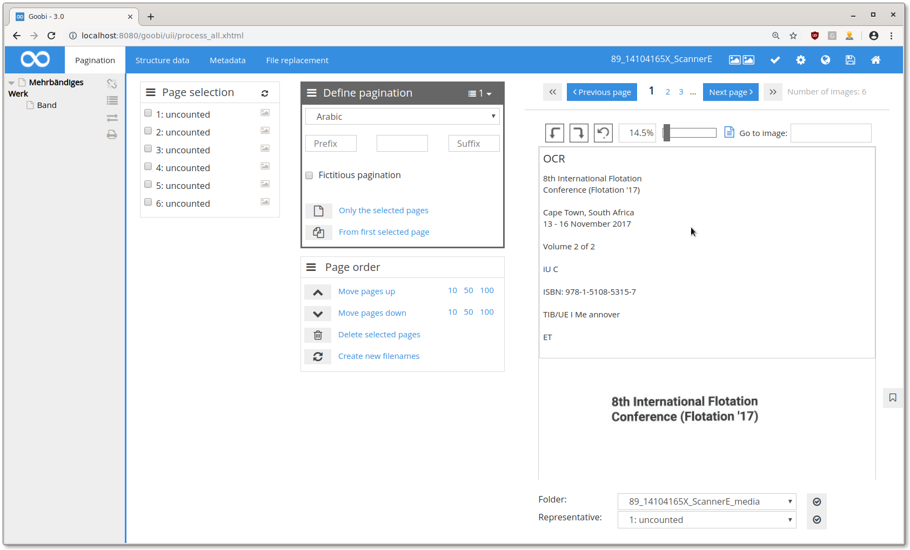
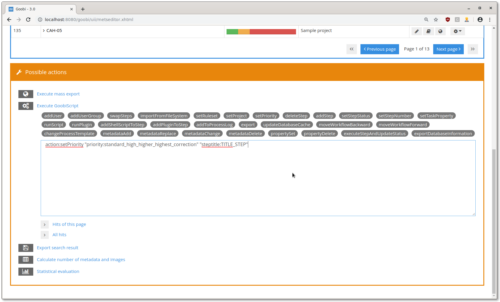

# July 2019

## Optimizing the image display

Previously, the entire process was fetched from the database if an image from this process was to be displayed. This has now been optimized so that database queries are no longer necessary.

[https://github.com/intranda/goobi/commit/6ea16c3115cbef1fac0428353f59cf7f2def94bd](https://github.com/intranda/goobi/commit/6ea16c3115cbef1fac0428353f59cf7f2def94bd)

## Improved OCR display in metadata editor

If several blank lines follow each other in the OCR result, it can quickly become confusing:

From now on, several successive blank lines will be combined into one:

[https://github.com/intranda/goobi/commit/eaa0f1c0ee5d5b170d041cfc559259ca2680a9a7](https://github.com/intranda/goobi/commit/eaa0f1c0ee5d5b170d041cfc559259ca2680a9a7)

## New GoobiScript for setting step priorities

A new GoobiScript has been added that allows mass manipulation of step priorities.

[https://github.com/intranda/goobi/commit/a2f27549976cf3fc9af8bdf96c94e118828dec1a](https://github.com/intranda/goobi/commit/a2f27549976cf3fc9af8bdf96c94e118828dec1a)

## Removing the entire process folder when a process is deleted

Previously, an error in Goobi left an empty folder in the file system after deleting a process. This error has now been corrected and the folder itself is also deleted.

[https://github.com/intranda/goobi/commit/2ee43e3a6cb890416f90f2ff50a44faf707d242f](https://github.com/intranda/goobi/commit/2ee43e3a6cb890416f90f2ff50a44faf707d242f)