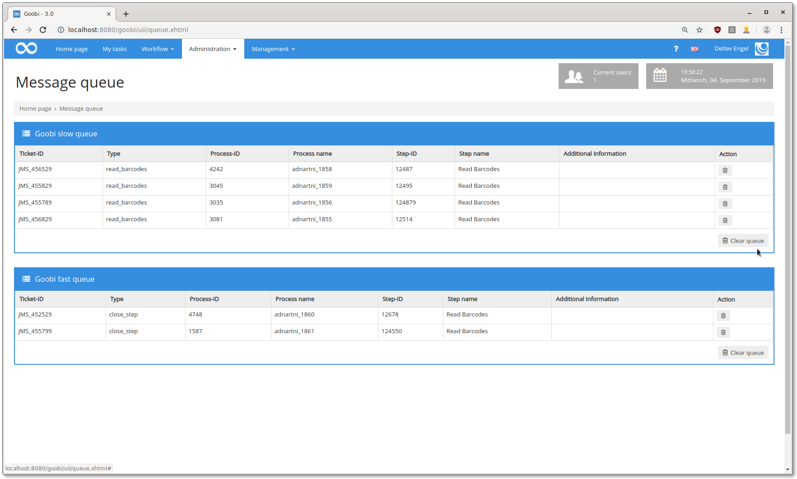
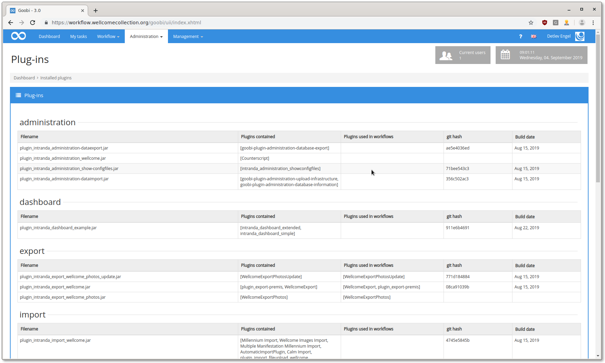
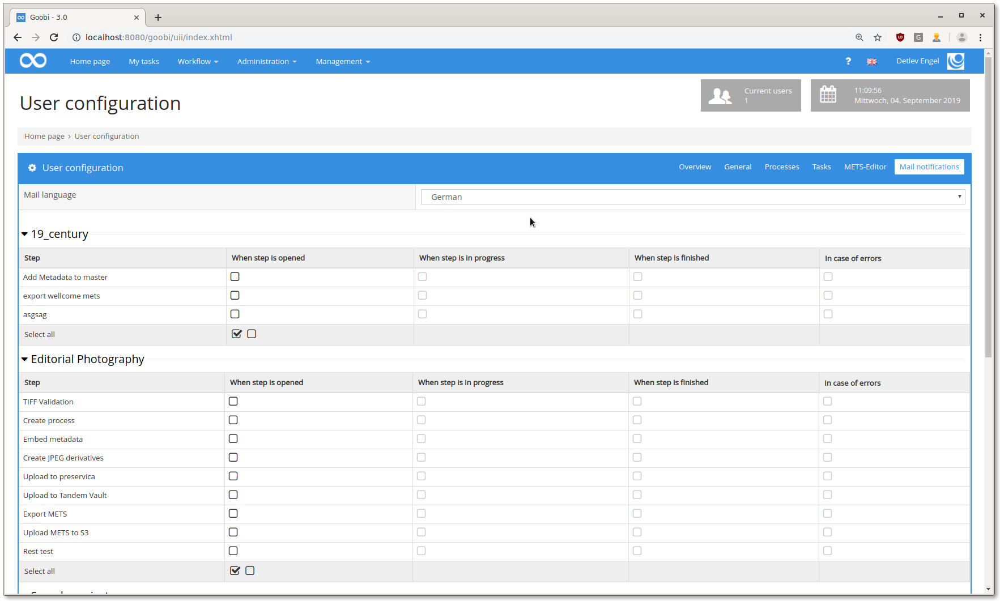

# August 2019

## ActiveMQ queues are now displayed

Already [some time ago](https://docs.intranda.com/goobi-workflow-digests-en/2019/04) we added a new queue to Goobi. There hasn't been much of this queue so far, it did its work quietly in the background.\
This has now been changed. There is a new page where administrators can view the queues and also cancel jobs.



[https://github.com/intranda/goobi/commit/38a43c078f403b24cc1fb2910e619ad189e3c4a2](https://github.com/intranda/goobi/commit/38a43c078f403b24cc1fb2910e619ad189e3c4a2) [https://github.com/intranda/goobi/commit/e3331d76932a20f1aa750f4be227264c123e7a10](https://github.com/intranda/goobi/commit/e3331d76932a20f1aa750f4be227264c123e7a10) [https://github.com/intranda/goobi/commit/e3331d76932a20f1aa750f4be227264c123e7a10](https://github.com/intranda/goobi/commit/e3331d76932a20f1aa750f4be227264c123e7a10)

## Improved stability of GoobiScript

If GoobiScripts were executed and new ones were started in parrallel there was an error, because two methods tried to access the list of GoobiScripts at the same time. This bug is now fixed, the entire GoobiScript administration is thread-safe.

[https://github.com/intranda/goobi/commit/349a75d98492779075db61e134783dc34862c9a7](https://github.com/intranda/goobi/commit/349a75d98492779075db61e134783dc34862c9a7) [https://github.com/intranda/goobi/commit/5906bcecc0855bc9286c310193e87049131820f6](https://github.com/intranda/goobi/commit/5906bcecc0855bc9286c310193e87049131820f6)

## Faster query of steps

If a user was assigned a large number of steps (\~30,000), it took up to 10 seconds to list the tasks. The same was valid for the submission of tasks. The two responsible SQL queries were optimized and are now also fast for users with more than 30,000 assigned steps.

[https://github.com/intranda/goobi/commit/ec5fb70fa8af702f813d58f256ef5808c3cebf77](https://github.com/intranda/goobi/commit/ec5fb70fa8af702f813d58f256ef5808c3cebf77) [https://github.com/intranda/goobi/commit/5373c1887509cd34cfdf17060fe7463d4568cb1d](https://github.com/intranda/goobi/commit/5373c1887509cd34cfdf17060fe7463d4568cb1d)

## Show all installed plugins

There is a new page listing all installed plugins. There is also information whether the plugins are used in workflows. The new page is accessible via the admin menu.



[https://github.com/intranda/goobi/commit/953b733d652c99682b3221e1cea67ea4d67ed21e](https://github.com/intranda/goobi/commit/953b733d652c99682b3221e1cea67ea4d67ed21e) [https://github.com/intranda/goobi/commit/019f9ac744d4690de6427ea57f5cae13a92b4b17](https://github.com/intranda/goobi/commit/019f9ac744d4690de6427ea57f5cae13a92b4b17) [https://github.com/intranda/goobi/commit/aa88a32a873ed1a04e0b79a9a9a7b78d432af2a5](https://github.com/intranda/goobi/commit/aa88a32a873ed1a04e0b79a9a9a7b78d432af2a5)

## New GoobiScript for renaming processes

There is a new GoobiScript for renaming tasks. The syntax is:

```
action:renameProcess search:OLDNAME replace:NEWNAME type:contains|full
```

The system searches for `OLDNAME` in the process name of the process to be changed and replaces it with `NEWNAME`. If `type` is set to `full`, the entire process name must match `OLDNAME`. If `contains` is used, only the part of the process name that matches `OLDNAME` is replaced.


[https://github.com/intranda/goobi/commit/c1387648d3606304f0fe5f5bdf5532512d2b691f](https://github.com/intranda/goobi/commit/c1387648d3606304f0fe5f5bdf5532512d2b691f)

## Link files in process log

It is now possible to link files in the process log. You can upload them directly under the input mask for the message.


[https://github.com/intranda/goobi/commit/cbbcbdb54c99fee8349296d5f2893cdab7533855](https://github.com/intranda/goobi/commit/cbbcbdb54c99fee8349296d5f2893cdab7533855) [https://github.com/intranda/goobi/commit/1f299436c67fbcf26421bacd3b5bc6e331854c09](https://github.com/intranda/goobi/commit/1f299436c67fbcf26421bacd3b5bc6e331854c09) [https://github.com/intranda/goobi/commit/2032e423fddd3642e3a8876e863ef23ed8914fb5](https://github.com/intranda/goobi/commit/2032e423fddd3642e3a8876e863ef23ed8914fb5)

## List all images of a task in the process details view

Along with the file upload to the process log, a list of all image files currently in the process has been added.


## Send emails when a step is opened or closed

There is now the possibility to send emails to users when opening a step to which the user is assigned. Users with extended rights can also have emails sent to them when a step changes to any other status. The configuration is done for each user in his user settings per project and step type. The emails can also be unsubscribed directly via a link in the respective email.



[https://github.com/intranda/goobi/commit/16cd4c52679c658b6151e34a9b0b8e37c98a632d](https://github.com/intranda/goobi/commit/16cd4c52679c658b6151e34a9b0b8e37c98a632d)

## Link to display a process after creation is only shown to authorized users

After creating a process, a link is displayed that allows you to jump directly to the process. This link is now only displayed if the user has the necessary rights to see the process.

[https://github.com/intranda/goobi/commit/dfbc61977cb856bc1b7e870d9d42f61f82079dcb](https://github.com/intranda/goobi/commit/dfbc61977cb856bc1b7e870d9d42f61f82079dcb)

## New security prompt for GoobiScripts

The old arithmetic problem caused some frustration for some users, so we changed the query to show the GoobiScript to run and the number of affected operations. All you have to do now is type in the number of affected tasks.


[https://github.com/intranda/goobi/commit/f3964314b7d44d763f7fe9fa6b8dcd4151e5603f](https://github.com/intranda/goobi/commit/f3964314b7d44d763f7fe9fa6b8dcd4151e5603f)

## Docker images

There are now public docker images available for Goobi workflow. You can find them at [Docker Hub](https://hub.docker.com/r/intranda/goobi-workflow). These images are a basic installation without plugins and are intended as a basis for creating custom images. For the use of the images we have created an instruction under the following link, which also shows the connection to a database:

[https://github.com/intranda/goobi/blob/master/DOCKER.md](https://github.com/intranda/goobi/blob/master/DOCKER.md)

## Installation Instructions

There is now an installation guide for Goobi workflow. This can be found at the following link:

[Installation instructions](https://docs.intranda.com/goobi-workflow-en/admin/8)

The manual refers to `Ubuntu Linux 16.04` and can be worked through step by step. The installation also covers compiling and installing the most common Goobi plugins.