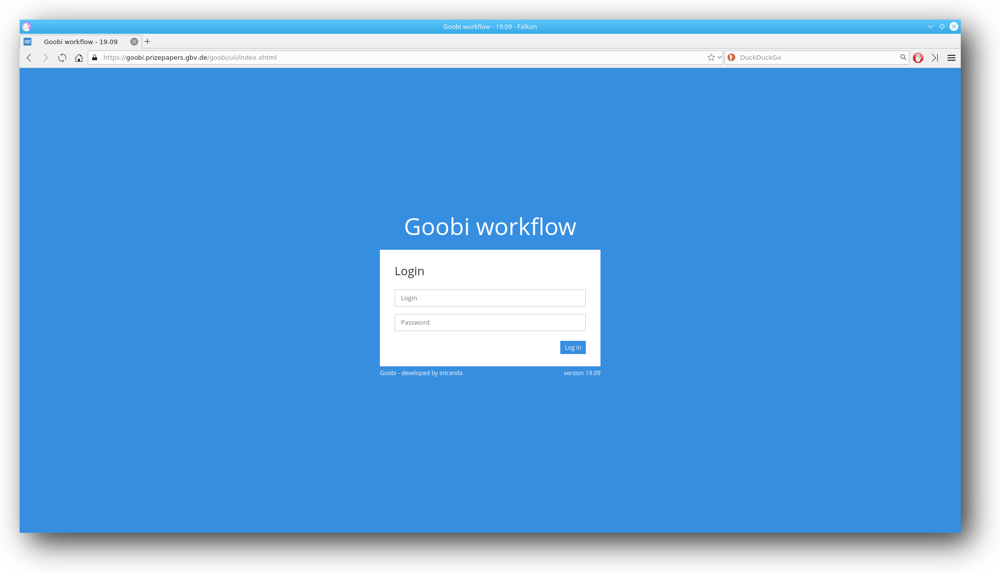
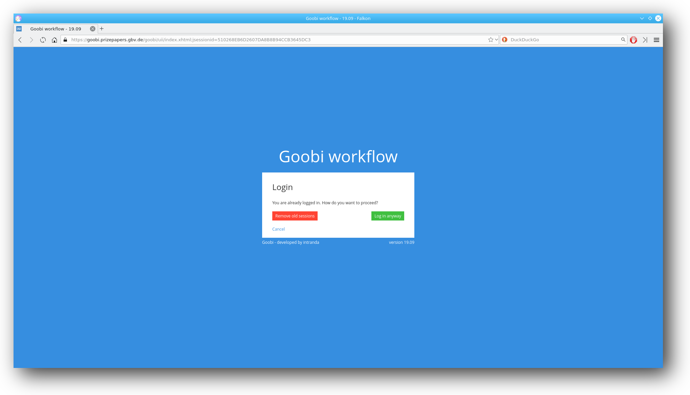
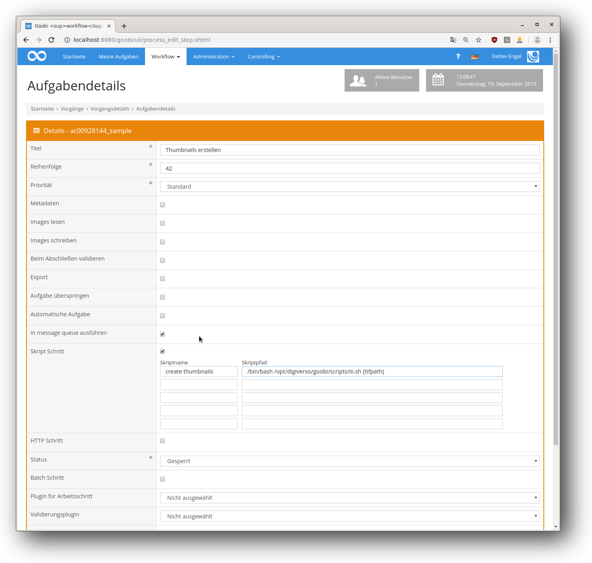

# September 2019

## New login screen

There is a new login screen that better reflects the "workflow" in the name.



[https://github.com/intranda/goobi/commit/5a9ed3e75e03cb04ef63ac20b74dda90b9bd8eb6](https://github.com/intranda/goobi/commit/5a9ed3e75e03cb04ef63ac20b74dda90b9bd8eb6)

## Removed intermediate session screen

If you were already logged in as a user and tried this again in another browser or on another computer, an intermediate page was displayed. It asked if the old sessions should be cleaned up. This intermediate page no longer shows up and you are logged in normally.



[https://github.com/intranda/goobi/commit/596353f747155ddcde9a8eca854798e30598108a](https://github.com/intranda/goobi/commit/596353f747155ddcde9a8eca854798e30598108a)

## New versioning for Goobi workflow

Since the Goobi days at the end of September there is a new versioning for Goobi workflow. The first release with the new versioning was "Goobi workflow 19.09". The first two figures are for the year, the second for the month in that year.  
Should there be a bugfix release, another number will be counted up, e.g. 19.09-1, 19.09-2 etc.

[https://github.com/intranda/goobi/commit/5a9ed3e75e03cb04ef63ac20b74dda90b9bd8eb6](https://github.com/intranda/goobi/commit/5a9ed3e75e03cb04ef63ac20b74dda90b9bd8eb6)

## Run automatic steps in a message queue

It is now possible to have automatic steps processed in a queue. Any number of workers can be assigned to the queue so that no load peaks occur on both smaller and larger systems.



[https://github.com/intranda/goobi/commit/ee7484fb88313203a9ca699414a2add3f53e149f](https://github.com/intranda/goobi/commit/ee7484fb88313203a9ca699414a2add3f53e149f) [https://github.com/intranda/goobi/commit/72a6d16bfe33aded4c0434cf68fa7f13584c8a9c](https://github.com/intranda/goobi/commit/72a6d16bfe33aded4c0434cf68fa7f13584c8a9c) [https://github.com/intranda/goobi/commit/0d94330938577a9a5897855d536342f629e88fe0](https://github.com/intranda/goobi/commit/0d94330938577a9a5897855d536342f629e88fe0)

## Personal information is also deleted when the user is deleted.

When a user is deleted in Goobi workflow, the following personal information is also deleted:

* username
* email
* given name
* family name
* ldap username

[https://github.com/intranda/goobi/commit/38d4f2f56d39015ff40bfc6b39e02c7193ded5d8](https://github.com/intranda/goobi/commit/38d4f2f56d39015ff40bfc6b39e02c7193ded5d8)

## Process Search: New filter: TemplateID

The REST endpoint for process search now also allows filtering by template IDs. A list with the template IDs to be filtered is passed with the search JSON object:

```javascript
{
  "templateIDs: [
    2,
    51,
    8
  ]
}
```

[https://github.com/intranda/goobi/commit/d42389620c1bc93f50b0b3a889645b73f5edd519](https://github.com/intranda/goobi/commit/d42389620c1bc93f50b0b3a889645b73f5edd519)