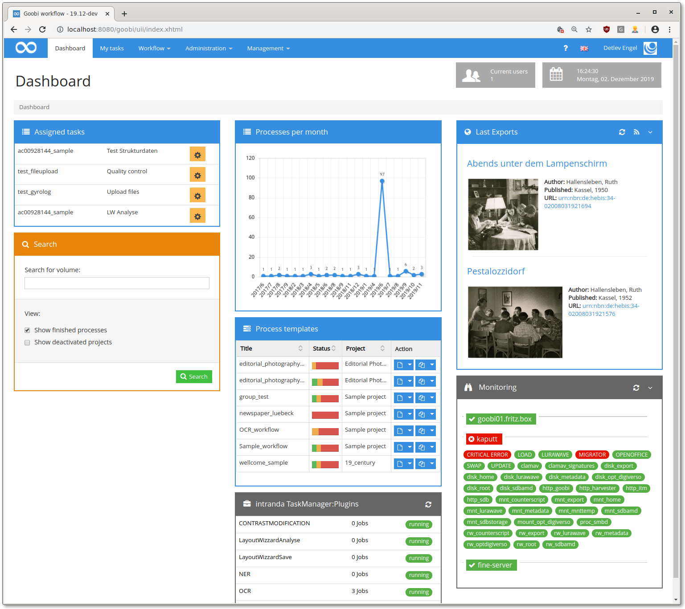

# October 2019

## New REST endpoint for file upload into an operation.

A file can now be copied to one of the image folders of an operation via multipart POST. The endpoint looks like this:

POST `https://mygoobi.tld/goobi/api/processes/{processId}/images/{folder}`

If `{folder}` is set to "master", it will be uploaded to the master folder, otherwise to the derivatives folder.

[https://github.com/intranda/goobi/commit/403d970d4ba95ecf87a710ec9357ed9bc2c27a13](https://github.com/intranda/goobi/commit/403d970d4ba95ecf87a710ec9357ed9bc2c27a13)

## Further SQL performance improvements

Further queries have been optimized.

[https://github.com/intranda/goobi/commit/7fddc8b303eca3a057dd070bf668293e2571f52a](https://github.com/intranda/goobi/commit/7fddc8b303eca3a057dd070bf668293e2571f52a)

## Release binaries

Travis is now building Goobi releases that will be released [on Github](https://github.com/intranda/goobi/releases).

## Support for GLB objects in 3D view

For better performance, GLB objects are now supported in the 3D view of the METS editor.

[https://github.com/intranda/goobi/commit/0250f80d3685a2698c15e1ff6ed3a2aad7579050](https://github.com/intranda/goobi/commit/0250f80d3685a2698c15e1ff6ed3a2aad7579050)

## Performance improvements of the extended dashboard

The extended dashboard has been completely redesigned to offer better performance and fewer bugs.

[https://github.com/intranda/goobi/commit/fd739050f8b89d04b7d02d9453f16e47f4f09fdb](https://github.com/intranda/goobi/commit/fd739050f8b89d04b7d02d9453f16e47f4f09fdb) [https://github.com/intranda/goobi/commit/83c5abdb4c7d342b50c7454dd0d55a9e64806334](https://github.com/intranda/goobi/commit/83c5abdb4c7d342b50c7454dd0d55a9e64806334) [https://github.com/intranda/goobi/commit/e9c4ffd3027eb37a30d5f20089ae59c3d7916cc2](https://github.com/intranda/goobi/commit/e9c4ffd3027eb37a30d5f20089ae59c3d7916cc2)

## Another GoobiScript fix

The latest changes to Goobiscript had introduced new bugs that made Goobi unusable in long queues. This has been fixed.

[https://github.com/intranda/goobi/commit/826b47d403cd830e2624e11eb7ffcc2a7da3bfee](https://github.com/intranda/goobi/commit/826b47d403cd830e2624e11eb7ffcc2a7da3bfee)