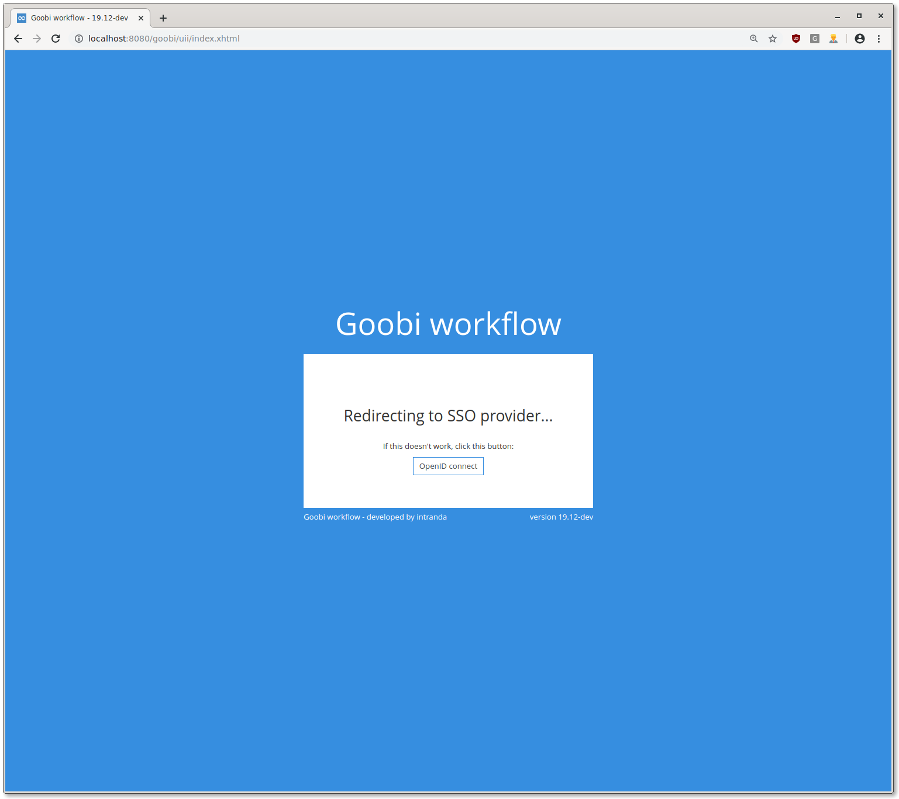
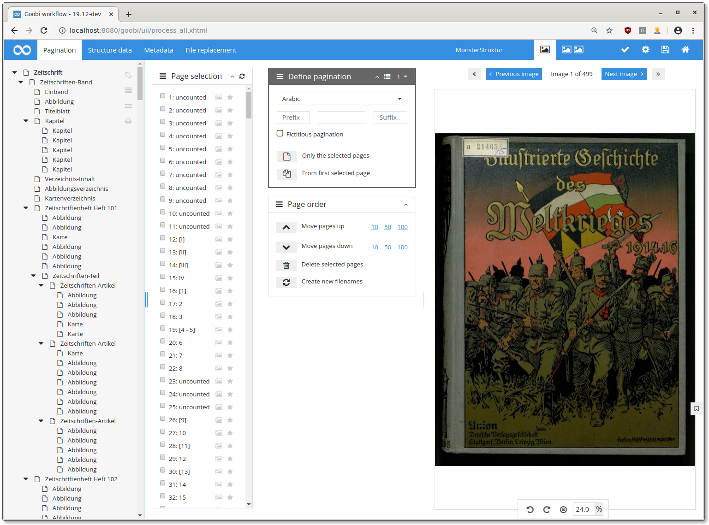

# November 2019

## Two new GoobiScripts

Two new GoobiScripts have been added:

* **deleteUserGroup** removes a user group from steps
* **renameStep**  renames a step in multiple processes

[https://github.com/intranda/goobi/commit/36d9e5c75b2523d5c13e6def32b07c926edb1611](https://github.com/intranda/goobi/commit/36d9e5c75b2523d5c13e6def32b07c926edb1611)

## Single sign on with openID Connect

Goobi workflow now supports openID Connect as an external authentication provider. The implementation is kept configurable and works with many openID Connect providers.

[https://github.com/intranda/goobi/commit/843e9d4d8ee2731803832736a98e3fcf43ec1df4](https://github.com/intranda/goobi/commit/843e9d4d8ee2731803832736a98e3fcf43ec1df4)[https://github.com/intranda/goobi/commit/29d78831087b5a42d484c32ffeb5a6cf0600b4e1](https://github.com/intranda/goobi/commit/29d78831087b5a42d484c32ffeb5a6cf0600b4e1)[https://github.com/intranda/goobi/commit/1d98eeaa59b393f6e5485db64c5f6470cdf1dc73](https://github.com/intranda/goobi/commit/1d98eeaa59b393f6e5485db64c5f6470cdf1dc73)

## New METS Editor

The new METS editor has landed in Goobi workflow stable. The primary goal of the conversion was to make the code more maintainable.

The new code structure has already allowed us to make some improvements. Most of these improvements avoid reloading the page, which should lead to a better workflow. For example, it is now possible to enlarge and reduce the size of individual areas without reloading.

Several dozen commits have been included in the new METS editor, so only the final merge commit is listed here:

[https://github.com/intranda/goobi/commit/cc72ab41a793d1c8986b6b4fc880bcd44cd75433](https://github.com/intranda/goobi/commit/cc72ab41a793d1c8986b6b4fc880bcd44cd75433)

## Message queue: Display the dead letter queue

If messages in the message queue could not be processed successfully several times, they have disappeared so far. From now on, Goobi will monitor the dead letter queue and display the messages from it in the user interface.

[https://github.com/intranda/goobi/commit/b8f294ceddfeb7e563efb27365c2a4709de45ab5](https://github.com/intranda/goobi/commit/b8f294ceddfeb7e563efb27365c2a4709de45ab5)

## Thumbnail folder: performance improvements

The `thumbs` folder in a Goobi workflow process folder contains pre-rendered smaller versions of the images in the master and derivative folders. If an image is requested that is smaller than one of the `thumbs` folders, that smaller image will be loaded and delivered.

Some performance optimizations have been made in the implementation of the logic described above. In addition, an image with exactly the right size is no longer loaded into memory, but passed directly to the browser.

[https://github.com/intranda/goobi/commit/de4659e3dde243a646a184c7e1621747969f6bc5](https://github.com/intranda/goobi/commit/de4659e3dde243a646a184c7e1621747969f6bc5) [https://github.com/intranda/goobi/commit/06bea9d7a87475416c03ce4ee0819ab1c9d1dc1e](https://github.com/intranda/goobi/commit/06bea9d7a87475416c03ce4ee0819ab1c9d1dc1e)

## EasyDB integration in the METS Editor

Analogous to the search in authority databases, there is now also the option of starting a search in easyDB from the METS Editor and linking an object from easyDB with a Goobi process.

[https://github.com/intranda/goobi/commit/d9d9fcd2e0fec2dcc95fa6e9baee30fe09f331e4](https://github.com/intranda/goobi/commit/d9d9fcd2e0fec2dcc95fa6e9baee30fe09f331e4)