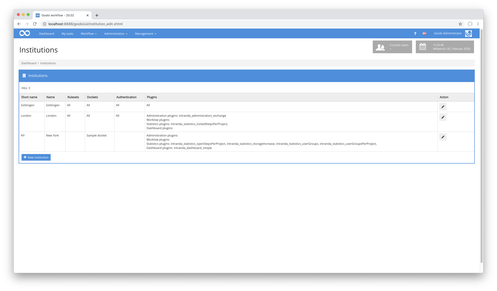
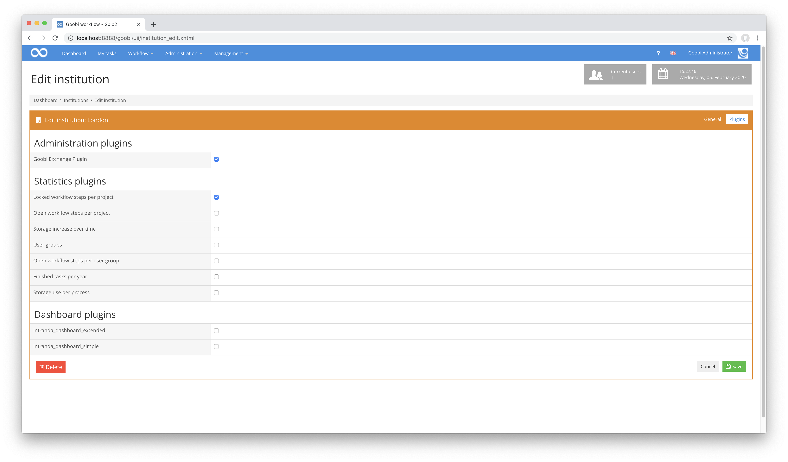
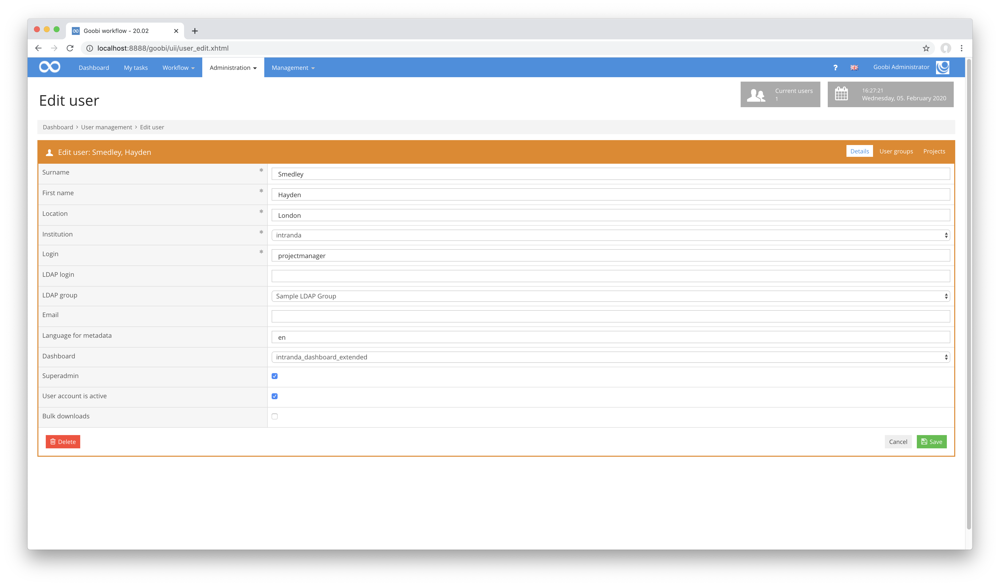
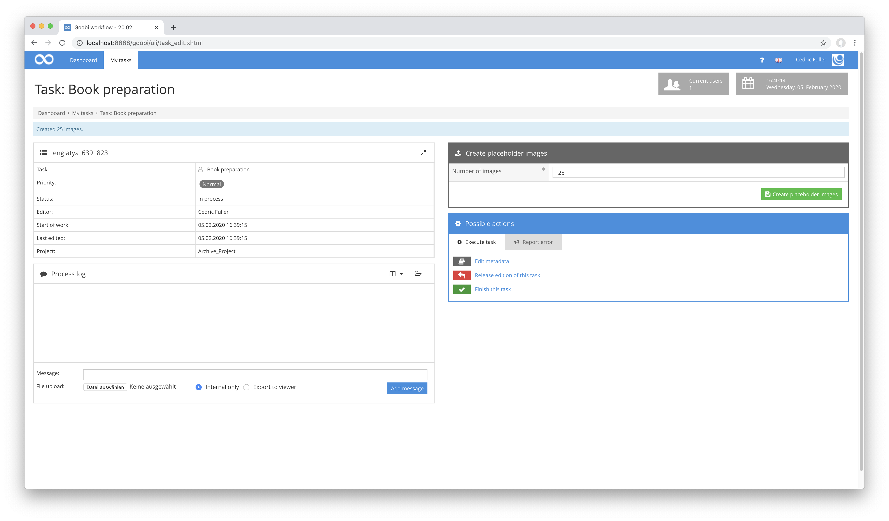
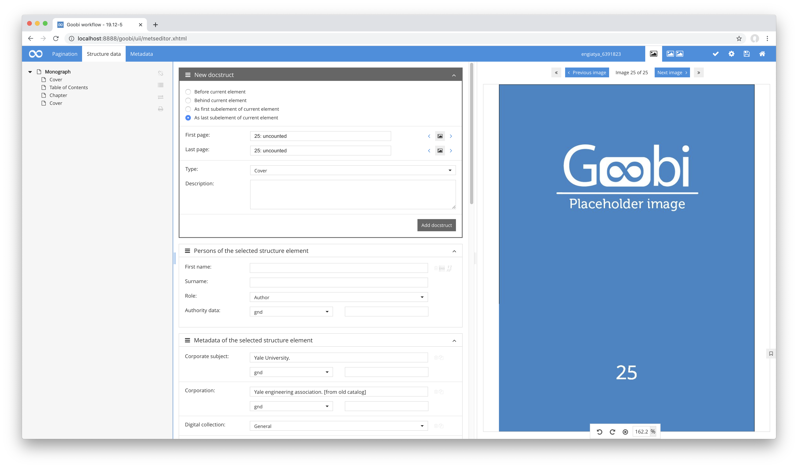
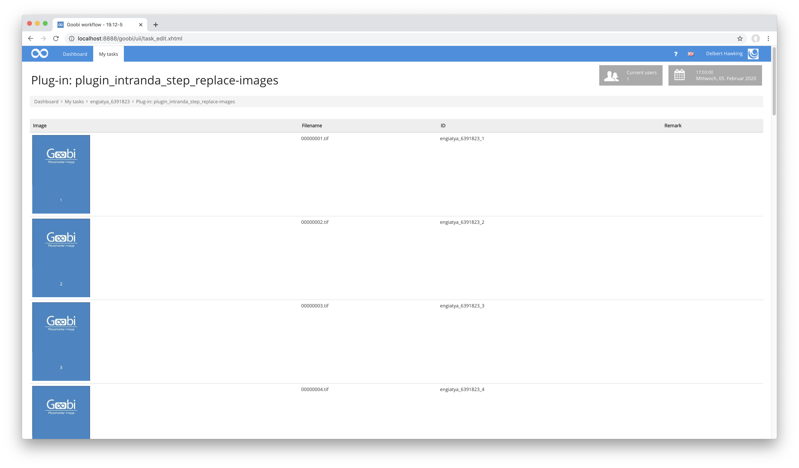
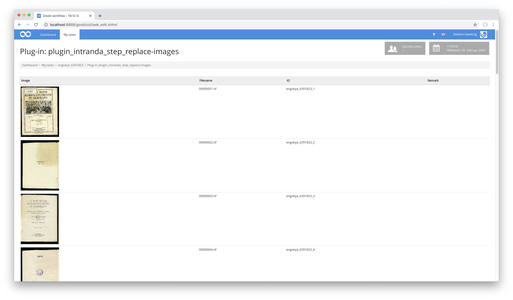
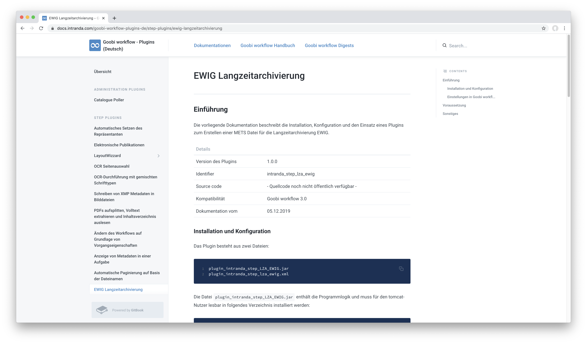
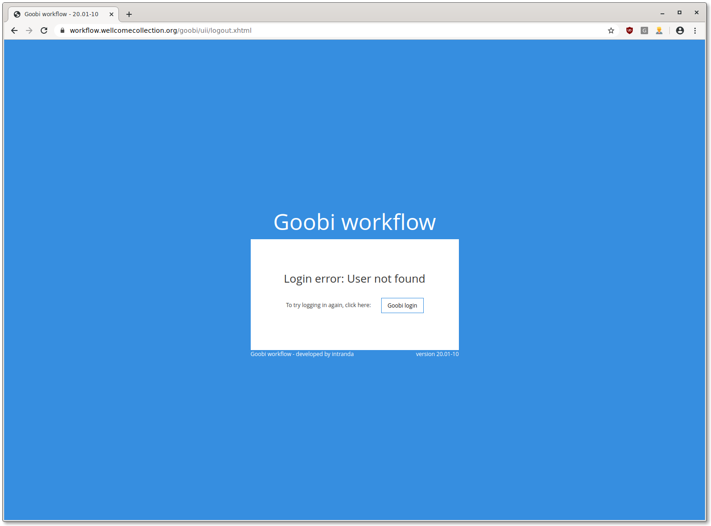

# December 2019

## Multi-client capability in Goobi workflow

With the current release, Goobi workflow is now multi-client capable. To this end, Goobi workflow now has `institutions` to which the routing slips, rule sets, users, groups and projects can be assigned. It is also possible to assign routing slips and rule sets to several institutions at the same time.





Because users of Goobi workflow are always assigned to just one institution, Goobi initially looks completely unchanged for normal users. In the background, however, the restriction to the institution in question already takes effect, preventing access to the content of the other institutions. The restriction also applies to administrators, who can also only adjust the settings for their own institution and add users for these institutions. For the administration of the institutions themselves, there is now a new superordinate rights level in Goobi workflow, `superadmin`.



For the commissioning of the multi-client capability at least one user must be given the right `superadmin`. This is possible by using the following customized SQL statement within the database, where the correct ID of the user is entered:

```sql
  update benutzer set superadmin = true where benutzerid = xyz
```

The super administrator created in this way can then create other super administrators within the Goobi workflow user interface.

[https://github.com/intranda/goobi/commit/6c41dd7969](https://github.com/intranda/goobi/commit/6c41dd7969)  
[https://github.com/intranda/goobi/commit/fac1506e8a](https://github.com/intranda/goobi/commit/fac1506e8a)  
[https://github.com/intranda/goobi/commit/3472e38eb4](https://github.com/intranda/goobi/commit/3472e38eb4)

## Two new plugins for a completely different way of working

In the past, we have been approached by a growing number of interested parties who would like to use Goobi in a completely different way to the way it is used in most other institutions. Specifically, the idea is that the workflows should be designed in such a way that it is possible to create a logical structure even before digitised material is created. The associated images, however, should only be entered afterwards. Thanks to the enormous flexibility of Goobi workflow, it was possible to find a solution for this too. Two new plug-ins were developed to enable this method of working:

First of all the new plugin `goobi-plugin-step-placeholder-creation` is used. Within its interface the user can define the number of placeholder images to be created and stored in the master image directory.



On the basis of the placeholder images created in this way, you can now work within the METS Editor almost as usual. Structural data and metadata can now be created and assigned to the respective pages.



The `goobi-plugin-step-replace-images` plugin is then used in the rest of the workflow. This allows the temporary placeholder images to be replaced by the actual digitized images. At the same time, the plugin ensures that the images to be uploaded via drag & drop only replace the desired files and that the files are automatically renamed independently of the original naming of the files, as specified by the placeholder images. However, the file extension is dynamically adapted to the uploaded file format, so that besides TIF files, JPEG, JP2 or other formats can also be used.





Should individual images not be created and uploaded during the upload, this is also immediately apparent, for example, within the Image-QA Plugin and in the Metadata Editor due to the conspicuous placeholder images.


For a better understanding, a screencast is available here, which runs through the process of such a workflow in a comprehensible way.



## EWIG Long Term Archive adjustments

The export plugin for the ingest into the long-term archive EWIG now supports submission manifests and also exports the contents of the process log. This means that it is now possible to trace within the long-term archive what exactly happened to the data and when during the workflow.



The detailed documentation for this plugin can be found at the following address:

[https://docs.intranda.com/goobi-workflow-plugins-de/step-plugins/ewig-langzeitarchivierung](https://docs.intranda.com/goobi-workflow-plugins-de/step-plugins/ewig-langzeitarchivierung)

## Fix for Single Sign On

If Goobi workflow is linked to a single sign-on via OpenID for authentication, an error has occurred in the past in the case of unknown users. Previously, these users were placed in an infinite loop during login, in which they were repeatedly forwarded to the login provider and then back to Goobi. The behaviour of Goobi has now been changed at this point so that a meaningful error page is displayed instead.



[https://github.com/intranda/goobi/commit/684f7638bd91ec5a788ac419b592fc20341e1cea](https://github.com/intranda/goobi/commit/684f7638bd91ec5a788ac419b592fc20341e1cea)