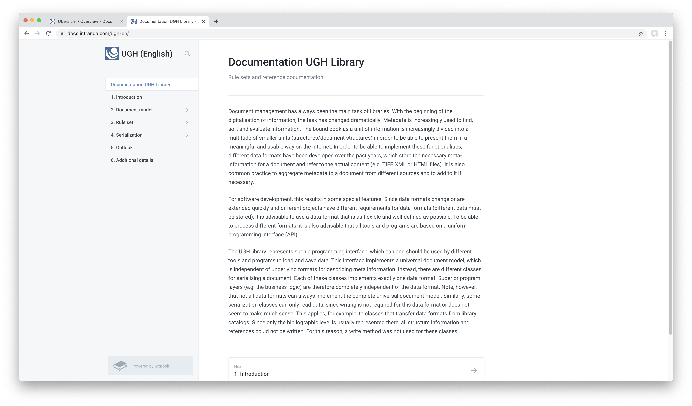

# January 2020

## Coming soon

* Migration of Goobi workflow for Java 11 support
* Extension of the vocabulary manager
* Implementation of a flexible editor for manuscript indexing

## Capture of image sections for structural and metadata

Thanks to extensive modifications to our metadata library UGH and to Goobi workflow, it is now possible to capture image sections in the METS Editor and add structural elements to them. This is done by simply clicking on the relevant button, in the same way as you would previously select a page area. You can then draw a frame on the image and assign structure and metadata. After creating such a screen section, it behaves in the same way as all previous structural elements.

A screencast is available here to illustrate the functionality and its operation:



[https://github.com/intranda/goobi/commit/bf60d7a8c6](https://github.com/intranda/goobi/commit/bf60d7a8c6)  
[https://github.com/intranda/goobi/commit/30670c2d15](https://github.com/intranda/goobi/commit/30670c2d15)  
[https://github.com/intranda/goobi/commit/22b366738e](https://github.com/intranda/goobi/commit/22b366738e)  
[https://github.com/intranda/goobi/commit/0e85656827](https://github.com/intranda/goobi/commit/0e85656827)  
[https://github.com/intranda/goobi/commit/deb7d1c177](https://github.com/intranda/goobi/commit/deb7d1c177)  
[https://github.com/intranda/goobi/commit/0dbfd01c24](https://github.com/intranda/goobi/commit/0dbfd01c24)

## Distribution of computing load over external machines

A message queue for the controlled processing of long-running tasks was introduced in Goobi Workflow last year. This functionality has now been extended once again. The new functionality differs from the existing queue in that jobs in this queue can also be read and executed by external programs outside Goobi. From now on, this will enable us to automatically distribute the load of computationally intensive tasks, such as a JPEG conversion, across several machines. Further machines for such calculations can now be added or simply switched off again without any great configuration effort.

[https://github.com/intranda/goobi/commit/7d61ccb265](https://github.com/intranda/goobi/commit/7d61ccb265)  
[https://github.com/intranda/goobi/commit/f2b7615cae](https://github.com/intranda/goobi/commit/f2b7615cae)  
[https://github.com/intranda/goobi/commit/e82e911e48](https://github.com/intranda/goobi/commit/e82e911e48)  
[https://github.com/intranda/goobi/commit/29c5c0275a](https://github.com/intranda/goobi/commit/29c5c0275a)  
[https://github.com/intranda/goobi/commit/99babcc433](https://github.com/intranda/goobi/commit/99babcc433)

## Right-to-left reading direction when navigating in the image display and thumbnails

The METS Editor has been supporting right-to-left metadata display within input fields for some time. However, a new feature is that the reading direction of a work is now also taken into account for the image display. A title whose reading direction is right-to-left can be marked as such. Thus, the image navigation as also the display of thumbnails adapts itself, so that the button for turning to the next page is arranged, for example, on the left instead of on the right. This change was not only implemented within the METS editor but also in the ImageQA plugin.

[https://github.com/intranda/goobi/commit/854d683f83b4ba0733b6a552da09726a7d0fcb97](https://github.com/intranda/goobi/commit/854d683f83b4ba0733b6a552da09726a7d0fcb97)  
[https://github.com/intranda/goobi/commit/4947bcb3a14e6549cf091821e1a017e3a29008f1](https://github.com/intranda/goobi/commit/4947bcb3a14e6549cf091821e1a017e3a29008f1)  
[https://github.com/intranda/goobi/commit/b05febe2f1a53bd3cb3880a9e8374dcf8f1744bf](https://github.com/intranda/goobi/commit/b05febe2f1a53bd3cb3880a9e8374dcf8f1744bf)  
[https://github.com/intranda/goobi/commit/e97e95ff4e1acf65ec1a7c924176b9468dbc0eaf](https://github.com/intranda/goobi/commit/e97e95ff4e1acf65ec1a7c924176b9468dbc0eaf)

## Audio/Video Media in METS-Editor

Another major change within the UGH metadata library and the METS editor in Goobi workflow is the new option of displaying audio and video media. This is technically based on techniques available in the browser. For browsers such as Firefox and Chrome, this means that they are capable of playing MP4, WebM and Ogg videos, as well as MP3, WAV and Ogg audio files, for example. In comparison, Internet Explorer supports MP4 videos and MP3 for audio media.

[https://github.com/intranda/goobi/commit/c8c84253ba](https://github.com/intranda/goobi/commit/c8c84253ba)

## 4K Display support in the METS Editor

The recently redesigned METS Editor had some display problems with very high monitor resolutions. Among other things, there were problems with larger zoom levels and when using 4K monitors. These problems were ultimately due to a rounding error and have now been fixed.

[https://github.com/intranda/goobi/commit/2d79176efd](https://github.com/intranda/goobi/commit/2d79176efd)

## Activation of over 200 JUnit tests

Gradually, over 200 JUnit tests were reactivated. These automated software tests had been developed some time ago. However, their execution had been deactivated in the past for the old Continuous Integration Platform due to lack of compatibility. By switching to Docker-based builds in our Jenkins and Travis, these issues have now been resolved and the tests have been reactivated.

[https://github.com/intranda/goobi/commit/0e68fc70f4](https://github.com/intranda/goobi/commit/0e68fc70f4)  
[https://github.com/intranda/goobi/commit/472bd7e0da](https://github.com/intranda/goobi/commit/472bd7e0da)

## First live instance of Goobi workflow within the Amazon cloud

Since the beginning of January 2020, the first Goobi instance within the Amazon cloud has gone live. Many of the developments made in recent months, such as the S3 connection, message queues and single sign-on using OpenID, were part and parcel of this move. We will continue to report on further developments in this area in the coming months.

## Conversion of the logging to Log4j2

The Log4j logging library used internally by Goobi was already a bit outdated. This month, we finally managed to integrate the new version with a new API into Goobi workflow. This change has affected almost all Java classes in Goobi workflow and is therefore certainly one of the biggest single commits in the history of Goobi.

[https://github.com/intranda/goobi/commit/6890576fea](https://github.com/intranda/goobi/commit/6890576fea)  
[https://github.com/intranda/goobi/commit/1927409014](https://github.com/intranda/goobi/commit/1927409014)

## Configurable export of file groups within METS files

There are now new options for controlling the creation of METS filegroups. You can now configure that instead of a specified configured mimetype and suffix, the file extensions are now used to specify the mimetypes of the files in the media folder. This allows a much more flexible generation of METS files depending on the actual files per object.

To use this functionality, the corresponding METS file group must be edited within the project settings. There the checkbox "Use file extensions and mimetype of files" must be activated.

It is also possible to exclude individual file types in a file group. This is necessary, for example, if one file group is to be created for audio files and another for the cover image. To do this, the list of unwanted file extensions must be entered in the "File extensions to be ignored" field. When creating the filegroup for the METS file, all files with this file extension will be skipped.

[https://github.com/intranda/goobi/commit/783bb301fc](https://github.com/intranda/goobi/commit/783bb301fc)  
[https://github.com/intranda/goobi/commit/cd94e77c2c](https://github.com/intranda/goobi/commit/cd94e77c2c)

## UGH documentation is now available online and multilingual

For the metadata library UGH there already existed in the past an extensive documentation as PDF file. This has now been transferred to the same documentation portal as numerous other documentations before.

At the same time we have translated this documentation into English. Thus the documentation of UGH can be maintained much better from now on, both regarding the topicality of the contents and the multilingualism.

[https://docs.intranda.com/ugh-de/](https://docs.intranda.com/ugh-de/)  
[https://docs.intranda.com/ugh-en/](https://docs.intranda.com/ugh-en/)