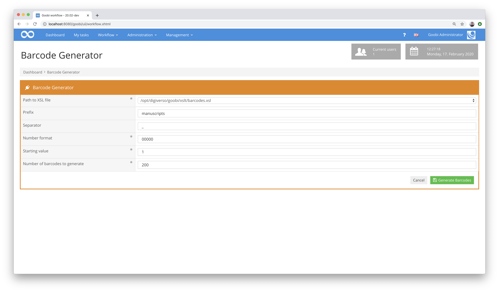
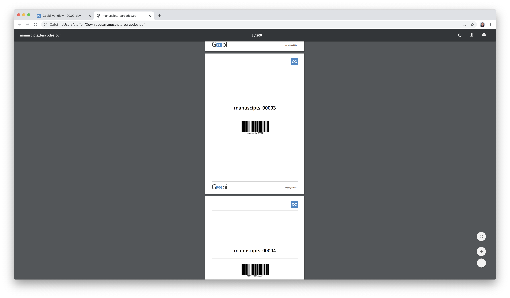

# February 2020

## Coming soon

In the coming weeks we will probably focus on the following points:

* Further expansion of scalability to cloud infrastructure
* Completion of the flexible editor for handwriting capture
* Automation of Goobi-to-go deployment
* Developing multilingualism

## METS-Editor: Pre-caching of images for higher performance image display

Within the METS Editor, the previous and next image of the currently displayed page is now preloaded. This has greatly reduced the waiting time for the next image to be displayed in case of scrolling, which has a very positive effect on the operation of the METS Editor.

[https://github.com/intranda/goobi/commit/cc5bf154e267a186aa12d9bbf9e8563d5b9d8e8e](https://github.com/intranda/goobi/commit/cc5bf154e267a186aa12d9bbf9e8563d5b9d8e8e)

## METS-Editor: Keep zoom level

Another improvement in the METS Editor is a feature that has been adopted from the Goobi viewer. This involves maintaining the current zoom level of the currently displayed image when you scroll to subsequent pages. For example, a zoom level on the page number is retained even when scrolling through the stack of images without having to enlarge the image repeatedly and align it for display in the image container.

[https://github.com/intranda/goobi/commit/2bcb3fff2e2f09f5178cf33431c0b1ddf3cfaa82](https://github.com/intranda/goobi/commit/2bcb3fff2e2f09f5178cf33431c0b1ddf3cfaa82)

## Enhancing multilingualism - Work in progress

Goobi workflow already has a user interface in German, English, Spanish and Hebrew. We are currently working on extending the range of languages for Dutch, Portuguese, French and Italian. This work has not yet been fully completed. However, we expect to be able to complete this in cooperation with the respective native speakers as early as March.

[https://github.com/intranda/goobi/commit/2736b5982065579dbf95224611a2a29b081e9857](https://github.com/intranda/goobi/commit/2736b5982065579dbf95224611a2a29b081e9857) [https://github.com/intranda/goobi/commit/2736b5982065579dbf95224611a2a29b081e9857](https://github.com/intranda/goobi/commit/2736b5982065579dbf95224611a2a29b081e9857) [https://github.com/intranda/goobi/commit/b5e229ad09be7c867b3b5238724d9ae9fe04f2a6](https://github.com/intranda/goobi/commit/b5e229ad09be7c867b3b5238724d9ae9fe04f2a6) [https://github.com/intranda/goobi/commit/ef9dfc54794cb4fa662d7a299e246ea01f1a8efc](https://github.com/intranda/goobi/commit/ef9dfc54794cb4fa662d7a299e246ea01f1a8efc) [https://github.com/intranda/goobi/commit/2736b5982065579dbf95224611a2a29b081e9857](https://github.com/intranda/goobi/commit/2736b5982065579dbf95224611a2a29b081e9857) [https://github.com/intranda/goobi/commit/dbc93d187122de2b64cc6f3490a630fcd92b9d26](https://github.com/intranda/goobi/commit/dbc93d187122de2b64cc6f3490a630fcd92b9d26)

## Enhanced PDF generation functionality - also in METS Editor

In the past, the METS Editor offered the possibility to print the structure tree. However, this functionality was no longer sufficient in recent years, as more and more information was required from users. In addition to the information about the structure tree, metadata and the representative of the image should also be displayed.

This functionality has now been developed. It replaces the previous button for printing within the METS Editor:

In addition, this function is also directly accessible from the operation list menu for each operation:

The PDF file created in this way usually looks like the following example. However, an individual design is also possible, since the mechanism of generation via XSLT transformation allows many degrees of freedom with regard to functionality and design.

[https://github.com/intranda/goobi/commit/b81d652c29d784a08c236fe72fc4de21770bf9c6](https://github.com/intranda/goobi/commit/b81d652c29d784a08c236fe72fc4de21770bf9c6)

## Non-Latin characters are supported in the dockets

So far we have had problems with the display of non-Latin characters within our generated dockets. By changing the default layouts, integrating Unicode-enabled fonts and some configuration work, we have now succeeded in ensuring that Hebrew characters, for example, can now also be displayed correctly.

[https://github.com/intranda/goobi/commit/96c6add77248342fa66ff4d242f29d847aa7bdd3](https://github.com/intranda/goobi/commit/96c6add77248342fa66ff4d242f29d847aa7bdd3)

## Java 11 Support

The further development of Java was accompanied by the fact that Goobi workflow was meanwhile specified to be operated with Java 8. We have now been able to remove this restriction and have achieved compatibility with the current Java 11. We then ran Goobi workflow on our own developer computers under Java 11 for the whole of February and found no further problems. This is how we declare Goobi fit for Java 11.

## New plugin for TIF validation and error messages

Up to now, TIF validation has been run via the TaskManager. This type of execution had the advantage that load peaks could be avoided. However, it also had a disadvantage, namely that a more precise control of the workflow was not possible. So far, only the TIF validation step itself could be closed or set to an error status in case of errors. With the new step plug-in for Goobi Workflow, it is now possible to open a specific previous step automatically after automatic image validation has failed. This step can then be accepted directly by a user to correct the errors in the images.

How the steps between the validation step and the one to which the error is reported can be configured within the plugin. As well as the question which folder contents should be validated and how exactly the image validation should be done.

More information and the documentation for the plugin can be found at the following address:


https://docs.intranda.com/goobi-workflow-plugins-en/step-plugins/intranda_step_jhove-validation


## Plugin for automatic renaming of files

A new plugin for renaming files was developed. It allows to automatically rename the images in the process folder according to a freely selectable scheme. All the variables that are also available in script steps and other parts of Goobi workflow are available for this. As usual, these variables are also available within the Goobi workflow documentation:


https://docs.intranda.com/goobi-workflow-en/manager/8


The documentation for the plugin can be found at:


https://docs.intranda.com/goobi-workflow-plugins-en/step-plugins/intranda_step-rename-files


## Barcode generation plugin

For one project a plugin was needed where individual barcodes can be generated. This is a workflow plugin, within which only a prefix, a start value and a number of barcodes to be generated have to be specified. In addition, it is also possible to select the appearance of the barcodes from various templates. Similar to the routing slips, this is again based on a transformation via XSLT, which allows a completely free visual design of the barcodes to be generated. Thus, it is possible to influence how the paper format, the page layout, contents and also the barcode type to be used should be designed.

The barcodes can look like this example:

A documentation for the new plugin can be found at the following address:


https://docs.intranda.com/goobi-workflow-plugins-en/workflow-plugins/plugin-workflow-barcode-generator


To illustrate the operation of the plugin, a screencast is also available here:


https://youtu.be/Eh8H4k1sKvE
