# March 2020

## Coming soon

In the coming weeks we will probably focus on the following points:

* LayoutWizzard extensions
* Audio and Video integrations
* Documentation
* Extension of the vocabulary functionalities

## Projects now with own editable identifiers

Projects now have a new data field, the `Identifier`. This new value is also available in the so-called Variable Replacer. This means that this new information can also be used within scripts, on run sheets or in plugins like the new file renaming plugin (see below).

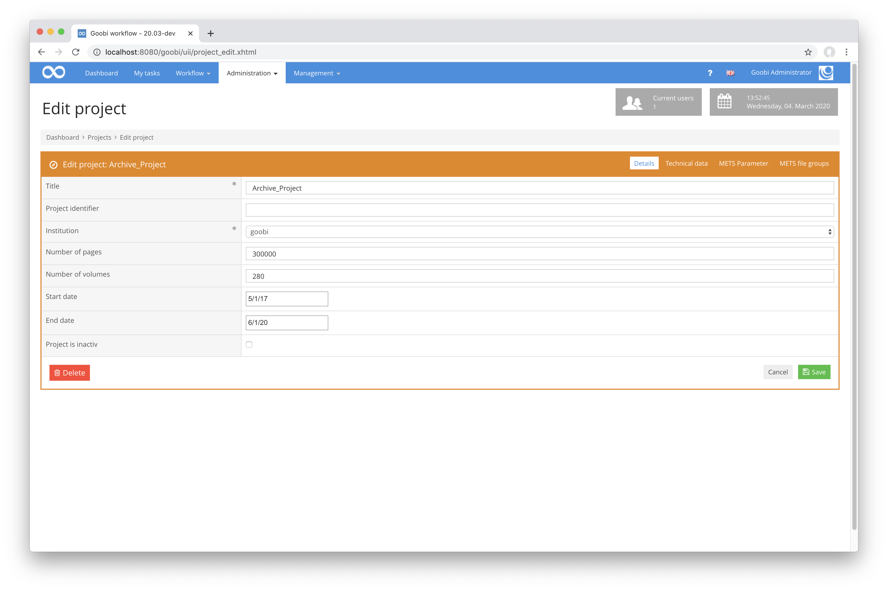

[https://github.com/intranda/goobi/commit/30d41e7969e26c5268602dcd47bad3651c313116](https://github.com/intranda/goobi/commit/30d41e7969e26c5268602dcd47bad3651c313116) [https://github.com/intranda/goobi/commit/38c2cbd58d52c260b29c2645bf88f4968ca0d897](https://github.com/intranda/goobi/commit/38c2cbd58d52c260b29c2645bf88f4968ca0d897) [https://github.com/intranda/goobi/commit/7e14445cd902540f74a42653b7c6db9dfee095a9](https://github.com/intranda/goobi/commit/7e14445cd902540f74a42653b7c6db9dfee095a9)

## New plugin: Flexible editor for manuscript indexing

There is now a new, enormously flexible editor that has been implemented for the indexing of manuscripts, but which can also be used in other areas. It basically consists of three columns, each of which can contain any number of boxes within which several input fields can be grouped. The special feature is that the contents of the individual boxes do not all have to be displayed at first. This enables the user to have an overview of the entire form without having to scroll. The individual boxes within the respective areas are activated by clicking on one of the badges and are thus visible. In this way, form fields that are not required are hidden and do not clutter the screen with unnecessary space-intensive components.

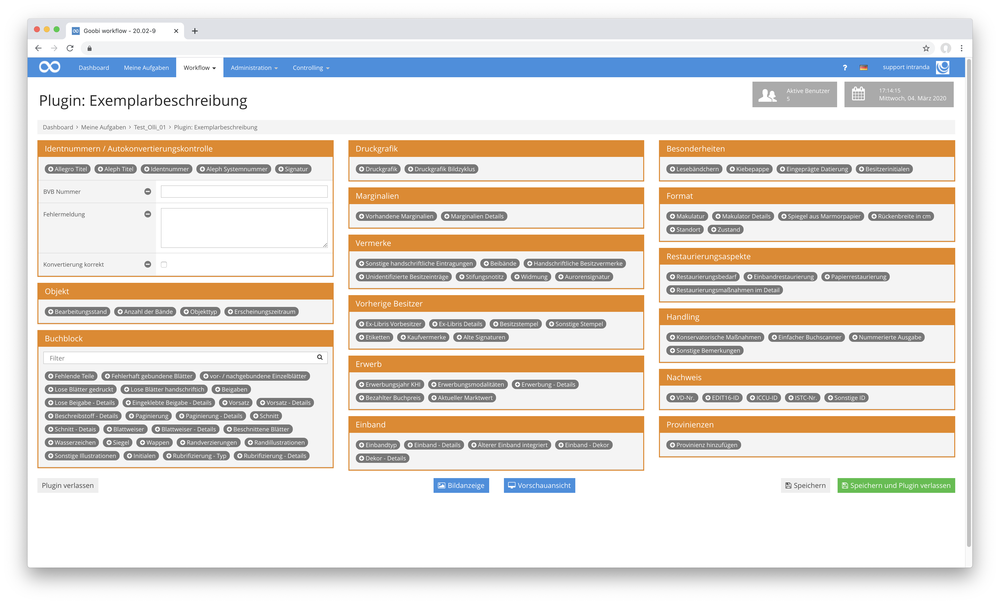

The individual fields within each box can be typed. This way it can be determined that certain information can be captured via input boxes, selection fields, text areas, checkboxes etc. in order to optimize the operation as much as possible.

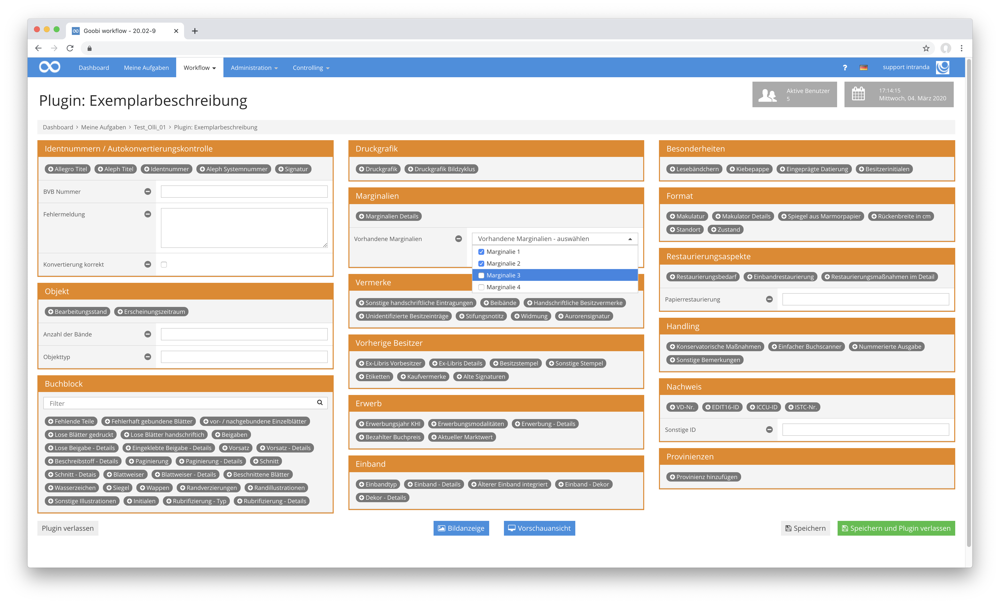

Among other things, the functionality that the values for selection fields come from the new vocabulary manager comes into play. This allows you to manage controlled vocabularies within Goobi and use them directly within the Handwriting Editor.

All the content of the new manuscript editor is controlled via the plugin's configuration file and can be modified on the fly.

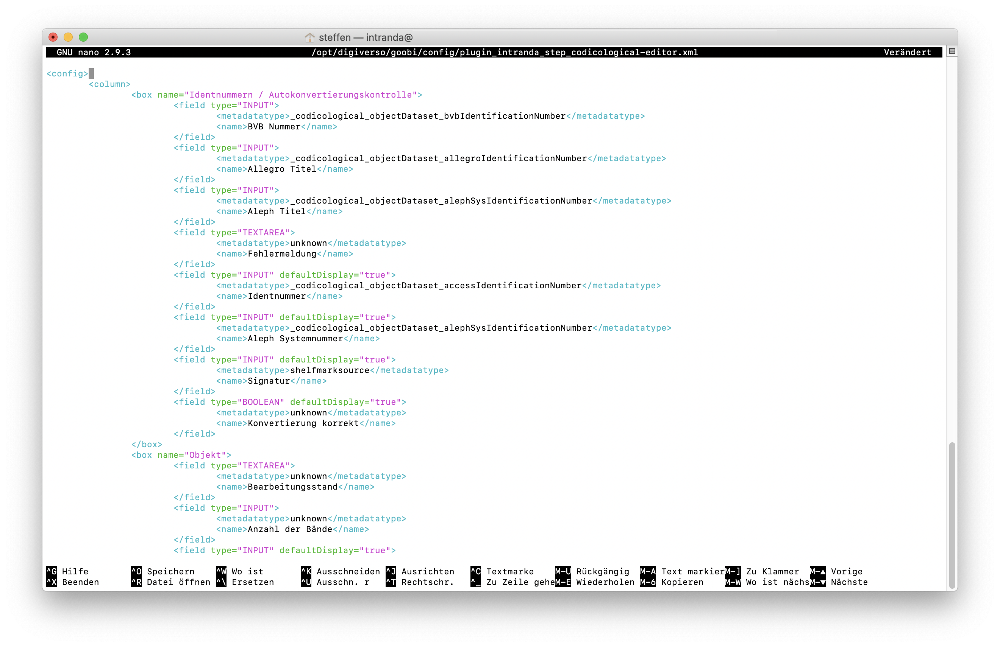

## Vocabulary manager as part of Goobi workflow

For some time now, an administration plugin for the management of vocabularies had already existed. This plugin has now been incorporated into the core of Goobi workflow and is now a central basic component for all Goobi workflow installations.

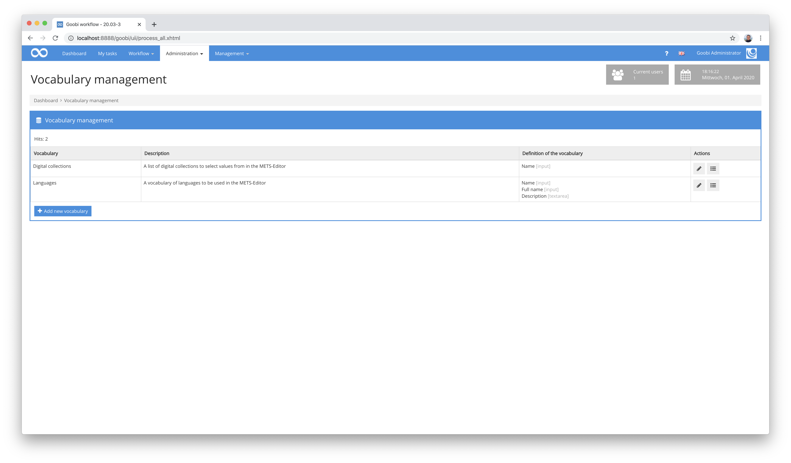

Within this new vocabulary manager, any number of vocabularies can now be defined and edited. For the creation and configuration of a vocabulary the authorization `Vocabulary management - Administration` is required as a special right level. For the administration of individual vocabulary data sets, however, the authorization `Vocabulary management - data sets` is required.

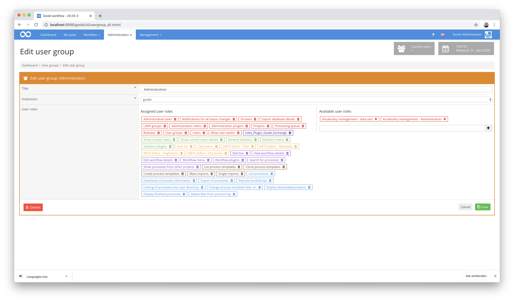

Various options are available for the administration of a vocabulary. For example, different fields of different types can be defined, each of which has multilingual content, can be prefilled with content and can also be defined as mandatory fields.

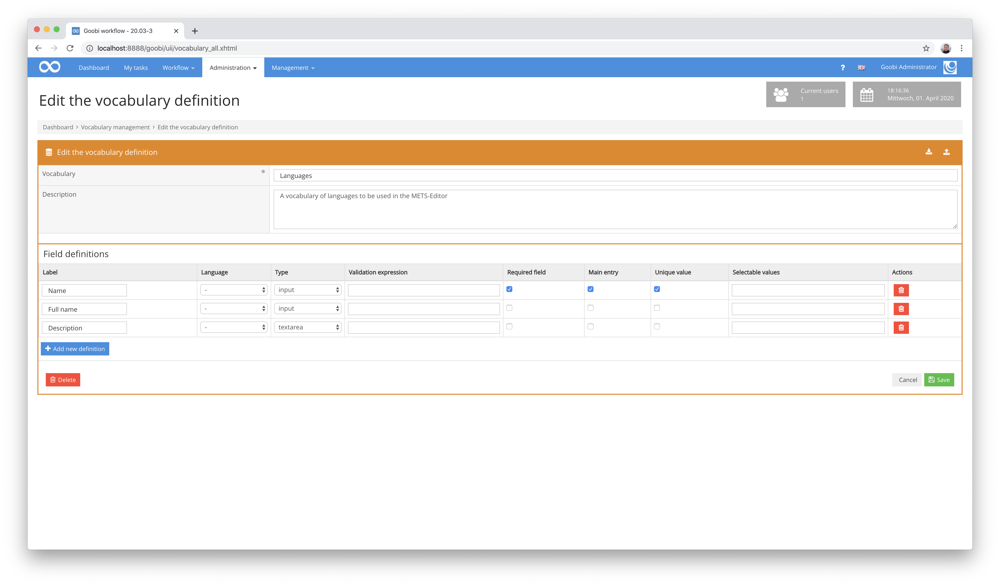

An import and export mechanism via the Microsoft Excel data format is also available for convenient data exchange. Already existing controlled vocabularies can thus be imported automatically even with large amounts of data.

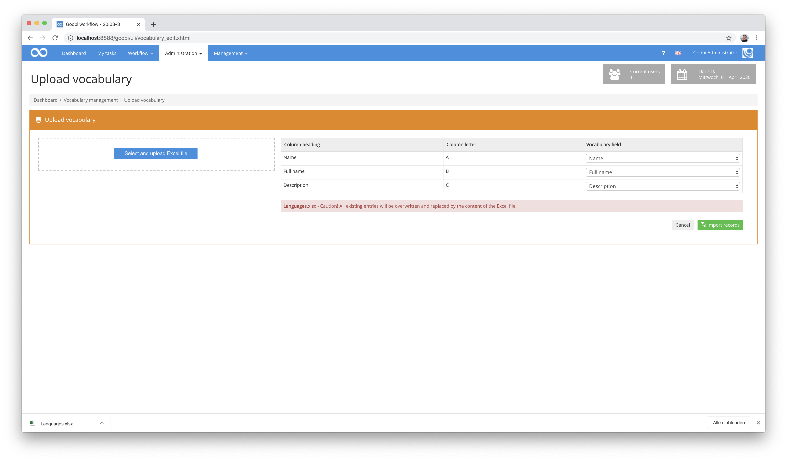

The interface for editing the individual data records of a vocabulary adapts dynamically to the vocabulary definition. Depending on the configuration, several different fields of different types can be filled out per record.

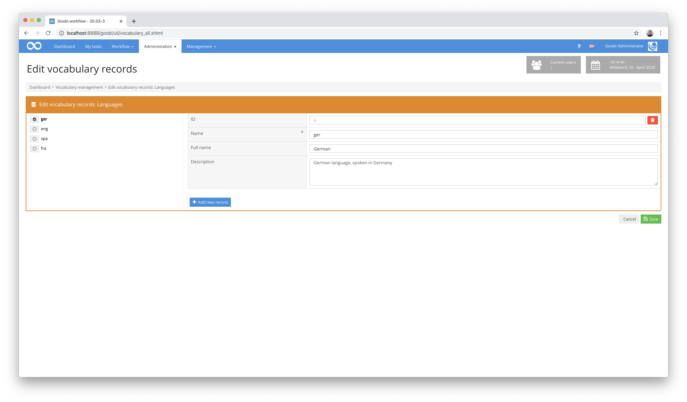

The data sets created in this way are then available via a REST API for access by external applications, can be used within the METS Editor for use as metadata, or can be used for automatic enrichment of metadata.

[https://github.com/intranda/goobi/commit/e515dac2ed6835a0a6a5d81fc0ea50b1a4b22f83](https://github.com/intranda/goobi/commit/e515dac2ed6835a0a6a5d81fc0ea50b1a4b22f83) [https://github.com/intranda/goobi/commit/4d2bd8c118272f0b7d01ff25ad56bb32bbc99e7b](https://github.com/intranda/goobi/commit/4d2bd8c118272f0b7d01ff25ad56bb32bbc99e7b) [https://github.com/intranda/goobi/commit/17c1d9072bcf9c13cd8036330149ba591c1f4103](https://github.com/intranda/goobi/commit/17c1d9072bcf9c13cd8036330149ba591c1f4103) [https://github.com/intranda/goobi/commit/7479bb8220307fed4c92a8b23e1c537984b652e1](https://github.com/intranda/goobi/commit/7479bb8220307fed4c92a8b23e1c537984b652e1) [https://github.com/intranda/goobi/commit/c7b6c86d6a0f91f7dc588c763c07e342f1b940e9](https://github.com/intranda/goobi/commit/c7b6c86d6a0f91f7dc588c763c07e342f1b940e9)

## Selection fields for the Mets Editor with content from Vocabulary Manager

Within the METS Editor it is now possible to select field contents from a vocabulary of the Vocabulary Manager. Thus, you can now define your own controlled vocabularies via the user interface and use them for metadata capture. There are two different working methods for this:

A selection of data records can be easily made via a drop-down field, which is defined within the configuration file `goobi_metadataDisplayRules.xml`:

```markup
<vocabularyList ref="singleDigCollection">
  <source>Digital collections</source>
</vocabularyList>
```


A selection of records is also possible via a search form, as is also possible for other vocabularies (e.g. Viaf, GND, Geonames etc.). In this case the configuration in the file `goobi_metadataDisplayRules.xml` is done as follows:

```markup
<vocabularySearch ref="SubjectTopic">
  <source>Languages</source>
  <field>Name; Full Name; Description</field>
</vocabularySearch>
```

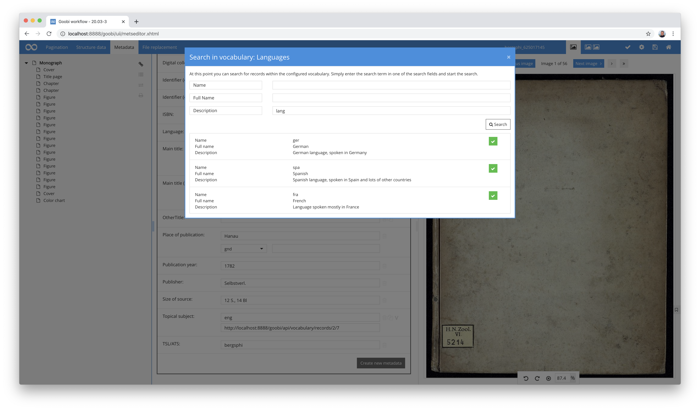

Incidentally, for both use cases it is important that Goobi's REST API is active and allows access to the vocabulary within the `goobi_rest.xml` configuration file as follows:

```markup
<endpoint path="/vocabulary.*">
  <method name="get">
    <allow />
  </method>
  <method name="post">
    <allow />
  </method>
</endpoint>
```

## New plugin to automatically find and replace metadata from a vocabulary

The new vocabulary management functionality allows many new usage scenarios for Goobi workflow. For example, a plug-in has been developed in this context that can automatically make corrections to existing metadata. To do this, you can specify within the configuration of the plugin which metadata is to be used as source information and in which metadata the target information is to be written. Thus, the following scenario can be covered:

* within the metadata, different variants of the same location in different spellings and abbreviations, each without standard data specification, are displayed in the field `Place of publication`
* This use case applies to numerous cities within the data sets with different notations
* In a vocabulary, places are defined with the different spellings and abbreviations used, as well as the desired similar spelling
* It is also defined in the vocabulary that a link to the standard data set from GeoNames should be used for the corrected value of the place of publication. For this purpose, the authority and the dataset identifier to be used is stored for the location
* The plug-in is automatically executed before a digital asset is published in the Goobi workflow. It analyses all metadata fields to determine whether there is a replacement definition for them. If such a value is found, the required target notation is used together with the standard data specifications and written to the target field. If the configured metadata field does not contain any other spelling in the vocabulary, the source value is copied to the target field unchanged together with any existing standard data.

The configuration of such a replacement definition looks like this as an example:

```markup
<config_plugin>
  <config>
    <project>*</project>
    <step>*</step>
    <entry>
      <fieldFrom>originalPlaceOfPublication</fieldFrom>
      <fieldTo>PlaceOfPublication</fieldTo>
      <vocabulary>Place vocabulary</vocabulary>
      <contentSearch>original value</contentSearch>
      <contentReplace>corrected value</contentReplace>
      <contentAuthority>authority</contentAuthority>
      <contentAuthorityUri>authorityURI</contentAuthorityUri>
      <contentAuthorityValueUri>valueURI</contentAuthorityValueUri>
    </entry>
  </config>
</config_plugin>
```

Within the vocabulary, data records are stored for the various abbreviations and spellings, which are to be taken into account for the replacement:


After the successful run of the plugin, the metadata is automatically enriched. These replacements can also take place repeatedly within the workflow and update the configured target fields with the currently valid version from the vocabulary.


The detailed documentation of the plugin can be found here:



## Neuer Plugin-Typ für Part-GUI und Full-GUI gleichzeitig

In the past, there were three variants of the Goobi step plug-ins:

| Type   | Description                                                                                                |
| ------ | ---------------------------------------------------------------------------------------------------------- |
| `NONE` | Plugins completely without user interface                                                                  |
| `PART` | Plugins with a partial user interface, integrated into an accepted task (example: File Upload Plugin)      |
| `FULL` | Plugins with a complete user interface, which are entered from an accepted task (example: Image-QA-Plugin) |

A new variant has been added, which now allows a plugin to support both a partial and a complete user interface.

| Type            | Description                                                                                          |
| --------------- | ---------------------------------------------------------------------------------------------------- |
| `PART_AND_FULL` | Plugins with partial and complete user interface at the same time (example: revised Image-QA-Plugin) |

In this way it is now possible for a plugin, for example, to display a preview of what can be viewed and edited in detail in the complete user interface within an accepted task. This was first implemented using the Image-QA Plugin as an example.


[https://github.com/intranda/goobi/commit/05d755e8d738a6d4248307c55861c7f6ca75a7cc](https://github.com/intranda/goobi/commit/05d755e8d738a6d4248307c55861c7f6ca75a7cc) [https://github.com/intranda/goobi/commit/80ea9855ba60ce1ad54322668798562211086e12](https://github.com/intranda/goobi/commit/80ea9855ba60ce1ad54322668798562211086e12) [https://github.com/intranda/goobi/commit/a824f97aa7044d6e302eb7a67dd77af2e6300ebc](https://github.com/intranda/goobi/commit/a824f97aa7044d6e302eb7a67dd77af2e6300ebc)

## Revision and documentation of the Image-QA-Plugin

The Image QA Plugin is one of the most widely used plugins. It has received several updates in the past. However, it has never been publicly documented. This month we have tackled this once. Besides several major and minor visual adjustments, we implemented extensive support for 3D objects and created a documentation.


And in case you don't know it yet, the QA plugin can do much more than just display images. Among other things it can do the following:

* in different workflows it can behave differently with regard to display and functionality
* a download of single or multiple images is possible
* Images can be rotated individually or together in 90 degree steps
* Images can be deleted
* there is a full screen display
* Full texts can be displayed parallel to the image
* PDF files can be generated
* the number of thumbnails is configurable
* the resolution of the zoom levels for the large image is configurable
* it is the first plugin to support the new display variant `PART_AND_FULL` for displaying thumbnails directly within the task




[https://github.com/intranda/goobi/commit/6bba5b0d27c4e2ff8420a9a1fb8ae382c4cc8fa1](https://github.com/intranda/goobi/commit/6bba5b0d27c4e2ff8420a9a1fb8ae382c4cc8fa1) [https://github.com/intranda/goobi/tree/a322a94342beedd4a2c730ad4e8671814ff793fc](https://github.com/intranda/goobi/tree/a322a94342beedd4a2c730ad4e8671814ff793fc)

## Plugin for displaying specific validation results within tasks

A few months ago, a special import plug-in was developed that allows a mass import of metadata from an Excel spreadsheet and allows a detailed validation of the field contents even before the actual import. More about this plugin can be found in its documentation here:



In addition, there is now a second plugin that works closely with this import plugin. It reuses the same configuration file once again and provides a repeated possible display of metadata that was previously imported and revised during the workflow. As a step plug-in, it allows repeated execution and combined execution together with access to the Goobi workflow metadata editor.


[https://docs.goobi.io/goobi-workflow-plugins-en/step-plugins/intranda_step_metadata_yerusha_validation](https://docs.goobi.io/goobi-workflow-plugins-en/step-plugins/intranda_step_metadata_yerusha_validation)

## Numerous optical adjustments in several places

Goobi workflow has undergone numerous minor visual changes that cannot be discussed in detail here. The majority of these visual adjustments relate to layout issues, standardising spacing and font sizes and icon display. In this context, we have also assigned slightly modified icons to a number of functions in order to avoid duplication and ensure that the layout is standardised.

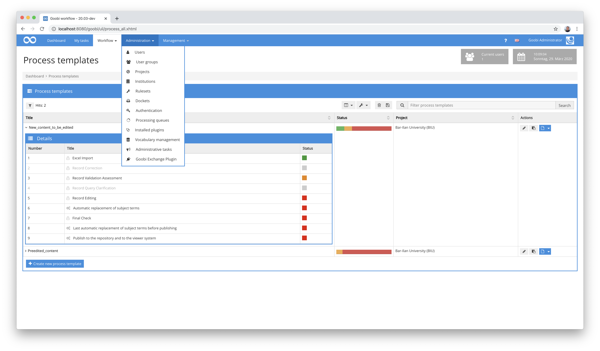

After the major Updated METS Editor in November and December 2019, we received repeated feedback that it should still be possible to navigate between pages within the METS Editor by skipping one page at a time. This had been abolished in the context of the homogenization of the Paginator during the conversions. With our conversions we have now restored this function, so that navigation no longer has to be carried out in individual page jumps.


[https://github.com/intranda/goobi/commit/dc6adab07ef74a10dd1d0f570a3297141c11efc0](https://github.com/intranda/goobi/commit/dc6adab07ef74a10dd1d0f570a3297141c11efc0) [https://github.com/intranda/goobi/commit/940dc8d68f2b21f4e8a4f0566fba8ba7585b1990](https://github.com/intranda/goobi/commit/940dc8d68f2b21f4e8a4f0566fba8ba7585b1990) [https://github.com/intranda/goobi/commit/92a8ae02f79da6dde326f27ed60c45d80262599c](https://github.com/intranda/goobi/commit/92a8ae02f79da6dde326f27ed60c45d80262599c) [https://github.com/intranda/goobi/commit/6484491167c12f1a0ab29a6f5b7f1cbea5145fcf](https://github.com/intranda/goobi/commit/6484491167c12f1a0ab29a6f5b7f1cbea5145fcf) [https://github.com/intranda/goobi/commit/531986e7430213c739a5312300137868777378e3](https://github.com/intranda/goobi/commit/531986e7430213c739a5312300137868777378e3)