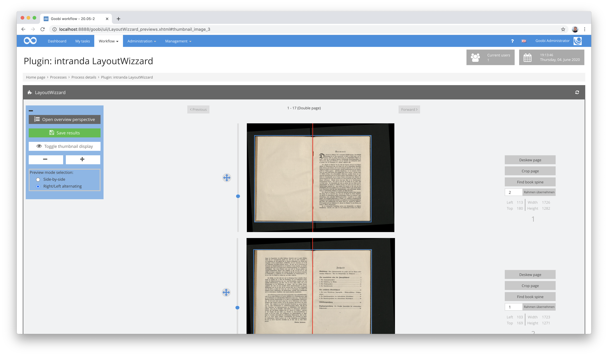
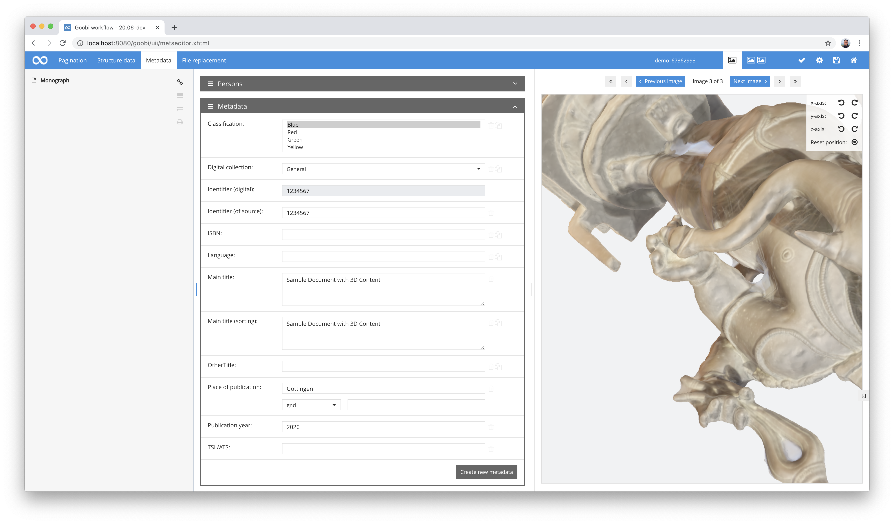
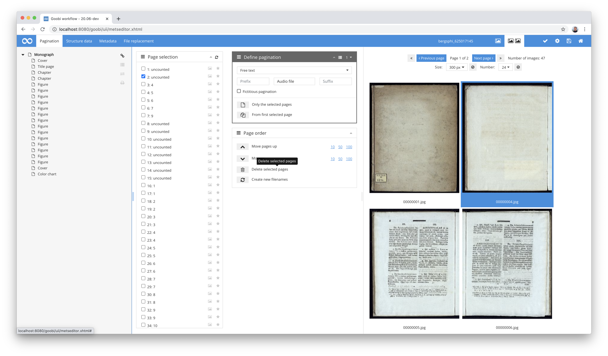
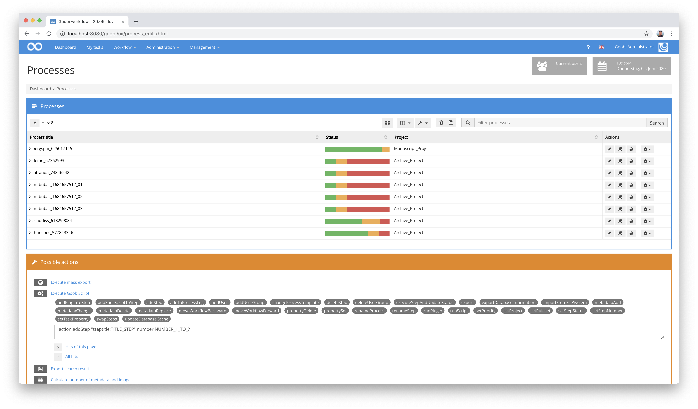
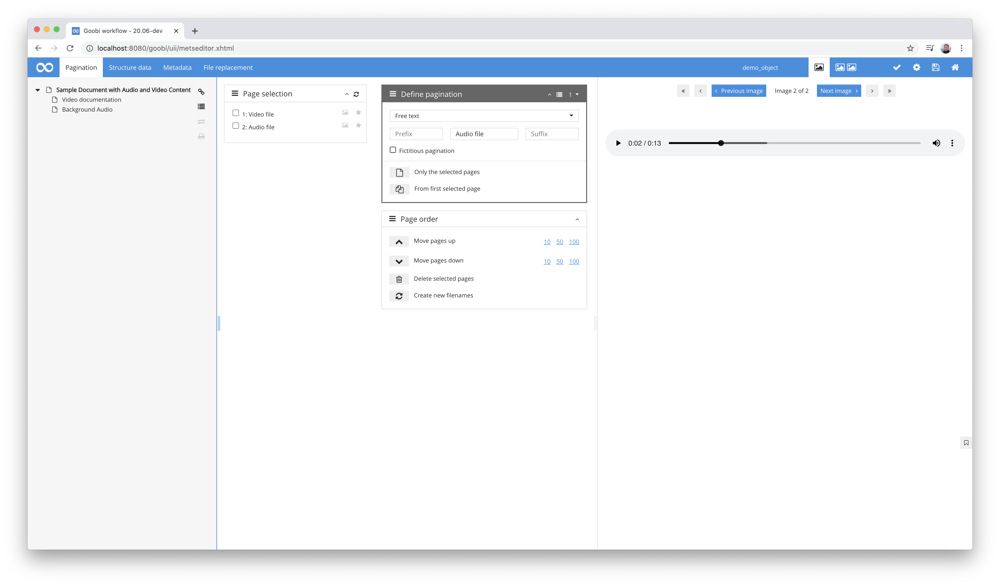
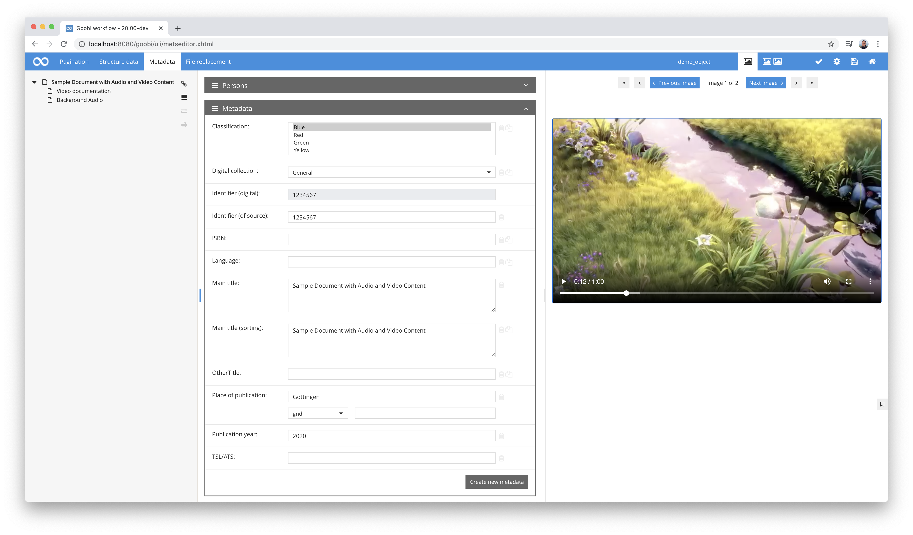
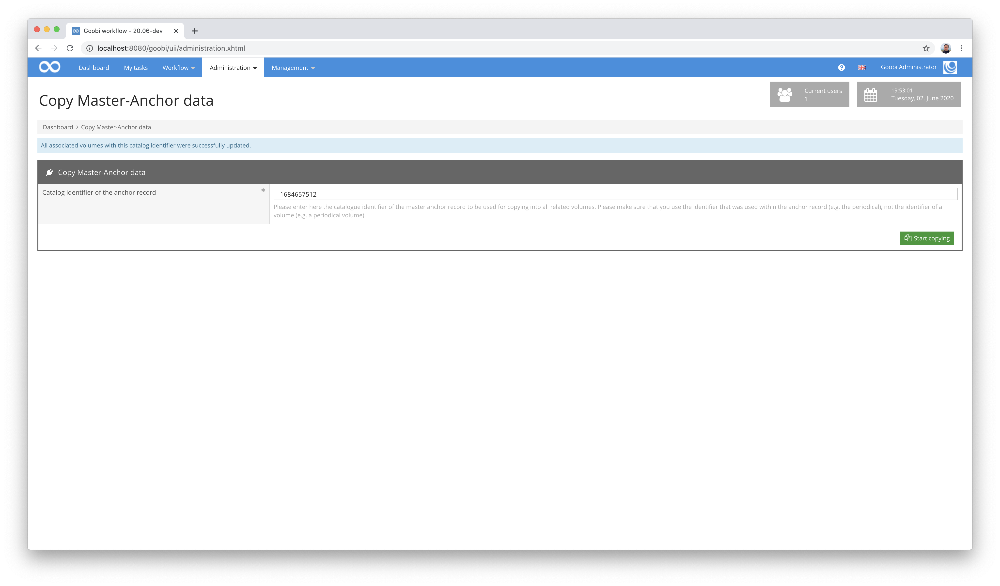
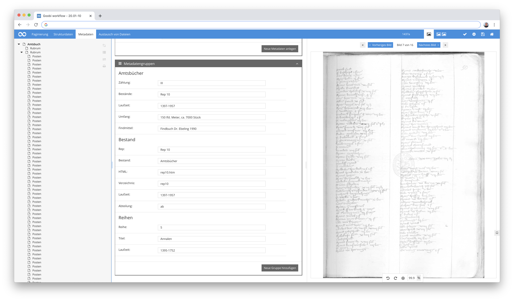

# April 2020

## Coming soon

In the coming weeks we will probably focus on the following points:

* Refactorization of the LayoutWizzard plugin for automatic image cropping
* Conversion of the Goobi code to use CDI

## Extensions of the LayoutWizard for automatic cropping of images

The LayoutWizzard as a plugin for convenient cropping of images is becoming more and more popular. This was accompanied by the wish that its use should also be possible within the Amazon Cloud. For this reason, LayoutWizzard has now been revised so that it can be used on the S3 storage system in addition to a regular file system, just like Goobi workflow.



For more information about the LayoutWizzard, please refer to the detailed documentation for operation and configuration options:


https://docs.goobi.io/goobi-workflow-plugins-en/step-plugins/layoutwizzard


## 3D display now supports DRACO compression

Goobi workflow has been supporting the handling of 3D objects for several months now. This has already proved to be very useful for various data formats. However, handling very large files and their high-performance delivery and display was repeatedly a particular challenge. With the newly added functionality to support `DRACO` compression, the visualisation of qualitative 3D models has now become much better, as the file sizes are considerably smaller than in the previously supported formats.

More information about compression using DRACO can be found here:


https://github.com/google/draco


There is no significant change for the user in handling these new and already supported 3D formats. Objects can still be displayed, zoomed and rotated within the QA plug-in as well as within the METS editor as before.



[https://github.com/intranda/goobi/commit/273a53e36a0ac2614c4d95a96d41865218fe7b81](https://github.com/intranda/goobi/commit/273a53e36a0ac2614c4d95a96d41865218fe7b81)

## Improvement of file operations in METS Editor

Within the METS Editor, a user has also been able to manipulate the image stack for a long time, for example, to change the order of the files, delete files or even rename them. In the past, however, the operation of these functions was sometimes problematic, because after changes to the image stack, the METS file always had to be saved as well. With the revisions we have now made in this area, this is no longer necessary. Changes to files within the METS Editor are now always saved in the METS file as well, so that the METS file can no longer become asynchronous to the file names. In addition, we have conducted extensive testing to ensure that changes made will always affect all folders. For example, when renaming or deleting master files, derivative files, thumbnails, OCR results, LayoutWizzard files and also PDF files are immediately changed so that the changes made have the same effect in all versions of the digitised material.



[https://github.com/intranda/goobi/commit/f5425981918c37ad3e77336569119777c8d68b1d](https://github.com/intranda/goobi/commit/f5425981918c37ad3e77336569119777c8d68b1d) [https://github.com/intranda/goobi/commit/8f0fc997e6c6bfa9247f76ecf337e89081177c54](https://github.com/intranda/goobi/commit/8f0fc997e6c6bfa9247f76ecf337e89081177c54)

## Bugfix for the GoobiScript addStep

There was an error within the GoobiScripts `addStep` that prevented its execution. The GoobiScript has now been revised and is working again.



[https://github.com/intranda/goobi/commit/a17dcc5d666d49c9c5cb5d9451bc6a9f8894503b](https://github.com/intranda/goobi/commit/a17dcc5d666d49c9c5cb5d9451bc6a9f8894503b)

## Display audio and video within the METS Editor

Over the last few weeks, we've worked hard to ensure that Goobi workflow now supports audio and video data directly within the METS Editor and also displays and plays back such files. In this way, Goobi now provides even better support for handling audio and video material and also generates the correct file groups for exporting METS files, allowing published digitised material to be displayed directly in the Goobi viewer, for example.





To ensure that Goobi handles audio and video data correctly, some minor adjustments are required within the ruleset used to enable `audio` and `video` within an object in addition to `pages`, `image areas` and `3D objects`. An example of such an adjustment in the ruleset is shown below:

```markup
<DocStrctType>
  <Name>page</Name>
  <language name="de">Seite</language>
  <language name="en">Page</language>
  <language name="rusdml">page</language>
  <language name="es">Página</language>
  <allowedchildtype>area</allowedchildtype>
  <metadata num="1m">logicalPageNumber</metadata>
  <metadata num="*">_ucc_id</metadata>
  <metadata num="1m">physPageNumber</metadata>
  <metadata num="1o">_urn</metadata>
</DocStrctType>
  <DocStrctType>
  <Name>audio</Name>
  <language name="de">Audio</language>
  <language name="en">Audio</language>
  <metadata num="1o">_urn</metadata>
  <metadata num="1m">logicalPageNumber</metadata>
  <metadata num="1m">physPageNumber</metadata>
</DocStrctType>
<DocStrctType>
  <Name>video</Name>
  <language name="de">Video</language>
  <language name="en">Video</language>
  <metadata num="1o">_urn</metadata>
  <metadata num="1m">logicalPageNumber</metadata>
  <metadata num="1m">physPageNumber</metadata>
</DocStrctType>
<DocStrctType>
  <Name>object</Name>
  <language name="de">3D Objekt</language>
  <language name="en">3D Object</language>
  <metadata num="1o">_urn</metadata>
  <metadata num="1m">logicalPageNumber</metadata>
  <metadata num="1m">physPageNumber</metadata>
</DocStrctType>
<DocStrctType>
  <Name>area</Name>
  <language name="de">Bildbereich</language>
  <language name="en">Area</language>
  <metadata num="*">_ucc_id</metadata>
  <metadata num="1o">_urn</metadata>
  <metadata num="1o">_COORDS</metadata>
  <metadata num="1o">_SHAPE</metadata>
  <metadata num="1m">physPageNumber</metadata>
  <metadata num="1m">logicalPageNumber</metadata>
</DocStrctType>  
<DocStrctType>
  <Name>BoundBook</Name>
  <language name="de">Gebundenes Buch</language>
  <language name="en">Bound Book</language>
  <allowedchildtype>page</allowedchildtype>
  <allowedchildtype>audio</allowedchildtype>
  <allowedchildtype>video</allowedchildtype>
  <allowedchildtype>object</allowedchildtype>
  <metadata num="1o">PhysicalLocation</metadata>
  <metadata num="1o">datedigit</metadata>
  <metadata num="1o">shelfmarksource</metadata>
  <metadata num="1o">mediumsource</metadata>
  <metadata num="1o">FormatSourcePrint</metadata>
  <metadata num="*">_ucc_id</metadata>
  <metadata num="1o">shelfmarkarchiveimageset</metadata>
  <metadata num="1o">pathimagefiles</metadata>
  <metadata num="1o">imagedescr</metadata>
  <metadata num="1o">copyrightimageset</metadata>
  <metadata num="1o">_urn</metadata>
  <metadata num="1o">_representative</metadata>
</DocStrctType>
```

Depending on which audio and video formats you are working with at this point, they can be played back within the web browser without the need for any additional plugins. However, as this varies from browser to browser, it has proven to be best to use the derivatives to mp3 for audio files and mp4 for video files. The following is a list of which browsers directly support which file formats:

Video formats:

| Browser                | MP4 | WebM | Ogg |
| ---------------------- | --- | ---- | --- |
| Edge/Internet Explorer | YES | NO   | NO  |
| Chrome                 | YES | YES  | YES |
| Firefox                | YES | YES  | YES |
| Safari                 | YES | NO   | NO  |
| Opera                  | YES | YES  | YES |

Audio formats:

| Browser                | MP3 | WAV | OGG |
| ---------------------- | --- | --- | --- |
| Edge/Internet Explorer | YES | NO  | NO  |
| Chrome                 | YES | YES | YES |
| Firefox                | YES | YES | YES |
| Safari                 | YES | YES | NO  |
| Opera                  | YES | YES | YES |

[https://github.com/intranda/goobi/commit/368c3c102df57806ba6cf7f652730cc4ce495577](https://github.com/intranda/goobi/commit/368c3c102df57806ba6cf7f652730cc4ce495577) [https://github.com/intranda/goobi/commit/f9953fe0e91a2e3494bf23e1338b7daca63b6aa2](https://github.com/intranda/goobi/commit/f9953fe0e91a2e3494bf23e1338b7daca63b6aa2) [https://github.com/intranda/goobi/commit/da4cb26bd48ba93b837ba062e0592f99535d6142](https://github.com/intranda/goobi/commit/da4cb26bd48ba93b837ba062e0592f99535d6142)

## Revision and documentation of the plugin for adaptations to anchor datasets

The already existing plugin for the uniform adaptation of anchor data sets was thoroughly revised and documented. It allows you to select a central Goobi process, e.g. for a multi-volume work or a journal, which should form the master process for all other Goobi processes. Changes within its anchor file in the Mets Editor therefore mean that all the associated Goobi processes can be updated with the identical data in the central anchor record.



Besides some small optical adjustments, a detailed documentation has been created for this plugin. This is available here:


https://docs.goobi.io/goobi-workflow-plugins-en/administration/plugin_intranda_administration_copyanchor


## Data processing of the digital city archive Duderstadt

The City Archive Duderstadt was very progressive very early on and in the 1990s digitized the entire archive and created an enormous [data stock including metadata and transcriptions](http://stadtarchiv-duderstadt.gbv.de/projekt-d.htm). We have been working with this data for a long time and have now imported all data. The proprietary data was converted into an EAD format and the individual objects were described in a METS file, so that all deeply indexed metadata can now be republished.



The entire data stock of the Duderstadt city archive has also already been prepared for publication within a Goobi viewer and is already usable as a prototype. Before the URL is announced, however, some primarily visual work needs to be completed here. This will take place relatively soon, however, and will then be documented here once again.

## New configuration documentation for the REST interface

Goobi workflow has long had an extendable REST interface to allow external systems to communicate with Goobi. The existing documentation for this within the manual has been revised. This means that an up-to-date version of the documentation on how to activate the interface for selected endpoints specifically for selected IP addresses is now available at the following address


https://docs.goobi.io/goobi-workflow-en/admin/7/7.5-goobi_rest.xml
