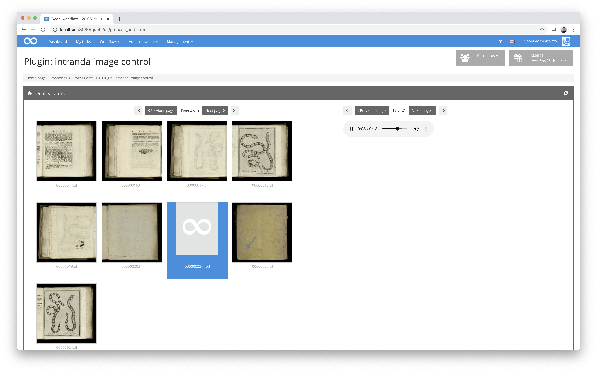
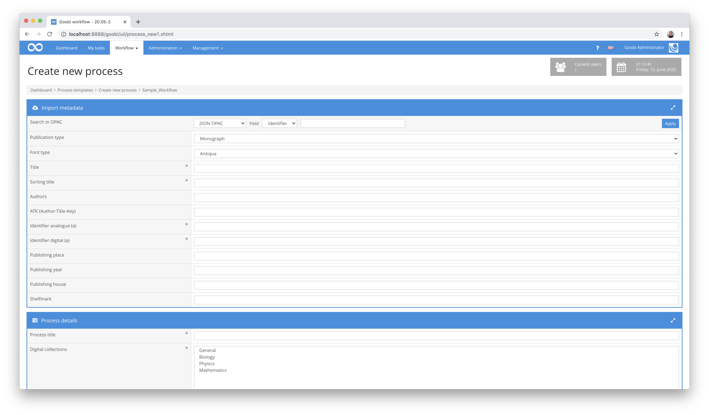

# May 2020

## Coming soon

In the coming weeks we will probably focus on the following points:

* LayoutWizzard Refactoring
* Conversion of the Goobi code to use CDI
* Accessibility according to WCAG 2.1

## Display of audio and video materials within the Image QA Plugin

Having already completed support for audio and video within the METS editor of Goobi workflow last month, we also took another look at the Image QA plugin this month to make it compatible for audio and video display.




Again, the same compatibility restrictions apply as for the METS Editor, so that the following formats are possible directly within the display so far

Video formats:

| Browser                | MP4 | WebM | Ogg |
| ---------------------- | --- | ---- | --- |
| Edge/Internet Explorer | YES | NO   | NO  |
| Chrome                 | YES | YES  | YES |
| Firefox                | YES | YES  | YES |
| Safari                 | YES | NO   | NO  |
| Opera                  | YES | YES  | YES |

Audioformate:

| Browser                | MP3 | WAV | OGG |
| ---------------------- | --- | --- | --- |
| Edge/Internet Explorer | YES | NO  | NO  |
| Chrome                 | YES | YES | YES |
| Firefox                | YES | YES | YES |
| Safari                 | YES | YES | NO  |
| Opera                  | YES | YES | YES |

[https://github.com/intranda/goobi/commit/32cad013767d747f308d1e0168e111232f44ee27](https://github.com/intranda/goobi/commit/32cad013767d747f308d1e0168e111232f44ee27)

## Optimization of the image display in combination with the new thumbs folders

When an `info.json` is requested for an image via IIIF, the existing thumbs are now returned as zoom levels. This causes the browser with the included tool for image display (openSeadragon) to request exactly these, so that the thumbnails can be passed through directly. This change brings with it an enormous acceleration of the loading times. For some images with longer loading times, for example, the time could be reduced from the original 2.4 seconds to only 0.2 seconds.

[https://github.com/intranda/goobi/commit/0afa8ac5b58b801a07699ac982239965e2a257e8](https://github.com/intranda/goobi/commit/0afa8ac5b58b801a07699ac982239965e2a257e8) [https://github.com/intranda/goobi/commit/a61d3e0735e2b53bac5192adfa4b07e42d3395cd](https://github.com/intranda/goobi/commit/a61d3e0735e2b53bac5192adfa4b07e42d3395cd)

## ImageQA: New full screen view for fast browsing

The full screen view of the Image-QA Plugin has also been significantly reworked. It has now been implemented once again in JavaScript, which, in conjunction with the above fast image delivery, allows you to navigate through the images at a perceived desktop speed.


To use this new full screen display, this adjustment must be made within the plugin configuration:

```markup
<useJSFullscreen>true</useJSFullscreen>
```

[https://github.com/intranda/goobi/commit/f43f2dbfd0eb737c8a75a00db987ee6e5c328411](https://github.com/intranda/goobi/commit/f43f2dbfd0eb737c8a75a00db987ee6e5c328411) [https://github.com/intranda/goobi/commit/0042b21959930d2dc80c92d1864125e92bc40f8f](https://github.com/intranda/goobi/commit/0042b21959930d2dc80c92d1864125e92bc40f8f) [https://github.com/intranda/goobi/commit/1843faf29f7985a5f6fc4a45d6f04e708b636b7e](https://github.com/intranda/goobi/commit/1843faf29f7985a5f6fc4a45d6f04e708b636b7e) [https://github.com/intranda/goobi/commit/fcf566fe0d0d4194585793c272f13c5603918001](https://github.com/intranda/goobi/commit/fcf566fe0d0d4194585793c272f13c5603918001)

## METS Editor: Use last page for new structural element is now optional

Relatively recently, the METS Editor has integrated a new feature that allows the end page used to create a structural element to automatically become the new start page for the next structural element immediately after it has been created. This saves unnecessary mouse clicks in most use cases as well as some time.


Nevertheless, there are so many individual ways of working in the Goobi community that not everyone benefits from such innovations. For this reason we have now made this function deactivatable. Directly within the box for creating new force elements, you can now use the checkbox provided there to determine whether the page transfer function should be deactivated for the following force elements.

[https://github.com/intranda/goobi/commit5f22c48421e29e0d4cce3a48e8c3e89a348a02a0](https://github.com/intranda/goobi/commit5f22c48421e29e0d4cce3a48e8c3e89a348a02a0)

## New Opac plugin for generic JSON import

The JSON format is playing a major role in more and more systems when it comes to exchanging data between machines. Among other things this is so also in some catalogue systems already in use, so among other things within ArchiveSpace ([https://archivesspace.org/](https://archivesspace.org/)). In order to support such data sources as well, a new Opac plugin for data transfer of JSON data was enabled.



Similar to the XML Opac plugin, the functionality of this plugin is kept extremely generic. Instead of using the XPath query language, JSON uses JSONPath to query metadata, so that very individual mappings of metadata from JSON to METS can be defined.

More information about the possible applications of JSONPath can be found here:


https://support.smartbear.com/alertsite/docs/monitors/api/endpoint/jsonpath.html


The source code for this new Opac plugin is published at Github:


https://github.com/intranda/goobi-plugin-opac-json


An extensive documentation about the plugin and its configuration options can be found here:


https://docs.goobi.io/goobi-workflow-plugins-de/opac/goobi-plugin-opac-json


[https://github.com/intranda/goobi/commit/fa5ecfd989a96b2540dfae4d0c61e75e2d583797](https://github.com/intranda/goobi/commit/fa5ecfd989a96b2540dfae4d0c61e75e2d583797) [https://github.com/intranda/goobi/commit/8a050eaf689f0cd4f0ceabaa69a493d9ebbc74cd](https://github.com/intranda/goobi/commit/8a050eaf689f0cd4f0ceabaa69a493d9ebbc74cd) [https://github.com/intranda/goobi/commit/fa4ef8689ddd14726214b7a4c0f9ecce3c092330](https://github.com/intranda/goobi/commit/fa4ef8689ddd14726214b7a4c0f9ecce3c092330) [https://github.com/intranda/goobi/commit/b40b6ab79fae816c3ec78d72a10687d6b9fb1915](https://github.com/intranda/goobi/commit/b40b6ab79fae816c3ec78d72a10687d6b9fb1915)

## Several dependencies have been updated

The general refactoring work on Goobi workflow is progressing alongside the usual day-to-day business. Among other things, various program libraries have been updated, such as

* PDFBox
* Jackson
* Jersey

[https://github.com/intranda/goobi/commit/5b90c799f9955a1cf666ecdf679661e7d820c934](https://github.com/intranda/goobi/commit/5b90c799f9955a1cf666ecdf679661e7d820c934)