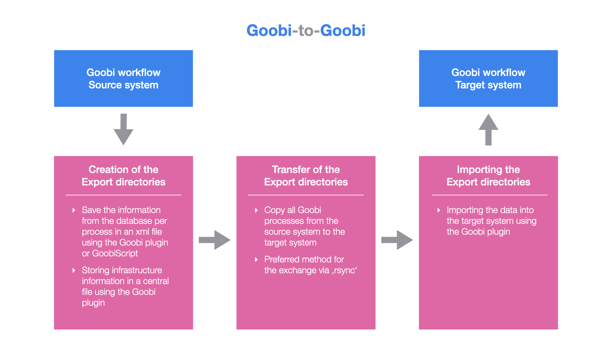
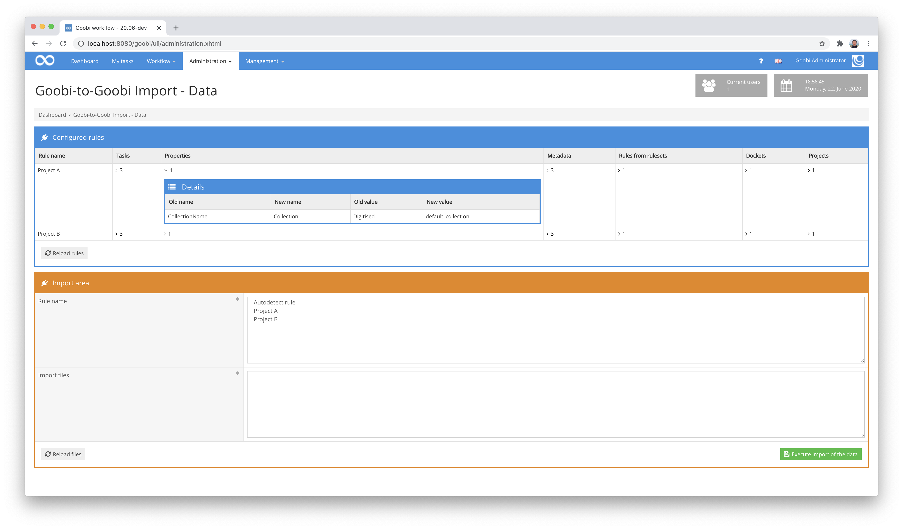
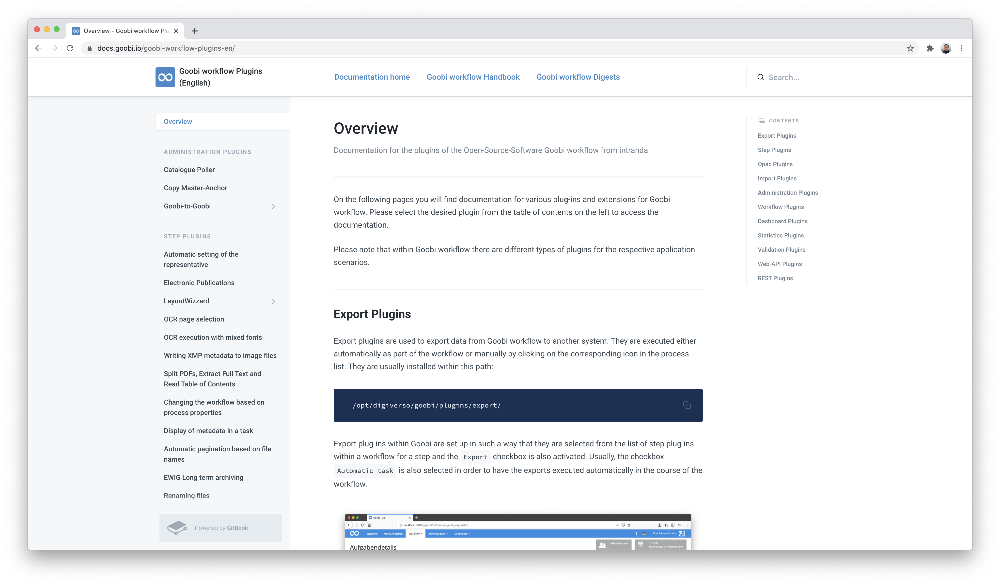
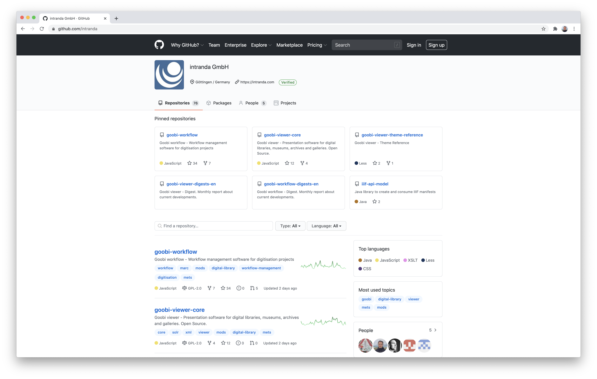
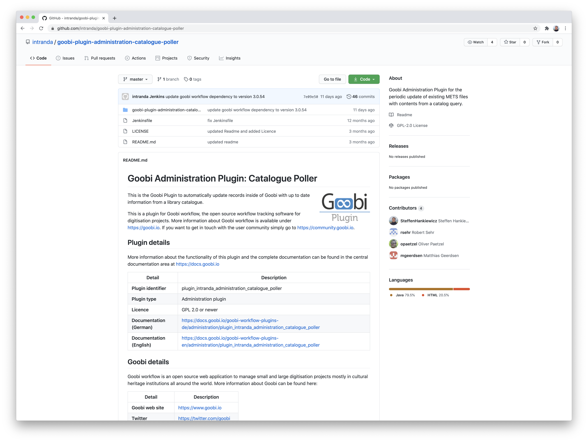
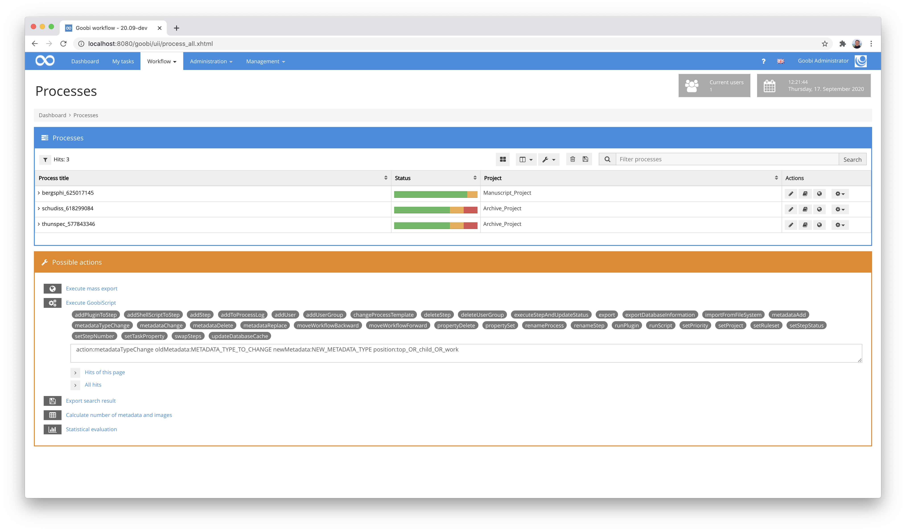
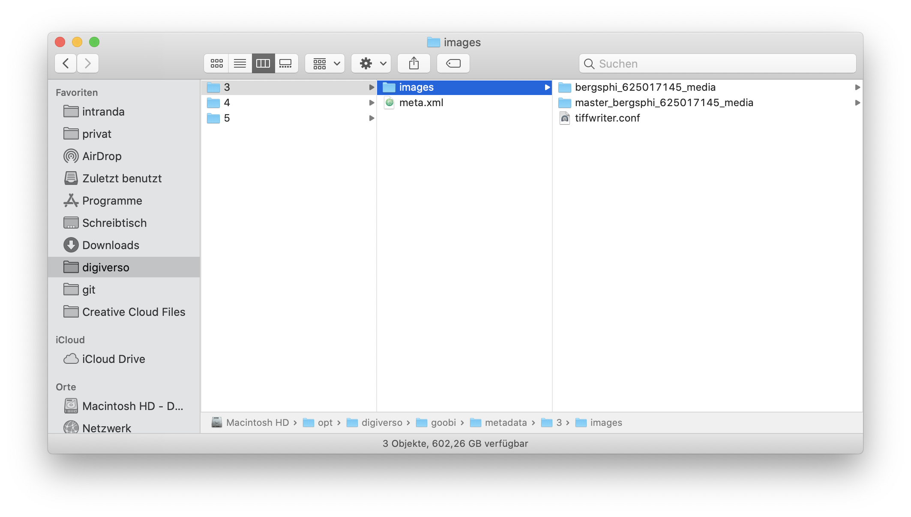
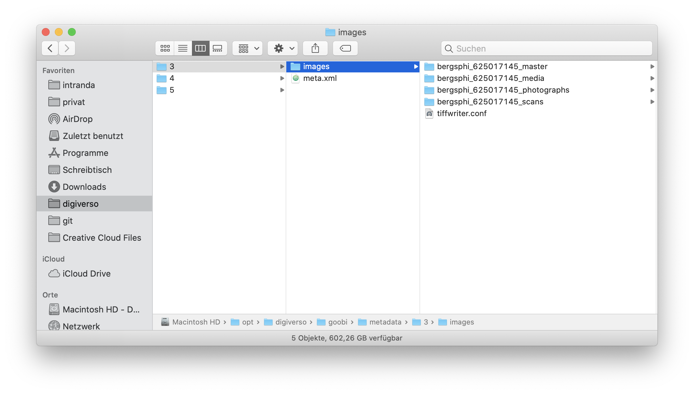

# June 2020

## Coming soon

In the coming weeks we will probably focus on the following points:

* Extension of the folder management per process
* Accessibility according to WCAG
* Enabling a cross-process possibility for working with the Layoutwizzard

## New plugin for data exchange: Goobi-to-Goobi

Goobi workflow is being used in more and more institutions and countries. The circle of users is no longer limited to cultural institutions but also includes an increasing number of scanning service providers. Previously, data transfer between two different Goobi instances had been quite difficult. With the new Goobi-to-Goobi plugin, this has now become easy.



The working method is such that a total of three separate work steps must be carried out for the exchange:

### a) Generation of export directories by the source system

First, the relevant data is exported from one Goobi. This includes the processes and media files. In addition, rule sets and user information can also be exported. The exact procedure for exporting is explained here:


https://docs.goobi.io/goobi-workflow-plugins-en/administration/plugin_intranda_adminstration_goobi2goobi/step_1_export


### b) Transfer of export directories from source system to target system

After the data has been successfully exported, it must be transferred to the target system. This transfer currently requires an exchange via tools such as `rsync` or the use of an external hard disk.

A description of the transfer with practical commands is described here:


https://docs.goobi.io/goobi-workflow-plugins-en/administration/plugin_intranda_adminstration_goobi2goobi/step_2_transfer


### c) Importing the export directories in the target system

As soon as the data is transferred to the destination machine, the import can begin. A separate user interface is available for this purpose, in which it can be specified which data are to be transferred exactly.



Detailed documentation is also available for this:


https://docs.goobi.io/goobi-workflow-plugins-en/administration/plugin_intranda_adminstration_goobi2goobi/step_3_import


The complete documentation of the plugin can be found at the following address:


https://docs.goobi.io/goobi-workflow-plugins-en/administration/plugin_intranda_adminstration_goobi2goobi


The source code of the plugin was published here:


https://github.com/intranda/goobi-plugin-administration-goobi2goobi-export



https://github.com/intranda/goobi-plugin-administration-goobi2goobi-import


## New documentation for numerous plugins

Numerous new plugins have been added to the Goobi documentation platform and have received detailed documentation on configuration and operation. In this context, the licences and links to the source code repositories were also included. Furthermore, the documentation was published in German and English.



An overview of the currently publicly documented Goobi workflow plugins can be found here:


https://docs.goobi.io/goobi-workflow-plugins-en/


## Numerous plugins released on GitHub

Many of the most frequently used plugins have now been released with their source code on GitHub. First we have created a standard for our readme files and then added it for all plugins to be published. Since June 2020 we have now over 70 open source repositories online at GitHub:



In total we have now published the source code of 48 plugins:



More information can be found on our GitHub page:


https://github.com/intranda


## New GoobiScript to change metadata type

A new GoobiScript has been introduced to allow you to change the type of metadata within many METS files. The call to this GoobiScript looks like this:

```
action:metadataTypeChange oldType:TYPE_TO_CHANGE newType:NEW_TYPE position:top_OR_child_OR_work
```

With this command, depending on the selected parameters, an existing metadata can now be changed so that the value is retained but the type is changed. For example, a `description` can become a `main title`. In addition, it can also be determined at which level within the structure tree this change should take place. Thus it is possible to determine whether such a change should only be made for superordinate publications, only for sub-elements (e.g. volumes) or basically for independent publications.



[https://github.com/intranda/goobi-workflow/commit/4306740b00a75d0a7874fb7cd10f8a19074f7754](https://github.com/intranda/goobi-workflow/commit/4306740b00a75d0a7874fb7cd10f8a19074f7754)

## METS Editor: Avoiding unnecessary loading times by using more Ajax

Within the METS editor we wanted a faster way of working. In particular, we didn't like the fact that the large image displayed or even the thumbnails displayed were reloaded unnecessarily often, which interrupted the work somewhat. For this reason we changed the user interface so that there are now significantly more partial reloads of page content without affecting the entire page. The user will notice this change especially when switching back and forth between the individual tabs of the METS Editor. However, this will also be noticeable when adding, saving and editing people, metadata and metadata groups.


[https://github.com/intranda/goobi-workflow/commit/c5fe9d3cd76fe93adbbb258b869a08724ba2a6e7](https://github.com/intranda/goobi-workflow/commit/c5fe9d3cd76fe93adbbb258b869a08724ba2a6e7)\
[https://github.com/intranda/goobi-workflow/commit/b433851dd74017a985be26cdd38b2f1f27055bf6](https://github.com/intranda/goobi-workflow/commit/b433851dd74017a985be26cdd38b2f1f27055bf6)

## Folder names are now completely configurable

A particularly large change was necessary in a project where different devices were used to generate master images and the files imported there had to be validated differently. We took this requirement as an opportunity to extend Goobi workflow so that it no longer just has the usual `master` and `media` (or `tif`) folders. Instead, from now on, a large number of directories can be defined. In addition, we do not expect the old naming scheme of the names to be hard-coded anymore but allow other names.

Previous naming scheme:



New possible naming scheme:



Such a directory name can be defined within the configuration file `goobi_config.properties` as follows:

```
process.folder.images.main={processtitle}_media
process.folder.images.master={processtitle}_master
process.folder.images.scans={processtitle}_scans
process.folder.images.photos={processtitle}_photographs
```

[https://github.com/intranda/goobi-workflow/commit/a0395f332aaba1ddc7b75792e2113bbbbb16e4bd](https://github.com/intranda/goobi-workflow/commit/a0395f332aaba1ddc7b75792e2113bbbbb16e4bd)

## Further adjustments

In addition to these major developments, there were again some minor adjustments, which will be briefly mentioned here:

### Creating processes

Previously, when you created new processes, a process was successfully created in Goobi even if the associated METS file could not be saved correctly. This has now been corrected so that a meaningful message is displayed and the process is not created if an error occurs.

[https://github.com/intranda/goobi-workflow/commit/18efa1677b98ac76828c6f40ac4fb7d22cb05da2](https://github.com/intranda/goobi-workflow/commit/18efa1677b98ac76828c6f40ac4fb7d22cb05da2)

### Scrolling the process log

In some browsers, scrolling within the process log had difficulties, making it feel unintuitive to use. This has now been corrected so that scrolling is now intuitive.

[https://github.com/intranda/goobi-workflow/commit/8a9b821eb620685bc340e332c38f468806dc16ea](https://github.com/intranda/goobi-workflow/commit/8a9b821eb620685bc340e332c38f468806dc16ea)

### Other handling of commas within configuration files

In the past, commas in several Goobi configuration files had to be specially masked or escaped. So instead of a `,` you always had to specify `\,`. This has now been corrected. Unfortunately, however, this change also means that some configuration files must now be checked for this escaping when updating Goobi. The same applies to the comma and the backslash, which can now be specified as `\` instead of `\\`.

[https://github.com/intranda/goobi-workflow/commit/f58d6a47a066e9a9c26e30d3eea4c579b27d831d](https://github.com/intranda/goobi-workflow/commit/f58d6a47a066e9a9c26e30d3eea4c579b27d831d)

### Loading times in LayoutWizzard

Within the LayoutWizzard, there was a change that resulted in a higher speed when opening the LayoutWizzard for the first time and when scrolling between the preview images.